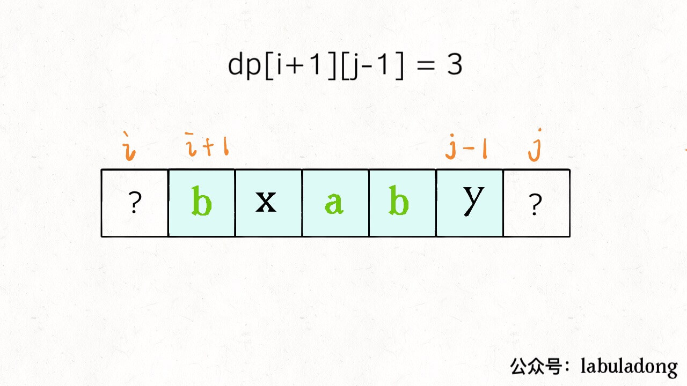
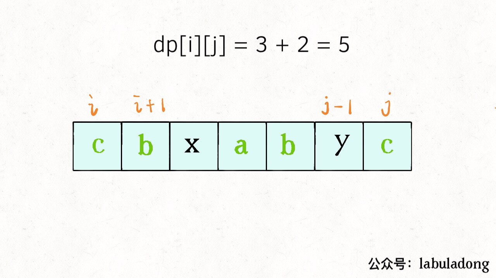
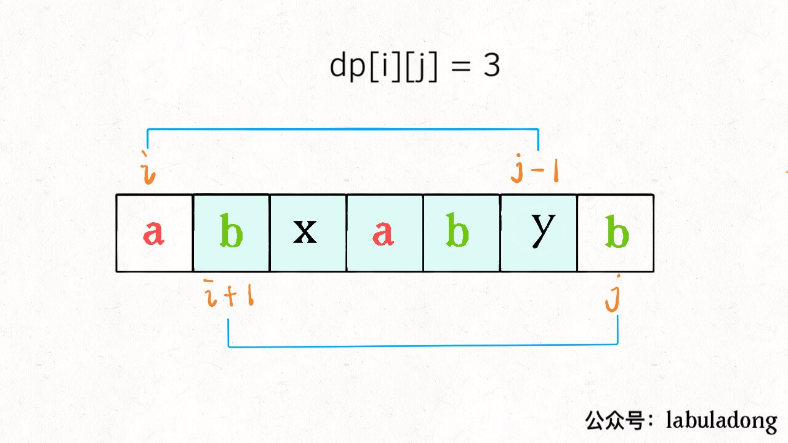

**在子数组 `array[i..j]` 中，我们要求的子序列（最长回文子序列）的长度为 `dp[i][j]`**。
<!-- TOC -->

- [动态规划之子序列问题解题模板](#动态规划之子序列问题解题模板)
        - [一、两种思路](#一两种思路)
        - [二、最长回文子序列](#二最长回文子序列)
        - [三、代码实现](#三代码实现)

<!-- /TOC -->
# 动态规划之子序列问题解题模板

子序列问题是常见的算法问题，而且并不好解决。

首先，子序列问题本身就相对子串、子数组更困难一些，因为前者是不连续的序列，而后两者是连续的，就算穷举你都不一定会，更别说求解相关的算法问题了。

而且，子序列问题很可能涉及到两个字符串，比如前文「最长公共子序列」，如果没有一定的处理经验，真的不容易想出来。所以本文就来扒一扒子序列问题的套路，其实就有两种模板，相关问题只要往这两种思路上想，十拿九稳。

一般来说，这类问题都是让你求一个**最长子序列**，因为最短子序列就是一个字符嘛，没啥可问的。一旦涉及到子序列和最值，那几乎可以肯定，**考察的是动态规划技巧，时间复杂度一般都是 O(n^2)**。

原因很简单，你想想一个字符串，它的子序列有多少种可能？起码是指数级的吧，这种情况下，不用动态规划技巧，还想怎么着？

既然要用动态规划，那就要定义 dp 数组，找状态转移关系。我们说的两种思路模板，就是 dp 数组的定义思路。不同的问题可能需要不同的 dp 数组定义来解决。

### 一、两种思路

**1、第一种思路模板是一个一维的 dp 数组**：

```java
int n = array.length;
int[] dp = new int[n];

for (int i = 1; i < n; i++) {
    for (int j = 0; j < i; j++) {
        dp[i] = 最值(dp[i], dp[j] + ...)
    }
}
```

举个我们写过的例子「最长递增子序列」，在这个思路中 dp 数组的定义是：

**在子数组 `array[0..i]` 中，我们要求的子序列（最长递增子序列）的长度是 `dp[i]`**。

为啥最长递增子序列需要这种思路呢？前文说得很清楚了，因为这样符合归纳法，可以找到状态转移的关系，这里就不具体展开了。

**2、第二种思路模板是一个二维的 dp 数组**：

```java
int n = arr.length;
int[][] dp = new int[n][n];

for (int i = 0; i < n; i++) {
    for (int j = 0; j < n; j++) {
        if (arr[i] == arr[j]) 
            dp[i][j] = dp[i][j] + ...
        else
            dp[i][j] = 最值(...)
    }
}
```

这种思路运用相对更多一些，尤其是涉及两个字符串/数组的子序列，比如前文讲的「最长公共子序列」。本思路中 dp 数组含义又分为「只涉及一个字符串」和「涉及两个字符串」两种情况。

**2.1 涉及两个字符串/数组时**（比如最长公共子序列），dp 数组的含义如下：

**在子数组 `arr1[0..i]` 和子数组 `arr2[0..j]` 中，我们要求的子序列（最长公共子序列）长度为 `dp[i][j]`**。

**2.2 只涉及一个字符串/数组时**（比如本文要讲的最长回文子序列），dp 数组的含义如下：

**在子数组 `array[i..j]` 中，我们要求的子序列（最长回文子序列）的长度为 `dp[i][j]`**。

第一种情况可以参考这两篇旧文：「编辑距离」「公共子序列」

下面就借最长回文子序列这个问题，详解一下第二种情况下如何使用动态规划。

### 二、最长回文子序列

之前解决了「最长回文子串」的问题，这次提升难度，求最长回文子序列的长度：



我们说这个问题对 dp 数组的定义是：**在子串 `s[i..j]` 中，最长回文子序列的长度为 `dp[i][j]`**。一定要记住这个定义才能理解算法。

为啥这个问题要这样定义二维的 dp 数组呢？我们前文多次提到，**找状态转移需要归纳思维，说白了就是如何从已知的结果推出未知的部分**，这样定义容易归纳，容易发现状态转移关系。

具体来说，如果我们想求 `dp[i][j]`，假设你知道了子问题 `dp[i+1][j-1]` 的结果（`s[i+1..j-1]` 中最长回文子序列的长度），你是否能想办法算出 `dp[i][j]` 的值（`s[i..j]` 中，最长回文子序列的长度）呢？


可以！这取决于 `s[i]` 和 `s[j]` 的字符：

**如果它俩相等**，那么它俩加上 `s[i+1..j-1]` 中的最长回文子序列就是 `s[i..j]` 的最长回文子序列：



**如果它俩不相等**，说明它俩**不可能同时**出现在 `s[i..j]` 的最长回文子序列中，那么把它俩**分别**加入 `s[i+1..j-1]` 中，看看哪个子串产生的回文子序列更长即可：



以上两种情况写成代码就是这样：

```java
if (s[i] == s[j])
    // 它俩一定在最长回文子序列中
    dp[i][j] = dp[i + 1][j - 1] + 2;
else
    // s[i+1..j] 和 s[i..j-1] 谁的回文子序列更长？
    dp[i][j] = max(dp[i + 1][j], dp[i][j - 1]);
```

至此，状态转移方程就写出来了，根据 dp 数组的定义，我们要求的就是 `dp[0][n - 1]`，也就是整个 `s` 的最长回文子序列的长度。

### 三、代码实现

首先明确一下 base case，如果只有一个字符，显然最长回文子序列长度是 1，也就是 `dp[i][j] = 1 (i == j)`。

因为 `i` 肯定小于等于 `j`，所以对于那些 `i > j` 的位置，根本不存在什么子序列，应该初始化为 0。

另外，看看刚才写的状态转移方程，想求 `dp[i][j]` 需要知道 `dp[i+1][j-1]`，`dp[i+1][j]`，`dp[i][j-1]` 这三个位置；再看看我们确定的 base case，填入 dp 数组之后是这样：


**为了保证每次计算 `dp[i][j]`，左下右方向的位置已经被计算出来，只能斜着遍历或者反着遍历**：


我选择反着遍历，代码如下：

```cpp
int longestPalindromeSubseq(string s) {
    int n = s.size();
    // dp 数组全部初始化为 0
    vector<vector<int>> dp(n, vector<int>(n, 0));
    // base case
    for (int i = 0; i < n; i++)
        dp[i][i] = 1;
    // 反着遍历保证正确的状态转移
    for (int i = n - 1; i >= 0; i--) {
        for (int j = i + 1; j < n; j++) {
            // 状态转移方程
            if (s[i] == s[j])
                dp[i][j] = dp[i + 1][j - 1] + 2;
            else
                dp[i][j] = max(dp[i + 1][j], dp[i][j - 1]);
        }
    }
    // 整个 s 的最长回文子串长度
    return dp[0][n - 1];
}
```

至此，最长回文子序列的问题就解决了。

**致力于把算法讲清楚！欢迎关注我的微信公众号 labuladong，查看更多通俗易懂的文章**：


[daiyi-guizhou](https://github.com/daiyi-guizhou/) 提供 python 解法代码：

[516. 最长回文子序列](https://leetcode-cn.com/problems/longest-palindromic-subsequence/)
```py

"""

516. 最长回文子序列
给定一个字符串 s ，找到其中最长的回文子序列，并返回该序列的长度。可以假设 s 的最大长度为 1000 。

输入:

"bbbab"
输出:

4
一个可能的最长回文子序列为 "bbbb"。

示例 2:
输入:

"cbbd"
输出:

2
一个可能的最长回文子序列为 "bb"。

 

提示：

1 <= s.length <= 1000
s 只包含小写英文字母
通过次数22,208提交次数39,949
"""
class Solution(object):
    def longestPalindromeSubseq(self, s):
        """
        :type s: str
        :rtype: int
        """
        if not s: return 0
        self._len = len(s)
        self._str = s
        self.dp = [[0 for _ in s] for _ in s]
        for i in range(self._len):
            self.dp[i][i]=1
        return self._trace()
        
    def _trace(self):
        for m in range(self._len-2,-1,-1):
            for n in range(m+1,self._len):
                if self._str[m] == self._str[n]:
                    self.dp[m][n]= 2 + self.dp[m+1][n-1]
                else:
                    self.dp[m][n] = max(self.dp[m][n-1],self.dp[m+1][n])
        return self.dp[0][-1]
```
```py
"""
115. 不同的子序列
给定一个字符串 S 和一个字符串 T，计算在 S 的子序列中 T 出现的个数。
一个字符串的一个子序列是指，通过删除一些（也可以不删除）字符且不干扰剩余字符相对位置所组成的新字符串。（例如，"ACE" 是 "ABCDE" 的一个子序列，而 "AEC" 不是）
题目数据保证答案符合 32 位带符号整数范围。
示例 1：
输入：S = "rabbbit", T = "rabbit"
输出：3
解释：
如下图所示, 有 3 种可以从 S 中得到 "rabbit" 的方案。
(上箭头符号 ^ 表示选取的字母)
rabbbit
^^^^ ^^
rabbbit
^^ ^^^^
rabbbit
^^^ ^^^
输入：S = "babgbag", T = "bag"
输出：5
解释：
如下图所示, 有 5 种可以从 S 中得到 "bag" 的方案。
(上箭头符号 ^ 表示选取的字母)
babgbag
^^ ^
babgbag
^^    ^
babgbag
^    ^^
babgbag
  ^  ^^
babgbag
    ^^^
通过次数15,196提交次数31,352
"""
# class Solution(object):
#     def numDistinct(self, s, t):
#         """
#         :type s: str
#         :type t: str
#         :rtype: int
#         """
#         if not s: return 0
#         dp ={}
#         for i in t:
#             dp[i]=[]
#         for index,i in enumerate(s):
#             if i in t: dp[i].append(index)
#         for i in t:
#             if not dp[i]: return 0
        
#         def multiple_for_cycle(_list,dp):
#             if len(_list) == 1: return [[i] for i in dp[_list]]
#             kk = multiple_for_cycle(_list[:len(_list)-1], dp)
#             res = []
#             for i in kk:
#                 for j in dp[_list[-1]]:
#                     if i[-1] < j:
#                         i.append(j)
#                         res.append([y for y in i ])
#                         i.pop()
#             return res
#         return len(multiple_for_cycle(t,dp))
        # def issort(_list):
        #     for i in range(len(_list)-1):
        #         if _list[i] >= _list[i+1]:
        #             return False
        #     return True
        # count = 0
        # for y in multiple_for_cycle(t,dp):
        #     if issort(y):
        #         count = count + 1
        # return count
    
        # def multiple_for_cycle(_list,dp):
        #     if len(_list) == 1: return [[i] for i in dp[_list]]
        #     kk = multiple_for_cycle(_list[:len(_list)-1], dp)
        #     res = []
        #     for i in kk:
        #         if not dp[_list[-1]]: return []
        #         for j in dp[_list[-1]]:
        #             if i[-1] < j:
        #                 res.append([j])
        #     return res
        # return len(multiple_for_cycle(t,dp))
        
        
        
        # index =1
        # self.pre = dp[t[0]]
        # while index < len(t):
        #     if not self.pre or not dp[t[index]]: return 0
        #     cur = []
        #     for n in dp[t[index]]:
        #         for index_m in range(len(self.pre),0,-1):
        #             if self.pre[index_m-1] < n:
        #                 cur = cur + [n] * index_m
        #                 break
        #     self.pre = cur
        #     index = index + 1
        # return len(self.pre)
class Solution(object):
    def numDistinct(self, s, t):
        """
        :type s: str
        :type t: str
        :rtype: int
        """
        if not s: return 0
        dp ={}
        for index,i in enumerate(s):
            if i in t:
                if i not in dp.keys():
                    dp[i] = [index]
                else:
                    dp[i].append(index)
        for j in t:
            if j not in dp.keys(): return 0  
              
        index =1
        from collections import OrderedDict
        pre = OrderedDict()
        for i in dp[t[0]]:
            pre[i] = 1
        while index < len(t):
            if not pre or not dp[t[index]]: return 0
            cur = OrderedDict()
            for n in dp[t[index]]:
                cur[n] = 0
                for m in pre.keys():
                    if m < n:
                        cur[n]= pre[m] + cur[n]
            pre = cur
            index = index + 1
            # print " ## ",pre
        return sum(pre.values())
```
```py
class Solution:
    def numDistinct(self, s: str, t: str) -> int:
        n1 = len(s)
        n2 = len(t)
        dp = [[0] * (n1 + 1) for _ in range(n2 + 1)]
        for j in range(n1 + 1):
            dp[0][j] = 1
        for i in range(1, n2 + 1):
            for j in range(1, n1 + 1):
                if t[i - 1] == s[j - 1]:
                    dp[i][j] = dp[i - 1][j - 1]  + dp[i][j - 1]
                else:
                    dp[i][j] = dp[i][j - 1]
        #print(dp)
        return dp[-1][-1]
"""
作者：powcai
链接：https://leetcode-cn.com/problems/distinct-subsequences/solution/dong-tai-gui-hua-by-powcai-5/
来源：力扣（LeetCode）
著作权归作者所有。商业转载请联系作者获得授权，非商业转载请注明出处。
"""
```
```py
# -*- coding:utf-8 -*-
# class Solution(object):
#     def increasingTriplet(self, nums):
#         """
#         :type nums: List[int]
#         :rtype: bool
#         # """
        # self._res = []
        # def dfs(nums, start, _list):
        #     if _list: self.res.append(_list)
        #     for j in range(start, len(nums)):
        #         if _list and _list[-1] >= nums[j]:
        #             continue
        #         _list.append(nums[j])
        #         dfs(nums,j+1, _list)
        #         _list.pop()
          
        # dfs(nums, 0, [])
        # _max = 0
        # for i in self._res:
        #     if len(i) < _max:
        #         self._res.remove(i)
        #     _max = len(i)
        # count = 0
        # for j in self._res:
        #     if len(j) == _max:
        #         count = count + 1
        # return count
        
        # n = len(nums)
        # dp = {}
        # for i in range(n):
        #     dp[i] = 1
        # for i in range(1,n):
        #     for k in range(i):
        #         if nums[i] > nums[k]:
        #             new = dp[k] + 1
        #             dp[i] = max(dp[i], new)
        # for i in range(n):
        #     if dp[i] >= 3: return True
        # return False
        # self._res = []
        # def dfs(nums, start, _list):
        #     if _list: self._res.append([m for m in _list])
        #     for j in range(start, len(nums)):
        #         if _list and _list[-1] >= nums[j]:
        #             continue
        #         _list.append(nums[j])
        #         dfs(nums,j+1, _list)
        #         _list.pop()
          
        # dfs(nums, 0, [])
        # self._max = 0
        # for i in self._res:
        #     if len(i) < self._max:
        #         self._res.remove(i)
        #     else:
        #         self._max = len(i)
        # # print self._max
        # count = 0
        # for j in self._res:
        #     if len(j) == self._max:
        #         count = count + 1
        # return count
        # n = len(nums)
        # dp = {}
        # for i in  range(n):
# class Solution(object):
#     def findNumberOfLIS(self, nums):
        # N = len(nums)
        # if N <= 1: return N
        # lengths = [0] * N #lengths[i] = longest ending in nums[i]
        # counts = [1] * N #count[i] = number of longest ending in nums[i]
        # for j, num in enumerate(nums):
        #     for i in xrange(j):
        #         if nums[i] < nums[j]:
        #             if lengths[i] >= lengths[j]:
        #                 lengths[j] = 1 + lengths[i]
        #                 counts[j] = counts[i]
        #             elif lengths[i] + 1 == lengths[j]:
        #                 counts[j] += counts[i]
        # longest = max(lengths)
        # return sum(c for i, c in enumerate(counts) if lengths[i] == longest)
#  """
#         def multiple_for_cycle(_list,dp):
#             if len(_list) == 1: return [[i] for i in dp[_list]]
#             kk = multiple_for_cycle(_list[:len(_list)-1], dp)
#             res = []
#             for i in kk:
#                 for j in dp[_list[-1]]:
#                     i.append(j)
#                     res.append([y for y in i ])
#                     # res.append(i)
#                     i.pop()
#             return res
#         for k in dp:
#             print k,' ## ',dp[k]
#         for y in multiple_for_cycle(t,dp):
#             print y
# a  ##  [1, 5]
# b  ##  [0, 2, 4]
# g  ##  [3, 6]
# [0, 1, 3]
# [0, 1, 6]
# [0, 5, 3]
# [0, 5, 6]
# [2, 1, 3]
# [2, 1, 6]
# [2, 5, 3]
# [2, 5, 6]
# [4, 1, 3]
# [4, 1, 6]
# [4, 5, 3]
# [4, 5, 6]
#  """    
# aa = [1,2,4,3,5,4,7,2]
# client = Solution()
# print client.increasingTriplet(aa)
```

[上一篇：经典动态规划问题：高楼扔鸡蛋（进阶）](../动态规划系列/高楼扔鸡蛋进阶.md)

[下一篇：动态规划之博弈问题](../动态规划系列/动态规划之博弈问题.md)

[目录](../README.md#目录)
