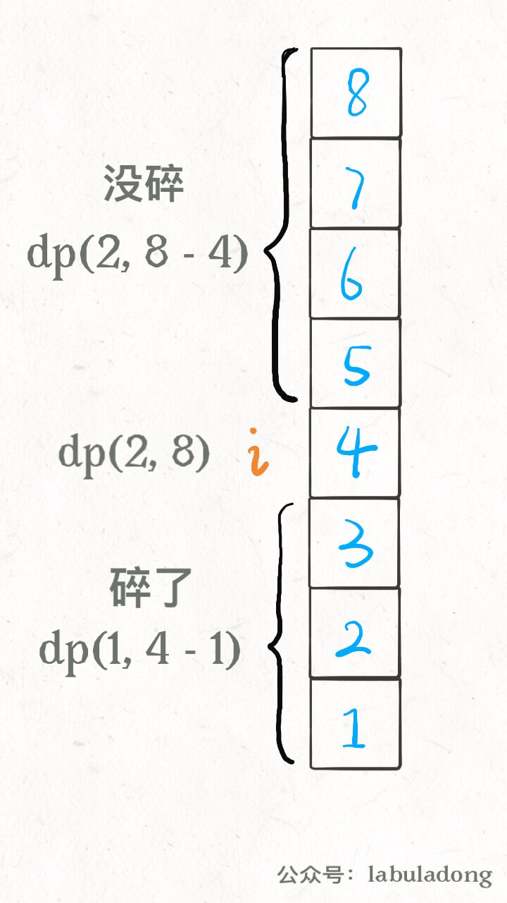
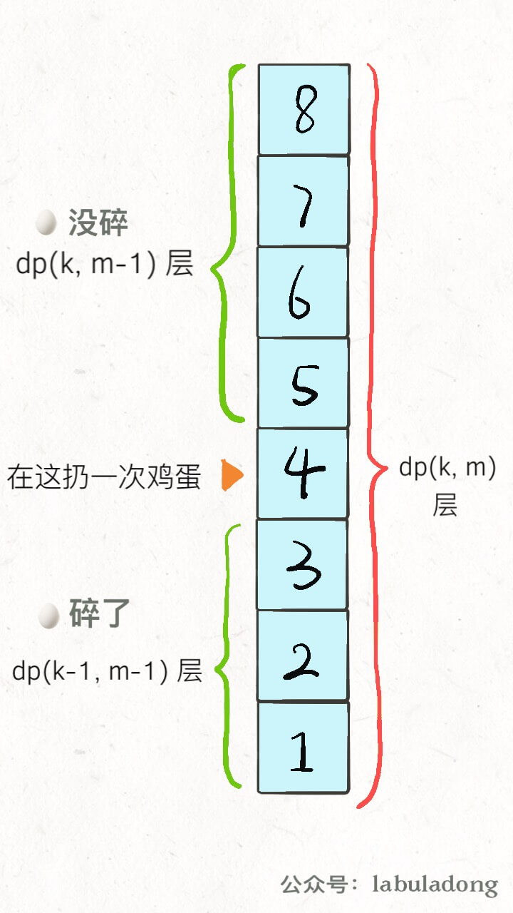

# 经典动态规划问题：高楼扔鸡蛋（进阶）

上篇文章聊了高楼扔鸡蛋问题，讲了一种效率不是很高，但是较为容易理解的动态规划解法。后台很多读者问如何更高效地解决这个问题，今天就谈两种思路，来优化一下这个问题，分别是二分查找优化和重新定义状态转移。

如果还不知道高楼扔鸡蛋问题的读者可以看下「经典动态规划：高楼扔鸡蛋」，那篇文章详解了题目的含义和基本的动态规划解题思路，请确保理解前文，因为今天的优化都是基于这个基本解法的。

二分搜索的优化思路也许是我们可以尽力尝试写出的，而修改状态转移的解法可能是不容易想到的，可以借此见识一下动态规划算法设计的玄妙，当做思维拓展。

### 二分搜索优化

之前提到过这个解法，核心是因为状态转移方程的单调性，这里可以具体展开看看。

首先简述一下原始动态规划的思路：

1、暴力穷举尝试在所有楼层 `1 <= i <= N` 扔鸡蛋，每次选择尝试次数**最少**的那一层；

2、每次扔鸡蛋有两种可能，要么碎，要么没碎；

3、如果鸡蛋碎了，`F` 应该在第 `i` 层下面，否则，`F` 应该在第 `i` 层上面；

4、鸡蛋是碎了还是没碎，取决于哪种情况下尝试次数**更多**，因为我们想求的是最坏情况下的结果。

核心的状态转移代码是这段：

```python
# 当前状态为 K 个鸡蛋，面对 N 层楼
# 返回这个状态下的最优结果
def dp(K, N):
    for 1 <= i <= N:
        # 最坏情况下的最少扔鸡蛋次数
        res = min(res, 
                  max( 
                        dp(K - 1, i - 1), # 碎
                        dp(K, N - i)      # 没碎
                     ) + 1 # 在第 i 楼扔了一次
                 )
    return res
```

这个 for 循环就是下面这个状态转移方程的具体代码实现：

$$ dp(K, N) = \min_{0 <= i <= N}\{\max\{dp(K - 1, i - 1), dp(K, N - i)\} + 1\}$$

如果能够理解这个状态转移方程，那么就很容易理解二分查找的优化思路。

首先我们根据 `dp(K, N)` 数组的定义（有 `K` 个鸡蛋面对 `N` 层楼，最少需要扔几次），**很容易知道 `K` 固定时，这个函数随着 `N` 的增加一定是单调递增的**，无论你策略多聪明，楼层增加测试次数一定要增加。

那么注意 `dp(K - 1, i - 1)` 和 `dp(K, N - i)` 这两个函数，其中 `i` 是从 1 到 `N` 单增的，如果我们固定 `K` 和 `N`，**把这两个函数看做关于 `i` 的函数，前者随着 `i` 的增加应该也是单调递增的，而后者随着 `i` 的增加应该是单调递减的**：


这时候求二者的较大值，再求这些最大值之中的最小值，其实就是求这两条直线交点，也就是红色折线的最低点嘛。

我们前文「二分查找只能用来查找元素吗」讲过，二分查找的运用很广泛，形如下面这种形式的 for 循环代码：

```java
for (int i = 0; i < n; i++) {
    if (isOK(i))
        return i;
}
```

都很有可能可以运用二分查找来优化线性搜索的复杂度，回顾这两个 `dp` 函数的曲线，我们要找的最低点其实就是这种情况：

```java
for (int i = 1; i <= N; i++) {
    if (dp(K - 1, i - 1) == dp(K, N - i))
        return dp(K, N - i);
}
```

熟悉二分搜索的同学肯定敏感地想到了，这不就是相当于求 Valley（山谷）值嘛，可以用二分查找来快速寻找这个点的，直接看代码吧，整体的思路还是一样，只是加快了搜索速度：

```python
def superEggDrop(self, K: int, N: int) -> int:
        
    memo = dict()
    def dp(K, N):
        if K == 1: return N
        if N == 0: return 0
        if (K, N) in memo:
            return memo[(K, N)]
                            
        # for 1 <= i <= N:
        #     res = min(res, 
        #             max( 
        #                 dp(K - 1, i - 1), 
        #                 dp(K, N - i)      
        #                 ) + 1 
        #             )

        res = float('INF')
        # 用二分搜索代替线性搜索
        lo, hi = 1, N
        while lo <= hi:
            mid = (lo + hi) // 2
            broken = dp(K - 1, mid - 1) # 碎
            not_broken = dp(K, N - mid) # 没碎
            # res = min(max(碎，没碎) + 1)
            if broken > not_broken:
                hi = mid - 1
                res = min(res, broken + 1)
            else:
                lo = mid + 1
                res = min(res, not_broken + 1)

        memo[(K, N)] = res
        return res
    
    return dp(K, N)
```

这个算法的时间复杂度是多少呢？**动态规划算法的时间复杂度就是子问题个数 × 函数本身的复杂度**。

函数本身的复杂度就是忽略递归部分的复杂度，这里 `dp` 函数中用了一个二分搜索，所以函数本身的复杂度是 O(logN)。

子问题个数也就是不同状态组合的总数，显然是两个状态的乘积，也就是 O(KN)。

所以算法的总时间复杂度是 O(K\*N\*logN), 空间复杂度 O(KN)。效率上比之前的算法 O(KN^2) 要高效一些。

### 重新定义状态转移

前文「不同定义有不同解法」就提过，找动态规划的状态转移本就是见仁见智，比较玄学的事情，不同的状态定义可以衍生出不同的解法，其解法和复杂程度都可能有巨大差异。这里就是一个很好的例子。

再回顾一下我们之前定义的 `dp` 数组含义：

```python
def dp(k, n) -> int
# 当前状态为 k 个鸡蛋，面对 n 层楼
# 返回这个状态下最少的扔鸡蛋次数
```

用 dp 数组表示的话也是一样的：

```python
dp[k][n] = m
# 当前状态为 k 个鸡蛋，面对 n 层楼
# 这个状态下最少的扔鸡蛋次数为 m
```

按照这个定义，就是**确定当前的鸡蛋个数和面对的楼层数，就知道最小扔鸡蛋次数**。最终我们想要的答案就是 `dp(K, N)` 的结果。

这种思路下，肯定要穷举所有可能的扔法的，用二分搜索优化也只是做了「剪枝」，减小了搜索空间，但本质思路没有变，还是穷举。

现在，我们稍微修改 `dp` 数组的定义，**确定当前的鸡蛋个数和最多允许的扔鸡蛋次数，就知道能够确定 `F` 的最高楼层数**。具体来说是这个意思：

```python
dp[k][m] = n
# 当前有 k 个鸡蛋，可以尝试扔 m 次鸡蛋
# 这个状态下，最坏情况下最多能确切测试一栋 n 层的楼

# 比如说 dp[1][7] = 7 表示：
# 现在有 1 个鸡蛋，允许你扔 7 次;
# 这个状态下最多给你 7 层楼，
# 使得你可以确定楼层 F 使得鸡蛋恰好摔不碎
# （一层一层线性探查嘛）
```

这其实就是我们原始思路的一个「反向」版本，我们先不管这种思路的状态转移怎么写，先来思考一下这种定义之下，最终想求的答案是什么？

我们最终要求的其实是扔鸡蛋次数 `m`，但是这时候 `m` 在状态之中而不是 `dp` 数组的结果，可以这样处理：

```java
int superEggDrop(int K, int N) {

    int m = 0;
    while (dp[K][m] < N) {
        m++;
        // 状态转移...
    }
    return m;
}
```

题目不是**给你 `K` 鸡蛋，`N` 层楼，让你求最坏情况下最少的测试次数 `m`** 吗？`while` 循环结束的条件是 `dp[K][m] == N`，也就是**给你 `K` 个鸡蛋，测试 `m` 次，最坏情况下最多能测试 `N` 层楼**。

注意看这两段描述，是完全一样的！所以说这样组织代码是正确的，关键就是状态转移方程怎么找呢？还得从我们原始的思路开始讲。之前的解法配了这样图帮助大家理解状态转移思路：



这个图描述的仅仅是某一个楼层 `i`，原始解法还得线性或者二分扫描所有楼层，要求最大值、最小值。但是现在这种 `dp` 定义根本不需要这些了，基于下面两个事实：

**1、无论你在哪层楼扔鸡蛋，鸡蛋只可能摔碎或者没摔碎，碎了的话就测楼下，没碎的话就测楼上**。

**2、无论你上楼还是下楼，总的楼层数 = 楼上的楼层数 + 楼下的楼层数 + 1（当前这层楼）**。

根据这个特点，可以写出下面的状态转移方程：

`dp[k][m] = dp[k][m - 1] + dp[k - 1][m - 1] + 1`

**`dp[k][m - 1]` 就是楼上的楼层数**，因为鸡蛋个数 `k` 不变，也就是鸡蛋没碎，扔鸡蛋次数 `m` 减一；

**`dp[k - 1][m - 1]` 就是楼下的楼层数**，因为鸡蛋个数 `k` 减一，也就是鸡蛋碎了，同时扔鸡蛋次数 `m` 减一。

PS：这个 `m` 为什么要减一而不是加一？之前定义得很清楚，这个 `m` 是一个允许的次数上界，而不是扔了几次。



至此，整个思路就完成了，只要把状态转移方程填进框架即可：

```java
int superEggDrop(int K, int N) {
    // m 最多不会超过 N 次（线性扫描）
    int[][] dp = new int[K + 1][N + 1];
    // base case:
    // dp[0][..] = 0
    // dp[..][0] = 0
    // Java 默认初始化数组都为 0
    int m = 0;
    while (dp[K][m] < N) {
        m++;
        for (int k = 1; k <= K; k++)
            dp[k][m] = dp[k][m - 1] + dp[k - 1][m - 1] + 1;
    }
    return m;
}
```

如果你还觉得这段代码有点难以理解，其实它就等同于这样写：

```java
for (int m = 1; dp[K][m] < N; m++)
    for (int k = 1; k <= K; k++)
        dp[k][m] = dp[k][m - 1] + dp[k - 1][m - 1] + 1;
```

看到这种代码形式就熟悉多了吧，因为我们要求的不是 `dp` 数组里的值，而是某个符合条件的索引 `m`，所以用 `while` 循环来找到这个 `m` 而已。

这个算法的时间复杂度是多少？很明显就是两个嵌套循环的复杂度 O(KN)。

另外注意到 `dp[m][k]` 转移只和左边和左上的两个状态有关，所以很容易优化成一维 `dp` 数组，这里就不写了。

### 还可以再优化

再往下就要用一些数学方法了，不具体展开，就简单提一下思路吧。

在刚才的思路之上，**注意函数 `dp(m, k)` 是随着 `m` 单增的，因为鸡蛋个数 `k` 不变时，允许的测试次数越多，可测试的楼层就越高**。

这里又可以借助二分搜索算法快速逼近 `dp[K][m] == N` 这个终止条件，时间复杂度进一步下降为 O(KlogN)，我们可以设 `g(k, m) =`……

算了算了，打住吧。我觉得我们能够写出 O(K\*N\*logN) 的二分优化算法就行了，后面的这些解法呢，听个响鼓个掌就行了，把欲望限制在能力的范围之内才能拥有快乐！

不过可以肯定的是，根据二分搜索代替线性扫描 `m` 的取值，代码的大致框架肯定是修改穷举 `m` 的 for 循环：

```java
// 把线性搜索改成二分搜索
// for (int m = 1; dp[K][m] < N; m++)
int lo = 1, hi = N;
while (lo < hi) {
    int mid = (lo + hi) / 2;
    if (... < N) {
        lo = ...
    } else {
        hi = ...
    }
    
    for (int k = 1; k <= K; k++)
        // 状态转移方程
}
```

简单总结一下吧，第一个二分优化是利用了 `dp` 函数的单调性，用二分查找技巧快速搜索答案；第二种优化是巧妙地修改了状态转移方程，简化了求解了流程，但相应的，解题逻辑比较难以想到；后续还可以用一些数学方法和二分搜索进一步优化第二种解法，不过看了看镜子中的发量，算了。

本文终，希望对你有一点启发。

坚持原创高质量文章，致力于把算法问题讲清楚，欢迎关注我的公众号 labuladong 获取最新文章：


[上一篇：经典动态规划问题：高楼扔鸡蛋](../动态规划系列/高楼扔鸡蛋问题.md)

[下一篇：动态规划之子序列问题解题模板](../动态规划系列/子序列问题模板.md)

[目录](../README.md#目录)