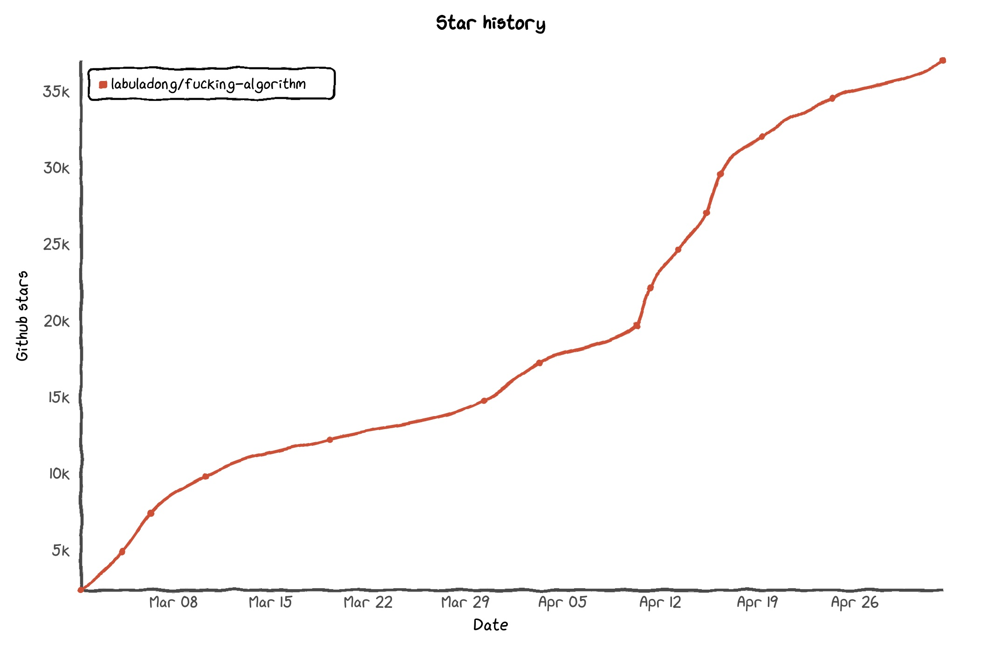

<<<<<<< Updated upstream
=======
<<<<<<< Updated upstream
<<<<<<< HEAD
<<<<<<< Updated upstream
>>>>>>> Stashed changes
English version repo and Gitbook is on [english branch](https://github.com/labuladong/fucking-algorithm/tree/english). Just enjoy：)
<<<<<<< Updated upstream

# 前言

本仓库总共 60 多篇原创文章，基本上都是基于 LeetCode 的题目，涵盖了所有题型和技巧，而且一定要做到**举一反三，通俗易懂**，绝不是简单的代码堆砌，后面有目录。
=======

# labuladong 的算法小抄
=======
<<<<<<< Updated upstream
=======
<<<<<<< Updated upstream
>>>>>>> Stashed changes
English version repo and Gitbook is on [english branch](https://github.com/labuladong/fucking-algorithm/tree/english). Just enjoy：)

# labuladong 的算法小抄

<p align='center'>
<a href="https://labuladong.gitee.io/algo" target="_blank"></a>
<a href="https://github.com/labuladong/fucking-algorithm" target="_blank"></a>
</p>

<p align='center'>
<a href="https://www.github.com/labuladong" target="_blank"></a>
<a href="https://www.zhihu.com/people/labuladong" target="_blank"></a>
<a href="https://i.loli.net/2020/10/10/MhRTyUKfXZOlQYN.jpg" target="_blank"></a>
<a href="https://space.bilibili.com/14089380" target="_blank"></a>
</p>


好消息，《labuladong 的算法小抄》纸质书出版啦！关注公众号查看详情👆

<p align='center'>

</p>


本仓库总共 60 多篇原创文章，都是基于 LeetCode 的题目，涵盖了所有题型和技巧，而且一定要做到**举一反三，通俗易懂**，绝不是简单的代码堆砌，后面有目录。
>>>>>>> Stashed changes

<p align='center'>
<a href="https://labuladong.gitee.io/algo" target="_blank"></a>
<a href="https://github.com/labuladong/fucking-algorithm" target="_blank"></a>
</p>

<p align='center'>
<a href="https://www.github.com/labuladong" target="_blank"></a>
<a href="https://www.zhihu.com/people/labuladong" target="_blank"></a>
<a href="https://i.loli.net/2020/10/10/MhRTyUKfXZOlQYN.jpg" target="_blank"></a>
<a href="https://space.bilibili.com/14089380" target="_blank"></a>
</p>


好消息，《labuladong 的算法小抄》纸质书出版啦！关注公众号查看详情👆

<p align='center'>

</p>


<<<<<<< Updated upstream
本仓库总共 60 多篇原创文章，都是基于 LeetCode 的题目，涵盖了所有题型和技巧，而且一定要做到**举一反三，通俗易懂**，绝不是简单的代码堆砌，后面有目录。
<<<<<<< Updated upstream
>>>>>>> Stashed changes

我先吐槽几句。**刷题刷题，刷的是题，培养的是思维，本仓库的目的就是传递这种算法思维**。我要是只写一个包含 LeetCode 题目代码的仓库，有个锤子用？没有思路解释，没有思维框架，顶多写个时间复杂度，那玩意一眼就能看出来。

只想要答案的话很容易，题目评论区五花八门的答案，动不动就秀 python 一行代码解决，有那么多人点赞。问题是，你去做算法题，是去学习编程语言的奇技淫巧的，还是学习算法思维的呢？你的快乐，到底源自复制别人的一行代码通过测试，已完成题目 +1，还是源自自己通过逻辑推理和算法框架不看答案写出解法？

<<<<<<< Updated upstream
网上总有大佬喷我，说我写这玩意太基础了，根本没必要啰嗦。我只能说大家刷算法就是找工作吃饭的，不是打竞赛的，我也是一路摸爬滚打过来的，我们要的是清楚明白有所得，不是故弄玄虚无所指。不想办法做到通俗易懂，难道要上来先把《算法导论》吹上天，然后把人家都心怀敬仰地劝退？别的不说，公众号几万读者，PDF 版本上万次下载，联系我的出版社都好几家，说明质量还过得去吧？
=======
网上总有大佬喷我，说我写的东西太基础，要么说不能借助框架思维来学习算法。我只能说大家刷算法就是找工作吃饭的，不是打竞赛的，我也是一路摸爬滚打过来的，我们要的是清楚明白有所得，不是故弄玄虚无所指。

不想办法做到通俗易懂，难道要上来先把《算法导论》吹上天，然后把人家都心怀敬仰地劝退？
>>>>>>> Stashed changes

**做啥事情做多了，都能发现套路的，我把各种算法套路框架总结出来，相信可以帮助其他人少走弯路**。我这个纯靠自学的小童鞋，花了一年时间刷题和总结，自己写了一份算法小抄，后面有目录，这里就不废话了。
=======
=======
只想要答案的话很容易，题目评论区五花八门的答案，动不动就秀 python 一行代码解决，有那么多人点赞。问题是，你去做算法题，是去学习编程语言的奇技淫巧的，还是学习算法思维的呢？你的快乐，到底源自复制别人的一行代码通过测试，已完成题目 +1，还是源自自己通过逻辑推理和算法框架不看答案写出解法？

网上总有大佬喷我，说我写的东西太基础，要么说不能借助框架思维来学习算法。我只能说大家刷算法就是找工作吃饭的，不是打竞赛的，我也是一路摸爬滚打过来的，我们要的是清楚明白有所得，不是故弄玄虚无所指。

不想办法做到通俗易懂，难道要上来先把《算法导论》吹上天，然后把人家都心怀敬仰地劝退？

**做啥事情做多了，都能发现套路的，我把各种算法套路框架总结出来，相信可以帮助其他人少走弯路**。我这个纯靠自学的小童鞋，花了一年时间刷题和总结，自己写了一份算法小抄，后面有目录，这里就不废话了。
>>>>>>> Stashed changes
>>>>>>> Stashed changes

### 使用方法

**1、先给本仓库点个 star，满足一下我的虚荣心**，文章质量绝对值你一个 star。我还在继续创作，给我一点继续写文的动力，感谢。

<<<<<<< Updated upstream
<<<<<<< Updated upstream
2、可以在我的 Gitbook 或者 GitHub pages 或者 [我的知乎](https://www.zhihu.com/people/fdl-72) 上查看所有文章，公众号更新后会尽快更新网页，建议收藏方便电脑端查看文章（之所以同时搞 Gitbook 和 GitHub pages，是因为有的地区的读者反映 Gitbook 经常加载不出来，你可以自行选择）：
=======
**2、建议收藏我的在线网站，每篇文章开头都有对应的力扣题目链接，可以边看文章边刷题**：
=======
**2、建议收藏我的在线网站，每篇文章开头都有对应的力扣题目链接，可以边看文章边刷题**：

Gitbook 地址：https://labuladong.gitbook.io/algo

<<<<<<< Updated upstream
>>>>>>> Stashed changes

Gitbook 地址：https://labuladong.gitbook.io/algo

GitBook 在国内访问速度很慢，且常被攻击，我特意部署了两个镜像站点，大家可根据网络情况自行选择：

GitHub Pages 地址：https://labuladong.github.io/algo

Gitee Pages 地址：https://labuladong.gitee.io/algo


**3、建议关注我的公众号 labuladong，坚持高质量原创，说是最良心最硬核的技术公众号都不为过**。本仓库的文章就是从公众号里整理出来的**一部分**内容，公众号可以查看更多内容；公众号后台回复关键词【加群】可以加入我们的刷题群，和大家一起讨论算法问题，分享内推机会：

<p align='center'>

</p>
>>>>>>> Stashed changes

Gitbook 地址（推荐）：https://labuladong.gitbook.io/algo/

<<<<<<< Updated upstream
GitHub page 地址：https://labuladong.github.io/ebook/

3、可以关注我的公众号 **labuladong** 及时获取更新。我不喜欢转载乱七八糟的低质文章，**坚持高质量原创，说是最良心最硬核的技术公众号都不为过**。

本仓库的文章就是从公众号里整理出来的**一部分**内容，我主要发文平台是微信公众号，公众号后台回复关键词【电子书】可以获得这份小抄的电子书版本，最近准备出版，限时免费下载；回复【**加群**】可以加入我们的刷题群，和大家一起讨论算法问题，分享内推机会：


我一直在写优质文章，但是后续的文章只发布到我的公众号/网站/知乎，不能开放到 GitHub。因为本仓库太火了，很多人直接拿我的文章去开付费专栏，价格还不便宜，我这免费写给您看，何必掏冤枉钱呢？所以多多关注本作者，多多宣传，谁也不希望劣币驱逐良币不是么？

其他的先不多说了，直接上干货吧，我们一起日穿 LeetCode，感受一下支配算法的乐趣。
=======
GitBook 在国内访问速度很慢，且常被攻击，我特意部署了两个镜像站点，大家可根据网络情况自行选择：

GitHub Pages 地址：https://labuladong.github.io/algo

Gitee Pages 地址：https://labuladong.gitee.io/algo


**3、建议关注我的公众号 labuladong，坚持高质量原创，说是最良心最硬核的技术公众号都不为过**。本仓库的文章就是从公众号里整理出来的**一部分**内容，公众号可以查看更多内容；公众号后台回复关键词【加群】可以加入我们的刷题群，和大家一起讨论算法问题，分享内推机会：

<p align='center'>

</p>

**4、欢迎关注 [我的知乎](https://www.zhihu.com/people/labuladong)**。

我一直在写优质文章，但是后续的文章只发布到公众号/网站/知乎，不能开放到 GitHub。因为本仓库太火了，很多人直接拿我的文章去开付费专栏，价格还不便宜，我这免费写给您看，何必掏冤枉钱呢？所以多多关注本作者，多多宣传，谁也不希望劣币驱逐良币不是么？

其他的先不多说了，直接上干货吧，我们一起搞定 LeetCode，感受一下支配算法的乐趣。
>>>>>>> Stashed changes

**PS：如果想下载此仓库到本地学习，不要用 git 命令下载，点击 GitHub 网页上的下载按钮直接下载 zip 文件，这样就不会下载 git 历史，大大加快下载速度**。
=======
我一直在写优质文章，但是后续的文章只发布到公众号/网站/知乎，不能开放到 GitHub。因为本仓库太火了，很多人直接拿我的文章去开付费专栏，价格还不便宜，我这免费写给您看，何必掏冤枉钱呢？所以多多关注本作者，多多宣传，谁也不希望劣币驱逐良币不是么？

其他的先不多说了，直接上干货吧，我们一起搞定 LeetCode，感受一下支配算法的乐趣。
>>>>>>> Stashed changes

# 目录

* 第零章、必读系列
  * [学习算法和刷题的框架思维](算法思维系列/学习数据结构和算法的高效方法.md)
  * [学习数据结构和算法读什么书](算法思维系列/为什么推荐算法4.md)
  * [动态规划解题框架](动态规划系列/动态规划详解进阶.md)
  * [动态规划答疑篇](动态规划系列/最优子结构.md)
  * [回溯算法解题框架](算法思维系列/回溯算法详解修订版.md)
  * [为了学会二分查找，我写了首诗](算法思维系列/二分查找详解.md)
  * [滑动窗口解题框架](算法思维系列/滑动窗口技巧.md)
  * [双指针技巧解题框架](算法思维系列/双指针技巧.md)
  * [Linux的进程、线程、文件描述符是什么](技术/linux进程.md)
  * [Git/SQL/正则表达式的在线练习平台](技术/在线练习平台.md)
* 第一章、动态规划系列
  * [动态规划详解](动态规划系列/动态规划详解进阶.md)
  * [动态规划答疑篇](动态规划系列/最优子结构.md)
  * [动态规划设计：最长递增子序列](动态规划系列/动态规划设计：最长递增子序列.md)
  * [编辑距离](动态规划系列/编辑距离.md)
  * [经典动态规划问题：高楼扔鸡蛋](动态规划系列/高楼扔鸡蛋问题.md)
  * [经典动态规划问题：高楼扔鸡蛋（进阶）](动态规划系列/高楼扔鸡蛋进阶.md)
  * [动态规划之子序列问题解题模板](动态规划系列/子序列问题模板.md)
  * [动态规划之博弈问题](动态规划系列/动态规划之博弈问题.md)
  * [贪心算法之区间调度问题](动态规划系列/贪心算法之区间调度问题.md)
  * [动态规划之KMP字符匹配算法](动态规划系列/动态规划之KMP字符匹配算法.md)
  * [团灭 LeetCode 股票买卖问题](动态规划系列/团灭股票问题.md)
  * [团灭 LeetCode 打家劫舍问题](动态规划系列/抢房子.md)
  * [动态规划之四键键盘](动态规划系列/动态规划之四键键盘.md)
  * [动态规划之正则表达](动态规划系列/动态规划之正则表达.md)
  * [最长公共子序列](动态规划系列/最长公共子序列.md)
* 第二章、数据结构系列
  * [学习算法和刷题的思路指南](算法思维系列/学习数据结构和算法的高效方法.md)
  * [学习数据结构和算法读什么书](算法思维系列/为什么推荐算法4.md)
  * [二叉堆详解实现优先级队列](数据结构系列/二叉堆详解实现优先级队列.md)
  * [LRU算法详解](高频面试系列/LRU算法.md)
  * [二叉搜索树操作集锦](数据结构系列/二叉搜索树操作集锦.md)
  * [特殊数据结构：单调栈](数据结构系列/单调栈.md)
  * [特殊数据结构：单调队列](数据结构系列/单调队列.md)
  * [设计Twitter](数据结构系列/设计Twitter.md)
  * [递归反转链表的一部分](数据结构系列/递归反转链表的一部分.md)
  * [队列实现栈\|栈实现队列](数据结构系列/队列实现栈栈实现队列.md)
* 第三章、算法思维系列
  * [算法学习之路](算法思维系列/算法学习之路.md)
  * [回溯算法详解](算法思维系列/回溯算法详解修订版.md)
  * [回溯算法团灭排列、组合、子集问题](高频面试系列/子集排列组合.md)
  * [二分查找详解](算法思维系列/二分查找详解.md)
  * [双指针技巧总结](算法思维系列/双指针技巧.md)
  * [滑动窗口技巧](算法思维系列/滑动窗口技巧.md)
  * [twoSum问题的核心思想](算法思维系列/twoSum问题的核心思想.md)
  * [常用的位操作](算法思维系列/常用的位操作.md)
  * [拆解复杂问题：实现计算器](数据结构系列/实现计算器.md)
  * [烧饼排序](算法思维系列/烧饼排序.md)
  * [前缀和技巧](算法思维系列/前缀和技巧.md)
  * [字符串乘法](算法思维系列/字符串乘法.md)
  * [FloodFill算法详解及应用](算法思维系列/FloodFill算法详解及应用.md)
  * [区间调度之区间合并问题](算法思维系列/区间调度问题之区间合并.md)
  * [区间调度之区间交集问题](算法思维系列/区间交集问题.md)
  * [信封嵌套问题](算法思维系列/信封嵌套问题.md)
  * [几个反直觉的概率问题](算法思维系列/几个反直觉的概率问题.md)
  * [洗牌算法](算法思维系列/洗牌算法.md)
  * [递归详解](算法思维系列/递归详解.md)
* 第四章、高频面试系列
  * [如何实现LRU算法](高频面试系列/LRU算法.md)
  * [如何高效寻找素数](高频面试系列/打印素数.md)
  * [如何计算编辑距离](动态规划系列/编辑距离.md)
  * [如何运用二分查找算法](高频面试系列/koko偷香蕉.md)
  * [如何高效解决接雨水问题](高频面试系列/接雨水.md)
  * [如何去除有序数组的重复元素](高频面试系列/如何去除有序数组的重复元素.md)
  * [如何寻找最长回文子串](高频面试系列/最长回文子串.md)
  * [如何k个一组反转链表](高频面试系列/k个一组反转链表.md)
  * [如何判定括号合法性](高频面试系列/合法括号判定.md)
  * [如何寻找消失的元素](高频面试系列/消失的元素.md)
  * [如何寻找缺失和重复的元素](高频面试系列/缺失和重复的元素.md)
  * [如何判断回文链表](高频面试系列/判断回文链表.md)
  * [如何在无限序列中随机抽取元素](高频面试系列/水塘抽样.md)
  * [如何调度考生的座位](高频面试系列/座位调度.md)
  * [Union-Find算法详解](算法思维系列/UnionFind算法详解.md)
  * [Union-Find算法应用](算法思维系列/UnionFind算法应用.md)
  * [一行代码就能解决的算法题](高频面试系列/一行代码解决的智力题.md)
  * [二分查找高效判定子序列](高频面试系列/二分查找判定子序列.md)
* 第五章、计算机技术
  * [Linux的进程、线程、文件描述符是什么](技术/linux进程.md)
  * [一文看懂 session 和 cookie](技术/session和cookie.md)
  * [关于 Linux shell 你必须知道的](技术/linuxshell.md)
  * [加密算法的前身今世](技术/密码技术.md)
  * [Git/SQL/正则表达式的在线练习平台](技术/在线练习平台.md)

# 感谢如下大佬参与翻译

按照昵称字典序排名：

[ABCpril](https://github.com/ABCpril), 
[andavid](https://github.com/andavid), 
[bryceustc](https://github.com/bryceustc), 
[build2645](https://github.com/build2645), 
[CarrieOn](https://github.com/CarrieOn), 
[cooker](https://github.com/xiaochuhub), 
[Dong Wang](https://github.com/Coder2Programmer), 
[ExcaliburEX](https://github.com/ExcaliburEX), 
[floatLig](https://github.com/floatLig), 
[ForeverSolar](https://github.com/foreversolar), 
[Fulin Li](https://fulinli.github.io/), 
[Funnyyanne](https://github.com/Funnyyanne), 
[GYHHAHA](https://github.com/GYHHAHA), 
[Hi_archer](https://hiarcher.top/), 
[Iruze](https://github.com/Iruze), 
[Jieyixia](https://github.com/Jieyixia), 
[Justin](https://github.com/Justin-YGG), 
[Kevin](https://github.com/Kevin-free), 
[Lrc123](https://github.com/Lrc123), 
[lriy](https://github.com/lriy), 
[Lyjeeq](https://github.com/Lyjeeq), 
[MasonShu](https://greenwichmt.github.io/), 
[Master-cai](https://github.com/Master-cai), 
[miaoxiaozui2017](https://github.com/miaoxiaozui2017), 
[natsunoyoru97](https://github.com/natsunoyoru97), 
[nettee](https://github.com/nettee), 
[PaperJets](https://github.com/PaperJets), 
[qy-yang](https://github.com/qy-yang), 
[realism0331](https://github.com/realism0331), 
[SCUhzs](https://github.com/HuangZiSheng001), 
[Seaworth](https://github.com/Seaworth), 
[shazi4399](https://github.com/shazi4399), 
[ShuozheLi](https://github.com/ShuoZheLi/), 
[sinjoywong](https://blog.csdn.net/SinjoyWong), 
[sunqiuming526](https://github.com/sunqiuming526), 
[Tianhao Zhou](https://github.com/tianhaoz95), 
[timmmGZ](https://github.com/timmmGZ), 
[tommytim0515](https://github.com/tommytim0515), 
[upbin](https://github.com/upbin), 
[wadegrc](https://github.com/wadegrc), 
[walsvid](https://github.com/walsvid), 
[warmingkkk](https://github.com/warmingkkk), 
[Wonderxie](https://github.com/Wonderxie), 
[wsyzxxxx](https://github.com/wsyzxxxx), 
[xiaodp](https://github.com/xiaodp), 
[youyun](https://github.com/youyun), 
[yx-tan](https://github.com/yx-tan), 
[Zero](https://github.com/Mr2er0), 
[Ziming](https://github.com/ML-ZimingMeng/LeetCode-Python3)

# Donate

如果本仓库对你有帮助，可以请作者喝杯速溶咖啡


<<<<<<< Updated upstream
=======
<<<<<<< Updated upstream
=======
<<<<<<< Updated upstream
=======
>>>>>>> Stashed changes
=======
English translation is in progress... Some articles are still in Chinese, but most are completed. Please **star** this repo. The full translation will eventually be finished. Enjoy.

These articles go over different kinds of **Algorithmic Thinking**. All are based on LeetCode problems. They are **not only the solution code for the problem, but also WHY the solution works and HOW we can figure it out**.

I don't like one-liners. They can be confusing. I like clear, easily understandable code.

The **Gitbook** has been deployed and will sync with this branch of the repo: https://labuladong.gitbook.io/algo-en/
<<<<<<< Updated upstream
=======
English translation is still processing... Some articles are still in Chinese, but most are completed. Please **star** this repo, when you come back soon, translation will finish perfectly. Just enjoy.

These articles are somehow kinds of **Algorithmic Thinking**. All based on LeetCode problems, but **NOT ONLY the code of solution, but also WHY writing code this way, HOW we figure it out.**

I don't like one liner and confusing, I like clear and easy-understanding.

**Gitbook** has deployed, will sync with this branch of the repo: https://labuladong.gitbook.io/algo-en/
>>>>>>> origin/english
=======
>>>>>>> Stashed changes

If you want to clone this repo, please use following command:

```shell
git clone --depth 1  --branch english https://github.com/labuladong/fucking-algorithm.git
```
<<<<<<< Updated upstream
<<<<<<< HEAD
=======
>>>>>>> Stashed changes
This command specifies the `english` branch and will limit the depth of the clone and get rid of the Git commit history, which can be faster to clone.

# Table of Contents

* I. Dynamic Programming
  * [Dynamic Programming in Details](dynamic_programming/AnalysisOfDynamicProgramming.md)
<<<<<<< Updated upstream
=======
This command specifies the `english` branch and limit the depth of clone, get rid of the Git commit history, which can be faster to clone.

# Table of Content

* I. Dynamic Programming
  * [Dynamic Programming in Detials](dynamic_programming/AnalysisOfDynamicProgramming.md)
>>>>>>> origin/english
=======
>>>>>>> Stashed changes
  * [Classic DP: Edit Distance](dynamic_programming/EditDistance.md)
  * [Classic DP: Super Egg](dynamic_programming/ThrowingEggsinHighBuildings.md)
  * [Classic DP: Super Egg(Advanced Solution)](dynamic_programming/SuperEggDropAdvanced.md)
  * [Class DP: Longest Common Subsequence](dynamic_programming/LongestCommonSubsequence.md)
  * [Classis DP: Game Problems](dynamic_programming/GameProblemsInDynamicProgramming.md)
  * [Regular Expression](dynamic_programming/RegularExpression.md)
  * [The Strategies of Subsequence Problem](dynamic_programming/StrategiesForSubsequenceProblem.md)
  * [Greedy: Interval Scheduling](dynamic_programming/IntervalScheduling.md)
  * [4 Keys Keyboard](dynamic_programming/FourKeysKeyboard.md)
  * [What is DP Optimal Substructure](dynamic_programming/OptimalSubstructure.md)
  * [Longest Increasing Subsequence](dynamic_programming/LongestIncreasingSubsequence.md)
  * [KMP Algorithm In Detail](dynamic_programming/KMPCharacterMatchingAlgorithmInDynamicProgramming.md)
  * [House Robber Problems](dynamic_programming/HouseRobber.md)
<<<<<<< Updated upstream
<<<<<<< HEAD
=======
>>>>>>> Stashed changes
  * [Stock Buy and Sell Problems](dynamic_programming/BestTimeToBuyAndSellStock.md)

* II. Data Structures
  * [Binary Head and Priority Queue](data_structure/binary_heap_implements_priority_queues.md)
  * [LRU Cache Strategy in Detail](interview/LRU_algorithm.md)
<<<<<<< Updated upstream
=======
  * [团灭 LeetCode 股票买卖问题](dynamic_programming/团灭股票问题.md)
  
* II. Data Structure
  * [Binary Head and Priority Queue](data_structure/binary_heap_implements_priority_queues.md)
  * [LRU Cache Strategy in Detial](interview/LRU_algorithm.md)
>>>>>>> origin/english
=======
>>>>>>> Stashed changes
  * [Collections of Binary Search Operations](data_structure/The_Manipulation_Collection_of_Binary_Search_Tree.md)
  * [Special Data Structure: Monotonic Stack](data_structure/MonotonicStack.md)
  * [Special Data Structure: Monotonic Stack](data_structure/Monotonic_queue.md)
  * [Design Twitter](data_structure/design_Twitter.md)
  * [Reverse Part of Linked List via Recursion](data_structure/reverse_part_of_a_linked_list_via_recursion.md)
  * [What's the Best Algo Book](think_like_computer/why_i_recommend_algs4.md)
  * [Queue Implement Stack/Stack implement Queue](data_structure/ImplementQueueUsingStacksImplementStackUsingQueues.md)
  * [Frameworkabout learning data structure and algorithm](think_like_computer/Framework%20and%20thoughts%20about%20learning%20data%20structure%20and%20algorithm.md)

* III. Algorithmic thinking
  * [My Way to Learn Algorithm](think_like_computer/ThewaytoAlgorithmlearning.md)
  * [The Framwork of Backtracking Algorithm](think_like_computer/DetailsaboutBacktracking.md)
<<<<<<< Updated upstream
<<<<<<< HEAD
  * [Binary Search in Detail](think_like_computer/DetailedBinarySearch.md)
=======
  * [Binary Search in Detial](think_like_computer/DetailedBinarySearch.md)
>>>>>>> origin/english
=======
  * [Binary Search in Detail](think_like_computer/DetailedBinarySearch.md)
>>>>>>> Stashed changes
  * [The Tech of Double Pointer](think_like_computer/double_pointer.md)
  * [The Key Concept of TowSum Problems](think_like_computer/The_key_to_resolving_TwoSum_problems.md)
  * [Divide Complicated Problem: Implement a Calculator](data_structure/Implementing_the_functions_of_a_calculator.md)
  * [Prefix Sum Skill](think_like_computer/prefix_sum.md)
  * [FloodFill Algorithm in Detail](think_like_computer/flood_fill.md)
  * [Interval Scheduling: Interval Merging](think_like_computer/IntervalMerging.md)
  * [Interval Scheduling: Intersections of Intervals](think_like_computer/IntervalIntersection.md)
  * [String Multiplication](think_like_computer/string_multiplication.md)
  * [Pancake Soring Algorithm](think_like_computer/PancakesSorting.md)
  * [Sliding Window Algorithm](think_like_computer/SlidingWindowTechnique.md)
  * [Some Useful Bit Manipulations](think_like_computer/CommonBitManipulation.md)
  * [Russian Doll Envelopes Problem](think_like_computer/RussianDollEnvelopes.md)
  * [Recursion In Detail](data_structure/RecursionInDetail.md)
  * [Backtracking Solve Subset/Permutation/Combination](interview/Subset_Permutation_Combination.md)
<<<<<<< Updated upstream
<<<<<<< HEAD
=======
>>>>>>> Stashed changes
  * [Several counter-intuitive Probability Problems](think_like_computer/several_counter_intuitive_probability_problems.md)
  * [Shuffle Algorithm](think_like_computer/Shuffle_Algorithm.md)

* IV. High Frequency Interview Problems
<<<<<<< Updated upstream
=======
<<<<<<< HEAD
  * [Several counter-intuitive Probability Problems](think_like_computer/several_counter_intuitive_probability_problems.md)
  * [Shuffle Algorithm](think_like_computer/Shuffle_Algorithm.md)
=======
  * [几个反直觉的概率问题](think_like_computer/几个反直觉的概率问题.md)
  * [洗牌算法](think_like_computer/洗牌算法.md)
>>>>>>> parent of 64a9fae... Merge pull request #213 from Lyjeeq/english

* IV. High Frequency Interview Problem
>>>>>>> origin/english
=======
>>>>>>> Stashed changes
  * [How to Implement LRU Cache](interview/LRU_algorithm.md)
  * [How to Find Prime Number Efficiently](interview/Print_PrimeNumbers.md)
  * [How to Calculate Minimium Edit Distance](dynamic_programming/EditDistance.md)
  * [How to Solve Drop Water Problem](interview/Trapping_Rain_Water.md)
  * [How to Remove Duplicate From Sorted Sequence](interview/RemoveDuplicatesfromSortedArray.md)
  * [How to Find Longest Palindromic Substring](interview/TheLongestPalindromicSubstring.md)
  * [How to Reverse Linked List in K Group](interview/reverse-nodes-in-k-group.md)
  * [How to Check the Validation of Parenthesis](interview/valid-parentheses.md)
  * [How to Find Missing Element](interview/missing_elements.md)
  * [How to Pick Elements From a Arbitrary Sequence](interview/ReservoirSampling.md)
  * [How to use Binary Search](interview/UsingBinarySearchAlgorithm.md)
  * [How to Scheduling Seats](interview/Seatscheduling.md)
  * [Union-Find Algorithm in Detail](think_like_computer/Union-find-Explanation.md)
  * [Union-Find Application](think_like_computer/Union-Find-Application.md)
  * [Find Sebesquence With Binary Search](interview/findSebesquenceWithBinarySearch.md)
  * [Problems can be sloved by one line](interview/one-line-code-puzzles.md)
  * [How to Find Dup and Missing Element](interview/Find-Duplicate-and-Missing-Element.md)
  * [How to Check Palindrom LinkedList](interview/check_palindromic_linkedlist.md)

* V. Common Knowledge
  * [Difference Between Process and Thread in Linux](common_knowledge/linuxProcess.md)
  * [You Must Know About Linux Shell](common_knowledge/linuxshell.md)
  * [You Must Know About Cookie and Session](common_knowledge/SessionAndCookie.md)
  * [Cryptology Algorithm](common_knowledge/Cryptology.md)
<<<<<<< Updated upstream
<<<<<<< HEAD
  * [Some Good Online Pratice Platforms](common_knowledge/OnlinePraticePlatform.md)
>>>>>>> Stashed changes
=======
  * [Some Good Online Pratice Platforms](common_knowledge/OnlinePraticePlatform.md)
>>>>>>> origin/english
=======
  * [Some Good Online Pratice Platforms](common_knowledge/OnlinePraticePlatform.md)
>>>>>>> Stashed changes
>>>>>>> Stashed changes
>>>>>>> Stashed changes
>>>>>>> Stashed changes
