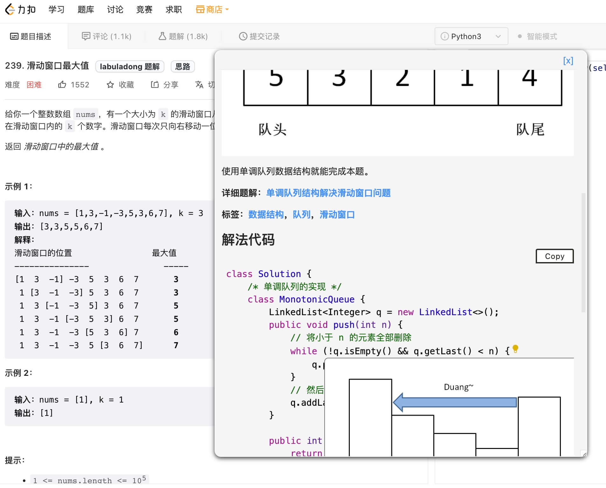
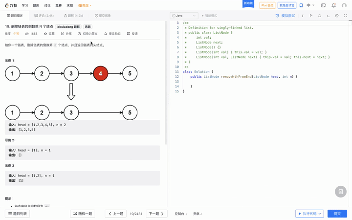
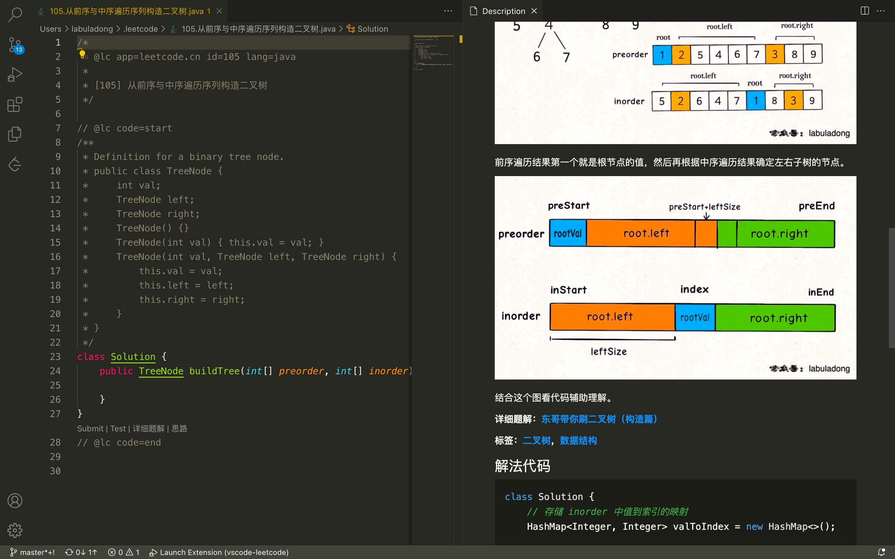
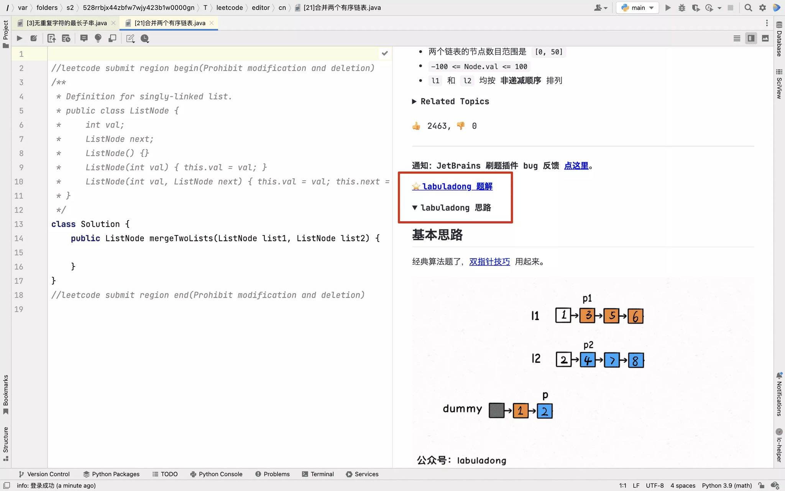
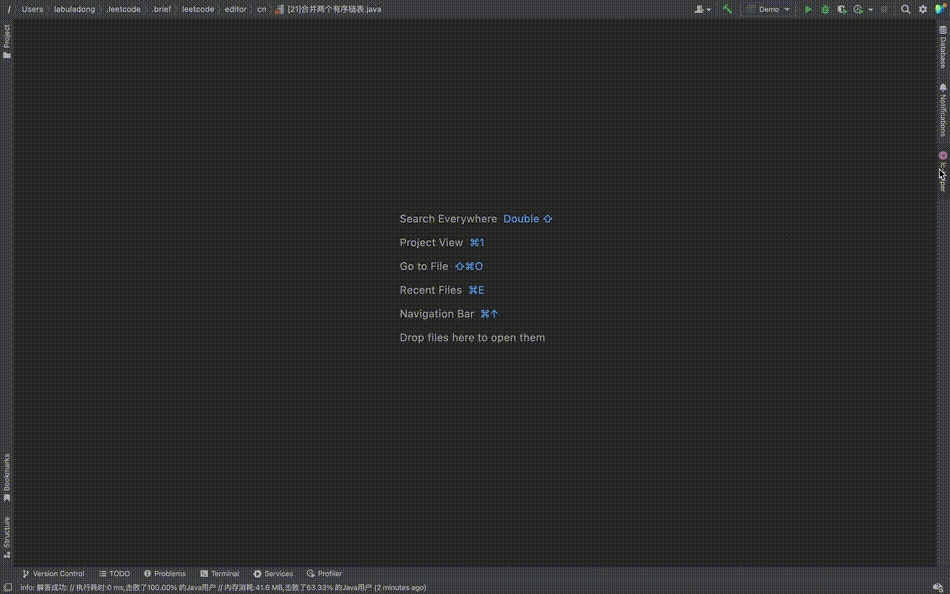

English version repo and Gitbook is on [english branch](https://github.com/labuladong/fucking-algorithm/tree/english). Just enjoy：)

# labuladong 的算法小抄

好消息，《labuladong 的算法小抄》纸质书出版啦！关注公众号查看详情👆

本仓库总共 60 多篇原创文章，都是基于 LeetCode 的题目，涵盖了所有题型和技巧，而且一定要做到**举一反三，通俗易懂**，绝不是简单的代码堆砌，后面有目录。

我先吐槽几句。**刷题刷题，刷的是题，培养的是思维，本仓库的目的就是传递这种算法思维**。我要是只写一个包含 LeetCode 题目代码的仓库，有个锤子用？没有思路解释，没有思维框架，顶多写个时间复杂度，那玩意一眼就能看出来。

只想要答案的话很容易，题目评论区五花八门的答案，动不动就秀 python 一行代码解决，有那么多人点赞。问题是，你去做算法题，是去学习编程语言的奇技淫巧的，还是学习算法思维的呢？你的快乐，到底源自复制别人的一行代码通过测试，已完成题目 +1，还是源自自己通过逻辑推理和算法框架不看答案写出解法？

网上总有大佬喷我，说我写的东西太基础，要么说不能借助框架思维来学习算法。我只能说大家刷算法就是找工作吃饭的，不是打竞赛的，我也是一路摸爬滚打过来的，我们要的是清楚明白有所得，不是故弄玄虚无所指。

不想办法做到通俗易懂，难道要上来先把《算法导论》吹上天，然后把人家都心怀敬仰地劝退？

**做啥事情做多了，都能发现套路的，我把各种算法套路框架总结出来，相信可以帮助其他人少走弯路**。我这个纯靠自学的小童鞋，花了一年时间刷题和总结，自己写了一份算法小抄，后面有目录，这里就不废话了。

### 使用方法

**1、先给本仓库点个 star，满足一下我的虚荣心**，文章质量绝对值你一个 star。我还在继续创作，给我一点继续写文的动力，感谢。

**2、建议关注我的公众号 labuladong，坚持高质量原创，说是最良心最硬核的技术公众号都不为过**。本仓库的文章就是从公众号里整理出来的**一部分**内容，公众号可以查看更多内容：

**3、建议收藏我的在线网站，每篇文章开头都有对应的力扣题目链接，可以边看文章边刷题，一共可以手把手带你刷 300 道题目**：

GitHub Pages 地址：https://labuladong.github.io/algo/

Gitee Pages 地址：https://labuladong.gitee.io/algo/

**4、我的教程已经制作成了《算法秘籍》和《刷题笔记》两本 PDF 教材，[点这里](https://mp.weixin.qq.com/s/X-fE9sR4BLi6T9pn7xP4pg) 查看。另外建议关注 [我的 B 站](https://space.bilibili.com/14089380)，我把一系列核心算法技巧都录制成了视频，方便大家学习**。

**5、我开发了一系列配套插件辅助大家学习算法，覆盖各个使用场景**：

首先是我的 [Chrome 刷题插件](https://mp.weixin.qq.com/s/wIxflO1dvXzDlibhEcENcQ)，方便在网页上刷题的读者，功能如下图：

如果不喜欢在网页刷题，可以安装我的 [vscode 刷题插件](https://mp.weixin.qq.com/s/z4mqiiJV9pZ3t6SIPa2kTA)，功能如下图：

或者，也可以安装我的 [JetBrains 刷题插件](https://mp.weixin.qq.com/s/NF8mmVyXVfC1ehdMOsO7Cw)，功能如下图：

**可以说，我把内容和配套工具全都做好了，你只要按部就班顺着我的教程学习，就可以获得沉浸式的学习体验。这是教程及工具链使用手册的入口**：

其他的先不多说了，直接上干货吧，我们一起搞定 LeetCode，感受一下支配算法的乐趣。

# 目录

### 第零章、必读文章

  * [学习算法和刷题的框架思维](https://labuladong.github.io/article/wx.html?wx=ZYaXOSVM3YBIeRWm7E_jcQ) 
  * [我的刷题心得](https://labuladong.github.io/article/wx.html?wx=_XhcgHrI15PsPp-Ie87p3w)
  * [动态规划解题套路框架](https://labuladong.github.io/article/?qno=509) 
  * [回溯算法解题套路框架](https://labuladong.github.io/article/?qno=51) 
  * [BFS 算法解题套路框架](https://labuladong.github.io/article/?qno=111) 
  * [手把手带你刷二叉树（纲领篇）](https://labuladong.github.io/article/?qno=104)
  * [一文搞懂单链表的六大解题套路](https://labuladong.github.io/article/?qno=21)
  * [一文秒杀所有岛屿题目](https://labuladong.github.io/article/?qno=200)
  * [我写了首诗，让你闭着眼睛也能写对二分搜索](https://labuladong.github.io/article/?qno=704) 
  * [我写了首诗，把滑动窗口算法算法变成了默写题](https://labuladong.github.io/article/?qno=76) 
  * [一个方法团灭 LeetCode 股票买卖问题](https://labuladong.github.io/article/?qno=121) 
  * [一个方法团灭 LeetCode 打家劫舍问题](https://labuladong.github.io/article/?qno=198) 
  * [一个方法团灭 nSum 问题](https://labuladong.github.io/article/?qno=15) 
  * [提高刷题幸福感的小技巧](https://labuladong.github.io/article/wx.html?wx=ucGZavJVKNCJ5j7T15voZA)

### 第一章、手把手刷数据结构

  * [手把手刷链表题目](https://labuladong.github.io/algo/)
    * [一文搞懂单链表的六大解题套路](https://labuladong.github.io/article/?qno=21)
    * [递归反转链表的一部分](https://labuladong.github.io/article/?qno=206) 
    * [如何 K 个一组反转链表](https://labuladong.github.io/article/?qno=25) 
    * [如何判断回文链表](https://labuladong.github.io/article/?qno=234) 

  * [手把手刷二叉树](https://labuladong.github.io/algo/)
    * [手把手带你刷二叉树（纲领篇）](https://labuladong.github.io/article/?qno=104)
    * [手把手带你刷二叉树（第一期）](https://labuladong.github.io/article/?qno=226) 
    * [手把手带你刷二叉树（第二期）](https://labuladong.github.io/article/?qno=654) 
    * [手把手带你刷二叉树（第三期）](https://labuladong.github.io/article/?qno=652) 
    * [手把手带你刷二叉搜索树（第一期）](https://labuladong.github.io/article/?qno=230) 
    * [手把手带你刷二叉搜索树（第二期）](https://labuladong.github.io/article/?qno=450) 
    * [手把手带你刷二叉搜索树（第三期）](https://labuladong.github.io/article/?qno=96) 
    * [美团面试官：你对后序遍历一无所知](https://labuladong.github.io/article/?qno=1373)
    * [二叉树的序列化，就那几个框架，枯燥至极](https://labuladong.github.io/article/?qno=297) 
    * [题目不让我干什么，我偏要干什么](https://labuladong.github.io/article/?qno=341) 
    * [Git原理之最近公共祖先](https://labuladong.github.io/article/?qno=236) 
    * [如何计算完全二叉树的节点数](https://labuladong.github.io/article/?qno=222) 
    * [二叉树八股文：递归改迭代](https://labuladong.github.io/article/wx.html?wx=jI8_-E6rx2HVBOmuQOTgHg)

  * [手把手刷图算法](https://labuladong.github.io/algo/)
    * [图论基础](https://labuladong.github.io/article/?qno=797)
    * [拓扑排序详解及运用](https://labuladong.github.io/article/?qno=207)
    * [二分图判定](https://labuladong.github.io/article/?qno=785)
    * [Union-Find算法详解](https://labuladong.github.io/article/?qno=323) 
    * [Union-Find算法应用](https://labuladong.github.io/article/?qno=130) 
    * [Kruskal 最小生成树算法](https://labuladong.github.io/article/?qno=261)
    * [Prim 最小生成树算法](https://labuladong.github.io/article/wx.html?wx=bvi0wGdbtB4nkYye0yzmqg)
    * [众里寻他千百度：名流问题](https://labuladong.github.io/article/?qno=277)
    * [我写了一个模板，把 Dijkstra 算法变成了默写题](https://labuladong.github.io/article/?qno=743)

  * [手把手设计数据结构](https://labuladong.github.io/algo/)
    * [算法就像搭乐高：带你手撸 LRU 算法](https://labuladong.github.io/article/?qno=146) 
    * [算法就像搭乐高：带你手撸 LFU 算法](https://labuladong.github.io/article/?qno=460) 
    * [前缀树算法模板秒杀五道算法题](https://labuladong.github.io/article/?qno=208)
    * [数据结构设计：最大栈](https://labuladong.github.io/article/?qno=895)
    * [一道求中位数的算法题把我整不会了](https://labuladong.github.io/article/?qno=295) 
    * [设计朋友圈时间线功能](https://labuladong.github.io/article/?qno=355)
    * [单调栈结构解决三道算法题](https://labuladong.github.io/article/?qno=496) 
    * [单调队列结构解决滑动窗口问题](https://labuladong.github.io/article/?qno=239) 
    * [二叉堆详解实现优先级队列](https://labuladong.github.io/article/wx.html?wx=o7tdyLiYm668dpUWd-x7Lg) 
    * [队列实现栈以及栈实现队列](https://labuladong.github.io/article/?qno=232) 

  * [手把手刷数组题目](https://labuladong.github.io/algo/)
    * [小而美的算法技巧：前缀和数组](https://labuladong.github.io/article/?qno=303) 
    * [小而美的算法技巧：差分数组](https://labuladong.github.io/article/?qno=370) 
    * [二维数组的花式遍历技巧](https://labuladong.github.io/article/?qno=48)
    * [双指针技巧总结](https://labuladong.github.io/article/?qno=167) 
    * [我写了首诗，把滑动窗口算法算法变成了默写题](https://labuladong.github.io/article/?qno=76) 
    * [我写了首诗，让你闭着眼睛也能写对二分搜索](https://labuladong.github.io/article/?qno=704) 
    * [二分搜索怎么用？我又总结了套路](https://labuladong.github.io/article/?qno=875)
    * [我和快手面试官对二分搜索进行了深度探讨](https://labuladong.github.io/article/?qno=410)
    * [田忌赛马背后的算法决策](https://labuladong.github.io/article/?qno=870)
    * [给我常数时间，我可以删除/查找数组中的任意元素](https://labuladong.github.io/article/?qno=380) 
    * [带权重的随机选择算法](https://labuladong.github.io/article/?qno=528)
    * [一道数组去重的算法题把我整不会了](https://labuladong.github.io/article/?qno=316) 
    * [如何去除有序数组的重复元素](https://labuladong.github.io/article/?qno=26) 
    * [twoSum问题的核心思想](https://labuladong.github.io/article/?qno=1) 

### 第二章、手把手刷动态规划

  * [动态规划基本技巧](https://labuladong.github.io/algo/)
    * [动态规划解题核心框架](https://labuladong.github.io/article/?qno=509) 
    * [动态规划设计：最长递增子序列](https://labuladong.github.io/article/?qno=300)
    * [最优子结构原理和 dp 数组遍历方向](https://labuladong.github.io/article/wx.html?wx=qvlfyKBiXVX7CCwWFR-XKg) 
    * [base case 和备忘录的初始值怎么定？](https://labuladong.github.io/article/?qno=931)
    * [对动态规划进行降维打击](https://labuladong.github.io/article/wx.html?wx=SnyN1Gn6DTLm0uJyp5l6CQ)
    * [动态规划和回溯算法到底谁是谁爹？](https://labuladong.github.io/article/?qno=494) 

  * [子序列类型问题](https://labuladong.github.io/algo/)
    * [经典动态规划：编辑距离](https://labuladong.github.io/article/?qno=72) 
    * [动态规划设计：最长递增子序列](https://labuladong.github.io/article/?qno=300)
    * [二维递增子序列：信封嵌套问题](https://labuladong.github.io/article/?qno=354) 
    * [动态规划设计：最大子数组](https://labuladong.github.io/article/?qno=53) 
    * [经典动态规划：最长公共子序列](https://labuladong.github.io/article/?qno=1143) 
    * [动态规划之子序列问题解题模板](https://labuladong.github.io/article/?qno=516) 

  * [背包类型问题](https://labuladong.github.io/algo/)
    * [经典动态规划：0-1 背包问题](https://labuladong.github.io/article/wx.html?wx=RXfnhSpVBmVneQjDSUSAVQ) 
    * [经典动态规划：子集背包问题](https://labuladong.github.io/article/?qno=416) 
    * [经典动态规划：完全背包问题](https://labuladong.github.io/article/?qno=518) 

  * [用动态规划玩游戏](https://labuladong.github.io/algo/)
    * [动态规划之最小路径和](https://labuladong.github.io/article/?qno=64)
    * [动态规划帮我通关了《魔塔》](https://labuladong.github.io/article/?qno=174)
    * [动态规划帮我通关了《辐射4》](https://labuladong.github.io/article/?qno=514)
    * [旅游省钱大法：加权最短路径](https://labuladong.github.io/article/?qno=787)
    * [经典动态规划：正则表达式](https://labuladong.github.io/article/?qno=10) 
    * [经典动态规划：高楼扔鸡蛋](https://labuladong.github.io/article/wx.html?wx=xn4LjWfaKTPQeCXR0qDqZg) 
    * [经典动态规划：高楼扔鸡蛋（进阶）](https://labuladong.github.io/article/wx.html?wx=7XPGKe7bMkwovH95cnhang) 
    * [经典动态规划：戳气球](https://labuladong.github.io/article/?qno=312) 
    * [经典动态规划：博弈问题](https://labuladong.github.io/article/wx.html?wx=xTeOzqNiGJwbwIpS3ySZqw) 
    * [经典动态规划：四键键盘](https://labuladong.github.io/article/?qno=651) 
    * [一个方法团灭 LeetCode 打家劫舍问题](https://labuladong.github.io/article/?qno=198) 
    * [一个方法团灭 LeetCode 股票买卖问题](https://labuladong.github.io/article/?qno=121) 
    * [有限状态机之 KMP 字符匹配算法](https://labuladong.github.io/article/?qno=28) 
    * [构造回文的最小插入次数](https://labuladong.github.io/article/?qno=1312) 

  * [贪心类型问题](https://labuladong.github.io/algo/)
    * [贪心算法之区间调度问题](https://labuladong.github.io/article/?qno=435) 
    * [扫描线技巧：安排会议室](https://labuladong.github.io/article/?qno=253)
    * [剪视频剪出一个贪心算法](https://labuladong.github.io/article/?qno=1024)
    * [如何运用贪心思想玩跳跃游戏](https://labuladong.github.io/article/?qno=55) 
    * [当老司机学会了贪心算法](https://labuladong.github.io/article/?qno=134)

### 第三章、必知必会算法技巧

  * [暴力搜索算法](https://labuladong.github.io/algo/)
    * [回溯算法解题套路框架](https://labuladong.github.io/article/?qno=51) 
    * [经典回溯算法：集合划分问题](https://labuladong.github.io/article/?qno=698)
    * [回溯算法团灭子集、排列、组合问题](https://labuladong.github.io/article/?qno=78) 
    * [回溯算法最佳实践：解数独](https://labuladong.github.io/article/?qno=37) 
    * [回溯算法最佳实践：括号生成](https://labuladong.github.io/article/?qno=22) 
    * [BFS 算法解题套路框架](https://labuladong.github.io/article/?qno=111) 
    * [如何用 BFS 算法秒杀各种智力题](https://labuladong.github.io/article/?qno=773) 

  * [数学运算技巧](https://labuladong.github.io/algo/)
    * [常用的位操作](https://labuladong.github.io/article/?qno=191) 
    * [讲两道常考的阶乘算法题](https://labuladong.github.io/article/?qno=172) 
    * [如何高效寻找素数](https://labuladong.github.io/article/?qno=204) 
    * [如何高效进行模幂运算](https://labuladong.github.io/article/?qno=372) 
    * [如何寻找缺失的元素](https://labuladong.github.io/article/?qno=268) 
    * [如何同时寻找缺失和重复的元素](https://labuladong.github.io/article/?qno=645) 
    * [如何在无限序列中随机抽取元素](https://labuladong.github.io/article/?qno=382) 
    * [一行代码就能解决的算法题](https://labuladong.github.io/article/?qno=292) 
    * [几个反直觉的概率问题](https://labuladong.github.io/article/wx.html?wx=eCgxtBpsrZjJQ9KmhKrEJw) 

  * [其他算法技巧](https://labuladong.github.io/algo/)
    * [快速排序亲兄弟：快速选择算法](https://labuladong.github.io/article/?qno=215) 
    * [分治算法详解：运算优先级](https://labuladong.github.io/article/?qno=241) 
    * [一个方法解决三道区间问题](https://labuladong.github.io/article/?qno=1288) 

  * [经典面试题](https://labuladong.github.io/algo/)
    * [谁能想到，斗地主也能玩出算法](https://labuladong.github.io/article/?qno=659) 
    * [东哥吃葡萄时竟然吃出一道算法题！](https://labuladong.github.io/article/wx.html?wx=3VjL7Gud1bQQrbjedzEhMQ) 
    * [烧饼排序算法](https://labuladong.github.io/article/?qno=969) 
    * [字符串乘法计算](https://labuladong.github.io/article/?qno=43) 
    * [如何实现一个计算器](https://labuladong.github.io/article/?qno=224) 
    * [如何高效解决接雨水问题](https://labuladong.github.io/article/?qno=42) 
    * [如何寻找最长回文子串](https://labuladong.github.io/article/?qno=5) 
    * [如何解决括号相关的问题](https://labuladong.github.io/article/?qno=20) 
    * [如何判定完美矩形](https://labuladong.github.io/article/?qno=391) 
    * [如何调度考生的座位](https://labuladong.github.io/article/?qno=855) 
    * [二分查找高效判定子序列](https://labuladong.github.io/article/?qno=392) 

### 第四章、通用计算机技术

  * [Linux 文件系统都是什么鬼](https://labuladong.github.io/article/wx.html?wx=kJx07mbQQExV3JUGJo4nYw) 
  * [Linux 的进程、线程、文件描述符是什么](https://labuladong.github.io/article/wx.html?wx=USb5e2Zoc0LRgRShRpTYfg) 
  * [关于 Linux shell 你必须知道的](https://labuladong.github.io/article/wx.html?wx=h3SXmZ2yMtOKEKdACUx1Ew) 
  * [Linux shell 的实用小技巧](https://labuladong.github.io/article/wx.html?wx=vCtu4lkcoixJELH2t9r7pg) 
  * [Linux 管道符原理大揭秘](https://labuladong.github.io/article/wx.html?wx=p3rwjoCWN2WnH4xxtwDiyQ)
  * [一文看懂 session 和 cookie](https://labuladong.github.io/article/wx.html?wx=lEAFW9ZSiqHJOfMnznPPHA) 
  * [加密算法的前身今世](https://labuladong.github.io/article/wx.html?wx=HvZsBiNn9tPcq11fmWgcLQ) 
  * [我用四个命令概括了 Git 的所有套路](https://labuladong.github.io/article/wx.html?wx=VdeQpFCL3GGsfOKrIRW6Hw) 
  * [Git/SQL/正则表达式的在线练习平台](https://labuladong.github.io/article/wx.html?wx=rSc4b-mdZSLuqBmvPWF8Vw) 

# 感谢如下大佬参与翻译

按照昵称字典序排名：

[ABCpril](https://github.com/ABCpril), 
[andavid](https://github.com/andavid), 
[bryceustc](https://github.com/bryceustc), 
[build2645](https://github.com/build2645), 
[CarrieOn](https://github.com/CarrieOn), 
[cooker](https://github.com/xiaochuhub), 
[Dong Wang](https://github.com/Coder2Programmer), 
[ExcaliburEX](https://github.com/ExcaliburEX), 
[floatLig](https://github.com/floatLig), 
[ForeverSolar](https://github.com/foreversolar), 
[Fulin Li](https://fulinli.github.io/), 
[Funnyyanne](https://github.com/Funnyyanne), 
[GYHHAHA](https://github.com/GYHHAHA), 
[Hi_archer](https://hiarcher.top/), 
[Iruze](https://github.com/Iruze), 
[Jieyixia](https://github.com/Jieyixia), 
[Justin](https://github.com/Justin-YGG), 
[Kevin](https://github.com/Kevin-free), 
[Lrc123](https://github.com/Lrc123), 
[lriy](https://github.com/lriy), 
[Lyjeeq](https://github.com/Lyjeeq), 
[MasonShu](https://greenwichmt.github.io/), 
[Master-cai](https://github.com/Master-cai), 
[miaoxiaozui2017](https://github.com/miaoxiaozui2017), 
[natsunoyoru97](https://github.com/natsunoyoru97), 
[nettee](https://github.com/nettee), 
[PaperJets](https://github.com/PaperJets), 
[qy-yang](https://github.com/qy-yang), 
[realism0331](https://github.com/realism0331), 
[SCUhzs](https://github.com/brucecat), 
[Seaworth](https://github.com/Seaworth), 
[shazi4399](https://github.com/shazi4399), 
[ShuozheLi](https://github.com/ShuoZheLi/), 
[sinjoywong](https://blog.csdn.net/SinjoyWong), 
[sunqiuming526](https://github.com/sunqiuming526), 
[Tianhao Zhou](https://github.com/tianhaoz95), 
[timmmGZ](https://github.com/timmmGZ), 
[tommytim0515](https://github.com/tommytim0515), 
[ucsk](https://github.com/ucsk), 
[wadegrc](https://github.com/wadegrc), 
[walsvid](https://github.com/walsvid), 
[warmingkkk](https://github.com/warmingkkk), 
[Wonderxie](https://github.com/Wonderxie), 
[wsyzxxxx](https://github.com/wsyzxxxx), 
[xiaodp](https://github.com/xiaodp), 
[youyun](https://github.com/youyun), 
[yx-tan](https://github.com/yx-tan), 
[Zero](https://github.com/Mr2er0), 
[Ziming](https://github.com/ML-ZimingMeng/LeetCode-Python3)

# Donate

如果本仓库对你有帮助，可以请作者喝杯速溶咖啡

