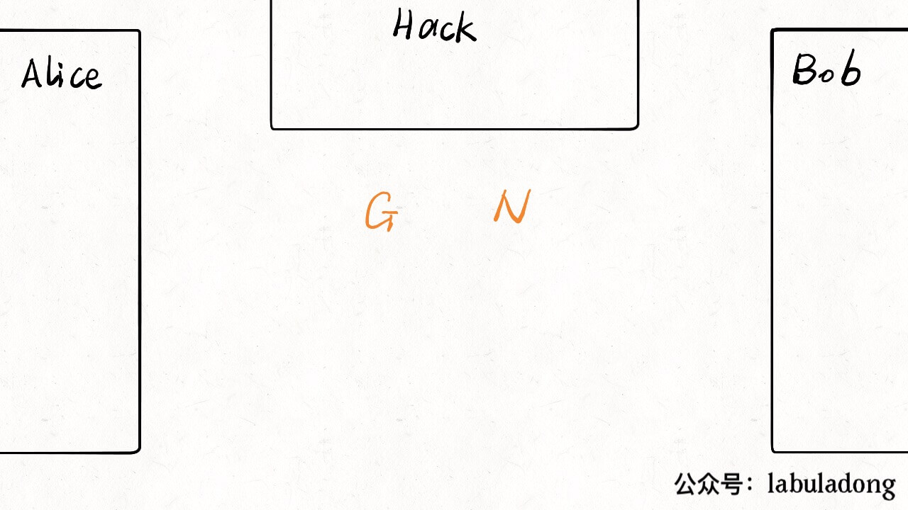
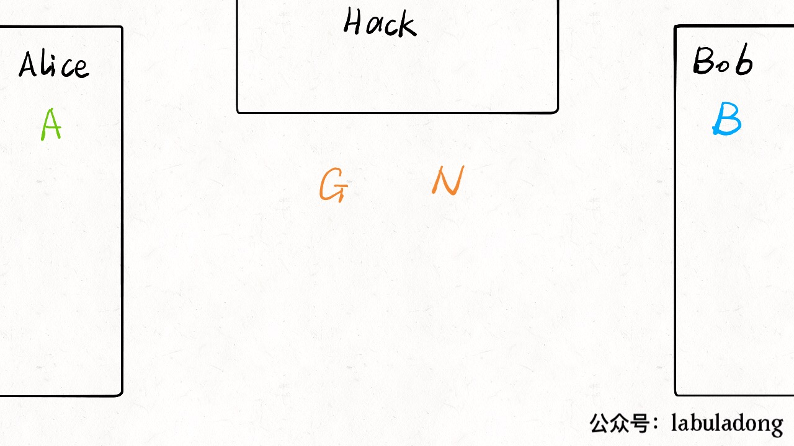
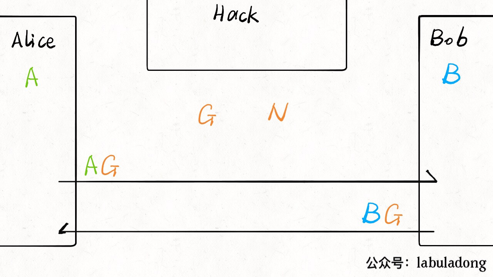
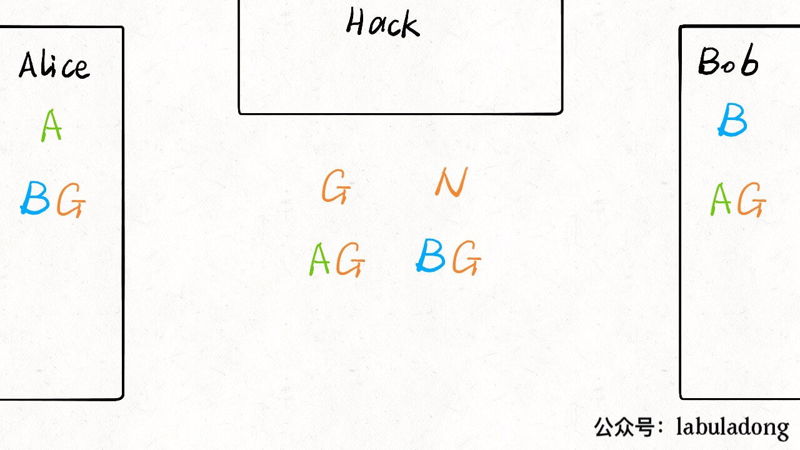
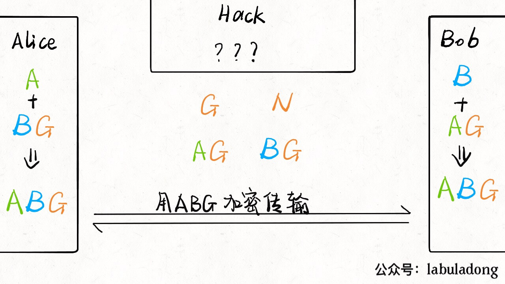
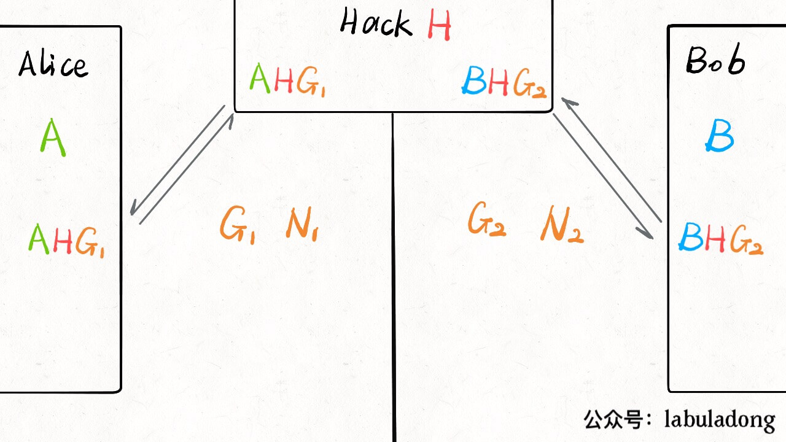
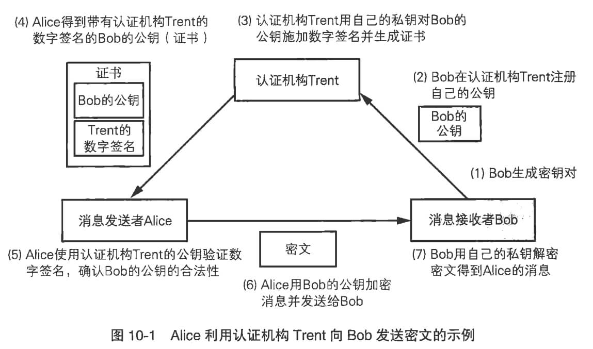

# Cryptology

Speaking of cipher, the first thing that comes to our mind is the password to login, but from the point of cryptography， it is the unqualified cipher.

Why? Because the password of our account depends on crypticity, that is I keep the password in my mind and do not let you know,so you can not login in with my account.

However,cryptography says confidential information will be revealed some day, so encryption algorithm should not keep the secret to become confidential, Conversely, even you know the encryption algorithm, you can do nothing. Magically speaking,I tell you my ciphers, but you still do not know my ciphers.

The most metaphysical algorithm is Diffie-Hellman key exchange algorithm.I am so surprised in such a case that two people exchange some numbers in the front of you and they can share a common secret,but you can not figure out what it is.The following will focus on the algorithm.

In the article,cryptography mainly solve the problem of encrypt and decrypt in the process of information exchange.Assume that the process of information exchange is insecurity and all the information is being eavesdropped,so sender encrypt the information before sending and receiver must know how to decrypt after receiving.The interesting thing is that
if the receiver know the way to decrypt,the eavesdropper should also know.

In the following **we will introduce symmetric encryption algorithm、key exchange algorithm、asymmetrical encryption algorithm、digital signature、public-key certificate** to explain how we solve the problem of secure transmission.

## First, Symmetric Encryption

Symmetric ciphers，also called shared key cipher，as the name suggests，it uses the same key to encrypt and decrypt.

First of all,we know information consists of 0/1 bits sequence and the xor of two identical bits sequence is 0.

For example,one of the simplest symmetric encryption is that we can generate a random bits key that is the same length as original word ,then get the xor of key and origin as encrypted words.
Conversely,we can xor this encrypted words with the key to recovery the origin words.

This simple example has some problems because of its simplicity.For example,if the original words is large,the key is just as large and the overhead of generating large random bits sequence is also high.

Of course,there are many sophisticated and excellent symmetric encryption algorithm that solves these problems.For example, Rijndael cryptographic algorithm,triple DES algorithm and so on.
**These algorithm is invulnerable,that is,they have huge key space,are impossible to brute force and encryption process is relatively fast**.

**However,the weakness of these symmetric encryption algorithm is the distribution of keys**.when using the same key to encrypt and decrypt,sender must send the key to receiver.If the hacker can overhead the encrypted text and the key,these
invulnerable algorithm is broken.

Therefore, the two most common algorithms to solve the key distribution problem are diffie-hellman key exchange algorithm and asymmetric encryption algorithm.

## Second、Key exchange algorithm

The secret key as we say is a big number, the algorithm use this number to encrypt and decrypt. The problem is that transition is insecure and the data can be eavesdropped.In other words, is there a way that it can let two people exchange the key in the front of others?

Diffie-Hellman key exchange algorithm can achieve it. **Precisely speaking, this algorithm do not send the secret to the receiver, but by some sharing number, both sides generate the same secret in their mind and the secret can not be generated by the third party eavesdropper.**

Perhaps this is the legend of the heart has a sharp touch of it.

This algorithm is not complicated, you can try it with your friends and I will show the flow.In the beginning, we should define one thing: **Not all operations have inverses.**

The simplest case is the well-known one-way hash function.That is given a number `a` and a hash function  `f`, you can calculate `f(a)`,but if given `f(a)` and `f`,finding `a` is basically impossible.The reason why the key exchange algorithm looks so mysterious is that it takes advantage of this irreversible property.

Below, let me show the flow of exchange key algorithm. Follow naming conventions, the parties who are going to perform the key exchange algorithm are called Alice and Bob,the bad guy who is trying to steal their communication in the Internet is called hack.

First, Alice and Bob negotiate two number `N` and `G` as the origin.Of course the negotiation can be eavesdropped by Hack,so I put these two numbers in the middle presenting all three parties know.

Now Alice 和 Bob **in mind** generate a number separately `A` and `B`:

Now Alice do some calculation using `A` and `G` and get the result `AG`, then send it to Bob; Bob also do some calculation using `B` and `G` and get the result `BG`,then send it to Alice:

Now the situation is as following:

Note that,as the hash function case above, knowing `AG` and `G` can not figure out `A`, the same as `BG`.

So, Alice can use `BG` and his `A` generate a number `ABG` by some calculation. Bob also can use `AG` and his `B` get the number `ABG` by some calculation. This number is the shared secret of Alice and Bob.

As for Hack, He can eavesdrop `G`,`AG`,`BG`, but because the calculation is irreversible, he can not calculate `ABG`.

Above is the basic flow, as for picking which number, it is exquisite and I won't write specifically for the space.

Under the premise of the third party's eavesdropping, the algorithm can calculate a secret which can not be calculated by others as the key of symmetric encryption algorithm and start the communication of symmetric encryption.

About this algorithm, Hack come up with a crack way, not to eavesdrop Alice and Bob's communication, but to pretend to be Alice and Bob at the same time, that is man-in-middle attack.

In this way, both parties can't realize that they are sharing secrets with Hack. As a result, Hack can decrypt or even modify data.

**So, key exchange algorithm can not perfectly resolve the distribution of the key, the weakness lies in not being able to verify the identity of the receiver**.So, before using exchange key algorithm, we must verify the identity. For example, using the digital signature.

## Third、Asymmetrical encryption

The thinking of the asymmetrical encryption is that don't sneak around with the transmission key. I separate the encryption key from the decryption key and use the public key to encrypt and the private to decrypt.Only send the public key to the receivers and they can send me encrypted data that I can use my private key to decrypt.About the eavesdropper，it is useless to get the data and the public key, because only the private key can be used to decrypt.

You can think like this, **the private key is the key and the public key is the lock.We can public the lock and let others lock the data before send to me,but the key is in my hand to unlock.** Our common RSA algorithm is a typical asymmetric encryption algorithm, the implementation is complicated,I will skip here and you can find in google.

In practice, the speed of asymmetrical encryption is slow compared to the symmetric encryption, so when it comes to transit huge amount of data,we do not use the public key to encrypt the data,but encrypt the symmetric encryption key and send it to receiver and then use symmetric encryption algorithm to encrypt data.

It should be noted that, like Diffie-Hellman algorithm, **asymmetrical encryption algorithm can not verify the identity of sender and receiver,is still be cracked by man-in-middle attack.** For example, Hack block public key released by Bob, then send Alice her public key as Bob.So, without knowing it, Alice will encrypt the private data with Hack's public key, which can be decrypted and eavesdropped by Hack.

So, the Diffie-Hellman algorithm and the RSA asymmetrical encryption algorithm can partially resolve the distribution of the key and both have the same weakness.What is the different scenario of applying them?

Simply speaking, according to the basic principles of the two algorithms, we can see that:

If both sides have a symmetric encryption plan and hope to encrypt the communication and not let others get the key,they can use Diffie-Hellman key exchange algorithm.
If you hope everyone can encrypt the data,but only you can decrypt, you can use RSA asymmetrical encryption algorithm and release the public key.

In the following, we try to resolve the problem of verifying the identity of the sender.

## Fourth、Digital signature

About asymmetrical encryption algorithm as said,it release the public key so that others can send the encrypted date to you and it can only be decrypted by the private key kept by you. Actually, **private key can be used to encrypt the data,as RSA algorithm,the data encrypted by the private key can open be decrypted by the public key.**

Digital signature takes the advantage of asymmetrical encryption,but reverses the process of public key encrypting. **Releasing the public key,but you use the private key to encrypt data and then public the encrypted data,this is the digital signature.**

You may ask what is the purpose? The public key can decrypt the data,but I still encrypt the data and release.Isn't that a superfluous act?

Yes,but **the digital signature is not used to ensure the confidentiality of the data,but is used to verify your identity,** to prove that the data comes from you.

You can image the data encrypted by you private key can only be decrypted by you public key,so if the encrypted data can be decrypted by you public key,can't it prove that the data comes from yourself?

Of course,the encrypted data is just a signature that should be released with the data at the same time.The specific process is:

1 Bob generates the public key and the secret key and releases the public key and keep the secret key himself.

2 **making the data encrypted by the private key as signature and sends the data with this signature.**

3 Alice receives the data the the signature and needs to check does the data come from Bob.So he use the public key released by Bob to decrypt and compare the decrypted data with the received data.If they are the same,it proves that the data is origin and comes from Bob.

Why Alice can conclude? After all,the data and the signature,either can be exchanged.The reason is as follows:

1. If someone modify the data,Alice will know after he decrypt the data and find the difference.

2. If someone exchange the signature,Alice will get the wrong code after decryption and it is obviously different from the original data.

3. someone may tend to modify the data and regenerate the signature so that Alice can not find the difference;but he can not generate the signature because he do not have the private key of Bob.

In Summary,**digital signature can verify the origin of the data to some degree**.The reason is that it can be cracked by man-in-middle attack. Once it comes to the distribution of the public key, the receiver may receive the fake public key and make the wrong verification, Which can not be avoided.

Ridiculously, digital signature is a way verify the identity of others with the assumption that the identity of others is real.It seems like a dead cycle.**There must exist a trusted origin to verify the identity of others,Or no matter how many processes are used, they are just transferring problems, not really solving them.**

## Fifth, Public-key certificate

**The public-key certificate is the public key plus the signature,issued by a trusted third party certification authority**。Introducing the trusted third part is one of the feasible solution of dependency cycle.

The process of certificate is as follows:

1. Bob goes to the trusted certification authority to verify the identity of himself and provide his public key.

2. Alice who wants to communicate with Bob, request the public key of Bob from the certification authority and then certification authority will give the certificate of Bob(it contains Bob's public key and the signature of his public key) to Alice.

3. Alice check the signature adn verify that the public key comes from the certificate authority and not tampered in halfway.

4. Alice encrypts the data through this public key and starts to communicate with Bob.

> PS: the above is for description.In real,certificate is only installed once instead of request from certificate authority every time and it is the server sends the certificate to client not the certificate authority.

Some people may ask if Alice want to verify the validity of the certificate, he must have the public key of the authority.Isn't it the dead cycle mentioned just now?

The regular browser we pre-installed contains trusted certificate to verity the identity of certificate authority,so the certificate is credible.

when Bob provide the public key, he must provide many personal information to strictly verify his identity,so it can be considered trusted.

Except for the trusted public key of Bob, the communication of Alice and Bob is protected by the secure algorithm and is invulnerable.

Most of the regular websites nowadays apply HTTPS protocol, that adds a SSL/TLS secure layer between the HTTP protocol and the TCP protocol. After the TCP handshake, SSL protocol layer also handshake to exchange secure information including the certificate of the website, so that the browser can verify the website. After SSL layer finish the verification, the data in the HTTP protocol is encrypted to guarantee secure transmission.

## Sixth, Summary

Symmetric encryption algorithm use the same secret key to encrypt and decrypt, is hard to crack, encrypt quickly, but has the problem of secret key transmission.

Diffie-Hellman key exchange algorithm can it like a Vulcan mind meld,partially solve the problem of the distribution of the secret key,but it can not verify the identity of senders and receivers and can be cracked by man-in-middle attack.

asymmetrical encryption algorithm generates a pair of secrete keys, separate encryption and decryption.

RSA algorithm is a classical asymmetrical encryption algorithm and it has two purpose:One is to encrypt,that is releasing a public key to encrypt and hold a secret key itself to decrypt,for the confidentiality of the data.Another one is for digital signature,that is
releasing the public key and generate the digital signature by private key, to prove that the data comes from the secret key holder.But either way can not avoid man-in-middle attack because of the distribution of the public key.

The public-key certificate is the public key plus the signature,issued by a trusted third party certification authority.Because regular browsers pre-install the public key of the trusted certification authority, it can avoid man-in-middle attack.

The SSL/TLS secure layer in HTTPS protocol includes these encryption methods above.**So do not install irregular browser and certificate of unknown source**.

Cryptography is a little part of the security.Even though the HTTPS websites certified by a formal authority are not totally trusted,it only indicates the transition of the data is safe.Technology can not protect you.The most important thing is to improve personal safety awareness,pay more attention and handle sensitive data carefully.
