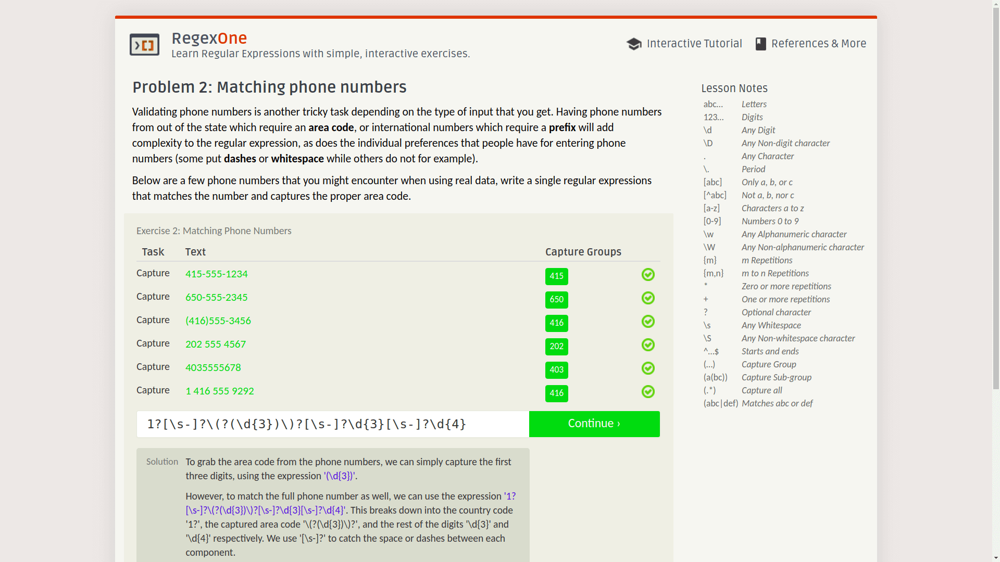
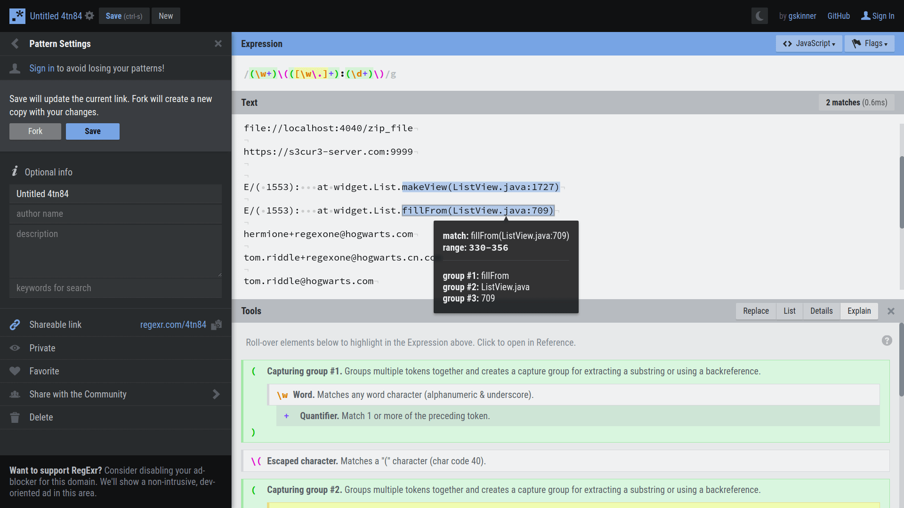
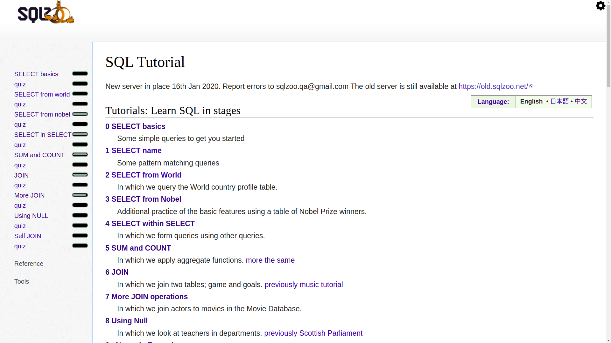
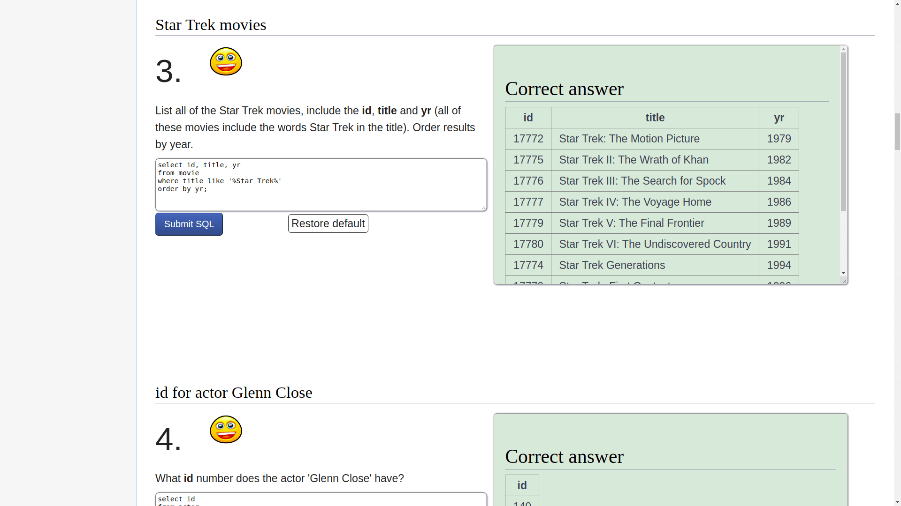

# Git/SQL/Regular Expressions Online Practice Platform

**Translator: [Dong Wang](https://github.com/Coder2Programmer)**

**Author: [labuladong](https://github.com/labuladong)**

Although I like to take exam-oriented education when I'm fine, I also found a trick from the exam-oriented education: If I can learn a certain skill in the form of a question, the efficiency and effectiveness are the best. For technical learning, I often face a dilemma: **I know a lot of theoretical knowledge, but some scenarios can’t be simulated, and I lack the opportunity to do it myself**. It's useful there is a workbook with standard answers.

So when learning new technologies, I will first search for online problem solving platforms. Do n’t mention that some gods have done very good online practice platforms. Here are a few platforms, which are learning Git, SQL, regular expression online training platform.

### 1. Git exercises

This is a project called Learning Git Branching, which I must recommend:

As in the welcome dialog box, this is indeed one of the **best** Git animation tutorials I have found so far, none of them.

When I used Git, I would `add .`,` clone`, `push`,` pull`, `commit`. The other commands would not be at all. Git is a downloader, and Github is a resource website, of course the execution of git commands depend on luck. I don't understand what version control is, and I don't bother to read the messy documents.

The tutorial on this site is not to give you detailed examples of modifying files, but to abstract each `commit` into nodes of the tree, **in the form of animation to break through the levels**, and let you use Git commands to complete your goals freely:

All Git branches are visualized. You just enter the Git command on the command line on the left, and the branch will change accordingly. As long as the task goal is reached, you will pass the level! The website will also record the number of your orders, try to pass the minimum number of orders!

At first I thought that this tutorial only included version management of the local Git repository, but **later I was surprised to find that it also has a remote repository operation tutorial**!

It ’s really the same as playing a game. The difficulty design is reasonable and the fluency is very good. I can’t stop playing it anymore, and I get through in a few hours, cooool!

In short, this tutorial is very suitable for beginners and advanced. If you feel that you don't have a good grasp of Git, using Git commands or relying on luck, you can play this tutorial, I believe it will make you more proficient in using Git.

It is an open source project, Github project address:

https://github.com/pcottle/learnGitBranching

Tutorial website address:

https://learngitbranching.js.org

### 2. regular expression exercises

**Regular expression is a very powerful tool**. It can be said that all data in the computer are characters. With the help of pattern matching tools such as regular expressions, operating the computer can be said to be even more powerful.

Here are two websites recommended, one is an exercise platform, and the other is a platform for testing regular expressions.

The exercise platform called RegexOne:

There are basic tutorials in front, and some common regular expression topics in the back, such as judging mailboxes, URLs, phone numbers, or extracting key information from logs.

As long as you write a regular expression that meets the requirements, you can go to the next question. The key is that each question has a standard answer. You can click the solution button below to view it:

RegexOne URL：

https://regexone.com/

The test tool is a Github project called RegExr and its website:

It can be seen that after entering text and regular pattern strings, **the website will add nice and easy-to-recognize styles to regular expressions, automatically search for pattern strings in text, highlight matching strings, and also display each group captured string**.

This website can be used in conjunction with the previous regular exercise platform. Here you can try various expressions and paste them after successful matching.

RegExr URL：

https://regexr.com/

If you want to learn more about regex, there is a good advanced learning resource: [https://www.regular-expressions.info/](https://www.regular-expressions.info/).

And another high quality regex testing site is: [https://regex101.com/](https://regex101.com/).

### 3. SQL exercises

This is a website called SQLZOO with all the exercises on the left:

SQLZOO is a very useful SQL practice platform. English is not difficult to understand. You can read the English version directly, but you can also switch to Traditional Chinese, which is friendly.

Here are the more commonly used SQL commands, to give you a need, you write SQL statements to achieve correct query results. **The most important thing is that there is not only a detailed explanation of the usage of each command here, there is a multiple choice question (quiz) at the end of each topic, and there is a judgment system, and even some difficult questions have video explanations**:

As for the difficulty, it's gradual, even friendly to novices, and the later questions are really more technical. I believe this is what people who love to think and challenge like! LeetCode also has SQL-related topics, but the difficulty is generally relatively large. I think it is more appropriate to brush the basic SQL commands in SQLZOO and then to LeetCode.

Website address:

https://sqlzoo.net/
