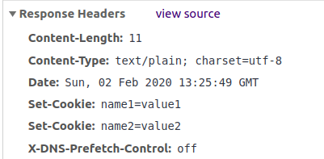
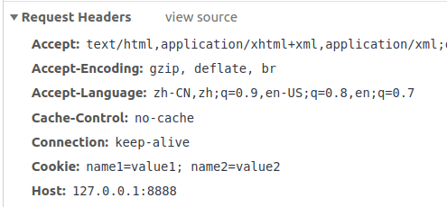
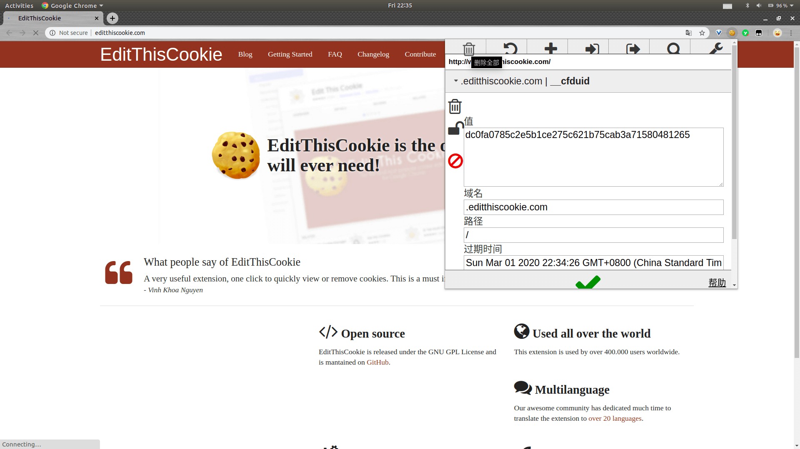
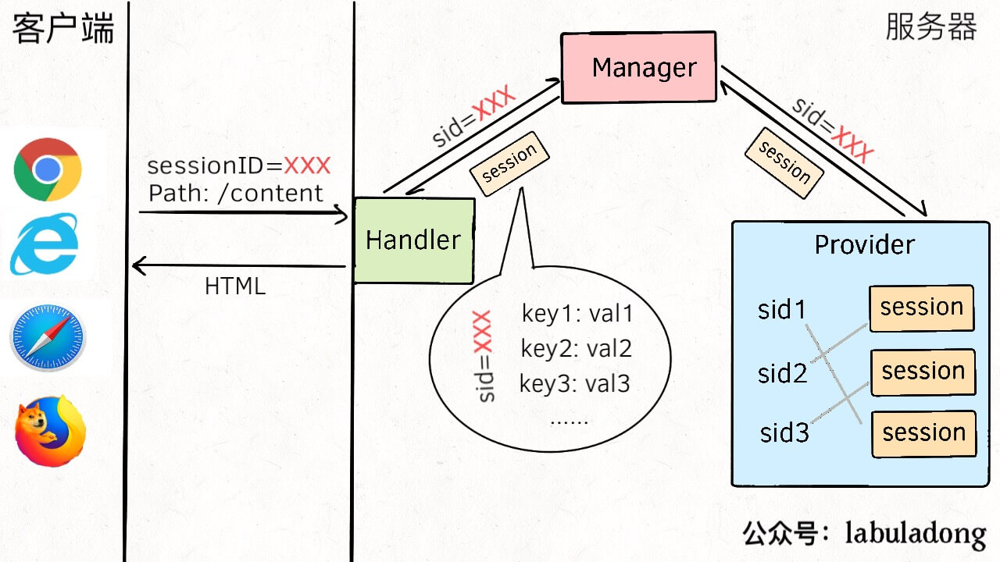

# Session and Cookie

**Translator: [Funnyyanne](https://github.com/Funnyyanne)**

**Author: [labuladong](https://github.com/labuladong)**

Everyone should be familiar with cookies. For example after logging on the website, you will be asked to log in again. Or some guys play with python, but websites just block your crawlers. These are all related to cookies. If you understand the server backend's processing logic for cookies and sessions, you can explain these phenomena, and even drill some holes indefinitely, let me talk it slowly.

## 1.Introduction to session and cookie

The emergence of cookie because HTTP is a stateless protocol, In other words, the server can't remember you, and every time you refresh the web page, you have to re-enter your account password to log in. It's hard to accept. Cookie is like the server tagged you, and the server recognizes you every time you make a request to the server.

To summarize it abstractly：**A cookie can be considered a「variable」,such as `name=value`,stored in the browser; One session can be understood as a data structure ,for the most part is the 「mapping」（Key-value data）,and stored on the server**.

Note that I said is 「a」cookie can be thought of as a variable,but the server can be set at a time more than one cookie. So it sometimes makes sense to say that cookies are「a set」of key-value pairs.

Cookie can be set on the sever through the “SetCookie” field of HTTP, such as s simple service I wrote in Go:

```go
func cookie(w http.ResponseWriter, r *http.Request) {
    // Set up two cookies
 http.SetCookie(w, &http.Cookie{
  Name:       "name1",
  Value:      "value1",
 })

 http.SetCookie(w, &http.Cookie{
  Name:  "name2",
  Value: "value2",
 })
    // Write string back
 fmt.Fprintln(w, "content")
}
```

When the browser accesses the corresponding URL, check the details of the HTTP communication through the browser‘s develop tools,and you can see that the server’s response issued the  `SetCookie` command twice：



After that,the `Cookie` field in the browser’s request carries two cookies：



**So, what cookie does is it's very simple, it's nothing more than the server tagging every client (browser)** to make it easier for the server to recognize them. Of course, HTTP also has a number of parameters that can be used to set cookies, such as expiration time, or to make a cookie available only to a specific path, and so on.

But the problem is that we also know that many websites now have complex functions and involve a lot of data interaction. For example, the shopping cart function of the e-commerce website has a large amount of information and a complicated structure, not by a simple cookie mechanism to pass so much information. Also, know that the cookie field is stored in the HTTP header. Even if it can carry this information, it will consume a lot of bandwidth and consume more network resources.

Session can work with cookies to solve this problem. For example, a cookie stores such a variable `sessionID=xxxx`, and just passes this cookie to the server, and then the server finds the corresponding session by this ID. This session is a data structure that stores the user ’s shopping cart and other detailed information. The server can use this information to return to the user's customized web page, effectively solving the problem of tracking users.

**Session is a data structure designed by the website developer, so it can carry various data** , as long as the client's cookie sends a unique session ID, the server can find the corresponding session, recognize this client.

Because session is stored in the server in the form of memory. When many users occupy the session, it will take up server resources, so the session pool management plan must be done. Due to the session will generally have an expiration time. The server will regularly check and delete the expired session. If the user to access the server again later, may go into log back in and so on, the server will create a new session, the session ID sends to the client through the form of a cookie.

So, we know the principle of cookies and sessions, what are the practical benefits? **In addition to dealing with interviews, I will tell you the usefulness of a chicken thieves, that is use these services without paying.**

Some website, the services you use it for the first time. It allows you to try it for free directly, but after using it once, let you log in and pay to continue using the service. And you find that the website seems to remember your computer by some means, unless you change the computer or change a browser to do it for free again.

So the question is, how does the web server remember you when you're not logged in? Obviously, the server must have sent cookies to your browser, and a corresponding session was set up in the background to record your status. Every time your browser visits the website, it will obediently carry cookies. Server checks the session that the browser has been free to use, have to let it log in pay, can't let it continue to pay for nothing.

If I don't let the browser sends the cookie, every time I pretend to be a little cute newcomer to try it out, can I keep no flower playing? The browser will store the website's cookies as files in some places (different browser configurations are different), so you just find them and delete them. But for Firefox and Chrome browsers, there are many plugins that can directly edit cookies.For example, my Chrome browser with a plug-in called “EditThisCookie”, this is their website:



This type of plugin can read the browser's cookies on the current web page, open the plugin can edit and delete cookies at will. **Of course, occasionally get a free job is okay, but discouraged it all time. If you want to use it, pay for it. Otherwise, That's all the website can say:“No buck, No bang!”**

The above is a brief introduction to cookies and sessions. Cookie is a part of the HTTP protocol and are not complicated. So let's take a look at the code architecture to implement session management in detail.

## 2.Implementation of session

The principle of session is not difficult, but it is very skillful to implement it. Generally, three components are required to complete it. They respectively are`Manager`,`Provider` and  `Session` three classes (interface).



1. The browser requests the page resource of the path `/content` rom the server over the HTTP protocol, there is a Handler function on the corresponding path to receive the request, parses the cookie in the HTTP header, and gets the session ID stored in it,then send this ID to the  `Manager`.

2. `Manager`acts as a session manager, mainly storing some configuration information, such as the lifetime of the session, the name of the cookie, and so on. All sessions are stored in a `Provider` inside the `Manager`.So `Manager` passes the `Sid` (session ID) to the `Provider` to find out which session that ID corresponds to.

3. `Provider` is a container, most commonly a hash table that maps each `Sid` to its session. After receiving the `Sid` passed by the `Manager`, it finds the session structure corresponding to the `Sid`, which is the session structure, and returns it.

4. `Session` stores the user's specific information. The logic in the Handler function takes out this information, generates the user's HTML page, and returns it to the client.

So you might ask, why make such a trouble, why not directly in the Handler function to get a hash table, and then store the `Sid` and `Session` structure mapping ?

**That's the design trick!** Let's talk about why it is divided into `Manager`、`Provider` and  `Session`。

Let's start with `Session` at the bottom. Since session is a key-value pair, why not use a hash table directly, but abstract such a data structure?

First, because the `Session` structure may not only store a hash table, but also some auxiliary data, such as `Sid`, number of accesses, expiration time, or last access time, which is easy to implement algorithms like LRU and LFU.

Second, because sessions can be stored in different ways. If you use the built-in programming language hash table, then the session data is stored in memory, if the amount of data, it is likely to cause the program to crash, but once the program ends, all session data is lost. So we can have a variety of session storage, such as cached database Redis, or stored in MySQL and so on.

Therefore, `Session` structure provides a layer of abstraction to shield the differences between different storage methods, as long as a set of common interfaces are provided to manipulate key-value pairs:

```go
type Session interface {
    // Set key-value pairs
    Set(key, val interface{})
    // Get the value by key
    Get(key interface{}) interface{}
    // Remove key
 Delete(key interface{})
}
```

Besides, why `Provider` should be abstracted. `Provider` in our figure above is a hash table that holds the mapping of `Sid` to `Session`, but it will definitely be more complicated in practice. We need to delete some sessions from time to time. In addition to setting the survival time, we can also adopt some other strategies, such as LRU cache elimination algorithm, which requires the `Provider` to use the data structure of hash list to store the session.

PS: For the mystery of the LRU algorithm, please refer to the [LRU_algorithm](https://github.com/Funnyyanne/fucking-algorithm/blob/english/interview/LRU_algorithm.md) above.

Therefore, `Provider` as a container is to shield algorithm details and organize the mapping relationship between `Sid` and `Session` with a reasonable data structure and algorithm.You only need to implement the following methods to add, delete, modify and check sessions:

```go
type Provider interface {
    // Add and return session
    SessionCreate(sid string) (Session, error)
    // Delete a session
    SessionDestroy(sid string)
    // Read a session
    SessionRead(sid string) (Session, error)
    // Update a session
    SessionUpdate(sid string)
    // Recycle expired sessions through an algorithm similar to LRU
 SessionGC(maxLifeTime int64)
}
```

Finally, `Manager`, most of the specific work is delegated to `Session` and the `Provider`, `Manager` is mainly a set of parameters, such as the survival time of the session, the strategy to clean up expired sessions, and the session's available storage methods. `Manager` blocks the specific details of the operation, and we can flexibly configure the session mechanism through `Manager`.

In summary, the main reason for the session mechanism to be divided into several parts is decoupling and customization. I have seen several use Go to implement session services on Github, the source code is very simple, if you are interested you can learn：

<https://github.com/alexedwards/scs>

<https://github.com/astaxie/build-web-application-with-golang>
