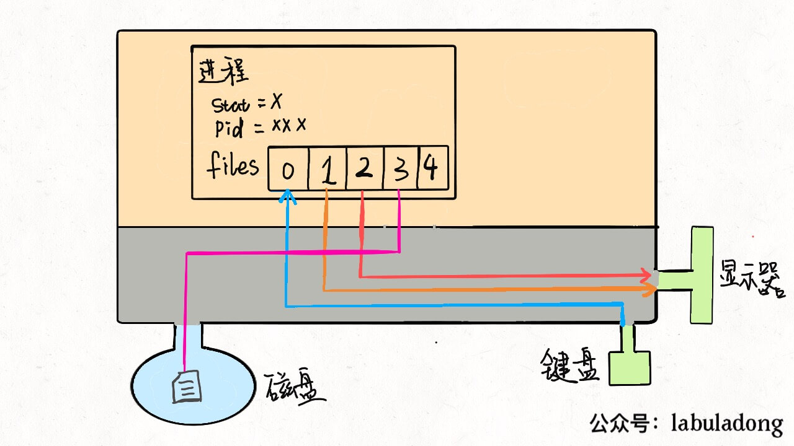

# What are Processes, Thread, and File Descriptor in Linux

**Translator: [Seaworth](https://github.com/Seaworth)**

**Author: [labuladong](https://github.com/labuladong)**

Speaking of process, I am afraid that the most common problem of interviews is the relationship between thread and process. The answer is: **In Linux systems, there is almost no difference between process and thread**.

A process of Linux is a data structure. You can clearly understand the underlying working principle of file descriptors, redirection, and pipeline commands. Finally, from the perspective of operating system, we can see why there is basically no difference between thread and process.

## 一、What is a process

First, abstractly, our computer is this thing as follows:


This large rectangle represents the computer's **memory space**, where the small rectangle represents **process**, the circle in the lower left corner represents **disk**, and the graph in the lower right corner represents some **input and output devices** , such as mouse, keyboard, monitor, etc. In addition, it is noted that the memory space is divided into two parts, the upper part represents **user space**, and the lower part represents **kernel space**.

User space holds the resources that the user process needs to use. For example, if you create an array in the program, this array must exist in user space. Kernel space stores system resources that the kernel process needs to load. These resources are generally not allowed to be accessed by users. But some user processes can share some kernel space resources, such as some dynamic link libraries and so on.

We write a hello program in C language, compile it to get an executable file, run it on the command line to display Hello World on the screen, and then exit the program. At the operating system level, a new process is created, which reads the executable file into memory space, executes it, and finally exits.

**The executable program you compiled is just a file**, not a process. The executable file must be loaded into memory and packed into a process to really run. Processes are created by the operating system. Each process has its inherent attributes, such as process ID (PID), process status, open files, etc. After the process is created, ti reads into your program and your program will be executed by the system.

So, how does the operating system create processes? **For the operating system, a process is a data structure**. Let's look directly at the Linux source code:

```cpp
struct task_struct {
 // Process status
    /* -1 unrunnable, 0 runnable, >0 stopped: */
 long     state;
 // Virtual memory structure
 struct mm_struct  *mm;
 // Process number
 pid_t     pid;
 // Pointer to parent process
 struct task_struct __rcu  *parent;
 // Children form the list of natural children:
 struct list_head  children;
 // Pointer to filesystem information:
 struct fs_struct  *fs;
 // Open file information:
 struct files_struct  *files;
};
```

`task_struct` is the description of a process by the Linux kernel, which can also be called `process descriptor`. The [source code](https://github.com/torvalds/linux/blob/master/include/linux/sched.h) is more complicated. So I only intercepted a few common ones here.

The interesting ones are the `mm` pointer and the `files` pointer. The `mm`  pointer refers to the virtual memory of the process, which is where the resources and executable files are loaded. The `files` pointer points to an array containing pointers to all files opened by the process.

## 二、What is a file descriptor

Let's start with `files`, which is an array of file pointers. Generally, a process will read input from `files[0]`, write output to `files[1]`, and write error information to `files[2]`.

For example, from our perspective, the `printf` function in C is to print characters to the command line, but from the process perspective, it is to write data to `files[1]`. Similarly, the `scanf` function is that the process reads data from `files[0]`.

**When each process is created, the first three bits of `files` are filled with default values, which point to standard input stream, standard output stream, and standard error stream, respectively. We often say `file descriptor` refers to the index of this file pointer array**. So the file descriptor of the program by default : 0 represents standard input (stdin), 1 is standard output (stdout), 2 is standard error (stderr).

We can redraw a picture as follows:


For general computers, input stream is the keyboard, output stream and error stream are both displays. So now this process is connected to the kernel with three wires. Because hardware resources are managed by the kernel, our process needs to let the kernel process access hardware resources through **system calls**.

PS: Don't forget, everything is abstracted into files  in Linux. And devices are also files, which can be read and written.

If the program we wrote needs other resources, such as opening a file for reading and writing, this is also very simple. Make a system call and let the kernel open the file, and this file will be placed in the 4th position of `files`:



Understand this principle, **input redirection** is easy to understand. When the program wants to read data, it will read `files[0]`. So we just point `files[0]` to a file. Then the program will read the data from this file instead of the keyboard. the **less-than character <** is used to redirect the input of a command.

```shell
command < file.txt
```


Similarly, **output redirection** is to point `files[1]` to a file. So the output of the program will not be written to the display, but to this file. The **greater-than character >** is used for output redirection.

```shell
command > file.txt
```


Error redirection is the same, so I will not go into details.

**Pipe symbol** is actually the same. It connects the output stream of one process with the input stream of another process, and the data is passed in it. I have to say that this design idea is really beautiful.

```shell
cmd1 | cmd2 | cmd3
```


At this point, you may also see the clever design idea of **Everything is a file in Linux**. Whether it is a device, a process, a socket, or a real file, all of them can be read and written. And they are loaded into a simple `files` array. The specific details are delivered to the operating system, which is effectively decoupled, beautiful and efficient.

## 三、What is a thread

The first thing to be clear is that multi-process and multi-thread can achieve concurrency to improve the utilization efficiency of the processor. So the key now is what's the difference between multi-thread and multi-process.

Why is there basically no difference between thread and process in Linux? From the perspective of the Linux kernel, thread and process are not treated differently.

We know that the system call `fork()` function can create a new child process. And the function `pthread()` can create a new thread. **But both thread and process are represented by the `task_struct` structure. The only difference is the shared data area**.

In other words, threads look no different from processes. It's just that some data areas of a thread are shared with its parent process. However, a child process is a copy, not a share. For example, the `mm` structure and the `files` structure are shared across threads, I drew two pictures and you will understand.


Therefore, our multi-thread program should use the lock mechanism to avoid multiple threads writing data to the same area at the same time. Otherwise, data may be disordered.

Then you may ask, **Since processes and threads are similar, and multi-process data is not shared, that is, there is no data disorder problem. Why is multi-thread use more common than multi-process?**

Because in reality the concurrency of data sharing is more common. For example, ten people take ten yuan from one account at the same time. What we hope is that the balance of this shared account will be reduced by exactly one hundred yuan. Instead, each person gets a copy of the account, and each copy account is reduced by ten yuan.

Of course, it must be explained that only Linux systems treat thread as process that shares data, and do not treat them specifically, do not treat thread and process differently. Many other operating systems treat thread and process differently. Threads have their own unique data structures. I personally think that this design is not as concise as Linux and increases the complexity of the system.

Creating threads and processes are very efficient in Linux. For the problem of memory area copy, Linux uses the copy-on-write optimization strategy when creating a process. The memory space of parent process is not actually copied, but only copied during the write operation. **So creating processes and threads in Linux are very fast**.

Stick to original high-quality articles, committed to making algorithmic problems clear. Welcome to follow us on WeChat public account **labuladong** for latest articles.
