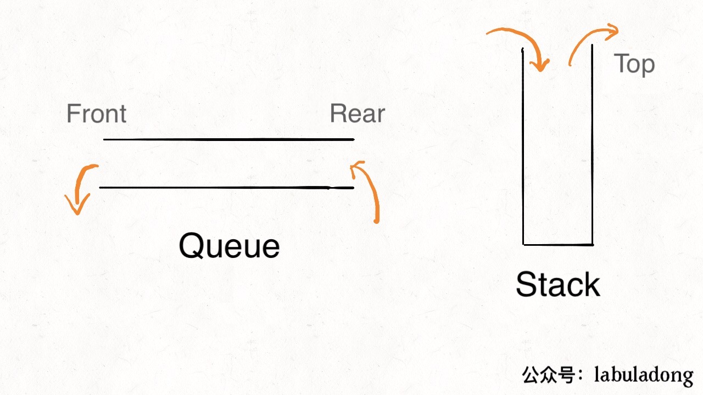
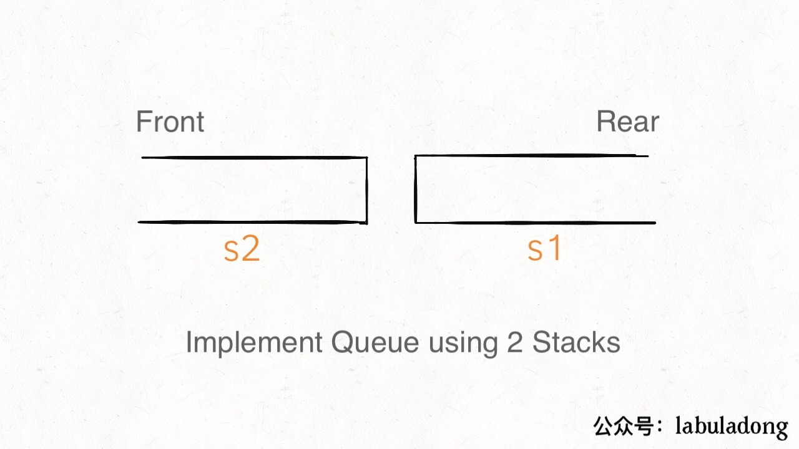
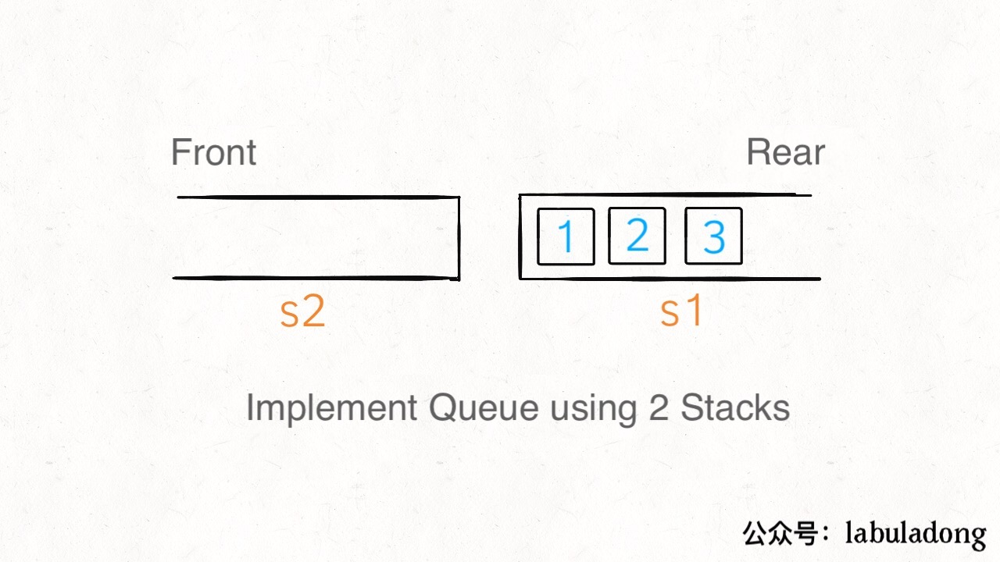
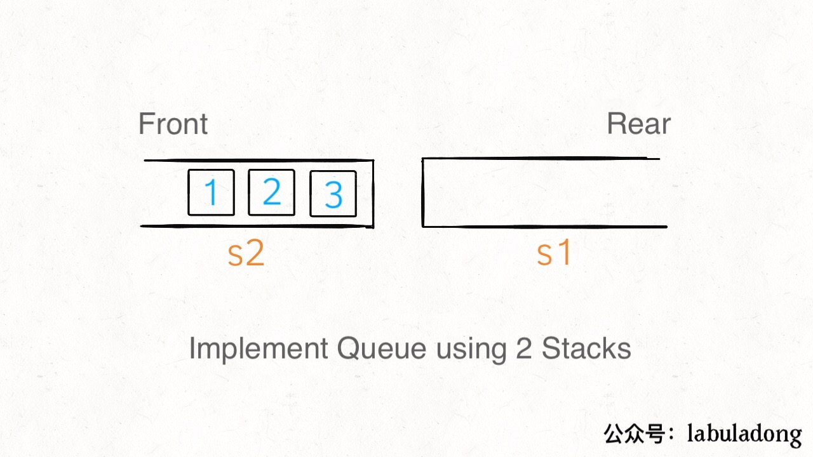
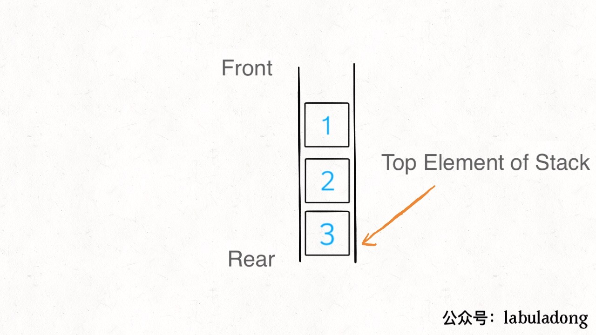
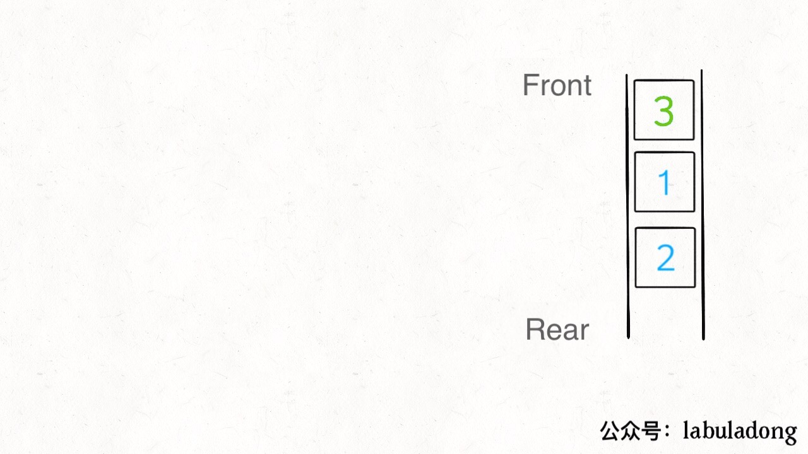

# Implement Queue using Stacks |Implement Stack using Queues

**Translator:[walsvid](https://github.com/walsvid)**

**Author:[labuladong](https://github.com/labuladong)**

Queue is a FIFO (first-in-first-out) strategy data structure, while Stack is a FILO (first-in-last-out) data structure. The visual description of these data structures is shown in the figure:



The basics of these two data structures are actually implemented by arrays or linked lists, but the API limits their behavior. So let's take a look at how to use "Stack" to implement a "Queue" and how to use "Queue" to implement a "Stack".

### 1. Using Stack to implement Queue

First, the API of Queue are as follows:

```java
class MyQueue {
    
    /** Push element x to the back of queue. */
    public void push(int x);
    
    /** Removes the element from in front of queue and returns that element. */
    public int pop();
    
    /** Get the front element. */
    public int peek();
    
    /** Returns whether the queue is empty. */
    public boolean empty();
}
```

We can use two stacks `s1,s2` to implement the function of a queue (it may be easier to understand to place the stack horizontally):



```java
class MyQueue {
    private Stack<Integer> s1, s2;
    
    public MyQueue() {
        s1 = new Stack<>();
        s2 = new Stack<>();
    }
    // ...
}
```

When calling `push` to enqueue an element, we only need to push the element into `s1`. For example, if we `push` 3 elements into 1,2,3, then the detailed structure is like this:



```java
/** Push element x to the back of queue. */
public void push(int x) {
    s1.push(x);
}
```

So what if using `peek` to get the front element of the queue at this time? Logically speaking, the front element should be 1, but in `s1`, 1 is pushed to the bottom of the stack. Now we can use `s2` to transit elements. When `s2` is empty, all elements of `s1` can be moved to` s2`, **at this time the elements in `s2` are FIFO (first-in-first-out) order**.



```java
/** Get the front element. */
public int peek() {
    if (s2.isEmpty())
        // move elements from s1 to s2
        while (!s1.isEmpty())
            s2.push(s1.pop());
    return s2.peek();
}
```

Similarly, for the `pop` operation, we only need to operate `s2`.

```java
/** Removes the element from in front of queue and returns that element. */
public int pop() {
    // First call peek to ensure that s2 is not empty.
    peek();
    return s2.pop();
}
```

Finally, how to determine the queue is empty? If both stacks are empty, the queue is empty:

```java
/** Returns whether the queue is empty. */
public boolean empty() {
    return s1.isEmpty() && s2.isEmpty();
}
```

So far, we implement a queue with stacks. The core idea is to use two stacks to cooperate with each other.

It is worth mentioning, what is the time complexity of these operations? What's interesting is that the `peek` operation may trigger a `while` loop when it is called. In this case, the time complexity is $O(N)$, but in most cases, the `while` loop will not be triggered and the time complexity is $O(1)$. Since the `pop` operation calls `peek`, its time complexity is the same as peek.

In this case, it can be said that their **worst time complexity** is $O(N)$, because, including a `while` loop, it may be necessary to move elements from `s1` to `s2`.

However, their **average time complexity** is $O(1)$. We can understand it in this way: For an element, it can only be moved at most once, which means that the average time complexity of each element of the `peek` operation is $O(1)$.

### 2. Using Queue to implement Stack

If it is tricky to use 2 stacks to implement a queue, then using queue to implement stack is much more straightforward, requiring only one queue as the basic data structure. 

First, the API of stack are as follows:

```java
class MyStack {
    
    /** Push element x onto stack. */
    public void push(int x);
    
    /** Removes the element on top of the stack and returns that element. */
    public int pop();
    
    /** Get the top element. */
    public int top();
    
    /** Returns whether the stack is empty. */
    public boolean empty();
}
```

Let's talk about the `push` API first. We can add elements directly to the queue, and record the rear element at the same time. Since the rear element is equivalent to the top element of the stack, if we want to use `top` to get the top element of the stack, we can directly return it:

```java
class MyStack {
    Queue<Integer> q = new LinkedList<>();
    int top_elem = 0;

    /** Push element x onto stack. */
    public void push(int x) {
        // x is the rear element of queue, it also the top element of stack.
        q.offer(x);
        top_elem = x;
    }
    
    /** Return the top element. */
    public int top() {
        return top_elem;
    }
}
```

Our basic data structure is a FIFO queue, and each `pop` can only take elements in front of the queue; But the stack is FILO, which means the `pop` API takes elements from the rear of the queue.



The solution is simple. We can take out the front element of the queue and add it to the rear of the queue, and let the previous rear element line up to the head of the queue, and then we can take it out:



```java
/** Removes the element on top of the stack and returns that element. */
public int pop() {
    int size = q.size();
    while (size > 1) {
        q.offer(q.poll());
        size--;
    }
    // the previous rear element reaches the head of the queue
    return q.poll();
}
```

There is still a small problem with this implementation. The original rear element has reached to the head of the queue and has been deleted, but the `top_elem` variable was not updated. We need a little modification:

```java
/** Removes the element on top of the stack and returns that element. */
public int pop() {
    int size = q.size();
    // Leave the last 2 elements
    while (size > 2) {
        q.offer(q.poll());
        size--;
    }
    // Record the new rear element
    top_elem = q.peek();
    q.offer(q.poll());
    // Remove the previous rear element
    return q.poll();
}
```

In the end, the `empty` API is easy to implement, just check if the underlying queue is empty:

```java
/** Returns whether the stack is empty. */
public boolean empty() {
    return q.isEmpty();
}
```

Obviously, if we implement a stack with a queue, the time complexity of the `pop` operation is $O(N)$, and all other operations are $O(1)$.

I think that implement a stack with a queue is a trivial problem, but **implement a queue with a dual stack is worth learning**.


After moving elements from stack `s1` to `s2`, the elements become the FIFO order of the queue in s2. This feature is similar to "Two negatives make an affirmative.," which is not easy to think.

I hope this article is helpful to you.

"Stick to original high-quality articles, and work hard to make algorithmic problems clear."