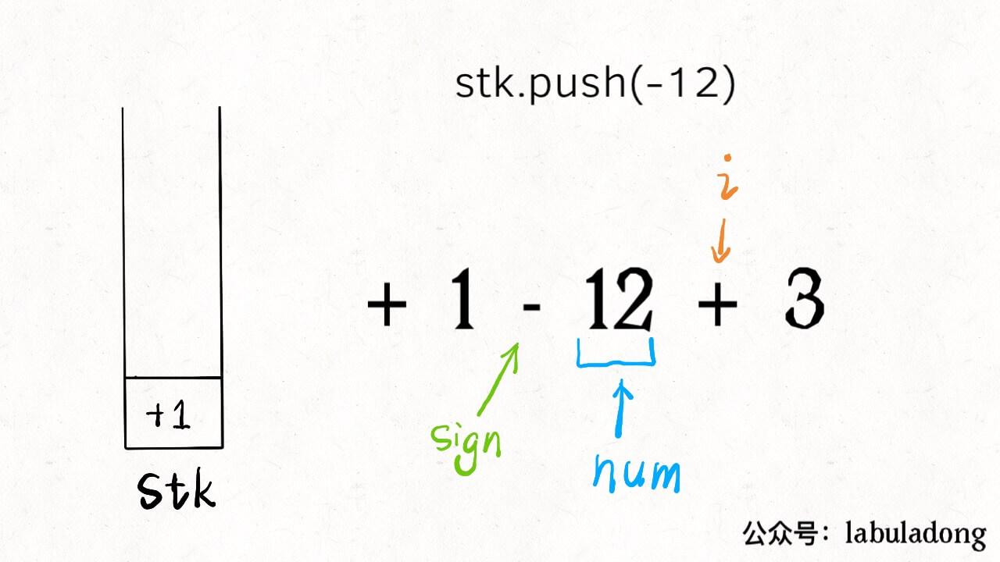
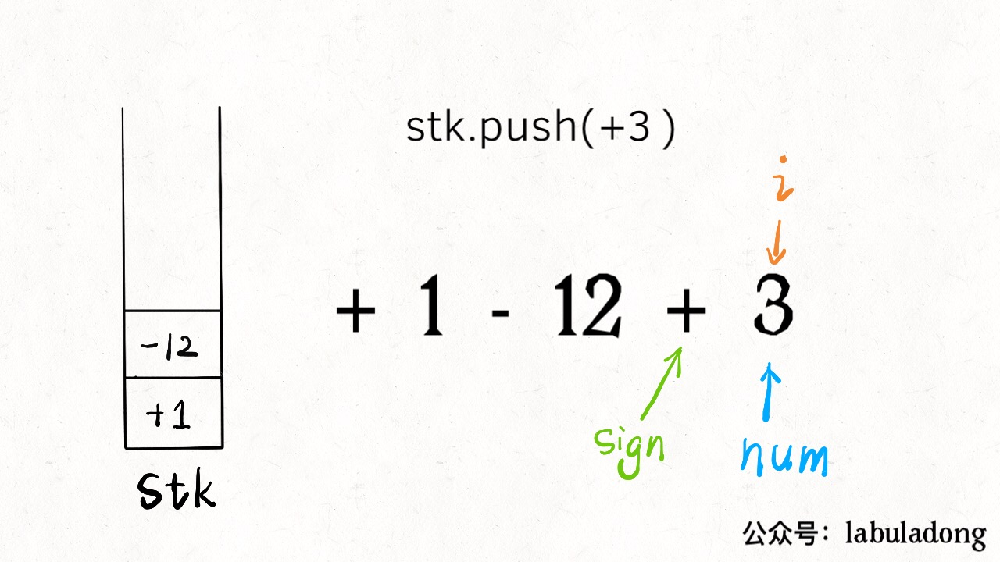
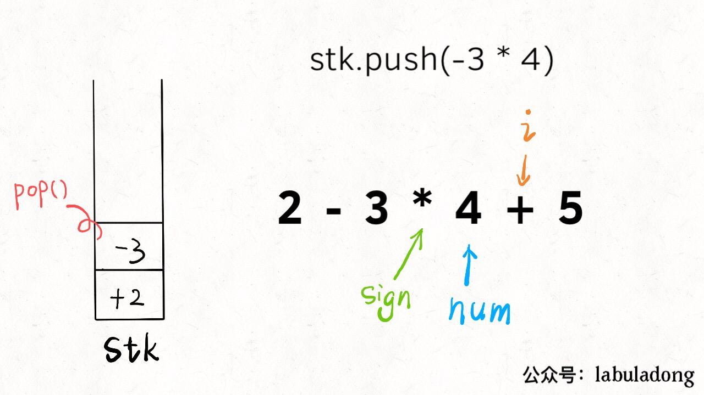
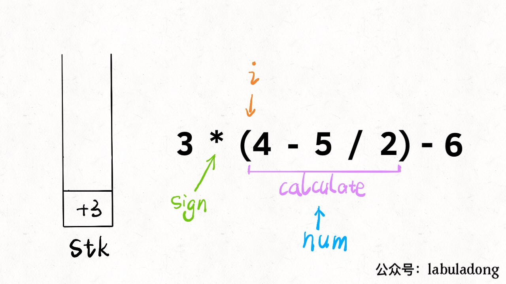
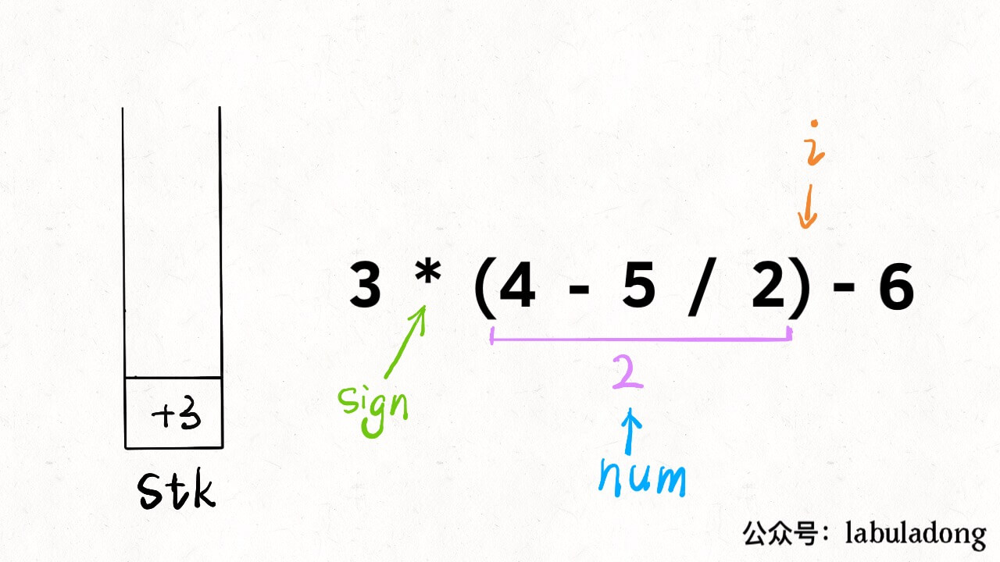
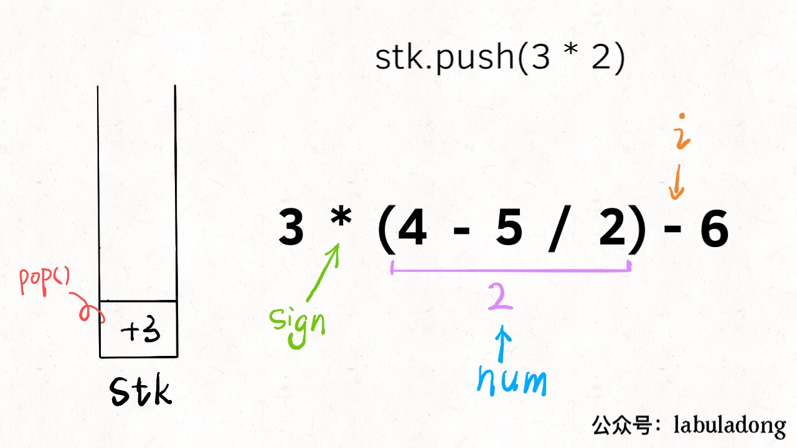

# Dismantling complex problems: Implementing the functions of a calculator

**Translator: [Zero](https://github.com/Mr2er0)**

**Author: [labuladong](https://github.com/labuladong)**

The calculator function we will eventually implement is as follows:
 
1、Enter a string that can include `+-* /`, numbers, brackets, and spaces. Your algorithm returns the structure of the operation.

2、To comply with the algorithm, parentheses have the highest priority, multiply and divide first, then add and subtract.

3、The division sign is an integer division, rounded to zero regardless of the sign (5/2 = 2, -5 / 2 = -2).

4、It can be assumed that the input formula must be legal, and there will be no integer overflow in the calculation process, and there will be no unexpected situation where the divisor is 0.

For example, if you enter the following string, the algorithm will return 9:

`3 * (2-6 /(3 -7))`

As you can see, this is very close to the calculator we use in real life. Although we have definitely used the calculator before, if we think about its algorithm implementation, we will find that it is not easy to implment:

1、To handle parentheses according to common sense, first calculate the innermost parentheses, and then gradually simplify them outward. This process is easy to make mistakes, let alone write algorithms!

2、It is not difficult to teach children to multiply and divide first, then add and subtract, but it may be difficult to teach computers.

3、To handle spaces. For the sake of beauty, we habitually put spaces between numbers and operators, but we have to figure out ways to ignore these spaces.

I remember a lot of textbooks on university data structure. When talking about data structures like stacks, they may use calculators as examples, but most can't make it clear. I don’t know how many future computer scientists may quit because of  such a simple data structure .

Then this article talks about how to implement one of the above-mentioned full-featured calculator functions.**The key lies in dismantling the problems layer by layer and solving the problems one by one**, I believe that this way of thinking can help everyone solve various complex problems.

Let's take apart. Starting with the simplest question.

### 1.Convert string to integer

Yes, it is such a simple question. First tell me, how to convert a **positive** integer in the form of a string into an int?

```cpp
string s = "458";

int n = 0;
for (int i = 0; i < s.size(); i++) {
    char c = s[i];
    n = 10 * n + (c - '0');
}
// n is now equal to 458
```

This is still very simple, old-fashioned. But even so simple, there are still issues that need attention: **This bracket in `(c - '0')` cannot be omitted, otherwise it may cause integer overflow**

Because the variable `c` is an ASCII code, if there is no parentheses, it will be added first and then subtracted. Imagine that` s` will overflow if it approaches INT_MAX. So use parentheses to ensure that you subtract before adding.

### 2.Processing addition and subtraction

Now further more, **If the input formula only contains addition and subtraction, and there are no spaces**, how do you calculate the result? Let's take the string expression `1-12 + 3` as an example. A very simple idea is implemented below:

1、First add a default symbol `+` to the first number and change it to `+ 1-12 + 3`.

2、Combine an operator and a number into a pair, that is, three pairs of `+ 1`,` -12`, `+ 3`, convert them into numbers, and put them on a stack.

3、Summing all the numbers in the stack , which is the result of the original calculation.

Let's look directly at the code and see it in combination with a picture:

```cpp
int calculate(string s) {
    stack<int> stk;
    // Record numbers in calculations
    int num = 0;
    // Record the sign before num, initialized to +
    char sign = '+';
    for (int i = 0; i < s.size(); i++) {
        char c = s[i];
        // If it is a number, assign it continuously to num
        if (isdigit(c)) 
            num = 10 * num + (c - '0');
        // If it's not a number, it must be the next symbol,
        // the previous numbers and symbols should be stored on the stack
        if (!isdigit(c) || i == s.size() - 1) {
            switch (sign) {
                case '+':
                    stk.push(num); break;
                case '-':
                    stk.push(-num); break;
            }
            // Update the symbol to the current symbol and clear the number
            sign = c;
            num = 0;
        }
    }
    // Sum all the results in the stack is the answer
    int res = 0;
    while (!stk.empty()) {
        res += stk.top();
        stk.pop();
    }
    return res;
}
```

I guess the part with the `switch` statement in the middle is a bit hard to understand. `i` is scanned from left to right, and `sign` and `num` follow it. When `s [i]` encounters an operator, the situation is this:



Therefore, at this time, the sign of `nums` should be selected according to the case of` sign`, stored in the stack, and then `sign` is updated and the` nums` is cleared to record the next pair of sign and numbers.

Also note that not only the new symbol will trigger the stack. When `i` reaches the end of the expression (`i == s.size ()-1`), the previous number should also be pushed on the stack for subsequent calculate the final result.



At this point, the algorithm for processing only the compact addition and subtraction strings is complete. Please ensure that you understand the above. The subsequent content will be modified based on this framework.

### 3.Multiplication and division

In fact, the idea is no different from just adding and subtracting. Take the string `2-3 * 4 + 5` as an example. The core idea is still to decompose the string into a combination of symbols and numbers.

For example, the above example can be decomposed into `+ 2`,` -3`, `* 4`,` + 5`. We have not dealt with the multiplication and division signs just now. It is very simple. **No other parts need to be changed**, add the corresponding case to the `switch` section:

```cpp
for (int i = 0; i < s.size(); i++) {
    char c = s[i];
    if (isdigit(c)) 
        num = 10 * num + (c - '0');

    if (!isdigit(c) || i == s.size() - 1) {
        switch (sign) {
            int pre;
            case '+':
                stk.push(num); break;
            case '-':
                stk.push(-num); break;
            // Just take out the previous number and do the corresponding operation
            case '*':
                pre = stk.top();
                stk.pop();
                stk.push(pre * num);
                break;
            case '/':
                pre = stk.top();
                stk.pop();
                stk.push(pre / num);
                break;
        }
        // Update the symbol to the current symbol and clear the number
        sign = c;
        num = 0;
    }
}
```



** Multiplication and division take precedence over addition and subtraction in that multiplication and division can be combined with numbers on the top of the stack, and addition and subtraction can only put themselves on the stack **.

Now let's think about **how to deal with the possible space characters in a string**. In fact, it is very simple. Think about what part of our existing code whil be affected by the appearance of the space character. 

```cpp
// If c is not a number
if (!isdigit(c) || i == s.size() - 1) {
    switch (c) {...}
    sign = c;
    num = 0;
}
```

Obviously spaces will enter this if statement, but we don't want to let spaces enter this if, because `sign` will be updated and `nums` will be cleared. Spaces are not operators at all and should be ignored.

Then just add one more condition:

```cpp
if ((!isdigit(c) && c != ' ') || i == s.size() - 1) {
    ...
}
```

Well, now our algorithm can calculate addition, subtraction, multiplication and division according to the correct rules, and automatically ignore the space characters. The rest is how to make the algorithm recognize the brackets correctly.

### 4.Handling parentheses

Dealing with parentheses in calculations should seem the hardest, but it's not as difficult as it seems.

To avoid the tedious details of the programming language, I translated the previous solution code into a Python version:

```python
def calculate(s: str) -> int:
        
    def helper(s: List) -> int:
        stack = []
        sign = '+'
        num = 0

        while len(s) > 0:
            c = s.pop(0)
            if c.isdigit():
                num = 10 * num + int(c)

            if (not c.isdigit() and c != ' ') or len(s) == 0:
                if sign == '+':
                    stack.append(num)
                elif sign == '-':
                    stack.append(-num)
                elif sign == '*':
                    stack[-1] = stack[-1] * num
                elif sign == '/':
                    # Python division to 0 rounding
                    stack[-1] = int(stack[-1] / float(num))                    
                num = 0
                sign = c

        return sum(stack)
    # Need to turn strings into lists for easy operation
    return helper(list(s))
```

This code is exactly the same as the C ++ code just now. The only difference is that instead of traversing the string from left to right, it continues to pop out characters from the left.

So why isn't it so hard to deal with parentheses, **because parentheses are recursive** Let's take the string `3 * (4-5 / 2) -6` as an example:

calculate(`3*(4-5/2)-6`)
= 3 * calculate(`4-5/2`) - 6
= 3 * 2 - 6
= 0

In fact, no matter how many levels of parentheses are nested, you can reduce the calculation in the parentheses to a number by calling itself recursively through the calculate function. **In other words, the calculations in parentheses are just a number.**

The question is, what are the start and end conditions for recursion? **Meet `(` begin recursion, encounter `)` end recursion**:

```python
def calculate(s: str) -> int:
        
    def helper(s: List) -> int:
        stack = []
        sign = '+'
        num = 0

        while len(s) > 0:
            c = s.pop(0)
            if c.isdigit():
                num = 10 * num + int(c)
            # Meet the left parenthesis and start recursive calculation of num
            if c == '(':
                num = helper(s)

            if (not c.isdigit() and c != ' ') or len(s) == 0:
                if sign == '+': ...
                elif sign == '-': ... 
                elif sign == '*': ...
                elif sign == '/': ...
                num = 0
                sign = c
            # Return recursive result when encountering right parenthesis
            if c == ')': break
        return sum(stack)

    return helper(list(s))
```







As you can see, with two or three lines of code, you can handle parentheses, which is the charm of recursion. At this point, all the functions of the calculator have been realized. By dismantling the problem layer by layer and solving the problems one by one, the problem does not seem so complicated.
### 5. Final summary

In this article, I want to express the idea of ​​dealing with complex problems by implementing the functions of a calculator.

We start with the simple problem of converting strings to numbers, and then work with expressions that only include addition and subtraction, then work with expressions that include four operations: addition, subtraction, multiplication, and division, then space characters, and then expressions that include parentheses.

**It can be seen that for some difficult problems, the solution is not achieved overnight, but it is advanced step by step and spirally rises**. If you give you the original question at the beginning, you may fail to handel it, and you  even can't understand the answer. It ’s normal. The key lies in how we simplify the problem ourselves and how to retreat for the sake of advancing.

**It's a very clever strategy to retreat and take the second best**。Think about it, assuming this is an exam question, you won't implement this calculator, but you wrote the string to integer algorithm and pointed out the easy-to-overflow trap, then at least you can get 20 points; if you can handle addition and subtraction, you can get 40 points; if you can handle addition, subtraction, multiplication and division, that is at least 70 points; plus the space character, 80. I just don't handle parentheses, so forget it, 80 is OK, OK?
