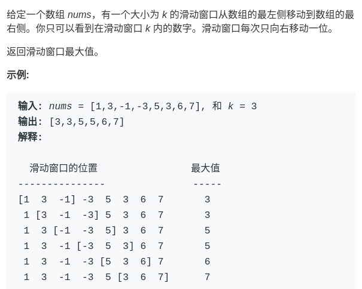

# special data structure: monotonic queue
The previous article talked about a special data structure "monotonic stack"a type of problem "Next Greater Number" is solved. This article writes a similar data structure "monotonic queue".

Maybe you haven't heard of the name of this data structure. In fact, it is not difficult. It is a "queue", but it uses a clever method to make the elements in the queue monotonically increase (or decrease). What's the use of this data structure? Can solve a series of problems with sliding windows.

See a LeetCode title，difficulty is hard：



### First, build a problem solving framewor

This problem is not complicated. The difficulty is how to calculate the maximum value in each "window" at O(1) time, so that the entire algorithm is completed in linear time.We discussed similar scenarios before and came to a conclusion:

In a bunch of numbers,the best value is known,If you add a number to this bunch of numbers,you can quickly calculate the most value by comparing them,but if you reduce one number,you may not get the maximum vaue quickly,but you can have to go through all the numbers and find the maximum value agai

Back to the scenario of this problem,as each window advances,you need to add a number and decrease one number,so if you want to get a new maximum value in O(1) time,you need a special "monotonic queue" data structure to assist

An ordinary queue must have these two operations:

```java
class Queue {
    void push(int n);
    // Or enqueue, adding element n to the end of the line
    void pop();
    // Or dequeue, remove the leader element
}
```

The operation of a "monotonic queue" is similar:

```java
class MonotonicQueue {
    // Add element n to the end of the line
    void push(int n);
    // Returns the maximum value in the current queue
    int max();
    // If the head element is n, delete it
    void pop(int n);
}
```
Of course, the implementation methods of these APIs are definitely different from the general Queue, but we leave them alone, and think that the time complexity of these operations is O (1), first answer this "sliding window" problem Frame out:

```cpp
vector<int> maxSlidingWindow(vector<int>& nums, int k) {
    MonotonicQueue window;
    vector<int> res;
    for (int i = 0; i < nums.size(); i++) {
        if (i < k - 1) { // Fill the first k-1 of the window first
            window.push(nums[i]);
        } else { // The window begins to slide forward
            window.push(nums[i]);
            res.push_back(window.max());
            window.pop(nums[i - k + 1]);
            // nums[i - k + 1] is the last element of the window
        }
    }
    return res;
}
```


这个思路很简单，能理解吧？下面我们开始重头戏，单调队列的实现。

### 二、实现单调队列数据结构

首先我们要认识另一种数据结构：deque，即双端队列。很简单：

```java
class deque {
    // 在队头插入元素 n
    void push_front(int n);
    // 在队尾插入元素 n
    void push_back(int n);
    // 在队头删除元素
    void pop_front();
    // 在队尾删除元素
    void pop_back();
    // 返回队头元素
    int front();
    // 返回队尾元素
    int back();
}
```

而且，这些操作的复杂度都是 O(1)。这其实不是啥稀奇的数据结构，用链表作为底层结构的话，很容易实现这些功能。

「单调队列」的核心思路和「单调栈」类似。单调队列的 push 方法依然在队尾添加元素，但是要把前面比新元素小的元素都删掉：

```cpp
class MonotonicQueue {
private:
    deque<int> data;
public:
    void push(int n) {
        while (!data.empty() && data.back() < n) 
            data.pop_back();
        data.push_back(n);
    }
};
```

你可以想象，加入数字的大小代表人的体重，把前面体重不足的都压扁了，直到遇到更大的量级才停住。


如果每个元素被加入时都这样操作，最终单调队列中的元素大小就会保持一个单调递减的顺序，因此我们的 max() API 可以可以这样写：

```cpp
int max() {
    return data.front();
}
```

pop() API 在队头删除元素 n，也很好写：

```cpp
void pop(int n) {
    if (!data.empty() && data.front() == n)
        data.pop_front();
}
```

之所以要判断 `data.front() == n`，是因为我们想删除的队头元素 n 可能已经被「压扁」了，这时候就不用删除了：


至此，单调队列设计完毕，看下完整的解题代码：

```cpp
class MonotonicQueue {
private:
    deque<int> data;
public:
    void push(int n) {
        while (!data.empty() && data.back() < n) 
            data.pop_back();
        data.push_back(n);
    }
    
    int max() { return data.front(); }
    
    void pop(int n) {
        if (!data.empty() && data.front() == n)
            data.pop_front();
    }
};

vector<int> maxSlidingWindow(vector<int>& nums, int k) {
    MonotonicQueue window;
    vector<int> res;
    for (int i = 0; i < nums.size(); i++) {
        if (i < k - 1) { //先填满窗口的前 k - 1
            window.push(nums[i]);
        } else { // 窗口向前滑动
            window.push(nums[i]);
            res.push_back(window.max());
            window.pop(nums[i - k + 1]);
        }
    }
    return res;
}
```

**三、算法复杂度分析**

读者可能疑惑，push 操作中含有 while 循环，时间复杂度不是 O(1) 呀，那么本算法的时间复杂度应该不是线性时间吧？

单独看 push 操作的复杂度确实不是 O(1)，但是算法整体的复杂度依然是 O(N) 线性时间。要这样想，nums 中的每个元素最多被 push_back 和 pop_back 一次，没有任何多余操作，所以整体的复杂度还是 O(N)。

空间复杂度就很简单了，就是窗口的大小 O(k)。

**四、最后总结**

有的读者可能觉得「单调队列」和「优先级队列」比较像，实际上差别很大的。

单调队列在添加元素的时候靠删除元素保持队列的单调性，相当于抽取出某个函数中单调递增（或递减）的部分；而优先级队列（二叉堆）相当于自动排序，差别大了去了。

赶紧去拿下 LeetCode 第 239 道题吧～

坚持原创高质量文章，致力于把算法问题讲清楚，欢迎关注我的公众号 labuladong 获取最新文章：


