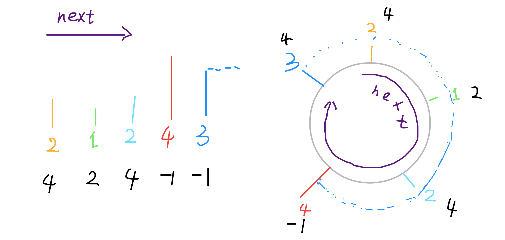

### How to use Monotonic Stack to solve problems[](#如何使用单调栈解题)

> 原文地址：[https://github.com/labuladong/fucking-algorithm/blob/master/数据结构系列/单调栈.md](https://github.com/labuladong/fucking-algorithm/blob/master/数据结构系列/单调栈.md)

**Translator: [miaoxiaozui2017](https://github.com/miaoxiaozui2017)**

**Author: [labuladong](https://github.com/labuladong)**

`Stack` is a very simple data structure. The logical sequence of first in and last out conforms to the characteristics of some problems, such as function call stack.      

`Monotonic stack` is actually a stack. It just uses some ingenious logic to keep the elements in the stack orderly (monotone increasing or monotone decreasing) after each new element putting into the stack.      

Well,sounds like a heap? No, monotonic stack is not widely used. It only deals with one typical problem, which is called `Next Greater Element`. In this paper, the algorithm template of monotonic queue is used to solve this kind of problem, and the strategy of dealing with "cyclic array" will be discussed.          

First, explain the original problem of `Next Greater Number`: give you an array,and return an array of equal length.The corresponding index stores the next larger element, if there is no larger element, store `-1`. It's not easy to explain clearly in words. Let's take a direct example:     

Give you an array `[2,1,2,4,3]`,and you return an array `[4,2,4,-1,-1]`.      

### Explanation

The number that is larger than `2` after `the first 2` is `4`.The number that is larger than `1` after `the first 1` is `2`. The number that is larger than `2` after `the second 2` is `4`.There is no number that is larger than `4` after `the fourth`,so  fill in `-1`.There is no number that is larger than `3` after `the third`,so fill in `-1`.   

It's a good idea for the violent solution of this problem.It scans the back of each element to find the first larger element. But the time complexity of the violent solution is `O (n^2)`.         

This problem can be thought abstractly: think of the elements in the array as people standing side by side, and the size of the elements as the height of an adult. These people stand in line before you. How to find the `Next Greater Number` of element `"2"`? Very simply, if you can see the element `"2"`, then the first person you can see behind him is the `Next Greater Number` of `"2"`. Because the element smaller than `"2"` is not tall enough and it is blocked by `"2"`,the first one not being blocked is the answer. 


This is a very understandable situation,huh? With this abstract scenario in mind, let's look at the code first. 

```cpp
vector<int> nextGreaterElement(vector<int>& nums) {
    vector<int> ans(nums.size()); // array to store answer
    stack<int> s;
    for (int i = nums.size() - 1; i >= 0; i--) { // put it into the stack back to front
        while (!s.empty() && s.top() <= nums[i]) { // determine by height
            s.pop(); // short one go away while blocked
        }
        ans[i] = s.empty() ? -1 : s.top(); // the first tall behind this element
        s.push(nums[i]); // get into the queue and wait for later height determination
    }
    return ans;
}
```

This is the template for monotonic queue solving problem. The `for` loop scans elements from the back to the front,and while we use the stack structure and enter the stack back to front, we are actually going to exit the stack front to back. The `while` loop is to rule out the elements between the two "tall" elements.Their existence has no meaning, because there is a "taller" element in front of them and they cannot be considered as the `Next Great Number` of the subsequent elements.        

The time complexity of this algorithm is not so intuitive. If you see `for` loop nesting with `while` loop, you may think that the complexity of this algorithm is `O(n^2)`, but in fact the complexity of this algorithm is only `O(n)`.   

To analyze its time complexity, we need to look at it on a whole: There are `n` elements in total, each element is pushed into the stack once, and it will be pop once at most, without any redundant operation. So the total calculation scale is proportional to the element scale `n`, which is the complexity of `O(n)`.     

Now that you have mastered the technique of using monotonic stack, and take a simple transformation to deepen your understanding.            

Give you an array `T = [73, 74, 75, 71, 69, 72, 76, 73]`, which stores the weather temperature in recent days(Is it in teppanyaki? No, it's in Fahrenheit). You return an array to calculate: for each day, how many days do you have to wait for a warmer temperature;and if you can't wait for that day, fill in `0`.            

### Example

Give you `T = [73, 74, 75, 71, 69, 72, 76, 73]`, and you return `[1, 1, 4, 2, 1, 1, 0, 0]`.          
**Explanation**  
The first day is 73 degrees Fahrenheit, and the next day is 74 degrees Fahrenheit, which is higher than 73 degrees Fahrenheit.So for the first day, you can wait for a warmer temperature just one day. The same goes for the latter.            

You are already sensitive to the typical problem like `Next Greater Number`.In essence, this problem is also to find the `Next Greater Number`. Instead of just answering what the `Next Greater Number` is, now you need to know the current distance from the `Next Greater Number`.      

For the same type of problem using the same idea, directly call the algorithm template of monotonic stack with a little change.Directly go to the code. 

```cpp
vector<int> dailyTemperatures(vector<int>& T) {
    vector<int> ans(T.size());
    stack<int> s; // here for element index，not element
    for (int i = T.size() - 1; i >= 0; i--) {
        while (!s.empty() && T[s.top()] <= T[i]) {
            s.pop();
        }
        ans[i] = s.empty() ? 0 : (s.top() - i); // get index spacing
        s.push(i); // add index，not element
    }
    return ans;
}
```

The monotonic stack is explained. Let's start with another important point: how to deal with "circular array".      

It's also `Next Greater Number`. Now suppose the array given to you is a ring and how to deal with it?   

Give you an array `[2,1,2,4,3]`,and you return an array `[4,2,4,-1,4]`. With the ring attribute, the last element `3` goes around and finds the element `4` larger than itself. 



First of all, the memory of the computer is linear, and there is no real ring array. However, we can simulate the effect of ring array. Generally, we use the `%` operator to calculate the modulus (remainder) to get the ring effect: 

```java
int[] arr = {1,2,3,4,5};
int n = arr.length, index = 0;
while (true) {
    print(arr[index % n]);
    index++;
}
```

Back to the problem of `Next Greater Number`. After adding the ring attribute, the difficulty lies in that the meaning of `Next` is not only the right side of the current element, but also the left side of the current element (as shown in the above example).   

If we are clear about the problem, it will be half solved. We can think about like this: "Double" the original array,or in another word,to connect another original array at the back. In this way, according to the previous "height comparison" process, each element can not only compare with the elements on its right, but also the elements on its left. 


How do you achieve it? Of course, you can construct this double length array and apply the algorithm template. However, instead of constructing a new array, we can use the technique of `circular array` to simulate. Just look at the code: 

```cpp
vector<int> nextGreaterElements(vector<int>& nums) {
    int n = nums.size();
    vector<int> res(n); // store result
    stack<int> s;
    // pretend that this array is doubled in length
    for (int i = 2 * n - 1; i >= 0; i--) {
        while (!s.empty() && s.top() <= nums[i % n])
            s.pop();
        res[i % n] = s.empty() ? -1 : s.top();
        s.push(nums[i % n]);
    }
    return res;
}
```

Till now,you have caught up with the design method and code template for `Monotonic Stack`，learned to solve the problem of `Next Greater Number` ,and can deal with `circular array`.
