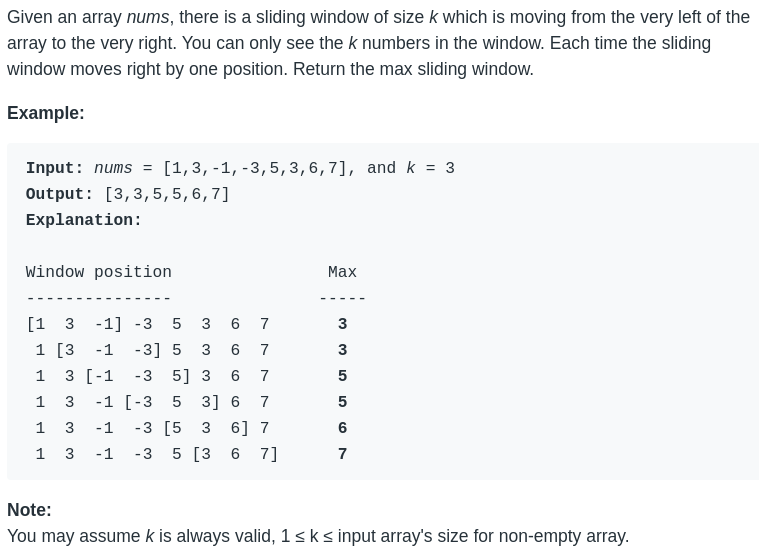
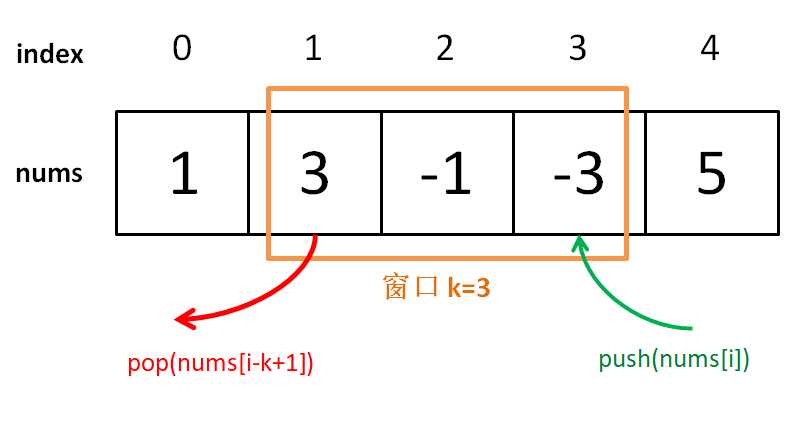
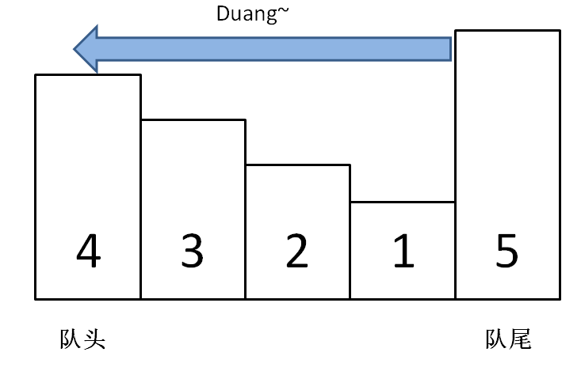
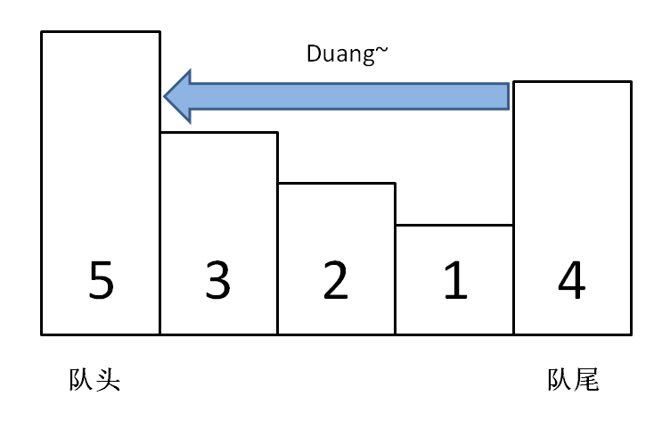

# special data structure: monotonic queue

**Author:[labuladong](https://github.com/labuladong)**

**Translator:[warmingkkk](https://github.com/warmingkkk)**

The previous article talked about a special data structure "monotonic stack"a type of problem "Next Greater Number" is solved. This article writes a similar data structure "monotonic queue".

Maybe you haven't heard of the name of this data structure. In fact, it is not difficult. It is a "queue", but it uses a clever method to make the elements in the queue monotonically increase (or decrease). What's the use of this data structure? Can solve a series of problems with sliding windows.

See a LeetCode title, 239 question，difficulty is hard：



### 1, build a problem solving framewor

This problem is not complicated. The difficulty is how to calculate the maximum value in each "window" at O(1) time, so that the entire algorithm is completed in linear time.We discussed similar scenarios before and came to a conclusion:

In a bunch of numbers,the best value is known,If you add a number to this bunch of numbers,you can quickly calculate the most value by comparing them,but if you reduce one number,you may not get the maximum vaue quickly,but you can have to go through all the numbers and find the maximum value again.

Back to the scenario of this problem,as each window advances,you need to add a number and decrease one number,so if you want to get a new maximum value in O(1) time,you need a special "monotonic queue" data structure to assist.

An ordinary queue must have these two operations:

```java
class Queue {
    void push(int n);
    // or enqueue, adding element n to the end of the line
    void pop();
    // or dequeue, remove the leader element
}
```

The operation of a "monotonic queue" is similar:

```java
class MonotonicQueue {
    // add element n to the end of the line
    void push(int n);
    // returns the maximum value in the current queue
    int max();
    // if the head element is n, delete it
    void pop(int n);
}
```
Of course, the implementation methods of these APIs are definitely different from the general Queue, but we leave them alone, and think that the time complexity of these operations is O (1), first answer this "sliding window" problem Frame out:

```cpp
vector<int> maxSlidingWindow(vector<int>& nums, int k) {
    MonotonicQueue window;
    vector<int> res;
    for (int i = 0; i < nums.size(); i++) {
        if (i < k - 1) { // fill the first k-1 of the window first
            window.push(nums[i]);
        } else { // the window begins to slide forward
            window.push(nums[i]);
            res.push_back(window.max());
            window.pop(nums[i - k + 1]);
            // nums[i - k + 1] is the last element of the window
        }
    }
    return res;
}
```



The idea is simple, understand? Below we start the highlight, the implementation of monotonic queues.

### 2, Implementing a monotonic queue data structure

First we need to know another data structure: deque, which is a double-ended queue. It's simple:

```java
class deque {
    // insert element n at the head of the team
    void push_front(int n);
    // insert element n at the end of the line
    void push_back(int n);
    // remove elements at the head of the team
    void pop_front();
    // remove element at the end of the line
    void pop_back();
    // returns the team head element
    int front();
    // returns the tail element
    int back();
}
```

Moreover, the complexity of these operations is O (1). This is actually not a rare data structure. If you use a linked list as the underlying structure, it is easy to implement these functions.

The core idea of "monotonic queue" is similar to "monotonic stack". The push method of the monotonic queue still adds elements to the end of the queue, but deletes the previous elements smaller than the new element:

```cpp
class MonotonicQueue {
private:
    deque<int> data;
public:
    void push(int n) {
        while (!data.empty() && data.back() < n) 
            data.pop_back();
        data.push_back(n);
    }
};
```

As you can imagine, adding the size of the number represents the weight of the person, squashing the underweight in front, and stopping until it encounters a larger magnitude.



If every element is added like this, the size of the elements in the monotonic queue will eventually decrease in a monotonic order, so our max () API can be written like this:

```cpp
int max() {
    return data.front();
}
```

The pop () API deletes element n at the head of the queue, which is also very easy to write:

```cpp
void pop(int n) {
    if (!data.empty() && data.front() == n)
        data.pop_front();
}
```

The reason to judge `data.front () == n` is because the queue head element n we want to delete may have been" squashed ", so we don't need to delete it at this time:



At this point, the monotonous queue design is complete, look at the complete problem-solving code:

```cpp
class MonotonicQueue {
private:
    deque<int> data;
public:
    void push(int n) {
        while (!data.empty() && data.back() < n) 
            data.pop_back();
        data.push_back(n);
    }
    
    int max() { return data.front(); }
    
    void pop(int n) {
        if (!data.empty() && data.front() == n)
            data.pop_front();
    }
};

vector<int> maxSlidingWindow(vector<int>& nums, int k) {
    MonotonicQueue window;
    vector<int> res;
    for (int i = 0; i < nums.size(); i++) {
        if (i < k - 1) { // fill the first k-1 of the window first
            window.push(nums[i]);
        } else { // window slide forward
            window.push(nums[i]);
            res.push_back(window.max());
            window.pop(nums[i - k + 1]);
        }
    }
    return res;
}
```

### 3, Algorithm complexity analysis

Readers may be wondering, while the push operation contains a while loop, the time complexity is not O (1), so the time complexity of this algorithm should not be linear time, right?

The complexity of the push operation alone is not O (1), but the overall complexity of the algorithm is still O (N) linear time. To think of it this way, each element in nums is pushed_back and pop_back at most once, without any redundant operations, so the overall complexity is still O (N).

The space complexity is very simple, which is the size of the window O (k).

### 4, Final conclusion

Some readers may think that "monotonic queues" and "priority queues" are more similar, but they are actually very different.

The monotonic queue maintains the monotonicity of the queue by deleting elements when adding elements, which is equivalent to extracting the monotonically increasing (or decreasing) part of a function; while the priority queue (binary heap) is equivalent to automatic sorting, the difference is large went.

Hurry up and get LeetCode's Question 239 ~
