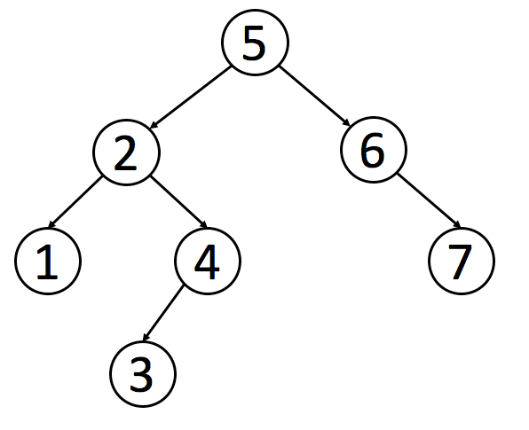
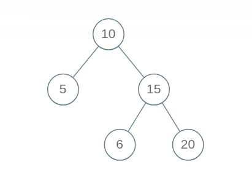
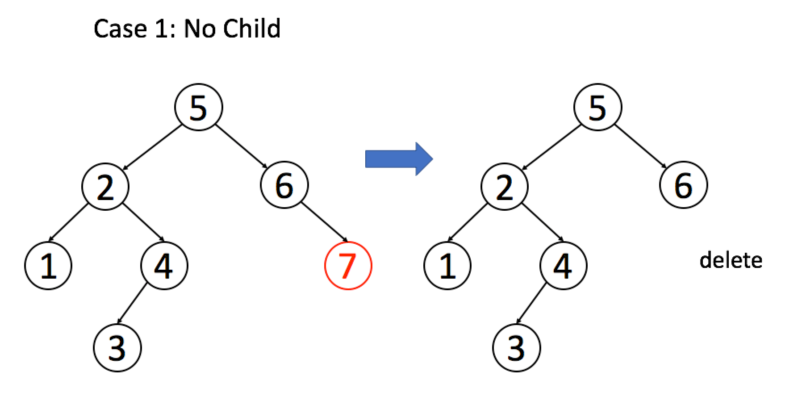
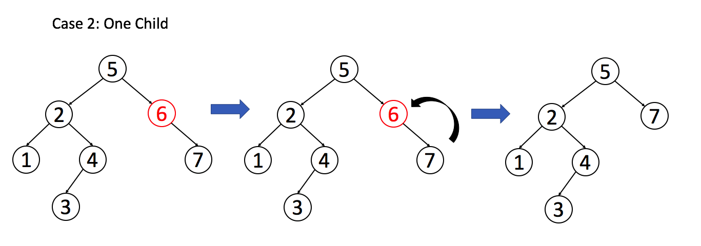
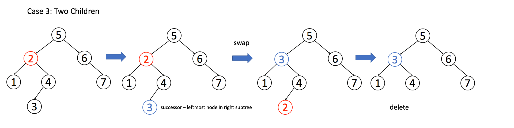

# The manipulation collection of binary search tree

**Translator**: [Fulin Li](https://fulinli.github.io/)

**Author**:[labuladong](https://github.com/labuladong)

In the previous article about [framework thinking](../algorithmic_thinking/学习数据结构和算法的高效方法.md), we introduced the traverse framework of the binary tree. There should be a deep impression of this framework left in your mind. In this article, we will put the framework into practice and illustrate how does it flexible resolve all issues about the binary tree.

The basic idea of binary tree algorithm design: Defining the manipulation in the current node and the last things are thrown to the framework.

```java
void traverse(TreeNode root) {
    // The manipulation required in the root node should be written here.
    // Other things will be resolved by the framework.
    traverse(root.left);
    traverse(root.right);
}
```

There are two simple examples to illustrate such an idea, and you can warm up first.

**1. How to add an integer to every node of binary tree?**

```java
void plusOne(TreeNode root) {
    if (root == null) return;
    root.val += 1;

    plusOne(root.left);
    plusOne(root.right);
}
```

**2. How to determine whether two binary trees are identical?**

```java
boolean isSameTree(TreeNode root1, TreeNode root2) {
    // If they are null, they are identical obviously
    if (root1 == null && root2 == null) return true;
    // If one of the nodes is void, but the other is not null, they are not identical
    if (root1 == null || root2 == null) return false;
    // If they are all not void, but their values are not equal, they are not identical
    if (root1.val != root2.val) return false;

    // To recursively compare every pair of the node
    return isSameTree(root1.left, root2.left)
        && isSameTree(root1.right, root2.right);
}
```

It is straightforward to understand the two above examples with the help of the traverse framework of the binary tree. If you can understand it, now you can handle all the problems with the binary tree.

Binary Search Tree (BST), is a common type of binary. The tree additionally satisfies the binary search property, which states that the key in each node must be greater than or equal to any key stored in the left sub-tree, and less than or equal to any key stored in the right sub-tree.

An example corresponding to the definition is shown as:



Next, we will realize basic operations with BST, including compliance checking of BST, addition, deletion, and search. The process of deletion and compliance checking may be slightly more complicated.

**0. Compliance checking of BST**

This operation sometimes is error-prone. Following the framework mentioned above, the manipulation of every node in the binary tree is to compare the key in the left child with the right child, and it seems that the codes should be written like this: 

```java
boolean isValidBST(TreeNode root) {
    if (root == null) return true;
    if (root.left != null && root.val <= root.left.val) return false;
    if (root.right != null && root.val >= root.right.val) return false;

    return isValidBST(root.left)
        && isValidBST(root.right);
}
```

But such algorithm is an error. Because the key in each node must be greater than or equal to any key stored in the left sub-tree, and less than or equal to any key stored in the right sub-tree. For example, the following binary tree is not a BST, but our algorithm will make the wrong decision.



Don't panic though the algorithm is wrong. Our framework is still correct, and we didn't notice some details information. Let's refresh the definition of BST: The manipulations in root node should not only include the comparison between left and right child, but it also require a comparison of the whole left and right sub-tree. What should do? It is beyond the reach of the root node.

In this situation, we can use an auxiliary function to add parameters in the parameter list, which can carry out more useful information. The correct algorithm is as follows:

```java
boolean isValidBST(TreeNode root) {
    return isValidBST(root, null, null);
}

boolean isValidBST(TreeNode root, TreeNode min, TreeNode max) {
    if (root == null) return true;
    if (min != null && root.val <= min.val) return false;
    if (max != null && root.val >= max.val) return false;
    return isValidBST(root.left, min, root) 
        && isValidBST(root.right, root, max);
}
```

**1. Lookup function in BST**

According to the framework, we can write the codes like this:

```java
boolean isInBST(TreeNode root, int target) {
    if (root == null) return false;
    if (root.val == target) return true;

    return isInBST(root.left, target)
        || isInBST(root.right, target);
}
```

It is entirely right. If you can write like this, you have remembered the framework. Now you can attempt to take some details into account: How to leverage the property of BST to facilitate us to search efficiently.

It is effortless! We don't have to search both of nodes recursively. Similar to the binary search, we can exclude the impossible child node by comparing the target value and root value. We can modify the codes slightly:

```java
boolean isInBST(TreeNode root, int target) {
    if (root == null) return false;
    if (root.val == target)
        return true;
    if (root.val < target) 
        return isInBST(root.right, target);
    if (root.val > target)
        return isInBST(root.left, target);
    // The manipulations in the root node are finished, and the framework is done, great!
```

Therefore, we can modify the original framework to abstract a new framework for traversing BST.

```java
void BST(TreeNode root, int target) {
    if (root.val == target)
        // When you find the target, your manipulation should be written here
    if (root.val < target) 
        BST(root.right, target);
    if (root.val > target)
        BST(root.left, target);
}
```

**3. Deletion function in BST**

This problem is slightly complicated. But you can handle it with the help of the framework! Similar to the insert function, we should find it before modification. Let's write it first:

```java
TreeNode deleteNode(TreeNode root, int key) {
    if (root.val == key) {
        // When you find it, you can delete it here.
    } else if (root.val > key) {
        root.left = deleteNode(root.left, key);
    } else if (root.val < key) {
        root.right = deleteNode(root.right, key);
    }
    return root;
}
```

When you find the target, for example, node A. It isn't effortless for us to delete it. Because we can't destroy the property of BST when we realize the Deletion function. There are three situations, and we will illustrate in the following three pictures:

Case 1: Node A is just the leaf node, and it's child nodes are all null. In this way, we can delete it directly.

The picture is excerpted from LeetCode



```java
if (root.left == null && root.right == null)
    return null;
```

Case 2: The node A has only one child node, then we can change its child node to replace its place.

The picture is excerpted from LeetCode



```java
// After excluding the Situation 1
if (root.left == null) return root.right;
if (root.right == null) return root.left;
```

Case 3: Node A has two child nodes. To avoid destroying the property of BST, node A must find the maximum node in left sub-tree or the minimum node in the right sub-tree to replace its place. We use the minimum node in the right sub-tree to illustrate it.

The picture is excerpted from LeetCode



```java
if (root.left != null && root.right != null) {
    // Find the minimum node in right sub-tree
    TreeNode minNode = getMin(root.right);
    // replace root node to minNode 
    root.val = minNode.val;
    // Delete the root node subsequently
    root.right = deleteNode(root.right, minNode.val);
}
```

The three situations are analyzed, and we can fill them into the framework and simplify the codes:

```java
TreeNode deleteNode(TreeNode root, int key) {
    if (root == null) return null;
    if (root.val == key) {
        // These two IF function handle the situation 1 and situation 2
        if (root.left == null) return root.right;
        if (root.right == null) return root.left;
        // Deal with situation 3
        TreeNode minNode = getMin(root.right);
        root.val = minNode.val;
        root.right = deleteNode(root.right, minNode.val);
    } else if (root.val > key) {
        root.left = deleteNode(root.left, key);
    } else if (root.val < key) {
        root.right = deleteNode(root.right, key);
    }
    return root;
}

TreeNode getMin(TreeNode node) {
    // The left child node is the minimum
    while (node.left != null) node = node.left;
    return node;
} 
```

In this way, we can finish the deletion function. Note that such an algorithm is not perfect because we wouldn't exchange the two nodes by 'root.val = minNode.val'. Generally, we will exchange the root and minNode by a series of slightly complicated linked list operations. Because the value of Val may be tremendous in the specific application, it's time-consuming to modify the value of the node. Still, the linked list operations only require to change the pointer and don't modify values.

**Summary**

In this article, you can learn the following skills:

1. The basic idea of designing a binary tree algorithm: Defining the manipulations in the current node and the last things are thrown to the framework.
2. If the manipulations in the current node have influence in its sub-tree, we can add additional parameters to the parameter list by adding auxiliary function.
3. On the foundation of the framework of the binary tree, we abstract the traverse framework of BST:

```java
void BST(TreeNode root, int target) {
    if (root.val == target)
        // When you find the target, your manipulation should be written here
    if (root.val < target) 
        BST(root.right, target);
    if (root.val > target)
        BST(root.left, target);
}
```

4. We grasp the basic operations of BST.