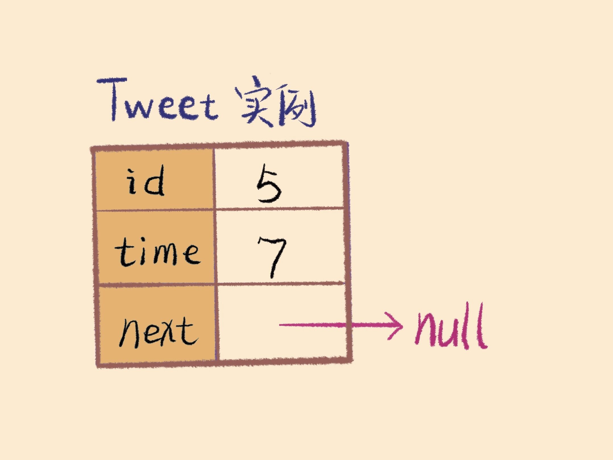
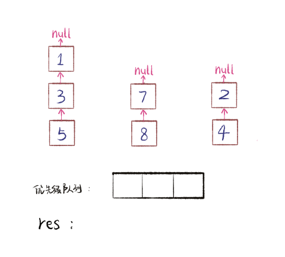

# Design Twitter

**Translator: [youyun](https://github.com/youyun)**

**Author: [labuladong](https://github.com/labuladong)**

[Design Twitter](https://leetcode.com/problems/design-twitter/) is question 355 on LeetCode. This question is both interesting and practical. It combines both algorithms about ordered linked lists and Object Oriented (OO) design principles. We'll be able to link Twitter functions with algorithms when we look at the requirements.

### 1. The Question and Use Cases

Twitter is similar to Weibo. We'll focus on the APIs below:

```java
class Twitter {

    /** user post a tweet */
    public void postTweet(int userId, int tweetId) {}
    
    /** return the list of IDs of recent tweets, 
    from the users that the current user follows (including him/herself),
    maximum 10 tweets with updated time sorted in descending order */
    public List<Integer> getNewsFeed(int userId) {}
    
    /** follower will follow the followee,
    create the ID if it doesn't exist */
    public void follow(int followerId, int followeeId) {}
    
    /** follower unfollows the followee,
    do nothing if the ID does not exist */
    public void unfollow(int followerId, int followeeId) {}
}
```

Let's look at an user story to understand how to use these APIs:

```java
Twitter twitter = new Twitter();

twitter.postTweet(1, 5);
// user 1 posts a tweet with ID 5

twitter.getNewsFeed(1);
// return [5]
// Remarks: because each user follows him/herself

twitter.follow(1, 2);
// user 1 starts to follow user 2

twitter.postTweet(2, 6);
// user 2 posted a tweet with ID 6

twitter.getNewsFeed(1);
// return [6, 5]
// Remarks: user 1 follows both user 1 and user 2,
// return the recent tweets from both users,
// with tweet 6 in front of tweet 5 as tweet 6 is more recent

twitter.unfollow(1, 2);
// user 1 unfollows user 2

twitter.getNewsFeed(1);
// return [5]
```

This is a common case in our daily life. Take Facebook as an example, when I just added my dream girl as friend on Facebook, I'll see her recent posts in my refreshed feeds, sorted in descending order. The difference is Twitter is uni-directional, while Facebook friends are bi-directional.

Most of these APIs are easy to implement. The most functionally difficult part could be `getNewsFeed`, as we have to sort by time in descending. However, the list of followees are dynamic, which makes these hard to keep track of.

__Algorithm helps here__: Imagine we store each user's own tweets in a linked list sorted by timestamp, with each node representing the tweet's ID and timestamp (datetime of creation). If a user follows k followees, we can combine these k ordered linked lists, and apply an algorithm to get the correct `getNewsFeed`.

Let's put the algorithm aside first and discuss in details later. There is another question: how should we use code to represent users and tweets to apply the algorithm? __This involves OO design__. Let's break into parts and tackle them one step at a time.

### 2. OO Design

Based on the analysis just now, we need a `User` class to store information about users, and a `Tweet` class to store information of tweets. The Tweet class will also be nodes in linked lists. Let's put up the frameworks:

```java
class Twitter {
    private static int timestamp = 0;
    private static class Tweet {}
    private static class User {}

    /* the APIs skeleton */
    public void postTweet(int userId, int tweetId) {}
    public List<Integer> getNewsFeed(int userId) {}
    public void follow(int followerId, int followeeId) {}
    public void unfollow(int followerId, int followeeId) {}
}
```

Because `Tweet` class needs to store timestamp, and `User` class needs to use `Tweet` class to store the tweets posted by a user, we put `Tweet` class and `User` class in `Twitter` class as inner class. For clarity and simplicity, we'll define them one by one.

**1、Implementation of Tweet Class**

Based on the previous analysis, it is easy to implement `Tweet` class. Each `Tweet` instance just needs to store its own `tweetId` and posted timestamp `time`. As node in linked list, it also needs to have a point `next` pointing to the next node.

```java
class Tweet {
    private int id;
    private int time;
    private Tweet next;

    // initialize with tweet ID and post timestamp
    public Tweet(int id, int time) {
        this.id = id;
        this.time = time;
        this.next = null;
    }
}
```



**2、Implementation of User Class**

Let's think about the real use cases. A user needs to store his/her `userId`, list of followees, and list of posted tweets. The list of followees can use Hash Set to store data, to avoid duplication and search fast. The list of posted tweets should be stored in a linked list to merge with order. Refer to the diagram below:


Besides, based on OO design principles, since the list of followees and the list of tweets are stored in `User`, actions such as "follow", "unfollow", and "post" should be `User`'s actions. Let's define these as `User`'s APIs:

```java
// static int timestamp = 0
class User {
    private int id;
    public Set<Integer> followed;
    // The head of the linked list of posted tweets by the user
    public Tweet head;

    public User(int userId) {
        followed = new HashSet<>();
        this.id = userId;
        this.head = null;
        // follow the user him/herself
        follow(id);
    }

    public void follow(int userId) {
        followed.add(userId);
    }

    public void unfollow(int userId) {
        // a user is not allowed to unfollow him/herself
        if (userId != this.id)
            followed.remove(userId);
    }

    public void post(int tweetId) {
        Tweet twt = new Tweet(tweetId, timestamp);
        timestamp++;
        // insert the new tweet to the head of the linked list
        // the closer a tweet is to the head, the larger the value of time
        twt.next = head;
        head = twt;
    }
}
```

**3、 Implementation of Several APIs**

```java
class Twitter {
    private static int timestamp = 0;
    private static class Tweet {...}
    private static class User {...}

    // we need a mapping to associate userId and User
    private HashMap<Integer, User> userMap = new HashMap<>();

    /** user posts a tweet */
    public void postTweet(int userId, int tweetId) {
        // instantiate an instance if userId does not exist
        if (!userMap.containsKey(userId))
            userMap.put(userId, new User(userId));
        User u = userMap.get(userId);
        u.post(tweetId);
    }
    
    /** follower follows the followee */
    public void follow(int followerId, int followeeId) {
        // instantiate if the follower does not exist
		if(!userMap.containsKey(followerId)){
			User u = new User(followerId);
			userMap.put(followerId, u);
		}
        // instantiate if the followee does not exist
		if(!userMap.containsKey(followeeId)){
			User u = new User(followeeId);
			userMap.put(followeeId, u);
		}
		userMap.get(followerId).follow(followeeId);
    }
    
    /** follower unfollows the followee, do nothing if follower does not exists */
    public void unfollow(int followerId, int followeeId) {
        if (userMap.containsKey(followerId)) {
            User flwer = userMap.get(followerId);
            flwer.unfollow(followeeId);
        }
    }

    /** return the list of IDs of recent tweets, 
    from the users that the current user follows (including him/herself),
    maximum 10 tweets with updated time sorted in descending order */
    public List<Integer> getNewsFeed(int userId) {
        // see below as we need to understand the algorithm
    }
}
```

### 3. Design of The Algorithm

The algorithm which combines k ordered linked list is implemented using Priority Queue. This data structure is an important application of Binary Heap. All inserted elements are auto sorted. When some random elements are inserted, we can easily take them out in ascending or descending order.

```python
PriorityQueue pq
# insert with random elements
for i in {2,4,1,9,6}:
    pq.add(i)
while pq not empty:
    # pop out the first (smallest) element each time
    print(pq.pop())

# Sorted Output：1,2,4,6,9
```

Based on this cool data structure, we can easily implement the core function. Note that we use Priority Queue to sort `time` in __descending order__, because the larger the value of `time`, the more recent it is, and hence, the close to the head it should be placed:

```java
public List<Integer> getNewsFeed(int userId) {
    List<Integer> res = new ArrayList<>();
    if (!userMap.containsKey(userId)) return res;
    // IDs of followees
    Set<Integer> users = userMap.get(userId).followed;
    // auto sorted by time property in descending order
    // the size will be equivalent to users
    PriorityQueue<Tweet> pq = 
        new PriorityQueue<>(users.size(), (a, b)->(b.time - a.time));

    // first, insert all heads of linked list into the priority queue
    for (int id : users) {
        Tweet twt = userMap.get(id).head;
        if (twt == null) continue;
        pq.add(twt);
    }

    while (!pq.isEmpty()) {
        // return only 10 records
        if (res.size() == 10) break;
        // pop the tweet with the largest time (the most recent)
        Tweet twt = pq.poll();
        res.add(twt.id);
        // insert the next tweet, which will be sorted automatically
        if (twt.next != null) 
            pq.add(twt.next);
    }
    return res;
}
```

Here is a GIF I created to describe the process of combining linked lists. Assume there are 3 linked lists of tweets, sorted by `time` property in descending order, we'll combine them in `res` in descending order. Note that the numbers in the nodes are `time` property, not `id`:



As of now, the design of a simple Twitter timeline function is completed.


### 4. Summary

In this article, we designed a simple timeline function using OO design principles and an algorithm which combines k sorted linked lists. This functionality is widely used in many social applications.

Firstly, we design the two classes, `User` and `Tweet`. On top of these, we used an algorithm to resolve the most important function. From this example, we can see that algorithms are not used alone in real applications. Algorithms need to be integrated with other knowledge to show their value.

However, our simple design may not cope with large throughput. In fact, the amount of data in real social applications is tremendous. There are a lot more aspects to take into consideration, including read and write performance to Database, the limit of memory cache, etc. Real applications are big and complicated engineering projects. For instance, the diagram below is a high-level system architecture diagram of a social network such as Twitter:


The problem we resolved is only a small part of the Timeline Service component. As the number of functions increases, the degree of complexity grows exponentially. Having one algorithm is not enough. It is more important to have a proper high-level design.
