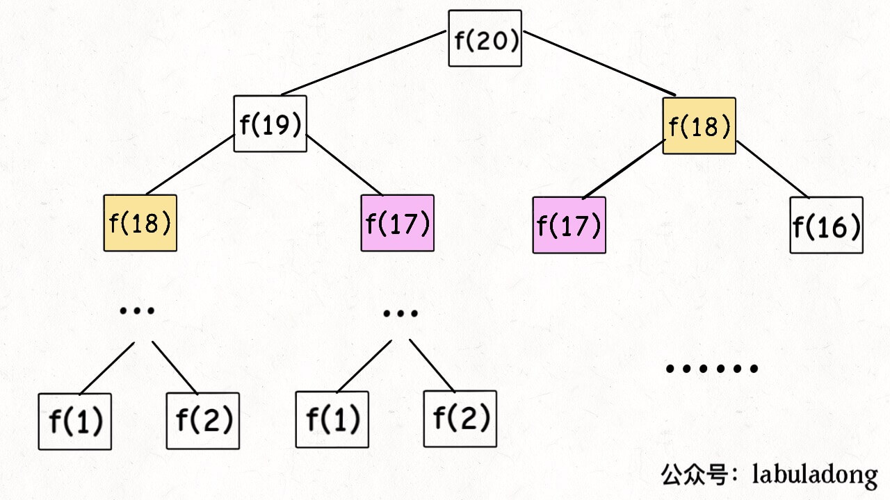
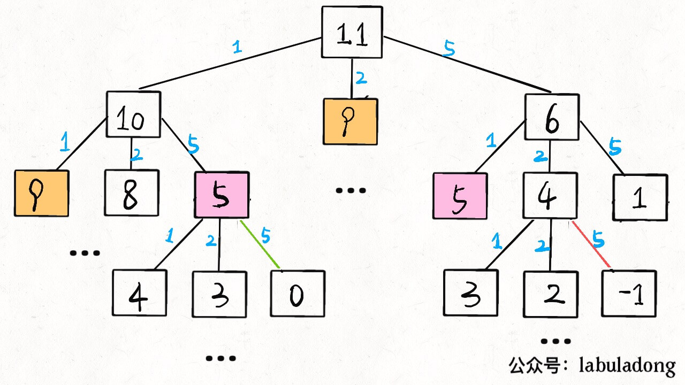
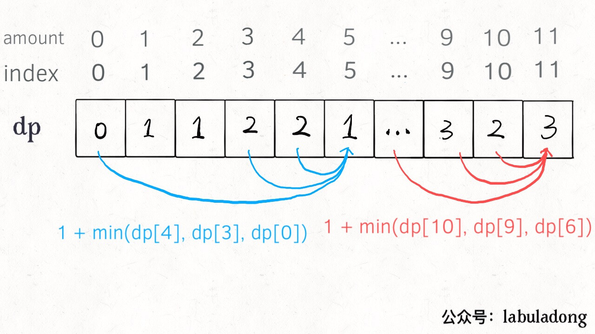

# Analysis of Dynamic Programming

This article is an advanced version of our famous work [Analysis of Dynamic Programming] which gets more than 200 stars.

By the way, our official account has at least a dozen of articles which disassemble the problem of dynamic programming, all of which I have merged into the list of articles. **They all mention the problem solving framework of dynamic programming, and we systematically summarize that.** During this short period, I have grown from a person without any formal training in computer science to who has completed more than half of the LeetCode, so what I summarize may not be suitable for every master, but for the public; after all, I have worked hard to get to where I am.

There are a few set-pieces (frameworks) for algorithm skills. If you know these, you will feel a lot easier,  this article aims to unveil dynamic programming and form a framework to solve this series of problems. Without further ado, let's dive in.

**The normal form of dynamic programming problem is to calculate the maximum or minimum**. Dynamic programming is, in fact, a method in optimization, having many applications in computer science problems, such as the problem of calculating the **longest** increasing subsequence, and the problem of calculating **the smallest** editing distance, etc.

Since we are asked to calculate the maximum or minimum, what is the core problem? **The core of the problem is enumeration**. As we are asked to calculate the max or min, we must enumerate all the feasible answers, then find max or min among them.

You might be asking: Is dynamic programming so easy, that it's only enumeration ? The problems I see about dynamic programming problems are all hard!

Firstly, the enumeration of dynamic programming is a bit special, because there **exist "overlapped subproblems"**. If we rely on brute force, these kind of problems will have extremely low efficiency, which is why we need a "memo records" or "DP table" to optimize the process of enumeration in order to avoid unnecessary (repeated) calculations.

In addition to that, DP problems must **have the "most optimal substructure"**, only through the most optimal subproblems can we obtain the solution of the most optimal original problems.

Moreover, although the core idea of DP is to enumerate for max or min, the problem itself can vary vastly, to enumerate all feasible answers is not easy, only when listing the **correct "state transition equation"** can we enumerate perfectly.

The overlapped subproblems, optimal substructure and correct state transition equation are the three elements of DP. What that means will be expanded in detail, however, in the practical algorithm problems solving, **it is hardest to write out the state transition equation** , which is why many people consider DP hard, below I provide a thinking model researched on by myself, to support you to consider the state transition equation.

Find out [`state`] -> Define dp array -> Find out [`option`] -> Find out base case.

We explain the basic principle of dynamic programming in detail by solving Fibonacci sequence problem and the collecting change problem below. The previous content you've read is to let you know what are overlapped subproblems (though Fibonacci sequence is not a strictly DP problem), and the next section mainly focuses on how to list the state transition equation.

Please do not frown upon this example for being easy, **only a simple example can allwo you to fully focus on the general ideas and techniques, instead of being confused by obscure details**. To get hard examples, there are many in the articles in this series.

### 1. Fibonacci sequence

**1. Brute Force Recursion**

The mathematics form of Fibonacci sequence is recursive, which in code is as shown:

```cpp
int fib(int N) {
    if (N == 1 || N == 2) return 1;
    return fib(N - 1) + fib(N - 2);
}
```

We don't need to discuss this in detail, teachers at school pretty much use this as an example of recursion. We also know writing code this way is clean, easy to understand, but very inefficient. Where is inefficiency? Suppose `n = 20`, and draw the recursive tree.

PS: Every time you meet the problems needed to be recursive, I'd recommend drawing the recursive tree, it'll be massive help for you in finding the reason of inefficiency.



How do we understand this recursive tree? That is to say to calculate the original problem of `f(20)`, we need to calculate the sub-problems `f(19)` and `f(18)`, then for the sub-problem of `f(19)`, we need to calculate sub-problems `f(18)` and `f(17)` first, and so on. Only when we `f(1)` or `f(2)`, will we know the solution (`1`), in which we can immediately return and the recursive tree will stop growing.

**How do we calculate the time complexity? It is number of subproblems multiplied by the time to solve a subproblem.**

The number of subproblems, namely the total number of nodes in recursive tree. Clearly the number of nodes in binary tree is exponential, so the number of subproblems is O(2^n). 

The time to solve a subproblem here is without cycles/loops, only with the add operation f(n-1) + f(n-2) of which the time is O(1).

Thus, the time to complexity  solve a subproblem is O(2^n), which is exponential, bang.

Observing the recursive tree, we can find the reason why the algorithm is inefficient: there exists a ton of repeated computation, for example, `f(18)` is calculated twice, and as you can see, the recursive tree with `f(18)` at the root has a so huge number of nodes, that every one step of calculation wastes a lot of time. Moreover, the brute-force solution for `f(18)` is calculated repeatedly, so this algorithm is very inefficient.

This is the first property in DP problems: **overlapped subproblem.** Below, we try to solve this problem.

**2. Recursive solution with memos**

Understanding the problem is half the solution (so we're halfway there). Since the reason for wasting time is repeated calculations, we can build a memo. Every time you find the answer to a subproblem, record it in the memo and then return the solution; every time you meet a problem, check the memo. If you find you have solved that before, just return that answer, no need to waste time to recalculate.

Generally an array is used as a memo, but you of course can use hash table (dictionary), the thought process is the same.

```cpp
int fib(int N) {
    if (N < 1) return 0;
    // memo initialized as 0
    vector<int> memo(N + 1, 0);
    // initialize the easiest condition
    return helper(memo, N);
}
 
int helper(vector<int>& memo, int n) {
    // base case 
    if (n == 1 || n == 2) return 1;
    // previously calculated
    if (memo[n] != 0) return memo[n];
    memo[n] = helper(memo, n - 1) + 
                helper(memo, n - 2);
    return memo[n];
}
```

Now, draw the recursive tree, and you will know what memo does.


In fact, by pairing recursive algorithms with memos, we can modify a recursive tree with massive redundancy through 'pruning', turning it into a recursive graph without redundancy, which intensely decreases the number of subproblems (the nodes in the recursive graph).


How to calculate the time complexity of our solution? The number of subproblems multiplied by the time of which the subproblem needs.

The number of total subproblems, namely the total number of nodes in graph, because there is no redundant computation in this algorithm, the subproblems are `f(1)`,`f(2)`,`f(3)`... `f(20)`, the number and size of input `n = 20` are directly proportional, so the number of subproblems are O(n).

The time to solve a subproblem, as above, there is no loop, the time is O(1). Compared to the brute-force soltion, is a reduction in dimension (n).

Therefore, the time complexity of this algorithm is O(n). Instead of a brute-force algorithm, it's a dimension reduction attack.

So far, the efficiency of the recursive solution with memos is the same as that of the iterative dynamic programming solution. In fact, this approach is almost identical to iterative dynamic programming, except that iterative DP is referred to as "top-down" and dynamic programming is referred to as "bottom-up".

What is "top down"? Notice that the recursion tree that we just drew, or the graph, goes from the top down, all the way down from a big old problem like `f(20)`, and gradually breaks down until `f(1)` and `f(2)` nodes hit the bottom, and then returns the answer layer by layer, hence: `top-down.`

What is "bottom-up"? The opposite! We start directly from the bottom, the simplest, smallest problem, `f(1)` and `f(2)`, and we push our way up, until we get to the answer we want, `f(20)`, and that's the idea of dynamic programming, and that's why dynamic programming is generally done without recursion, instead by iteration.

**3. recursive answer to dp array**

Now that you have inspiration from the previous "memorandum" section, we can separate this "memorandum" into a table, called DP table, in this table to complete the "bottom up" calculation. Isn't it beautiful!

```cpp
int fib(int N) {
    vector<int> dp(N + 1, 0);
    // base case
    dp[1] = dp[2] = 1;
    for (int i = 3; i <= N; i++)
        dp[i] = dp[i - 1] + dp[i - 2];
    return dp[N];
}
```


The explanation becomes easy with a picture drawn, and you see that the DP table looks very much like the result of the "pruning" before, only in reverse (the red text denotes 'unused array', with the text below the arrow indicating 'bottom-up'). In fact, the "memo" in the recursive solution with memo is the DP table after the final completion, so the two solutions are actually the same, in most cases, the efficiency is basically the same.

Here, we introduce the term "state transition equation", which is actually the mathematical form to describe the structure of the problem:


Now, why is it called the "state-transition equation"? Honestly, to sound fancy. You want to think of it this way: `f(n)` [aka f of n] to be a state of: `n`, and that state `n` is transferred from the sum of the `n - 1` and `n - 2`, that's called a state transfer – that's it.

You wll find that all the operations in the above solutions, such as return f(n - 1) + f(n - 2), dp[i] = dp[i - 1] + dp[i - 2], and the initialization of the memo or DP table, all revolve around different representations of this equation. This makes it clear why it is important to list the "state transfer equation", because it is the core of the solution. You'll also easily realize that the state transition equation directly represents the brute-force solution.

**Never look down upon the brute-force solution. the most difficult part of the dynamic programming problem is to write the state transfer equation**, that is, the brute-force solution. The optimization method is nothing more than the use of the memo or DP table – no mystery behind it.

At the end of this example, there's a little optimization detail. Observant readers will find that, according to the state transition equation of the Fibonacci sequence, the current state is only related to the previous two states. In fact, it is not necessary to have a long DP table to store all the states, just find a way to store the previous two states. Therefore, it can be further optimized to reduce the space complexity to O(1):

```cpp
int fib(int n) {
    if (n == 2 || n == 1) 
        return 1;
    int prev = 1, curr = 1;
    for (int i = 3; i <= n; i++) {
        int sum = prev + curr;
        prev = curr;
        curr = sum;
    }
    return curr;
}
```

Another important feature of dynamic programming, one might ask, is the optimal substructure. If you're wondering why we haven't expanded on it, don't fret: we'll discuss that below. The Fibonacci sequence example is not strictly a dynamic programming because it does not involve finding the optimal value. This is intended to demonstrate the spiraling process of algorithm design. Now, let's look at the second example, the problem of collecting change.

### 2. The problem of collecting change

Here's the problem: Given there are coins in different denominations of `k`, expressed as `c1, c2...ck`, the number of each coin is unlimited, and when given a total amount of `amount`, you're asked to count **at least** how many coins are needed to add up this amount. If it is impossible, the algorithm returns -1. The function signature of the algorithm is as follows:

```java
// 'coins' are the possible coin denomination options, 'amount' is the target amount
int coinChange(int[] coins, int amount);
```

For example `k = 3'`, face value (denomations) are 1, 2, 5, total amount `amount = 11`. So you have to have at least 3 coins, where 11 = 5 + 5 + 1.

How do you think computers should solve this problem? Obviously, it's a matter of enumerating all possible coin-pooling methods and finding the minimum number of COINS needed.

**1. Brute-Force Recursion**

First, the problem is dynamic programming because it has an "optimal substructure". **To meet the optimal substructure, subproblems must be independent of each other**. What is independence? I'm sure you don't want to see a mathematical proof, so let me give you an intuitive example.

For example, suppose your original problem (in school) is to get the highest total examination score, then your sub-problem is to get the highest score on the Chinese exam, the highest on the Mathematics exam... In order to get the highest score in each subject, you need to get the highest multiple choice score for each subject, and the highest fill-in-the-blanks score (and other different types of exam questions)... Of course, the end result is that you get full marks for each course, which is the highest total score.

We got the right result: the highest total score is the total score. As the process conforms to the optimal sub-structure, the "highest in each subject" sub-problems are independent of each other, with no conflict between them.

However, if add a condition: your Chinese achievement and mathematics achievement will mutually affect and influence each other, e.g one score is opposite to the other, where if your Chinese score goes up, your Mathematics exam goes down. Based on this, it is obvious that the highest total score you can get is not the total score anymore, based on the previous thinking process, you will get the wrong result. As the sub-problem is not independent, the achievement of Chinese and mathematics cannot be optimal at the same time, so the optimal sub-structure is destroyed.

Going back to the problem of making small change, why does it fit the optimal substructure? For example, if you want to ask for `amount = 11` in the minimum number of coins (original problem), if you know the how to count the minimum number of coins with `amount = 10` (a subproblem), you only need to traverse to the child the answer to the question, adding one (i.e. choosing a coin with a value of 1) is the answer to the question, because there is no limit to the number of the coins you can pick, there is no mutual dependence between sub-problems, they are independent of each other.

So, now that you see that this is a dynamic programming problem, you have to think about **how to get the right transition equation**.

**First determine the "state"**, which is the variable that changes in the original problem and subproblems. Since the number of coins is infinite, the only state is the target amount: `amount`.

**Then determine the definition of the `dp` function**: the current target amount is `n`, at least `dp(n)` coins are needed to make up the amount.

**Then determine the "choice" and choose the best/most optimal**, that is, for each state, what choices can be made to change the current state. Specific to this problem, no matter what the target amount is, the only choice is to choose a coin from the denomination list `coins`, thus reducing the target amount:

```python
# Pseudocode framework
def coinChange(coins: List[int], amount: int):
    # Definition: to scrape up an amount of n, at least dp(n) coins are required
    def dp(n):
        # Make a choice. Choose the one that requires the fewest coins
        for coin in coins:
            res = min(res, 1 + dp(n - coin))
        return res
    # So the question we're asking is dp(amount)
    return dp(amount)
```

**Finally, base case is clarified**, obviously when the target amount is 0, the number of COINS required is 0; When the target amount is less than 0, there is no solution, and -1 is returned:

```python
def coinChange(coins: List[int], amount: int):

    def dp(n):
        # base case
        if n == 0: return 0
        if n < 0: return -1
        # to minimize it is to initialize it to infinity
        res = float('INF')
        for coin in coins:
            subproblem = dp(n - coin)
            # No solution to subproblem, skip
            if subproblem == -1: continue
            res = min(res, 1 + subproblem)

        return res if res != float('INF') else -1
    
    return dp(amount)
```

So far, the state transfer equation has been completed, and the above algorithm is already a brute-force solution. The mathematical form of the above code is the state transfer equation:


At this point, the problem is actually solved, but the overlapping subproblems need to be eliminated. For example, when `amount = 11 and COINS = {1,2,5}`, the recursive tree can be drawn. (The blue text shows the additional coin needed to be added on top of the solution from subproblem to solve the problem)



**Time complexity analysis: Total number of subproblems x Time per subproblem **.

The total number of subproblems is the number of recursion tree nodes, which is hard to see, which is order n to the k, but it's exponential. Each subproblem contains a for loop of O(k). So the total time complexity is O (k * n^k), the exponential level (recall `k` is the number of denominations in coins, where `c1, c2, ..., ck`).

**2. Recursion with memo**

With minor modifications, subproblems can be eliminated with memos:

```python
def coinChange(coins: List[int], amount: int):
    # memo
    memo = dict()
    def dp(n):
        # Check the memo to avoid double counting
        if n in memo: return memo[n]

        if n == 0: return 0
        if n < 0: return -1
        res = float('INF')
        for coin in coins:
            subproblem = dp(n - coin)
            if subproblem == -1: continue
            res = min(res, 1 + subproblem)
        
        # store result into memo
        memo[n] = res if res != float('INF') else -1
        return memo[n]
    
    return dp(amount)
```

Without drawing, it is obvious that the memo greatly reduces the number of subproblems and completely eliminates the redundant computation of subproblems, so that the total number of subproblems will not exceed n, hence the number of subproblems is O(n). The time to deal with a subproblem is still O(k), so the total time complexity is O(kn).

**3. Iterative solution of dp array**

Of course, we can also use dp table from the bottom up to eliminate overlapping subproblems. The definition of 'dp' array is similar to that of 'dp' function just now, and the definition is the same:

**`dp[i] = x` means that: when the target amount is `i`, at least `x` coins are needed.**

```cpp
int coinChange(vector<int>& coins, int amount) {
    // The array size is amount + 1 and the initial value is also amount + 1
    vector<int> dp(amount + 1, amount + 1);
    // base case
    dp[0] = 0;
    for (int i = 0; i < dp.size(); i++) {
        // The inner for-loop is finding the minimum for all: subproblems + 1
        for (int coin : coins) {
            // No solution to subproblem, skip
            if (i - coin < 0) continue;
            dp[i] = min(dp[i], 1 + dp[i - coin]);
        }
    }
    return (dp[amount] == amount + 1) ? -1 : dp[amount];
}
```



PS: why is the `dp` array initialized to `amount + 1`? Because the number of coins that can be added to `amount` can only be equal to `amount` (all one-dollar coins) at most, initializing `amount + 1` is the same as initializing `amount + 1` to +∞ (infinity) for subsequent minimization.

### 3. Final conclusion

The first Fibonacci sequence problem explains how to optimize a recursion tree by using the "memo" or "dp table" method, and makes it clear that the two methods are essentially the same, with the difference of approaching the problem being top-down or bottom-up.

The second coin problem of counting change shows how to streamline the process of determining the "state transfer equation", by which brute-force recursive solutions are written, the rest is to optimize the recursion tree and eliminate overlapping subproblems.

If you didn't know much about dynamic programming previously, yet you can still read up to this point, I really want to give you a round of applause, I believe you've grasped the design/framework of this algorithm.

**There is nothing magical about a computer solving a problem. Its only solution is to exhaust all possibilities.** Algorithm design is nothing more than thinking "how to be exhaustive" first, and then pursuing "how to be exhaustive intelligently".

To write the dynamic transfer equation is to solve the "how to be exhaustive" problem. The reason why it is difficult is that many exhaustive operations require recursive implementation, and the second reason is that the solution space of some problems is complex and not easy to exhaustive.

The memo or DP table is in the pursuit of "how to intelligently be exhaustive." With the idea of exchanging space complexity to reduce time complexity, space the holy grail to reduce the complexity of time. In addition to, try to ask yourself, what other power move do we have up our sleeve?

**Work to make the algorithm clear! You are welcome to pay attention to my WeChat public number labuladong, see more easy-to-understand articles** :

Author: labuladong

[Previous: Why I Recommend "Algorithms, 4th Edition"](../think_like_computer/why_i_recommend_algs4.md)

[Next: Q&A on Dynamic Programming](../dynamic_programming/OptimalSubstructure.md)

[Table of Contents](../README.md#table-of-contents)