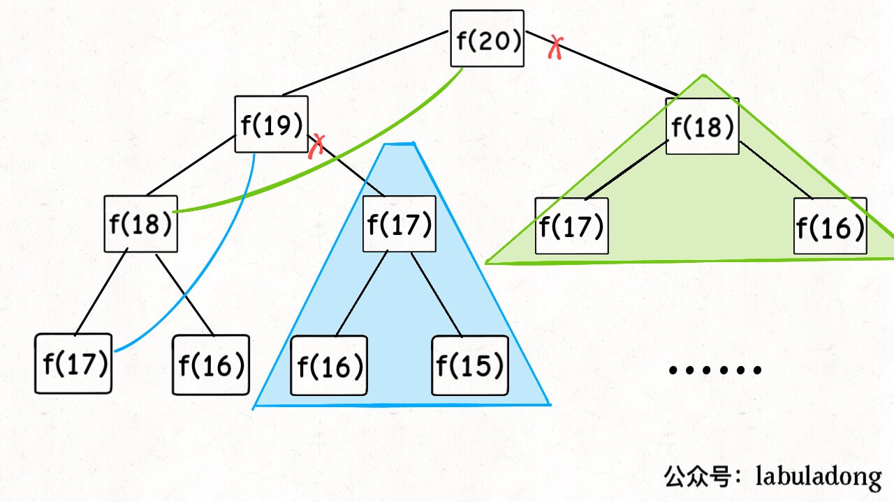

# Analysis of Dynamic Programming

This article is an advanced version of our famous work [Analysis of Dynamic Programming] which gets more than 200 stars.

By the way, our official account has at least a dozen of articles which disassemble the problem of dynamic programming, all of which I have merged into the list of articles. **They all mention the problem solving framework of dynamic programming, and we systematically summarize that.** During this short period, I have grown from a person without any formal training in computer science to who has completed more than half of the LeetCode, so what I summarize may not be suitable for every master, but for the public; after all, I have worked hard to get to where I am.

There are a few set-pieces for algorithm skills. If you know these, you will get a lot easier, this article aims to see through dynamic programming and form a framework to solve this series of problems. Let's get into the straight point. Here are the full contents.

**The normal form of dynamic programming problem is to calculate the maximum or minimum**. Dynamic programming is, in fact, a method in optimization, which just has many applications in problems in computer science, such as the problem to calculate the **longest** increasing subsequence, and the problem to calculate **the smallest** distance of editing.

Since we are asked to calculate the maximum or minimum, what is the core problem? **The core of the problem is enumeration**. Because we are asked to calculate the max or min, we must enumerate all the feasible answers and find max or min among those.

Is dynamic programming so easy that only enumeration is OK? What I see about dynamic programming problems are all hard.

Firstly, the enumeration of dynamic programming is a bit special, because there **exist "overlapped subproblems"** this kind of problems have extremely low efficiency, we need a "memos" or "DP table" to optimize the process of enumeration to avoid unnecessary calculations.

And that, the DP problems must **have the "best substructure"** , only through the max or min of subproblems can we obtain the max or min of original problems.

Moreover, although the core idea of DP is to enumerate for max or min, the problem itself varies, to enumerate all feasible answers is not a easy thing, only when listing the **correct "state transition equation"** can we enumerate perfectly.

The overlapped problems, best substructure and state transition equation are the three elements of DP. What that means will be told in detail, however, in the practical algorithm problems, **it is hardest to write out the state transition equation** , which is why many people consider DP hard, here I provide a thinking model researched on by myself, to support you to consider the state transition equation.

find out [state] -> define dp array -> find out [option] -> find out base case.


Next let's explain the basic principle of dynamic programming in detail by solving Fibonacci sequence problem and the collecting change problem. The former is to let you know what is overlapped subproblems (though Fibonacci sequence is not a strictly DP problem), the latter mainly focuses on how to list the state transition equation.


Please do not frown upon this example for being easy, only simple example can let you fully concentrate on the general ideas and techniques, instead of being confused by obscure details. To get hard instances, there is many in the history. 

### 1. Fibonacci sequence

**1. brute force recursion**

The mathematics form of Fibonacci sequence is recursive, which in code is like this

```cpp
int fib(int N) {
    if (N == 1 || N == 2) return 1;
    return fib(N - 1) + fib(N - 2);
}
```


We don't need to say too much about this, teachers at school all seem to use this as an example of recursion. We also know writing codes this way is easy but inefficient. Where is inefficient? Suppose n is 20 and draw the recursive tree.

PS: Every time you meet the problems needed to be recursive, you'd better draw the recursive tree, which is of great help for you to find the reason of inefficiency.


How to understand this recursive tree? That is to say to calculate the ordinary problem `f(20)`, we need to calculate `f(19)` and `f(18)`, then `f(19)`, we need to calculate `f(18)` and `f(17)` first, and so on.

**How to calculate the time complexity? It is number of subproblems multiplied by the time to solve a subproblem.**

The number of subproblems, namely the total number of nodes in recursive tree. Obviously the number of nodes in binary tree is exponential, so the number of subproblems is O(2^n), as the time to solve a subproblem here is without cycles, only with the add operation f(n-1) + f(n-2) of which the time is O(1), so the time to solve a subproblem is O(2^n), which is exponential, bang.


Observe the recursive tree, we can find the reason why the algorithm is inefficient: there exist a lot of repeated calculation, for example, `f(18)` is calculated twice, and as you can see, the recursive tree rooted at `f(19)` has a so huge volume that every one turn of calculation wastes a lot of time, moreover, more than the node `f(18)` is calculated repeatedly, so this algorithm is very inefficient.

This is the first property in DP: **overlapped subproblem.** Next, we try to solve this problem.

**2. recursive solution with memos**

To know well the problem is to solve a half. Since the reason for wasting time is repeating calculation, then we can make a memo, every time you obtain the answer of a subproblem , record it to the memo and then return; every time you meet a problem of memo check the memo,  if you  find you have solved that before, just take the answer out for use, and do not waste time to calculate.

Generally an array is used as a memo, of course you can use hash table (dictionary), the thought is the same.

```cpp
int fib(int N) {
    if (N < 1) return 0;
    // memo initialized as 0
    vector<int> memo(N + 1, 0);
    // initialize the easiest condition
    return helper(memo, N);
}
 
int helper(vector<int>& memo, int n) {
    // base case 
    if (n == 1 || n == 2) return 1;
    // having calculated
    if (memo[n] != 0) return memo[n];
    memo[n] = helper(memo, n - 1) + 
                helper(memo, n - 2);
    return memo[n];
}
```

Now, draw the recursive tree, and you will know what memo does.



In fact, recursive algorithms together with memos, put a recursive tree with abundant redundancy through pruning, we change one recursive graph without redundancy, which intensely decreases the number of subproblems (namely the node in the recursive graph).


How to calculate the time complexity? The number of subproblems multiplied by the time of which the subproblem needs.

The number of total subproblems, namely the total number of nodes in graph, because there is no redundant computation in this algorithm, the subproblems are `f(1)`,`f(2)`,`f(3)`...

`f(20)`, the number and size of input n = 20 are directly proportional, so the number of subproblems are O(n).

The time to solve a subproblem, as above, there is no loop, the time is O(1).

Therefore, the time complexity of this algorithm is O(n). Instead of a brute-force algorithm, it's a dimension reduction attack.

So far, the efficiency of the recursive solution with memos is the same as that of the iterative dynamic programming solution. In fact, this approach is almost identical to iterative dynamic programming, except that it is called "top-down" and dynamic programming is called "bottom-up".

What is "top down"? Notice that the recursion tree that we just drew, or the graph, goes from the top down, all the way down from a big old problem like `f(20)`, and gradually breaks down the size until `f(1)` and `f(2)` hit the bottom, and then returns the answer layer by layer, which is called `top-down.`

What is "bottom-up"? In turn, we start directly from the bottom, the simplest, smallest problem, `f(1)` and `f(2)`, and we push it up, until we get to the answer we want, `f(20)`, and that's the idea of dynamic programming, and that's why dynamic programming is generally done without recursion, by iteration.

**3. recursive answer to dp array**

Have the inspiration of last step "memorandum", we can separate this "memorandum" into a table, called DP table, in this table to complete the "bottom up" calculation is not beautiful!

```cpp
int fib(int N) {
    vector<int> dp(N + 1, 0);
    // base case
    dp[1] = dp[2] = 1;
    for (int i = 3; i <= N; i++)
        dp[i] = dp[i - 1] + dp[i - 2];
    return dp[N];
}
```


It makes sense to draw a picture, and you see that the DP table looks very much like the result of the "pruning" before, only in reverse.In fact, the "memo" in the recursive solution with memo is the DP table after the final completion, so the two solutions are actually the same, in most cases, the efficiency is basically the same.

Here, we introduce the term "state transition equation", which is actually the mathematical form to describe the structure of the problem:


Why is it called the "state-transition equation"? To sound fancy. You want f of n to be a state n, and that state n is transferred from the sum of the states n minus 1 and n minus 2, that's called a state transfer – that's all.

You will find that all the operations in the above solutions, such as return f(n - 1) + f(n - 2), dp[i] = dp[i - 1] + dp[i - 2], and the initialization of the memo or dp table, all revolve around different representations of this equation. It is important to list the "state transfer equation", which is the core of the solution. It's easy to see that the equation of state transition directly represents the brute-force solution.

**Never look down upon the brute-force solution. the most difficult part of the dynamic programming problem is to write the state transfer equation**, that is, the brute-force solution. The optimization method is nothing more than the use of the memo or DP table – no mystery at all.

At the end of this example, there's a little optimization detail. Observant readers will find that, according to the state transition equation of the Fibonacci sequence, the current state is only related to the previous two states. In fact, it is not necessary to have a long DP table to store all the states, just find a way to store the previous two states. Therefore, it can be further optimized to reduce the space complexity to O(1):

```cpp
int fib(int n) {
    if (n == 2 || n == 1) 
        return 1;
    int prev = 1, curr = 1;
    for (int i = 3; i <= n; i++) {
        int sum = prev + curr;
        prev = curr;
        curr = sum;
    }
    return curr;
}
```

Another important feature of dynamic programming, one might ask, is the optimal substructure. We'll talk about that. The example of the Fibonacci sequence is not strictly a dynamic programming because it does not involve finding the optimal value. This is intended to demonstrate the spiraling process of algorithm design. Now, let's look at the second example, the problem of making small change.

### 2. The problem of collecting change

Here's the problem: here are the COINS in different denominations of 'k', c1, c2...Ck ', the number of each coin is unlimited, and then I give you a total amount 'amount', and I ask you ** at least ** how many COINS are needed to scrape up this amount, if it is impossible, the algorithm returns -1. The function signature of the algorithm is as follows:

```java
// coins are the face value of the optional coin, is the target amount
int coinChange(int[] coins, int amount);
```

For example 'k = 3', face value 1,2,5, total amount 'amount = 11'.So you have to have at least 3 COINS, so 11 is equal to 5 plus 5 plus 1.

How do you think computers should solve this problem?Obviously, it's a matter of enumerating all possible coin-pooling methods and finding the minimum number of COINS needed.

**1. brute-force recursion**


First, the problem is dynamic programming because it has an "optimal substructure." **to meet the optimal substructure, subproblems must be independent of each other **.What is independence?You don't want to see a mathematical proof, but let me give you an intuitive example.


For example, your original problem is to get the highest total score, then your sub-problem is to get the highest Chinese test, mathematics test to the highest. In order to get the highest score in each subject, you need to get the highest multiple choice score for each subject and the highest fill-in-the-blank score. Of course, the end result is that you get full marks for each course, which is the highest total score.


Got the right result: the highest total score is the total score. Because the process conforms to the optimal sub-structure, the "highest in each subject" sub-problems are independent of each other.


However, if add a condition: your Chinese achievement and mathematics achievement will mutually restrict, one side is opposite to the other. In this way, it is obvious that the highest total score you can get is not the total score, according to the previous thinking will get the wrong result. Because the sub-problem is not independent, the achievement of Chinese and mathematics cannot be optimal at the same time, so the optimal sub-structure is destroyed.


Going back to the problem of making small change, why does it fit the optimal substructure?For example, if you want to ask ` amount = 11 ` when the minimum number of COINS (original), if you know the cobble ` amount = 10 ` minimum number of COINS (a problem), you only need to traverse to the child the answer to the question with a (to choose a value of 1 coin) is the answer to the question, because there is no limit to the number of the coin, there is no mutual between sub-problems, were independent of each other.


So, now that you know that this is a dynamic programming problem, you have to think about **how to get the right transition equation**.


**First determine the "state"**, which is the variable that changes in the original problem and subproblems. Since the number of COINS is infinite, the only state is the target amount `amount`.


**then determine the definition of the `dp` function ** : the current target amount is `n`, at least `dp(n)` COINS are needed to make up the amount.


**Then determine the "choice" and choose the best**, that is, for each state, what choices can be made to change the current state. Specific to this problem, no matter what the target amount is, the choice is to choose a coin from the denomination list 'COINS', and then the target amount will be reduced:

```python
# Pseudocode framework
def coinChange(coins: List[int], amount: int):
    # Definition: to scrape up an amount of n, at least dp(n) COINS are required
    def dp(n):
        # Make a choice. Choose the one that requires the fewest coins
        for coin in coins:
            res = min(res, 1 + dp(n - coin))
        return res
    # So the question we're asking is dp(amount)
    return dp(amount)
```

**finally, base case** is clarified. Obviously, when the target amount is 0, the number of COINS required is 0;When the target amount is less than 0, there is no solution, and -1 is returned:

```python
def coinChange(coins: List[int], amount: int):

    def dp(n):
        # base case
        if n == 0: return 0
        if n < 0: return -1
        # to minimize it is to initialize it to infinity
        res = float('INF')
        for coin in coins:
            subproblem = dp(n - coin)
            # No solution to subproblem, skip
            if subproblem == -1: continue
            res = min(res, 1 + subproblem)

        return res if res != float('INF') else -1
    
    return dp(amount)
```

So far, the state transfer equation has been completed, and the above algorithm is already a brute-force solution. The mathematical form of the above code is the state transfer equation:


At this point, the problem is actually solved, but the overlapping subproblems need to be eliminated. For example, when `amount = 11 and COINS = {1,2,5}`, the recursive tree can be drawn.


**time complexity analysis: total number of subproblems x time per subproblem **.

The total number of subproblems is the number of recursion tree nodes, which is hard to see, which is order n to the k, but it's exponential. Each subproblem contains a for loop of O(k).So the total time complexity is order k times n to the k, the exponential level.

**2. Recursion with memo**

With minor modifications, subproblems can be eliminated with memos:

```python
def coinChange(coins: List[int], amount: int):
    # memo
    memo = dict()
    def dp(n):
        # Check the memo to avoid double counting
        if n in memo: return memo[n]

        if n == 0: return 0
        if n < 0: return -1
        res = float('INF')
        for coin in coins:
            subproblem = dp(n - coin)
            if subproblem == -1: continue
            res = min(res, 1 + subproblem)
        
        # note on memo
        memo[n] = res if res != float('INF') else -1
        return memo[n]
    
    return dp(amount)
```

Without drawing, it is obvious that the memo greatly reduces the number of subproblems and completely eliminates the redundancy of subproblems, so that the total number of subproblems will not exceed n, that is, the number of subproblems is O(n).The time to deal with a subproblem is still O(k), so the total time complexity is O(kn).

**3. Iterative solution of dp array**

Of course, we can also use dp table from the bottom up to eliminate overlapping subproblems. The definition of 'dp' array is similar to that of 'dp' function just now, and the definition is the same:

**'dp[I] = x' means that when the target amount is' I ', at least 'x' COINS are needed **.

```cpp
int coinChange(vector<int>& coins, int amount) {
    // The array size is amount + 1 and the initial value is also amount + 1
    vector<int> dp(amount + 1, amount + 1);
    // base case
    dp[0] = 0;
    for (int i = 0; i < dp.size(); i++) {
        // The inner for is finding the minimum of + 1 for all subproblems
        for (int coin : coins) {
            // No solution to subproblem, skip
            if (i - coin < 0) continue;
            dp[i] = min(dp[i], 1 + dp[i - coin]);
        }
    }
    return (dp[amount] == amount + 1) ? -1 : dp[amount];
}
```


PS: why is the `dp` array initialized to `amount + 1`? Because the number of COINS that can be added to `amount` can only be equal to `amount` (all one-dollar COINS) at most, initializing `amount + 1` is the same as initializing `amount + 1` to +∞ (infinity) for subsequent minimization.

### 3. Final conclusion


The first Fibonacci sequence problem explains how to optimize a recursion tree by using the "memo" or "dp table" method, and makes it clear that the two methods are essentially the same, but top-down and bottom-up are different.


The second coin problem shows how to streamline the process of determining the "state transfer equation", by which brute-force recursive solutions are written, the rest is to optimize the recursion tree and eliminate overlapping subproblems.


If you don't know much about dynamic programming, you can still see it here, and I really want to give you a hand, because I think you've mastered the design of this algorithm.


**There is nothing magical about a computer solving a problem. Its only solution is to exhaust all possibilities.** Algorithm design is nothing more than thinking "how to be exhaustive" first, and then pursuing "how to be exhaustive intelligently".


To write the dynamic transfer equation is to solve the "how to be exhaustive" problem. The reason why it is difficult is that many exhaustive operations require recursive implementation, and the second reason is that the solution space of some problems is complex and not easy to exhaustive.


The memo or DP table is in the pursuit of "how to intelligently be exhaustive." With the idea of space for time, is the only way to reduce the complexity of time, in addition to, ask, also can play what flower work?


**Work to make the algorithm clear! You are welcome to pay attention to my WeChat public number labuladong, see more easy-to-understand articles  ** :
Translator: Jian Ma

Author: labuladong
