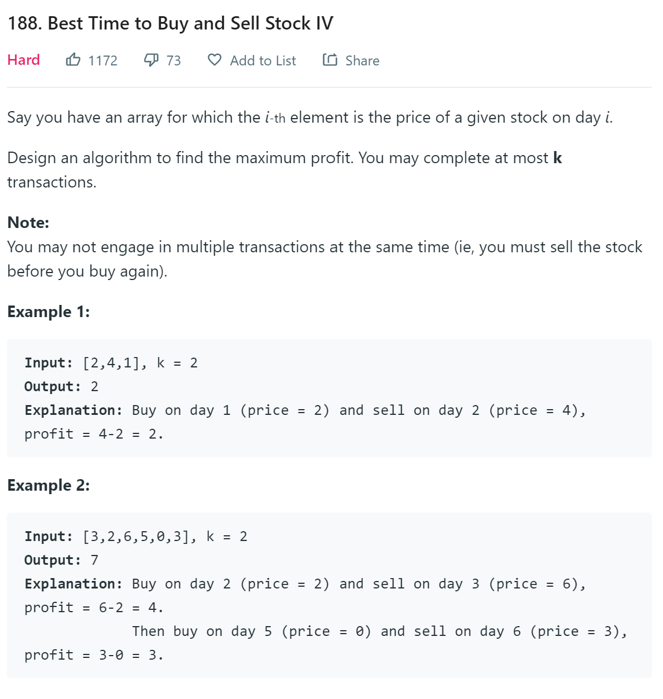
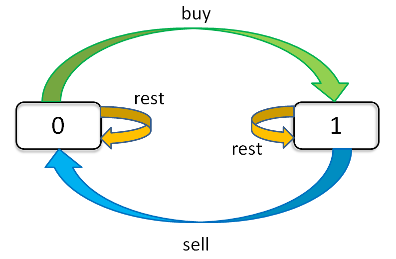
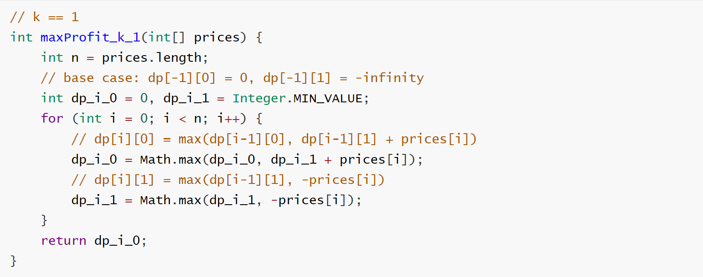

# Best Time to Buy and Sell Stock

**Translator: [Wonderxie](https://github.com/Wonderxie)**

**Author: [labuladong](https://github.com/labuladong)**

Many readers complain that there are too many tricks in the stock series problems on LeetCode. But if we really encounter such problems during the interview, we might not be able to think of those clever methods for a while. What should we do then? **Therefore, this article rejects tricky methods, but instead with the steady ones, using only a general method to solve the problems.**

This article uses the techniques of state machines to solve it, and it can be all submitted and accepted. Don't think that this term is high-dimensional, it's just a literary vocabulary, actually a DP table, you can understand it at a glance.

PS: This article is referenced from [one solution on LeetCode](https://leetcode.com/problems/best-time-to-buy-and-sell-stock/discuss/39038)。

Let's take a look at one of others' solutions:

```cpp
int maxProfit(vector<int>& prices) {
    if(prices.empty()) return 0;
    int s1=-prices[0],s2=INT_MIN,s3=INT_MIN,s4=INT_MIN;
        
    for(int i=1;i<prices.size();++i) {            
        s1 = max(s1, -prices[i]);
        s2 = max(s2, s1+prices[i]);
        s3 = max(s3, s2-prices[i]);
        s4 = max(s4, s3+prices[i]);
    }
    return max(0,s4);
}
```

Can you get it? Can you do it? Impossible! It's so normal that you get confused. Even if you barely understand, you can't solve the next problem. Why can others write such a weird yet efficient solution?Because there is a framework for this kind of problem, but people won't tell you. Because once they tell you, you learn it in five minutes, and the algorithm problem is no longer mysterious and will be vulnerable.

This article will tell you this framework, and then take you to solve the problem one by one. This article uses the techniques of state machines to solve it, and it can be all submitted and accepted. Don't think that this term is high-dimensional, it's just a literary vocabulary, actually a DP table, you can understand it at a glance.

These 6 problems are common, so we will concentrate on the fourth problem. Because this problem is one of the most generalized forms. The other problems are simplifications of this form. 

Look at the problem:



The first problem is that only one transaction is performed, which is equivalent to k = 1. The second problem is that the number of transactions is unlimited, which is equivalent to k = +infinity (positive infinity). The third problem is that only two transactions are performed, which is equivalent to k = 2. The remaining two are also unlimited, but the additional conditions of the "freezing period" and "handling fee" for the transaction are actually variants of the second problem, which are easy to handle.

If you are not familiar with the topics, you can go to LeetCode to view the content of these topics. In order to save space, this article does not list the specific content of these topics. Let's get back to business and start solving the problem.


**I. Exhaustive Framework**

First of all, always the same idea: how to exhaust? The exhaustive thinking here is not the same as the recursive idea of the previous article.

Recursion is actually in line with the logic of our thinking. It is advanced step by step. When we have something that can't be solved, we can thrown it to recursion. It usually works and the readability is still good. The disadvantage is that once you make a mistake, you can't easily find the cause of the error. For example, the recursive solution in the previous article definitely has computational redundancy, but it is not easy to find.

Here, we do not use recursive thinking for exhaustion, but use "state" for exhaustion. Let's be specific to each day to see how many possible "states" there are, and then to find the "choice" corresponding to each "state". We have to exhaust all "states", and the purpose of exhaustion is to update the "state" according to the corresponding "choice". It sounds abstract, just remember the words "state" and "choice". It's easy to understand by the following example.

```python
for state1 in all values of state1：
    for state2 in in all values of state2：
        for ...
            dp[state1][state2][...] = best_choice(choice1, choice2 ...)
```

For example, in this problem, **there are three "choices" every day:** buy, sell, and no operation. We use `buy`, `sell`, `rest` to represent these three choices. But the problem is that you can't do these three choices every day, because `sell` must be after `buy`, and `buy` must be after `sell`. Then the `rest` operation should be divided into two states, one is `rest` after `buy` (holding the stock), and one is `rest` after `sell` (not holding the stock). And don't forget, we also have a limit on the number of transactions k, which means that we can only operate on the premise that k > 0.

It's complicated, but don't be afraid. Our current purpose is just exhaustive. No matter how many states it has, what we have to do is to list all of them. **There are three "states" of this problem**. The first is the number of days, the second is the maximum number of allowed transactions, and the third is the current holding state (That is, the state of `rest` mentioned before. We can use 1 means hold, 0 means no hold). Then we can use a three-dimensional array to hold all the combinations of these states:

```python
dp[i][k][0 or 1]
0 <= i <= n-1, 1 <= k <= K
(n means the number of days, the uppercase K means the maximum number of allowed transactions)
This problem has a total of n × K × 2 states, and we can solve it all by exhausting them.

for 0 <= i < n:
    for 1 <= k <= K:
        for s in {0, 1}:
            dp[i][k][s] = max(buy, sell, rest)
```

And we can use natural language to describe the meaning of each state. For example, `dp[3][2][1]` means: Today is the third day. I can do 2 transactions so far. And I currently hold stocks. For another example, `dp[2][3][0]`: Today is the second day. I can do 3 transactions so far. And I don’t have any stocks in my hand. It's easy to understand, right?

The final answer we want to find is `dp[n-1][K][0]`, which is the maximum number of K transactions allowed on the last day and the maximum profit. The reader may ask why is it not `dp[n-1][K][1]`? Because "1" means that you still have stocks, "0" means that the stocks you have sold have been sold. Obviously, the latter must get greater profits than the former.

Remember how to interpret "state", and once you find it difficult to understand, translate it into natural language.


**II. State Transition Framework**

Now that we have completed the "state" exhaustion. We begin to think about what "choices" are there for each "state", and how we should update the "state". If we are just concerned with the "holding state", we can draw a state transition diagram.



It is clear from this diagram how each state (0 and 1) is transferred. Based on this diagram, let's write the state transition equation:

```
dp[i][k][0] = max(dp[i-1][k][0], dp[i-1][k][1] + prices[i])
              max( choose rest  ,          choose sell      )

Explanation: I don’t hold stocks today. There are two possibilities:
1) Either I didn’t hold stocks yesterday, and then choose to rest today, so I still don’t hold stocks today.
2) Either I held stocks yesterday, but today I chose to sell, so I don't hold stocks today.

dp[i][k][1] = max(dp[i-1][k][1], dp[i-1][k-1][0] - prices[i])
              max( choose rest  ,            choose buy         )

Explanation: Today I hold stocks. There are two possibilities:
1) Either I held stocks yesterday and chose to rest today, so I still hold stocks today.
2) Either I didn't hold stocks yesterday, but today I chose to buy, so today I hold stocks.
```

This explanation should be clear. If you buy, you need to subtract `prices[i]` from the profit, and if you sell, you need to increase `prices[i]` to the profit. The maximum profit of today is the larger of these two possible choices. And pay attention to the limitation of k. When we choose to buy, we reduce k by 1, which is very easy to understand. Of course, we need also decrease by 1 when we choose to sell.

Now we have completed the most difficult step in dynamic programming: the state transition equation. **If you can understand the previous content, then you can already deal with all the problems, just use this framework.** But there is one last thing left, which is to define the base case, which is the simplest case.

```
dp[-1][k][0] = 0
Explanation: Because i starts at 0, i = -1 means it hasn't started yet, and the profit at this time is of course 0.

dp[-1][k][1] = -infinity
Explanation: Before the beginning, it was impossible to hold stocks, which is expressed as negative infinity.

dp[i][0][0] = 0
Explanation: Because k starts from 1, k = 0 means that trading is not allowed at all, and profit is of course 0 at this time.

dp[i][0][1] = -infinity
Explanation: It is impossible to hold stocks when trading is not allowed. This possibility is expressed by negative infinity.
```

Let's summarize the above state transition equations:

```
base case：
dp[-1][k][0] = dp[i][0][0] = 0
dp[-1][k][1] = dp[i][0][1] = -infinity

state transition equation：
dp[i][k][0] = max(dp[i-1][k][0], dp[i-1][k][1] + prices[i])
dp[i][k][1] = max(dp[i-1][k][1], dp[i-1][k-1][0] - prices[i])
```

The reader may ask, how is this array index "-1" expressed programmatically, and how is negative infinity expressed? This is all a matter of detail, and there are many ways to achieve it. Now that the complete framework has been completed. Let's start the materialization of the code.


**III. Solve the problem**

**First Problem: k = 1**

Set state transition equations directly. According to the base case, some simplifications can be done:

```
dp[i][1][0] = max(dp[i-1][1][0], dp[i-1][1][1] + prices[i])
dp[i][1][1] = max(dp[i-1][1][1], dp[i-1][0][0] - prices[i]) 
            = max(dp[i-1][1][1], -prices[i])
Explanation：Base case of k = 0，so dp[i-1][0][0] = 0

Now we find that k is 1 and will not change, that is, k has no effect on the state transition. We can further simplify it with removing all k:
dp[i][0] = max(dp[i-1][0], dp[i-1][1] + prices[i])
dp[i][1] = max(dp[i-1][1], -prices[i])
```

Write the code directly:

```java
int n = prices.length;
int[][] dp = new int[n][2];
for (int i = 0; i < n; i++) {
    dp[i][0] = Math.max(dp[i-1][0], dp[i-1][1] + prices[i]);
    dp[i][1] = Math.max(dp[i-1][1], -prices[i]);
}
return dp[n - 1][0];
```

Obviously `dp[i-1]` is illegal when i = 0. This is because we have not processed the base case of i. Can be handled like this:

```java
for (int i = 0; i < n; i++) {
    if (i - 1 == -1) {
        dp[i][0] = 0;
        // Explanation：
        //   dp[i][0] 
        // = max(dp[-1][0], dp[-1][1] + prices[i])
        // = max(0, -infinity + prices[i]) = 0
        dp[i][1] = -prices[i];
        // Explanation：
        //   dp[i][1] 
        // = max(dp[-1][1], dp[-1][0] - prices[i])
        // = max(-infinity, 0 - prices[i]) 
        // = -prices[i]
        continue;
    }
    dp[i][0] = Math.max(dp[i-1][0], dp[i-1][1] + prices[i]);
    dp[i][1] = Math.max(dp[i-1][1], -prices[i]);
}
return dp[n - 1][0];
```

The first problem is solved, but it is troublesome to handle the base case in this way. And pay attention to the state transition equation, the new state is only related to an adjacent state. So in fact, instead of the entire DP array, only one variable is needed to store the adjacent state, which can reduce the space complexity to O(1):

```java
// k == 1
int maxProfit_k_1(int[] prices) {
    int n = prices.length;
    // base case: dp[-1][0] = 0, dp[-1][1] = -infinity
    int dp_i_0 = 0, dp_i_1 = Integer.MIN_VALUE;
    for (int i = 0; i < n; i++) {
        // dp[i][0] = max(dp[i-1][0], dp[i-1][1] + prices[i])
        dp_i_0 = Math.max(dp_i_0, dp_i_1 + prices[i]);
        // dp[i][1] = max(dp[i-1][1], -prices[i])
        dp_i_1 = Math.max(dp_i_1, -prices[i]);
    }
    return dp_i_0;
}
```

Both methods are the same, but this programming method is much simpler. But without the guidance of the previous state transition equations, it is definitely incomprehensible. Subsequent problems, we mainly write this kind of solution with O(1) space complexity.

**Second Problem: k = +infinity**

If k is positive infinity, then k and k-1 can be considered the same. The framework can be rewritten like this:

```python
dp[i][k][0] = max(dp[i-1][k][0], dp[i-1][k][1] + prices[i])
dp[i][k][1] = max(dp[i-1][k][1], dp[i-1][k-1][0] - prices[i])
            = max(dp[i-1][k][1], dp[i-1][k][0] - prices[i])

We find that k in the array has not changed, which means that we do not need to record the state of k:
dp[i][0] = max(dp[i-1][0], dp[i-1][1] + prices[i])
dp[i][1] = max(dp[i-1][1], dp[i-1][0] - prices[i])
```

Translate it directly into code:

```java
int maxProfit_k_inf(int[] prices) {
    int n = prices.length;
    int dp_i_0 = 0, dp_i_1 = Integer.MIN_VALUE;
    for (int i = 0; i < n; i++) {
        int temp = dp_i_0;
        dp_i_0 = Math.max(dp_i_0, dp_i_1 + prices[i]);
        dp_i_1 = Math.max(dp_i_1, temp - prices[i]);
    }
    return dp_i_0;
}
```

**Third Problem: k = +infinity with cooldown**

We must wait one day after each sell to continue trading. Just incorporate this feature into the state transition equation of the previous problem:

```
dp[i][0] = max(dp[i-1][0], dp[i-1][1] + prices[i])
dp[i][1] = max(dp[i-1][1], dp[i-2][0] - prices[i])
Explanation: When we choose to buy on day i, the state of i-2 should be transferred instead of i-1.
```

Translate it into code:

```java
int maxProfit_with_cool(int[] prices) {
    int n = prices.length;
    int dp_i_0 = 0, dp_i_1 = Integer.MIN_VALUE;
    int dp_pre_0 = 0; // variable representing dp[i-2][0]
    for (int i = 0; i < n; i++) {
        int temp = dp_i_0;
        dp_i_0 = Math.max(dp_i_0, dp_i_1 + prices[i]);
        dp_i_1 = Math.max(dp_i_1, dp_pre_0 - prices[i]);
        dp_pre_0 = temp;
    }
    return dp_i_0;
}
```

**Fourth Problem: k = +infinity with fee**

There is a fee for each transaction, so we need to substract the fee from the profit. Rewrite the equation:

```
dp[i][0] = max(dp[i-1][0], dp[i-1][1] + prices[i])
dp[i][1] = max(dp[i-1][1], dp[i-1][0] - prices[i] - fee)
Explanation: That means that the price of buying stocks has risen.
It's the same case that we substract it in the first formula, which is equivalent to reducing the price of the stock sold.
```

Translate it directly into code:

```java
int maxProfit_with_fee(int[] prices, int fee) {
    int n = prices.length;
    int dp_i_0 = 0, dp_i_1 = Integer.MIN_VALUE;
    for (int i = 0; i < n; i++) {
        int temp = dp_i_0;
        dp_i_0 = Math.max(dp_i_0, dp_i_1 + prices[i]);
        dp_i_1 = Math.max(dp_i_1, temp - prices[i] - fee);
    }
    return dp_i_0;
}
```

**Fifth Problem: k = 2**

k = 2 is slightly different from the previous problem, because the above conditions are not very related to k. Either k is positive infinity, and the state transition has nothing to do with k. Either k = 1, close to the base case of k = 0, and there is no sense of existence in the end.

In the case where k = 2 and k to be described later are arbitrary positive integers, the treatment of k is highlighted. We write the code directly and analyze the reason as we write.

```java
The original state transition equation, where there is no simplification
dp[i][k][0] = max(dp[i-1][k][0], dp[i-1][k][1] + prices[i])
dp[i][k][1] = max(dp[i-1][k][1], dp[i-1][k-1][0] - prices[i])
```

Following the previous code, we might take the following code for granted (wrong):

```java
int k = 2;
int[][][] dp = new int[n][k + 1][2];
for (int i = 0; i < n; i++)
    if (i - 1 == -1) { /* Deal with the base case */ }
    dp[i][k][0] = Math.max(dp[i-1][k][0], dp[i-1][k][1] + prices[i]);
    dp[i][k][1] = Math.max(dp[i-1][k][1], dp[i-1][k-1][0] - prices[i]);
}
return dp[n - 1][k][0];
```

Why is it wrong? Aren't we writing according to the state transition equation?

Remember the "exhaustive framework" summarized earlier? This means that we must exhaust all states. In fact, our previous solutions are all considering on exhausting in all states, but k has been simplified in the previous problem. For example, in the first problem when k = 1:



Since this problem does not eliminate the effect of k, we need also exhaust k:

```java
int max_k = 2;
int[][][] dp = new int[n][max_k + 1][2];
for (int i = 0; i < n; i++) {
    for (int k = max_k; k >= 1; k--) {
        if (i - 1 == -1) { /* Deal with the base case */ }
        dp[i][k][0] = max(dp[i-1][k][0], dp[i-1][k][1] + prices[i]);
        dp[i][k][1] = max(dp[i-1][k][1], dp[i-1][k-1][0] - prices[i]);
    }
}
// Exhaust n × max_k × 2 states, correct!
return dp[n - 1][max_k][0];
```

If you don't understand, you can go back to the first point "Exhaustive Frame" and re-read it.

Here, the value range of k is relatively small, so we can directly list all the cases of k = 1 and 2 without a for loop:

```java
dp[i][2][0] = max(dp[i-1][2][0], dp[i-1][2][1] + prices[i])
dp[i][2][1] = max(dp[i-1][2][1], dp[i-1][1][0] - prices[i])
dp[i][1][0] = max(dp[i-1][1][0], dp[i-1][1][1] + prices[i])
dp[i][1][1] = max(dp[i-1][1][1], -prices[i])

int maxProfit_k_2(int[] prices) {
    int dp_i10 = 0, dp_i11 = Integer.MIN_VALUE;
    int dp_i20 = 0, dp_i21 = Integer.MIN_VALUE;
    for (int price : prices) {
        dp_i20 = Math.max(dp_i20, dp_i21 + price);
        dp_i21 = Math.max(dp_i21, dp_i10 - price);
        dp_i10 = Math.max(dp_i10, dp_i11 + price);
        dp_i11 = Math.max(dp_i11, -price);
    }
    return dp_i20;
}
```

Guided by state transition equations and well-defined variable names, we believe you can easily understand them. In fact, we can make this more mystery and replace the above four variables with a, b, c, and d. This way, when someone sees your code, they will be frightened and respect you.

**Sixth Problem: k = any integer**

With the pavement of the previous problem k = 2, this problem should be no different from the first solution of the previous problem. However, a memory overflow error occurred. It turned out that the value of k passed in was very large, and the DP array was too large. Now think about, what is the maximum number of transactions k?

A transaction consists of buying and selling, which takes at least two days. Therefore, the effective limit k should not exceed n / 2. If it is exceeded, there is no constraint effect, which is equivalent to k = +infinity. This situation has been resolved before.

Reuse the previous code directly:

```java
int maxProfit_k_any(int max_k, int[] prices) {
    int n = prices.length;
    if (max_k > n / 2) 
        return maxProfit_k_inf(prices);

    int[][][] dp = new int[n][max_k + 1][2];
    for (int i = 0; i < n; i++) 
        for (int k = max_k; k >= 1; k--) {
            if (i - 1 == -1) { /* Deal with the base case */ }
            dp[i][k][0] = max(dp[i-1][k][0], dp[i-1][k][1] + prices[i]);
            dp[i][k][1] = max(dp[i-1][k][1], dp[i-1][k-1][0] - prices[i]);     
        }
    return dp[n - 1][max_k][0];
}
```

So far, all 6 problems are solved by one state transition equation.


**IV. Final Summarize**

This article tells everyone how to solve complex problems through the state transition method. Using a state transition equation to kill 6 stock trading problems. Now think about it, it is not so difficult, right? But this kind of problems is already more difficult issue in dynamic programming.

The key is to enumerate all possible "states" and then think about how to exhaustively update these "states". Generally, a multidimensional DP array is used to store these states, starting from the base case and moving backwards to the final state, which is the answer we want. Thinking about this process, do you understand the meaning of the term "dynamic programming"?

Specific to the problem of stock trading, we found three states, using a three-dimensional array, nothing more than exhaust and update. But we can say a bit more advanced, this is called "three-dimensional DP". As soon as this term is said, it immediately appears that you are superior to others.


