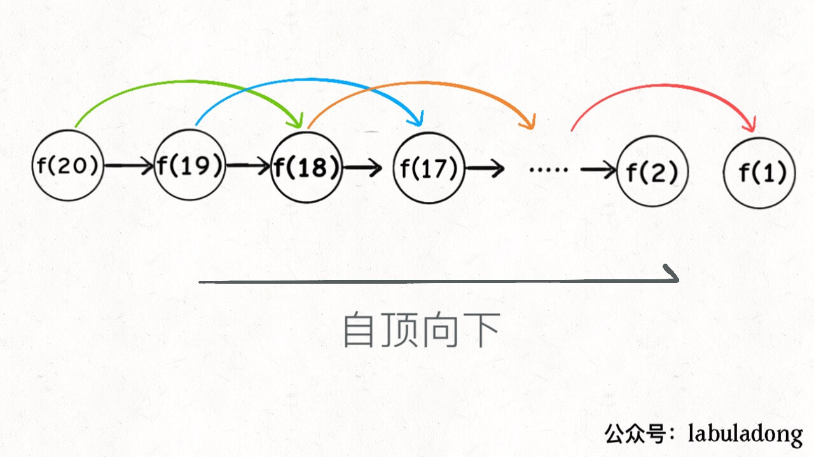
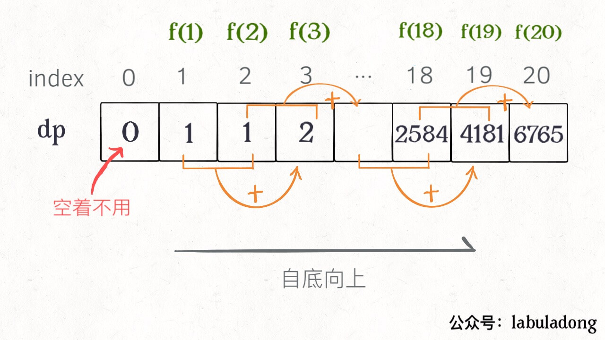

# Demystifying Dynamic Programming

**Translator: [freerambo](https://freerambo.github.io/portfolio/)**

**Author: [labuladong](https://github.com/labuladong)**

**Typically, all the problems that require to maximize or minimize certain quantity or counting problems that say to count the arrangements under certain condition or certain probability problems can be solved by using Dynamic Programming.**。
In fact, Dynamic programming is one optimization method in Operations Research. How ever, it is widely utilized in computer applications. For examples, find **the longest** Ascending subsequence or **the minimum** edit distance, so on and so forth.

Since DP is desired for the optimal value, what will be the core issues there? Given that we need to find an optimal solution, sure thing that we will need to exhaustively list out all possible solutions.
Among that, find the best solution is our target. Hence, it's safe to say **the key of Dynamic Programming is Exhaustion**. So simple. 

 
Is DP so simple? How could so many DP problems I faced are so diffuclt?  

Firstly, DP has it own pattern namely **Overlapping Subproblems**.

If using a brute-force method based on exhaustive search, it will be extremely low efficient since it need a lot of computing power or a lot of time to complete. 
Hence, `Memoization` or `Tabulation` can be used to accelerate this process to avoid unnecessary calculation. Before we study how to think Dynamically for a problem, we need to learn:

As said, all dynamic programming problems must satisfy the overlapping subproblems property and most of the classic dynamic problems also satisfy the **optimal substructure property**. 
Once, we observe these properties in a given problem, be sure that it can be solved using DP.

Though Exhaustion is the key of DP, the problems are varies that exhaustion can not be the solution all the time. 
Only the right state definition and transition you make will lead a proper solution. 

Mentioned above `Overlapping Subproblems`, `Optimal Substracture property` and `state transition` are three key elements in DP. 

We will explain it with detailed example in later chapters. In practical, write state transition equation is the key. That's why many people say DP is difficult. This article we proposed a thinking Frame to facilitate the state equation. 

Deciding `State` -> Defining relation among states -> Formulating `DP equation` -> Finalizing base case

Here gives examples of `Fibonacci Numbers` and `Coin Change` to illustrate the basic principle of DP. 

The first case demos you the overlapping subproblems while second one shows the state equation. 

**These two examples may be simple but clear enough to help you to understand the thinking and beauty of DP**. If you prefer obscure problems I am sure you can find many in historical posts or online.

### Fibonacci Numbers


**1、brute-force recursive**

The following is a recursive program for Fibonacci Numbers:

```cpp
int fib(int N) {
    if (N == 1 || N == 2) return 1;
    return fib(N - 1) + fib(N - 2);
}
```

Needless to say, school teachers always take this example for recursion. We know this code is simple, clean and understandable. 
However, it is very low efficiency. Let's say a recursion tree when `n=20`.

PS: Whenever have recursion problems, recursion tree is a better way to help you analyse the complexity of algorithm and identify the defects if any. 


How to understand this recursion tree? That is to say if need to get `f(20)`, we need to calculate `f(19)` and `f(18)` first. Then we will need to get `f(19)`. Similarly, we need to get subquestions `f(18)` and `f(17)` 
till we traverse to `f(1)` or `f(2)` where we can get the immediate result without any further recursion. 

**How to calculate the time complexity of Recursion？Number of subquestions * the Time needed。**


We can see that the function fib(3) is being called 2 times. If we would have stored the value of fib(3), then instead of computing it again, we could have reused the old stored value. There are following two different ways to store the values so that these values can be reused:

Number of subquestions is the total number of nodes in recursion tree. 
Apparently, total number of nodes is exponential that the number of subquestions is `O(2^n)`.

For a subproblem, There is no loop in this algorithm. Only one increase operation `f(n - 1) + f(n - 2)` which can be done in `O(1)`.
Hence the time complexity of this algorithm is exponential - `O(2^n)`.


If observe carefully, you will find that there are massive duplicate calculations that caused low efficiency. 
i.e. the function `f(18)` is being called 2 times. You can see there are large amount of nodes in subtree under `f(18)`. 
So many duplications in calculation are the reason why it is such low efficient. 
 
It comes to the first nature of DP - **Overlapping Subproblems**. Below gives possible solutions. 

**2、Memoized Recursive solution **

Defined the question is a half done of given problem. As duplicate calculation is causing long time-consuming, we can introduce a `memo` to record the results for each subproblems.
It will fetch the `memo`for a subproblem. If it has the result then directly return the result from `memo` without calculate it again.  

Generally, an array can be used as 'memo'. Also you can use hash table or other data structure who has same thinking.

```cpp
int fib(int N) {
    if (N < 1) return 0;
    // Initialize memo to 0
    vector<int> memo(N + 1, 0);
    // simplest case
    return helper(memo, N);
}
 
int helper(vector<int>& memo, int n) {
    // base case 
    if (n == 1 || n == 2) return 1;
    // calculated case
    if (memo[n] != 0) return memo[n];
    memo[n] = helper(memo, n - 1) + 
                helper(memo, n - 2);
    return memo[n];
}
```

Here illustrates the recursion tree for your understanding of how `memo` works.


In fact, Memorized recursion algorithm is weeding out redundant nodes in recursion tree through `pruning` to minimize the number of nodes. 


What is the time complexity of this memorized recursive algorithm? 
Since no redundant calculation, the subproblems is `f(1)`, `f(2)`, `f(3)` ... `f(20)` which is liner to the input `n = 20`. 
So the number of subproblems is `O(n)`.
As mentioned above, for a subproblem, time complexity is `O(1)`.

Thus, time complexity is `O(n)`. Compared to brute-force exhaustion, I am over the moon. 

Given that memorized program  has same efficiency with recursive DP. 

In fact, there is no much difference between this two. People call Memorized one as `Top down` and `Bottom Up` for DP. 

What is `Top Down`? Please note the recursion tree is in top to down manner from a big problem saying `f(20)`. Menorized program break it down till to `f(1)` and `f(2)` and return the result for each layer. This is the Top Down

What is `Bottom Up `? 
In a reverse way, we can start the calculate from the bottom most problem `f(1)` and `f(2)` till we calculate the result of `f(20)`.
This is the thinking of DP who normally diff from recursion and achieved by loop iteration. 

**3、dp with Tabulation**

Inspired by `Menorized` program, we can separate this `memo` into a table, let's say DP table.  
Wouldn’t it be handy to build a table in bottom up fashion and return the result from last entry. 

```cpp
int fib(int N) {
    vector<int> dp(N + 1, 0);
    // base case
    dp[1] = dp[2] = 1;
    for (int i = 3; i <= N; i++)
        dp[i] = dp[i - 1] + dp[i - 2];
    return dp[N];
}
```



You will find this DP table is quite similar to the `pruning` results but a reverse way of calculation manner. In most cases, Memorized programm and this DP table have same time complexity. 

Here gives the `State transition equation` who describe the problem structure in mathematical. 


为啥叫「状态转移方程」？为了听起来高端。你把 f(n) 想做一个状态 n，这个状态 n 是由状态 n - 1 和状态 n - 2 相加转移而来，这就叫状态转移，仅此而已。
Why call it `state transition equation`?


Let’s think f(n) as state n. The state n is obtained by state n - 1 plus state n - 2, so called state transition equation. 

You will find above solutions embody this state equation in various forms. 
For example, return f(n - 1) + f(n - 2), dp[i] = dp[i - 1] + dp[i - 2] and memorized or DP table operations.  

No need to say, the state equation is the key in solving DP problems. In fact, state equation represnts the brute-force exhaustion. 

**Don't look down the brute-force exhaustion. The most difficult part of DP is define the state equation.**，Optimized by memorization or DP table, exhaustion can achieve a good performance in most case.

If look carefully, you will notice that the Fibonacci Numbers only depend on the previous two states. It is not necessary to have a big DP table to store all states. Only store latest two states will significantly improve the efficiency and recude the space complexity to O(1).


```cpp
int fib(int n) {
    if (n == 2 || n == 1) 
        return 1;
    int prev = 1, curr = 1;
    for (int i = 3; i <= n; i++) {
        int sum = prev + curr;
        prev = curr;
        curr = sum;
    }
    return curr;
}
```

Someone may ask where is the optimal substructure? We will cover it in below sections. 
Strictly speaking, Fibonacci Numbers is not a typically DP problem as it does not have a optimal value. Those examples demonstrate the algorithm design with top-down and bottom-up processes.
Let's look at the second example - `coin change`.

### Coin Change Problem

There are infinite supply of `k` valued coins with `c1, c2 ... ck` respectively. Given a value `amount`, what is the minimum number of coins to get the given amount? If can not get the amount, return `-1`. Method signature is as below. 
```java
// coins - valued coins to be used ，amount is the target value
int coinChange(int[] coins, int amount);
```
For example, `k = 3` with coin values `1, 2, 5`, to get `amount = 11` at least 3 coins are needed as `11 = 5 + 5 + 1`.

What do you think how will computer solve this problem? Apparently, it will exhaustively list all possible solutions and find the minimum number of coins. 

**1、brute-force recursion**

It can be solve with DP since it has the `Optimal Substructure`. **To meet the「Optimal Substructure」, the subprobles must be independent**. 
 

Why we say this coin change problem satisfies the optimal substructure? 
Image that to get the minimum coins for `amount = 11`, if you can get the answer for `amount = 10`. Then you merely add the answer by 1. Cause there is infinite supply and those subproblems are independent. 

Since it is DP problem, we will need to define a right `state transition equation`.

**Define the `state`**，the variables in original problem ans subproblem。Due to infinite supply, the only target state the `amount`。

**Formulate `dp` equation**：For current amount `n`，at least need `dp(n)` coins。

**Decide selection and optimize**，For each state, it decides how to transit the states. Specify to this problem, whatever amount it is, it will choose one coin from `coins` and decrease the target amount.
 
```python
# pseudo-code
def coinChange(coins: List[int], amount: int):
    # define：to get amount - n，at least need dp(n) number of cpoins
    def dp(n):
        # do selection，choose the minimum results
        for coin in coins:
            res = min(res, 1 + dp(n - coin))
        return res
    # target answer - dp(amount)
    return dp(amount)
```

**lastly finalize base case**，if target amount is 0，required coins is 0；when target amount less than 0, return -1：

```python
def coinChange(coins: List[int], amount: int):

    def dp(n):
        # base case
        if n == 0: return 0
        if n < 0: return -1
        # to get minimum value，set initial value to infinite 
        res = float('INF')
        for coin in coins:
            subproblem = dp(n - coin)
            # if no solution for subproblem，skip it
            if subproblem == -1: continue
            res = min(res, 1 + subproblem)

        return res if res != float('INF') else -1
    
    return dp(amount)
```

Till now, state transition equation on basis of brute-force is completed. Above pseudo-code shows the state equation. 


To further eliminate the duplicated subproblems, we give the recursion tree. i.e. `amount = 11, coins = {1,2,5}`


**Time Complexity Analysis：NO. subproblems x Time of subproblem**。


NO. subproblems is exponential - O(n^k). There is a for loop in each subproblem that the time complexity is O(k). Hence total time complexity is also exponential - O(k * n^k). 

**2、Memorized rercusion**

With a little modification, it can be converted to a memorization solution.

```python
def coinChange(coins: List[int], amount: int):
    # Memorization
    memo = dict()
    def dp(n):
        # lookup memo to avoid duplication
        if n in memo: return memo[n]

        if n == 0: return 0
        if n < 0: return -1
        res = float('INF')
        for coin in coins:
            subproblem = dp(n - coin)
            if subproblem == -1: continue
            res = min(res, 1 + subproblem)
        
        # record to Memo
        memo[n] = res if res != float('INF') else -1
        return memo[n]
    
    return dp(amount)
```

Memorized solution completed eliminate the overlaps that number of subproblesm is decreased to O(n). The time complexity for subproblem is still `O(K)`.  So total time complexity becomes O(k * n^k). 

**3、dp 数组的迭代解法**

Definitely, we can apply the dp table a bottom-up based solution to avoid the overlaps. Same to previous definition of `dp` functions.

**`dp[i] = x` denotes when target amount is `i`，at least requires `x` coins**。

```cpp
int coinChange(vector<int>& coins, int amount) {
    // array size is amount + 1，initial value is amount + 1
    vector<int> dp(amount + 1, amount + 1);
    // base case
    dp[0] = 0;
    for (int i = 0; i < dp.size(); i++) {
        // inner for loop to get minimum value for all subproblems + 1
        for (int coin : coins) {
            // Skip if no solution
            if (i - coin < 0) continue;
            dp[i] = min(dp[i], 1 + dp[i - coin]);
        }
    }
    return (dp[amount] == amount + 1) ? -1 : dp[amount];
}
```


PS: Why initialize `dp` array with value `amount + 1` cause that at most `amount` number of coins (valued 1) to make value `amount`. 
Hence initial value `amount + 1`is equivalent to infinity for this problem and make it easier to get the minimum value.       

### Summary

Start with the Fibonacci Numbers, we explained two solutions of memorized and dp table to optimize the recursion tree. These two solutions have same nature but different approach from top-down and bottom-up.  

The second coin change problem illustrated the how to define the `state transition expresion` for brute-force sulution with optimized recursion tree to eliminate the overlaps. 

Big applause to you if reach here though you are not familiar with DP. I believe you have mastered the skills for DP problems.
 

**No siver bullet in computer world. Exhaustion is the only key.** Algorithm design does nothing but find a smart way for Exhaustion.

Formulating State equation is the way to solve the brute-force exhaustion problem. 
This is difficult cause exhaustion will require recursion in implementation and secondly some problems are complex themselves to be exhaustively resolved. 

Memorization and DP table are the smart solutions to exhaustion.
The idea that sacrificing space to improve efficiency is the only way to reduce the time complexity. Isn't it? 

  
**Make algorithm clear！Welcome to follow Wechat official account `labuladong` to obtain more comprehensive articles**：

