# Editing Distance

**Translator: [Master-cai](https://github.com/Master-cai)**

**Author: [labuladong](https://github.com/labuladong)**

few days ago, I saw an interview paper of Tencent. In this paper, most of the algorithm problems are Dynamic programming. The last question is that writing a function to calculate the shortest editing Distance. Today I wrote an article specifically to discuss this problem.

I personally like this problem because it looks very hard, the solution is Surprisingly simple and beautiful and it`s a rare algorithm which is not very useful.(yech, I recognized that many algorithm problems are not very useful.)Following is the problem:

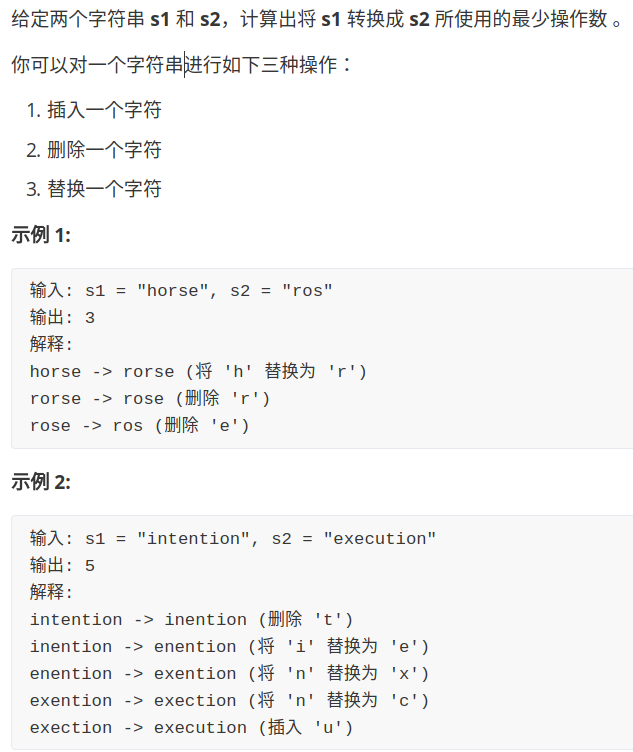

Why I say this problem is hard? Obviously, it`s just hard, making people Helpless and frightened.

And why I say this problem is useful? Because days ago I used the algorithm in my daily life. I had a article in my ‎Wechat Official Account and I  wrote some words out of place by mistake. So I decided to modify this part to make the logic suitable. However, the Wechat Official Account article can only be modified 20 words at most, and it only supports addition, deletion and replacement(exactly same as the editing distance problem.) So I used the algorithm to find a best way to solve the problem in just 16 steps.

Another advanced example is that the edit distance can be used to measure the similarity of two DNA sequences. The DNA sequence is a sequence included of A, G, C and T, which is similar to a string. The less editing distance is, The more similar the two DNA are. Maybe the owner of these DNAs were ancient relatives.

Let's get to the point, I will explain you how to edit the distance in detail, and I hope you could obtain something fruitful.


### 1. train of thought

The editing distance is a problem that give us two strings `s1` and `s2` with only three operations and let\`s change `s1` to `s2`  in least steps. The first thing to be sure of is that the result of `s1` to `s2` and `s2` to `s1` is the same. So we will use `s1` to `s2` as an example.

Mentioned in the early paper "The longest common subsequence",  **I said that to solve the dynamic programming problem of two strings, We normally use two pointers `i`, `j` to point to the end of the two strings, and then go forward step by step to reduce the size of the problem.**

Assuming that the two strings are "rad" and "apple", in order to change `s1` to` s2`, the algorithm works like this:

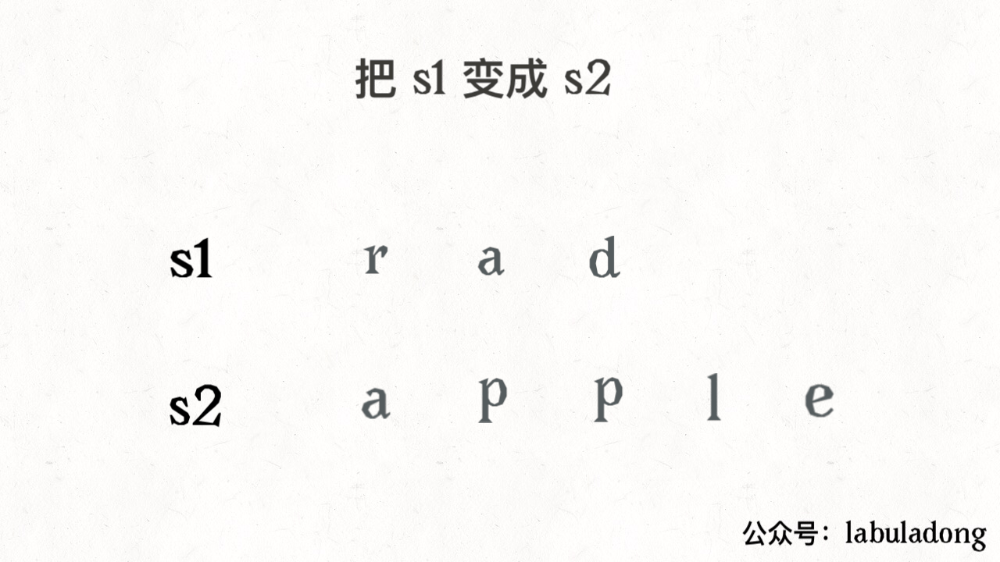
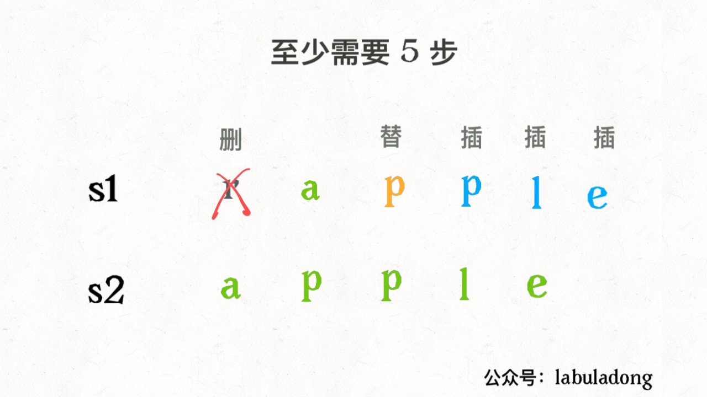

Remember this gif in order to solve the editing distance problem. The key is how to make 

the right operation which I will discuss later.

According to the above gif, we can figure out that there are not only three operations, in fact there is the fourth operation which is skip. For example:

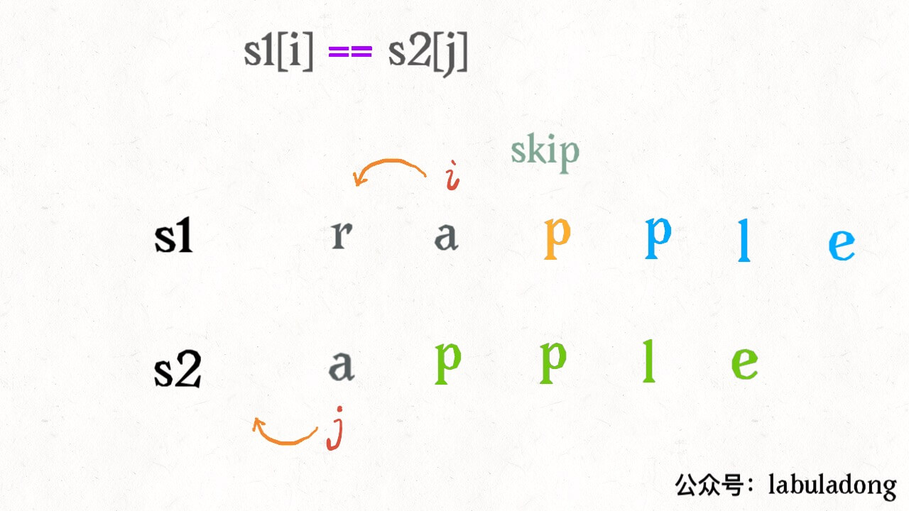

As the two strings are same, obviously there should be no operation to minimize the distance. Just move `i`, `j`. 

Another simple situation is when `j` has finished `s2`, if `i` has not finished `s1`, then you can only delete `s1` to make them the same. For example:


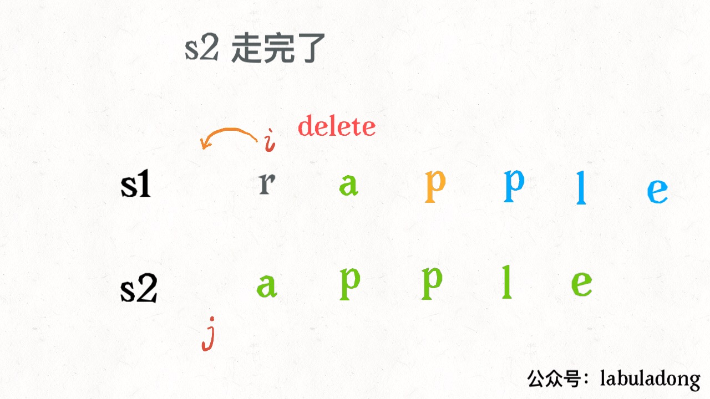

Similarly, if `i` finished `s1` and `j` has not finished `s2`, you can only insert all the remaining characters of `s2` into `s1` by inserting. As you see, the two cases are the **base case** of the algorithm.

Let\`s look at how to change your ideas into code. Sit tight, it's time to go.

### 2. code in detail

First we sort out our ideas:

The base case is when `i` finished `s1` or `j` finished `s2`, we can return the remaining length of another string directly.

For each pair characters, `s1[i]` and `s2[j]`, there are four operations:

```python
if s1[i] == s2[j]:
    skip
    i, j move forward
else:
    chose：
        insert
        delete
        replace
```

With this framework, the problem has been solved. Maybe you will ask, how to chose the "three choices"? It\`s very simple, try it all, and chose the smallest one. we need some recursive skills here.Look at the code:

```python
def minDistance(s1, s2) -> int:

    def dp(i, j):
        # base case
        if i == -1: return j + 1
        if j == -1: return i + 1
        
        if s1[i] == s2[j]:
            return dp(i - 1, j - 1)  # skip
        else:
            return min(
                dp(i, j - 1) + 1,    # insert
                dp(i - 1, j) + 1,    # delete
                dp(i - 1, j - 1) + 1 # replace
            )
    
    # i，j initialize to the last index
    return dp(len(s1) - 1, len(s2) - 1)
```

Let\`s explain this recursive code in detail. There is no need to explain the base case, so I mainly explain the recursive part.

It is said that recursive code is very interpretable. It does make sense. As long as you understand the definition of a function, you can clearly understand the logic of the algorithm. The function dp(i, j) is defined like this:

```python
def dp(i, j) -> int
# return the least editing distance s1[0..i] and s2[0..j]
```

**Remember this definition**, let\`s look at the code:

```python
if s1[i] == s2[j]:
    return dp(i - 1, j - 1)  # skip
# explain：
# already the same, no need any operation
# the least editing distance of s1[0..i] and s2[0..j] equals
# the least distance of s1[0..i-1] 和 s2[0..j-1]
# It means that dp(i, j) equals dp(i-1, j-1)
```

if `s1[i]！=s2[j]`, we should recurse the three operations which needs a bit of thing:

```python
dp(i, j - 1) + 1,    # insert
# explain：
# I Directly insert a character same as s2[j] at s1[i]
# then s2[j] are matched，move forward j，and continue compareed with i
# Don`t forget to add one to the operation number
```

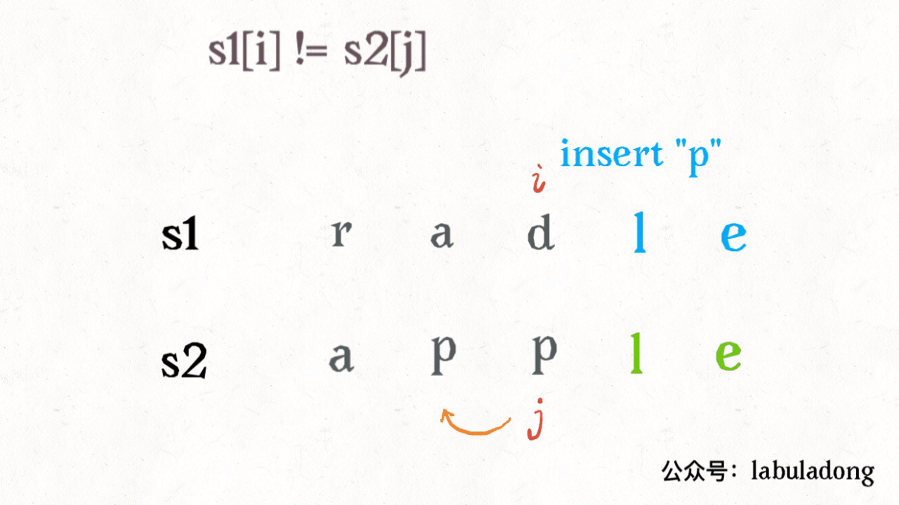

```python
dp(i - 1, j) + 1,    # delete
# explain：
# I directly delete s[i]
# move forward i，continue to compared with j
# add one to the operation number
```

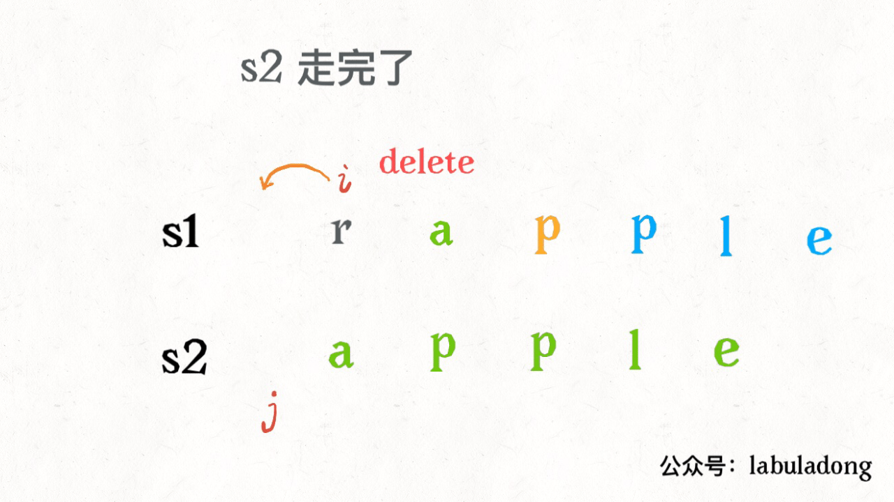

```python
dp(i - 1, j - 1) + 1 # replace
# explain：
# I directly replace s1[i] with s2[j], then they are matched
# move forward i，j and continue to compare
# add one to operation number
```

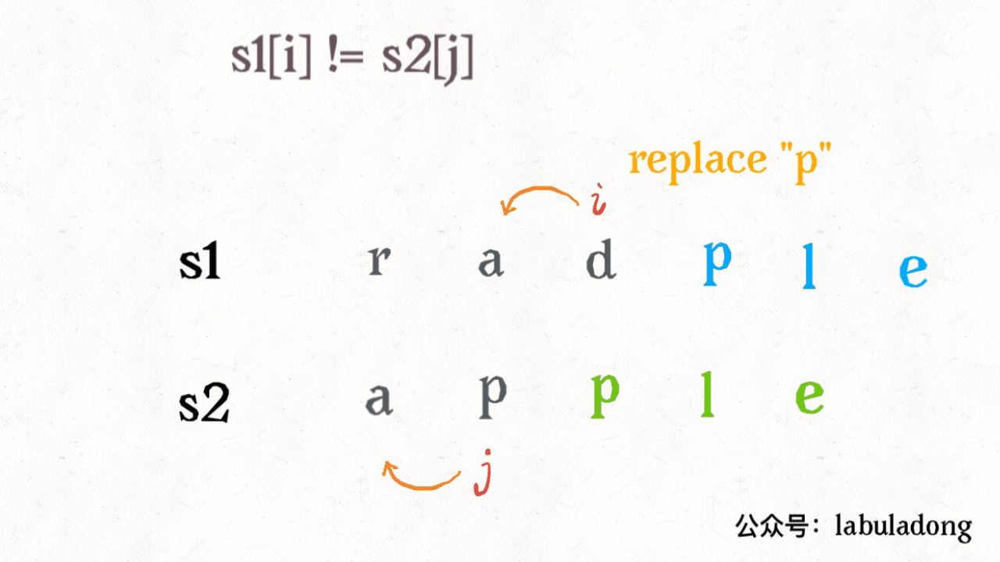

Now, you should fully understand this short and clever code. Another small problem is that this is a violent solution. There are many overlapping subproblems, which should to be optimized by dynamic programming techniques.

**How can we see the overlapping subproblems at a glance?**  As mentioned in the previous article "Regular Expressions for Dynamic Programming", we need to abstract the recursive framework of the algorithm in this article:

```python
def dp(i, j):
    dp(i - 1, j - 1) #1
    dp(i, j - 1)     #2
    dp(i - 1, j)     #3
```

For the subproblem `dp(i-1, j-1)`, how can we get it from the original question `dp(i, j)`? Once we found a repetitive path, it means that there is a huge number of repetitive paths, which is the overlapping subproblem. For example: `dp(i, j)-> #1` and `dp(i, j)->#2->#3`.

### 3. Optimized by Dynamic programming

For the overlapping subproblems, we introduced in the previous article "Detailed Explanation of Dynamic Programming" in detailed. The optimization is nothing more than a memo or a DP table.

The memo is easy to append, just modified the original code slightly.

```python
def minDistance(s1, s2) -> int:

    memo = dict() # memo
    def dp(i, j):
        if (i, j) in memo: 
            return memo[(i, j)]
        ...
        
        if s1[i] == s2[j]:
            memo[(i, j)] = ...  
        else:
            memo[(i, j)] = ...
        return memo[(i, j)]
    
    return dp(len(s1) - 1, len(s2) - 1)
```

**We mainly explain the DP table solution.**

First, we declare the meaning of the dp array. The dp array is a two-dimensional array, which looks like this:

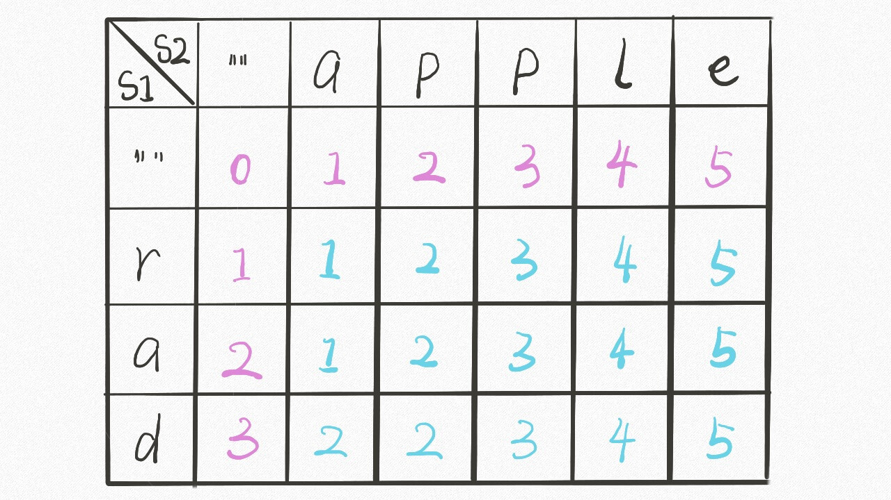

With the foundation of the previous recursive solution,  it\`s easy to understand.               `dp [..][0]` and `dp [0][..]` correspond to the base case. The meaning of `dp [i][j]` is similar to the previous dp function:

```python
def dp(i, j) -> int
# return the least editing distance of s1[0..i] and s2[0..j]

dp[i-1][j-1]
# storage the least editing distance of s1[0..i] and s2[0..j]
```

The base case of the dp function is that `i, j` is equal to -1. However the array index is at least 0, the dp array is offset by one position.

Since the dp array has the same meaning as the recursive dp function, you can directly apply the previous ideas to write code. **The only difference is that the DP table is solved from the bottom to up, and the recursive solution is solved from the top to down**:

```java
int minDistance(String s1, String s2) {
    int m = s1.length(), n = s2.length();
    int[][] dp = new int[m + 1][n + 1];
    // base case 
    for (int i = 1; i <= m; i++)
        dp[i][0] = i;
    for (int j = 1; j <= n; j++)
        dp[0][j] = j;
    // from the bottom to up
    for (int i = 1; i <= m; i++)
        for (int j = 1; j <= n; j++)
            if (s1.charAt(i-1) == s2.charAt(j-1))
                dp[i][j] = dp[i - 1][j - 1];
            else               
                dp[i][j] = min(
                    dp[i - 1][j] + 1,
                    dp[i][j - 1] + 1,
                    dp[i-1][j-1] + 1
                );
    // storage the least editing distance of s1 and s2
    return dp[m][n];
}

int min(int a, int b, int c) {
    return Math.min(a, Math.min(b, c));
}
```

### 4. Extension 

Generally speaking, when dealing with the dynamic programming of two strings, we just follow the ideas of this article, making the DP table. Why? Because it\`s easy to find out the relationship of the state transitions, such as the DP table of the edit distance:

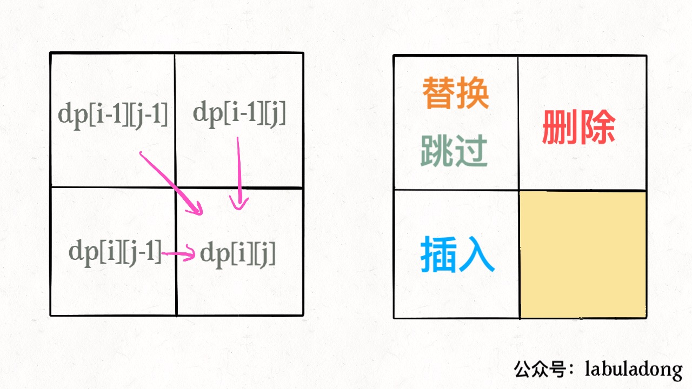

There is another detail: since every `dp[i][j]` is only related to the three status, the space complexity can be reduced to $O(min(M, N))$ (M, N is the length of the two strings). It\`s not very difficult but the code is harder to read. You can try to optimize it by yourself.

Maybe you will also ask, **As we only found the minimum editing distance, how can we know the every step?** In the example of modifying the article you mentioned earlier, only a editing distance is definitely not enough. You must know how to modify it.

Actually, it\`s very simple, just slightly modified the code and add additional information to the dp array:

```java
// int[][] dp;
Node[][] dp;

class Node {
    int val;
    int choice;
    // 0 skip
    // 1 insert
    // 2 delete
    // 3 replace
}
```

The `val` attribute is the value of the previous dp array, and the` choice` attribute represents the operation. When making the best choice, record the operation and then infer the specific operation from the result.

Our final result is  `dp [m] [n]`, where `val` holds the minimum edit distance, and` choice` holds the last operation, such as the insert operation, then you can move one space to the left:

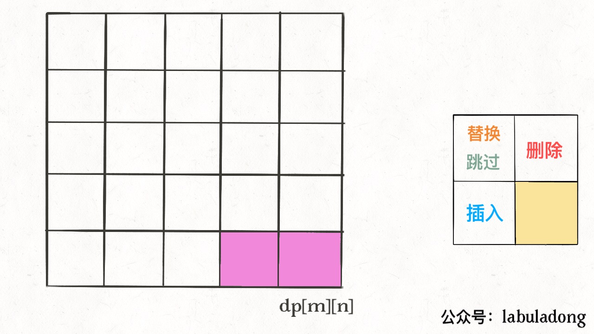

Repeat this process, you can return to the starting point `dp [0] [0]` step by step to form a path. Editing according to the operations on this path is the best solution.

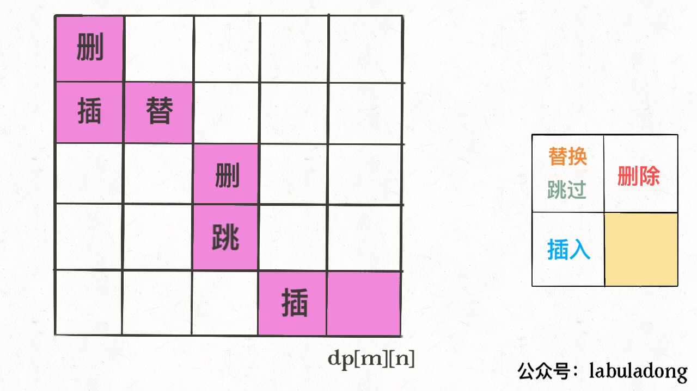

The above is the entire content of the edit distance algorithm. 
