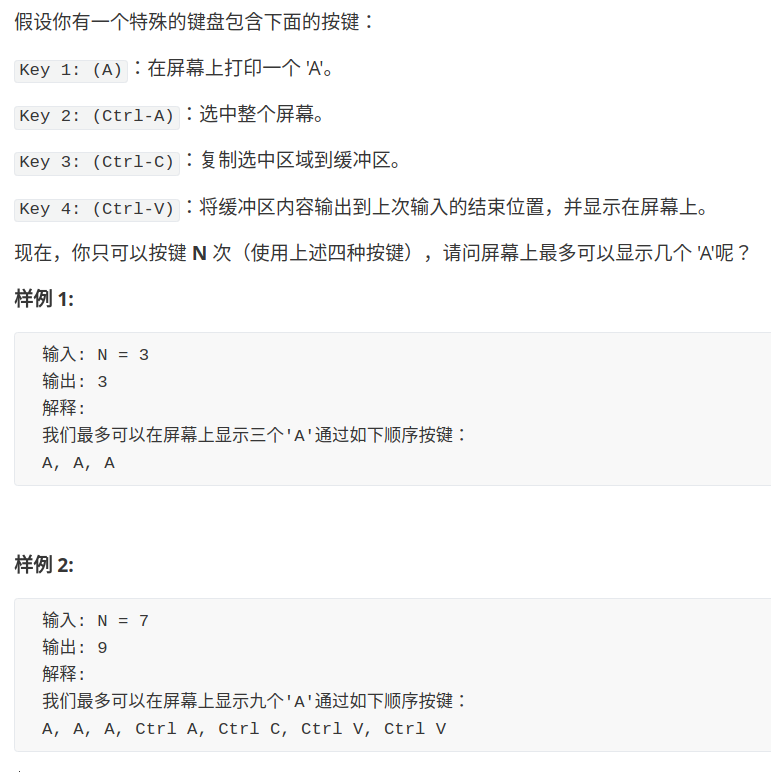
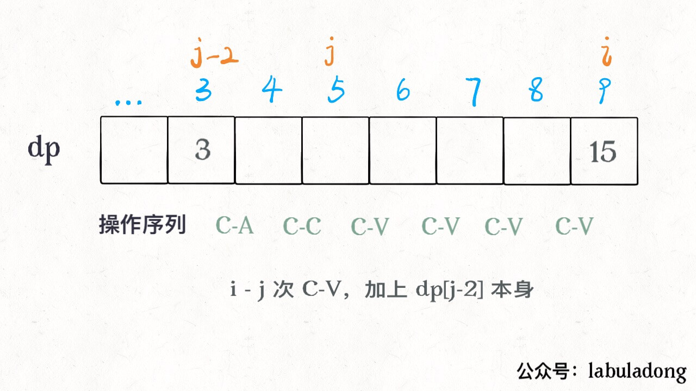

# 4 Keys Keyboard

**Translator: [upbin](https://github.com/upbin)**

**Author: [labuladong](https://github.com/labuladong)**

The problem of *4 keys keyboard* is very interesting and can broaden one's horizon.  This problem can make you obviously feel that different definitions of dp arrays need completely different logic to think about, and this logic can produce completely different solutions.

We can't wait to solve this problem:



After reading the question, think about how to get the maximum number of characters 'A' after typing `N` times on the keyboard? We are more familiar with trying questions using enumeration. Whenever we want to press the keyboard (and can press it), there are `4 buttons` for us to choose from, we can enumerate every possible operation It is obvious that this is a dynamic programming problem.

### Discuss the first method

This kind of problem-solving idea is easy to understand, but the efficiency is not high. We follow the routine directly: **for dynamic programming problems, we must first understand which are [ states ] and which are [ choices ].**

Specific to this problem, what **choices** are obvious for each keystroke: four types are the **4** keys mentioned in the title, which are `A`, `Ctrl-A`, `Ctrl-C`, and `Ctrl-V`.

Next, let's think about what are the **states** of this problem? **In other words, what information do we need to know to break down the original problem into smaller subproblems?**

Now you think about it, Is it correct for me to define the status of this problem as follows?

-   The first state is the remaining number of times the key can be pressed, we use `n` to represent it.
-   The second state is the number of characters 'A' on the current screen, we use `a_num`.
-   The third state is the number of characters 'A' still in the clipboard, represented by `copy`.

By defining **state** in this way, we can know the *base case*: when the number of remaining `n` is `0`, `a_num` is the answer we want.

Combining the four **choices** just mentioned, we can express these kinds of choices through state transitions:

```python
dp(n - 1, a_num + 1, copy)        # [ A ]
# comment: Press the 'A' key to add a character to the screen.
# Subtract 1 at the same time the number of times you are allowed to press the keyboard.

dp(n - 1, a_num + copy, copy)     # [Ctrl-V]
# comment: Press C-V to paste, the characters in the clipboard are added to the screen.
# Subtract 1 at the same time the number of times you are allowed to press the keyboard.

dp(n - 2, a_num, a_num)           # [Ctrl-A] & [Ctrl-C]
# comment: Ctrl + A and Ctrl + C can obviously be used together.
# The number of 'A' in the clipboard becomes the number of 'A' on the screen.
# Subtract 2 at the same time the number of times you are allowed to press the keyboard.
```

By describing this, we can see that the scale of the problem `n` is constantly decreasing, and finally we can reach the *base case* of `n == 0`. So this idea is correct: (Do you think so?)

```python
def maxA(N: int) -> int:
    
    # It can be verified that for the initial (n, a_num, copy) state,
    # there can be at most dp (n, a_num, copy) 'A' on the screen.
    def dp(n, a_num, copy):
        # base case
        if n <= 0: return a_num;
        # Let ’s try all three options and choose the largest one.
        return max(
                dp(n - 1, a_num + 1, copy),    # [ A ]
                dp(n - 1, a_num + copy, copy), # [Ctrl-V]
                dp(n - 2, a_num, a_num)        # [Ctrl-A] & [Ctrl-C]
            )

    # You can press the key n times, then there is no 'A' in the screen
    # and the clipboard.
    return dp(N, 0, 0)
```

This solution should be well understood because it is semantically explicit.

Below we continue to follow the routine and use <u>memorized search</u> to eliminate those overlapping sub-problems:

```python
def maxA(N: int) -> int:
    # memorandum
    memo = dict()
    def dp(n, a_num, copy):
        if n <= 0: return a_num;
        # Avoid overlapping subproblems being recalculated
        if (n, a_num, copy) in memo:
            return memo[(n, a_num, copy)]

        memo[(n, a_num, copy)] = max(
                # These options are still the same
            )
        return memo[(n, a_num, copy)]

    return dp(N, 0, 0)
```

After we optimized our code in this way, although the sub-problem was repeatedly solved, the number of searches was still very large (*if we submit to LeetCode it will definitely time out*).

Now let's try to analyze the time complexity of the algorithm just now. The challenge is that this analysis is not easy. No matter what it is, now we write this *dp function* as a *dp array*:

```c++
dp[n][a_num][copy]
// The total number of states (spatial complexity) of this problem
// is the volume of this three-dimensional array.
```

We know that the maximum value of the variable `n` is `N`, but it is difficult to calculate the maximum number of `a_num` and `copy`. The lowest complexity is *O(N^3)​*. So the algorithm just now is not good, the complexity is too high, and it can no longer be optimized.

The more embarrassing thing is that this also shows that I used to define **state** as it is not very good. Let's change the idea of defining this dp problem.

### Exploration of the second approach 

Next, our thinking is a little more complicated, but it is very efficient.

Continue to follow our routine, **choice** has been defined before, or the `4`. But this time we only need to define **a state**, which is the remaining number of available keyboard presses `n`.

This algorithm is based on the following fact. There must be only two cases of the key sequence corresponding to the optimal answer:

-   Either keep pressing A: `A`, ` A`, ... , `A` (more when `N` is smaller).
-   Either this is the form: `A`, `A`, ..., `Ctrl-A`, `Ctrl-C`, `Ctrl-V`, `Ctrl-V`, ..., `Ctrl-V` (mostly when `N` is larger). *(Here you can find some mathematical rules, you can study if you are interested)*

Because when the number of characters to be printed is relatively small (`N` is small), "`Ctrl-A`, `Ctrl-C`, `Ctrl-V`" consumes a relatively high number of operations, so we might as well keep pressing `A`. When `N` is relatively large, the gain of `Ctrl-V` in the later period is definitely relatively large. In this case, the entire operation sequence is roughly like this: at the beginning, press several 'A's, then `Ctrl-A`, `Ctrl-C`, and finally several `Ctrl-V`, and then continue `Ctrl-A -> Ctrl-C -> Ctrl-V` Such a loop operation.

In other words, the last keystroke was either `A` or `Ctrl-V`. As long as we are clear on this, we can design the algorithm through these **two situations**:

```java
int[] dp = new int[N + 1];
// Definition: dp[i] indicates the maximum number of 'A' that can be displayed after the // first operation.
for (int i = 0; i <= N; i++) 
    dp[i] = max(
    		// Press [ A ] this time,
        	// This time press [Ctrl-V].
        )
```

Think about it. For the case of [pressing the `A` key], it is actually a new 'A' printed on the screen of **state i-1**, so it is easy to get the result:

```java
// If we press the [ A ] key, it's just one more 'A' than the last time.
dp[i] = dp[i - 1] + 1;
```

However, if we want to press `Ctrl-V`, we also need to consider where we did `Ctrl-A` and `Ctrl-C`.

Earlier we said that the optimal sequence of operations must be `Ctrl-A`, `Ctrl-C` followed by several `Ctrl-V`, so we use a variable `j` as the starting point for these `Ctrl-V` operations. Then the two operations before `j` should be `Ctrl-A` and `Ctrl-C`:

```java
public int maxA(int N) {
    int[] dp = new int[N + 1];
    dp[0] = 0;
    for (int i = 1; i <= N; i++) {
        // press [ A ]
        dp[i] = dp[i - 1] + 1;
        for (int j = 2; j < i; j++) {
            // [Ctrl-A] & [Ctrl-C] -> dp[j-2], Paste i-j times
            // There are { dp[j-2] * (i-j+1) }number of 'A' on the screen
            dp[i] = Math.max(dp[i], dp[j - 2] * (i - j + 1));
        }
    }
    // What is the maximum number of 'A' after N keystrokes?
    return dp[N];
}
```

The `j` variable `minus 2` is used to save the number of operations available to `Ctrl-A`, `Ctrl-C`. See the description picture to understand:



We have just completed this algorithm. The time complexity of the algorithm is *O(N^2)​* and the space complexity is ​*O(N)*​, so this solution seems to be very efficient.

### Review our algorithmic ideas

Dynamic programming is difficult to find the state transition. The different definitions we set will produce different state transition logic. Although we can all get the correct results in the end, the efficiency of the program may have amazing differences.

Let's review the method we tried for the first time. Although the overlapping sub-problem has been eliminated, the efficiency of the program is still low, but where is the low? Let's abstract the recursive framework to find out:

```python
def dp(n, a_num, copy):
    dp(n - 1, a_num + 1, copy),    # [ A ]
    dp(n - 1, a_num + copy, copy), # [Ctrl-V]
    dp(n - 2, a_num, a_num)        # [Ctrl-A] & [Ctrl-C]
```

Let's analyze the logic of this exhaustive scheme. Obviously, it is possible to have such a sequence of operations `Ctrl-A`, `Ctrl+C`, `Ctrl-A`, `Ctrl-C`, ... , or `Ctrl-V`, `Ctrl-V`, ... . However, the result of the operation sequence produced by this method is not optimal, even if we have not figured out a way to circumvent these situations, thereby adding a lot of calculations of unnecessary sub-problems.

After we review the second solution, we only need to think a little bit before we can think that the operation sequence of the optimal answer should be this form: `A`, `A`, ..., `Ctrl-A`, `Ctrl-C`, `Ctrl-V`, `Ctrl-V`, ..., `Ctrl-V`.

Based on the findings we found, we redefined <u>state</u> and re-searched for <u>state transition</u>, which logically reduced the number of invalid sub-problems, and ultimately optimized the program's operating efficiency.

