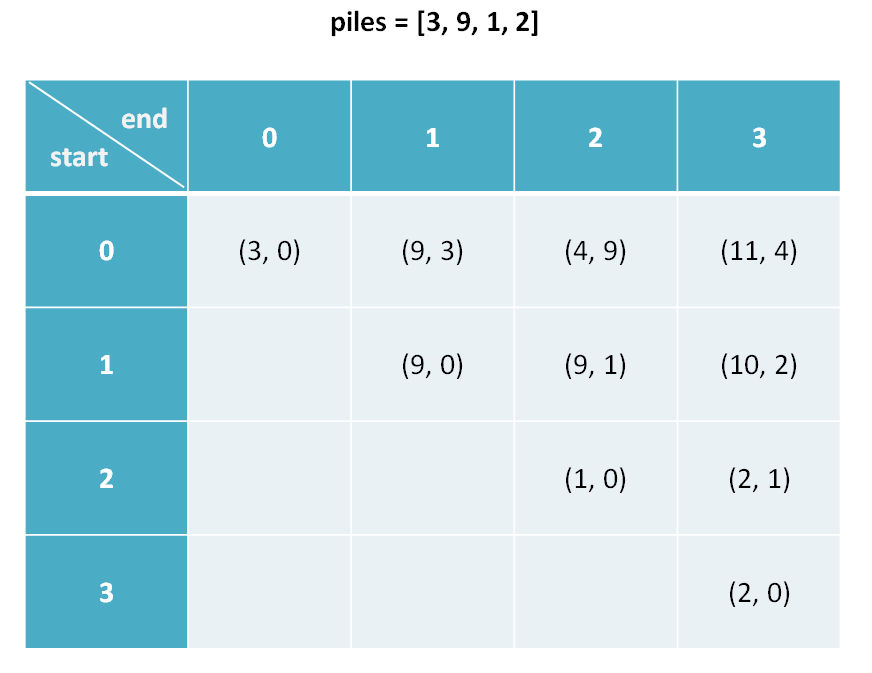
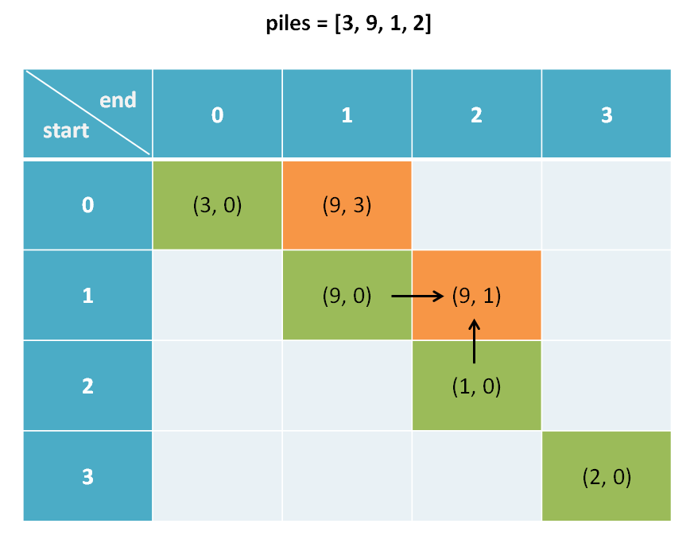
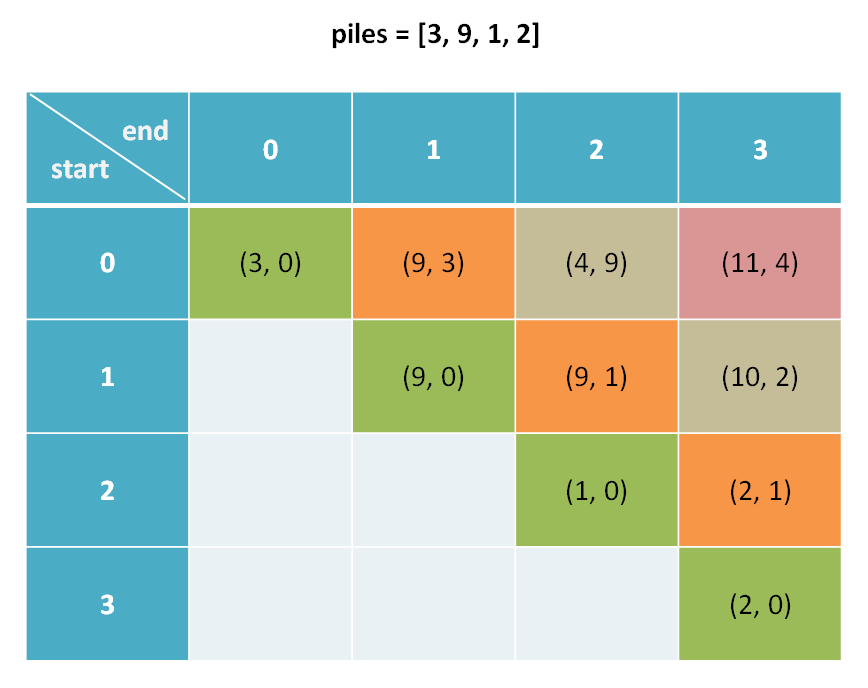

# Game Problems In Dynamic Programming 

**Translator: [wadegrc](https://github.com/wadegrc)**

**Author: [labuladong](https://github.com/labuladong)**

In the last article,we discussed a fun「stone game 」in [several puzzles](../高频面试系列/一行代码解决的智力题.md),By the constraints 
of the problem, the game is first to win.But intelligence questions are always intelligence questions,Real algorithmic problems are 
not solved by cutting corners. So this paper is going to talk about the stone game and assuming that both of these guys are smart enough, who's going to win in the end how do you solve this problem with dynamic programming.
 
Game problems follow a similar pattern,The core idea is to use tuples to store the game results of two people on the basis of two-dimensional dp array.Once you're mastered this technique,if someone asks you a similar question again,you can take it in stride.

We changed the stone game to be more general:

There is a pile of stones in front of you and your friends,it's represented by an array of piles,and piles[i] is how many stones are there in the ith heap.You take turns with the stones,one pile at a time,but you can only take the left or the right piles.After all the stones have been taken away, the last one who has more stones wins.

The heap number of stones can be any positive integer,and the total number of stones can be any positive integer,That would break the situation in which one must win first.Let's say I have three piles of rocks: `piles = [1, 100, 3]`,Whether it's a 1or a 3,the 100 that's going to make the difference is going to be taken away by the back hand,and the back hand is going to win.

**Assuming they are both smart**,design an algorithm that returns the difference between the final score of the first hand and the last hand,As in the example above,the first hand gets 4 points,the second hand gets 100 points, and you should return -96.


With this design,this problem is a Hard dynamic programming problem.**The difficuty with gaming is that two people have to take turns choosing,and they're both smart.How do we program?**

It's the approach that's been emphasized many times,The first step is to define the array,and then,like the stock buying and selling 
series,once you find the「status」and the「selection」,and then it's easy.

### 1.Define the meaning of the dp array:

Defining what a dp array means is very tachnical,The dp array of the same problem can be defined in several ways.Different definitions
lead to different state transition equations,But as long as there's no logic problem,you end up with the same answer.I recommend that you don't get caught up in what looks like a great short technique,and that you end up with something that's a little bit more stable, something that's the most interpretable, and something that's the easiest to generalize,This paper gives a general design framework of game problem.

Before we introduce what a dp array means,let's take a look at what it ultimately looks like:



As explained below,tupels are considered to be a calss containing first and second atrributes,And to save space,these two atrributes are abbreviated to fir and sec.As shown in the figure above,we think `dp[1][3].fir = 10`，`dp[0][1].sec = 3`.

Start by answering a few questions that readers might ask:

This is a two-dimensional dp table that stores tuples.How do you represent that?Half of this array is useless,How do you optimize it?Very simple, do not care,first to think out the way to solve the problem again.

**Here's an explanation of what a dp array means:**

```python
dp[i][j].fir represents the highest score the first hand can get for this section of the pile piles[i...j]
dp[i][j].sec represents the highest score the back hand can get for this section of the pile piles[i...j]

Just to give you an example,Assuming piles = [3, 9, 1, 2],The inedx starts at 0
dp[0][1].fir = 9 means:Facing the pile of stones [3, 9],The first player eventually gets 9 points.
dp[1][3].sec = 2 means:Facing the pile of stones [9, 1, 2],The second player eventually gets 2 points.
```

The answer we want is the difference between the final score of the first hand and the final score of the second hand,By thisdefinition, that is $dp[0][n-1].fir - dp[0][n-1].sec$ That is,facing the whole piles,the difference between the best score of the first hand and the best score of the second hand.

### 2.state transition equation:

It's easy to write the transition equation,The first step is to find all the states and the choices you can make for each state,and then pick the best.

From the previous definition of the dp array,**there are obviously three states:the starting index i,the ending index j,and the person whose turn it is.**

```python
dp[i][j][fir or sec]
range：
0 <= i < piles.length
i <= j < piles.length
```

For each state of the problem,**there are two choices you can make :Choose the pile to the left,or the pile to the right**.We can do all the states like this :

```python
n = piles.length
for 0 <= i < n:
    for j <= i < n:
        for who in {fir, sec}:
            dp[i][j][who] = max(left, right)

```

The pseudocode above is a rough framework for dynamic programming,and there is a similar pseudocode in the stock series problem.The difficulty of this problem is that two people choose alternately,that is to say,the choice of the first hand has effect on the second hand,how can we express this?

According to our definition of dp array,it is easy to solve this difficulty and **write down the state transition equation**:

```python
dp[i][j].fir = max(piles[i] + dp[i+1][j].sec, piles[j] + dp[i][j-1].sec)
dp[i][j].fir = max(    Select the rock pile on the far left     ,     Select the rock pile on the far right     )
# explanation：I,as a first hand,faced piles[i...j],I had two choices：
# If I choose the pile of rocks on the far left,and  I will face piles[i+1...j]
# But when it came to the other side,I became the back hand.
# If I choose the pile of rocks on the far right,and  I will face piles[i...j-1]
# But when it came to the other side,I became the back hand.

if the first hand select the left:
    dp[i][j].sec = dp[i+1][j].fir
if the first hand select the right:
    dp[i][j].sec = dp[i][j-1].fir
# explanation：I,as a back hand ,have to wait for the first hand to choose,There are two condition:
#  If the first hand choose the pile of rocks on the far left,I will face piles[i+1...j]
# then it's my turn, and i become the first hand.
# If the first hand choose the pile of rocks on the far right,I will face piles[i...j-1]
# then it's my turn, and i become the first hand.
```

According to the definition of the dp array, we can also find the **base case**,which is the simplest case:

```python
dp[i][j].fir = piles[i]
dp[i][j].sec = 0
range: 0 <= i == j < n
# explanation：i==j which means just a bunch of rocks piles[i] in the front of us
# So obviously the first hand can get piles[i],
# there are no stones int the back,so his score is 0
```


One thing to note here is that we found that the base case is tilted in the table,and we need dp[i+1][j] and dp[i][j-1] to compute dp[i][j]: 



So the algorithm can not simply traverse the dp array row by row,but **traverse the array diagonally**.



To be honest,traversing a two-dimensional array diagonally is easier said than done.


### 3.code implementation

How do you implement this fir and sec tuple?You can either use python,with its own tuple type,or use the c++pair container,or use a three-dimensional array,the last dimension being the tuple,or we can write a pair class ourselves.

```java
class Pair {
    int fir, sec;
    Pair(int fir, int sec) {
        this.fir = fir;
        this.sec = sec;
    }
}
```

Then we can directly translate our state transition equation into code,and we can pay attention to technique of traversing through array diagonally:

```java
/* Returns the difference between the last first hand and last hand */
int stoneGame(int[] piles) {
    int n = piles.length;
    //Initializes the dp array
    Pair[][] dp = new Pair[n][n];
    for (int i = 0; i < n; i++) 
        for (int j = i; j < n; j++)
            dp[i][j] = new Pair(0, 0);
    // base case
    for (int i = 0; i < n; i++) {
        dp[i][i].fir = piles[i];
        dp[i][i].sec = 0;
    }
    // traverse the array diagonally
    for (int l = 2; l <= n; l++) {
        for (int i = 0; i <= n - l; i++) {
            int j = l + i - 1;
            // The first hand select the left- or right-most pile.
            int left = piles[i] + dp[i+1][j].sec;
            int right = piles[j] + dp[i][j-1].sec;
            // Refer to the state transition equation.
            if (left > right) {
                dp[i][j].fir = left;
                dp[i][j].sec = dp[i+1][j].fir;
            } else {
                dp[i][j].fir = right;
                dp[i][j].sec = dp[i][j-1].fir;
            }
        }
    }
    Pair res = dp[0][n-1];
    return res.fir - res.sec;
}
```

Dynamic programming ,the most important is to understand the state transition equation,based on the previous detailed explanation,the reader should be able to clearly understand the meaning of this large piece of code.

And notice that the calculation of  'dp[i][j]' only depends on the left and the bottom elements,so there must be room for optimization, for one-dimensional dp,But one-dimensional dp is a little bit more complicated,it's less interpretable,so you don't have to waste time trying to understand it.

### 4.summary:

This paper presents a dynamic programming method to solve the game problem. The premise of game problems is usually between two smart people. The common way to describe such games is a one-dimensional array of dp, in which tuples represent the optimal decision of two people.

The reason for this design is that when the first hand makes a choice, it becomes the second hand, and when the second hand makes a choice, it becomes the first hand. This role reversal allows us to reuse the previous results, typical dynamic programming flags.


Those of you who have read this should understand how algorithms solve game problems. Learning algorithms, must pay attention to the template framework of the algorithm,rather than some seemingly awesome ideas, do not bend to write an optimal solution.Don't be afraid to use more space,don't try optimization too early, and don't be afraid of multidimensional arrays.A dp array is a way to store information and avoid double counting.


I hope this article has been helpful.
