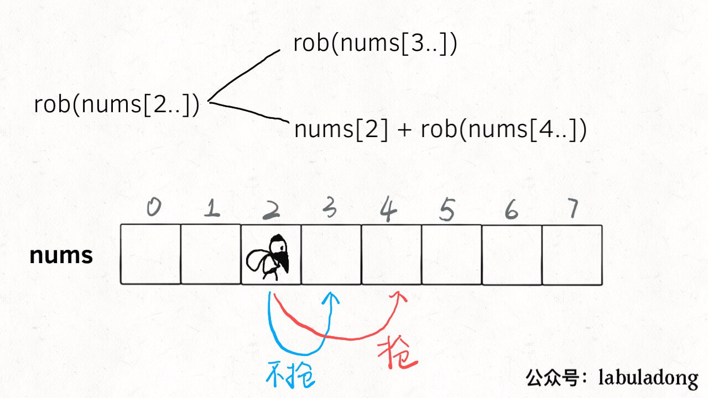

# House Robber series

**Translator**: [cooker](https://github.com/xiaochuhub)

**Author**: [labuladong](https://github.com/labuladong)

I find that this series of problems are highly praised. They are representative and skillful dynamic planning problems.
Today I will introduce an generalized method to solve all of these problems.

House robber series includes three problems. The difficulty design is very reasonable and progressive.
The first ([house robber](https://leetcode.com/problems/house-robber/)) is a standard dynamic programming problem.

The second ([house robber ii](https://leetcode.com/problems/house-robber-ii/)) include incorporates the condition of a circular array.

The third ([house robber iii](https://leetcode.com/problems/house-robber-iii/)) is quite amazing which combines the bottom-up and top-down solutions of dynamic programming with a binary tree. 
If you haven't done it, I highly recommend this series of problems.

### House Robber I


```java
public int rob(int[] nums);
```

The problem is easy to understand and the characteristics of dynamic programming are quite obvious. We have summarized the [Dynamic programming Detailed Explanation] before, **the key points to solve the dynamic programming problem is to find [state] and [choice]**.

Imagine that you are this professional robber. You walk through this row of houses from left to right. There are two **choices** in front of each house: `rob` or `not rob`.

`rob`: If you rob this house, then you **definitely** can't rob the adjacent houses, you can only start the next rob from the house after next.

`not rob`: If you don't rob this house, then you can walk to the next house and continue making choices.

When you walked past the last house, you don't have to rob. The money you could rob is obviously 0 (**base case**).

The above logic is very simple. In fact, the **state** and **choice** have been clearly defined: **The index of the house in front of you is the `state`, and rob or not rob is `choice`**.



In these two choices, you need to choose a larger result each time. You end up with the most money you can rob:
```java
// main function
public int rob(int[] nums) {
    return dp(nums, 0);
}
// return nums[start..] Maximum value that can be robbed
private int dp(int[] nums, int start) {
    if (start >= nums.length) {
        return 0;
    }
    
    int res = Math.max(
            // not rob, walk to the next house
            dp(nums, start + 1), 
            // rob，walk to the house after next
            nums[start] + dp(nums, start + 2)
        );
    return res;
}
```

After clearing the state transition, we can find that there is an overlap sub-problem for the same `start` position, such as the following figure:


Thieves have multiple choices to go to this position. Wouldn't it be a waste of time if they entered recursion every time? So there are overlapping sub-problems that can be optimized with memos:

```java
private int[] memo;
// main function
public int rob(int[] nums) {
    // initialize the memos
    memo = new int[nums.length];
    Arrays.fill(memo, -1);
    // robber robs from house 0
    return dp(nums, 0);
}

// return dp[start..] Maximum value that can be robbed
private int dp(int[] nums, int start) {
    if (start >= nums.length) {
        return 0;
    }
    // Avoid duplicate processing
    if (memo[start] != -1) return memo[start];
    
    int res = Math.max(dp(nums, start + 1), 
                    nums[start] + dp(nums, start + 2));
    // record the result to memos
    memo[start] = res;
    return res;
}
```

This is the top-down dynamic programming solution. We can also modify it slightly and write the **bottom-up** solution:
```java
 int rob(int[] nums) {
    int n = nums.length;
    // dp[i] = x: start rob at i-th house, the maximum money you can get is x
    // base case: dp[n] = 0
    int[] dp = new int[n + 2];
    for (int i = n - 1; i >= 0; i--) {
        dp[i] = Math.max(dp[i + 1], nums[i] + dp[i + 2]);
    }
    return dp[0];
}
```

We also found that the state transition is only related to the two recent states of `dp [i]`, so it can be further optimized to reduce the space complexity to O(1).

```java
int rob(int[] nums) {
    int n = nums.length;
    // record dp[i+1] and dp[i+2]
    int dp_i_1 = 0, dp_i_2 = 0;
    // record dp[i]
    int dp_i = 0; 
    for (int i = n - 1; i >= 0; i--) {
        dp_i = Math.max(dp_i_1, nums[i] + dp_i_2);
        dp_i_2 = dp_i_1;
        dp_i_1 = dp_i;
    }
    return dp_i;
}
```

The above process has been explained in detail in [Dynamic programming Detailed Explanation]. I believe that everyone can catch it. I think the next problem is more interesting, and we need to make some clever changes based on our current thinking.

### House Robber II


This question is basically the same as the first description. The robber still cannot rob adjacent houses. The input is still an array, but these houses are not in a row but arranged in a **circle**.

In other words, the first house and the last house are also adjacent and cannot be robbed at the same time. For example, if the input array `nums = [2,3,2]`, the result returned by the algorithm should be 3 instead of 4, because the beginning and end cann't be robbed at the same time.

It seems that this constraint should not be difficult to solve. We mentioned a solution for circular arrays in [a monotonic stack solve Next Greater Number]. So how to deal with this problem?

First of all, the first and last rooms cannot be robbed at the same time, then there are only three possible situations: case I, either they are not robbed; case II the first house is robbed and the last one is not robbed; case III, the first house is not robbed and the last one is robbed; 


That's easy. The solution is the maximum of these three cases. However, in fact, we don't need to compare three cases, just compare case II and case III. **Because these two cases have more room to choose than the case I, the money in the house is non-negative. So the optimal decision result is certainly not small if we have more choice**.

So just modify the previous solution slightly:

```java
public int rob(int[] nums) {
    int n = nums.length;
    if (n == 1) return nums[0];
    return Math.max(robRange(nums, 0, n - 2), 
                    robRange(nums, 1, n - 1));
}

// Calculate the optimal result for only the closed interval [start, end]
int robRange(int[] nums, int start, int end) {
    int n = nums.length;
    int dp_i_1 = 0, dp_i_2 = 0;
    int dp_i = 0;
    for (int i = end; i >= start; i--) {
        dp_i = Math.max(dp_i_1, nums[i] + dp_i_2);
        dp_i_2 = dp_i_1;
        dp_i_1 = dp_i;
    }
    return dp_i;
}
```

At this point, the second problem has also been solved.

### House Robber III

The third question changes the pattern again. The house now is arranged not a row, not a circle, but a binary tree! The house is on the node of the binary tree. The two connected houses cannot be robbed at the same time. It is indeed a legendary high IQ crime:


The overall thinking hasn't changed at all, we need to choose the option of robbing or not robbing, and make choice with higher returns. We can even write the code directly according to this routine:
```java
Map<TreeNode, Integer> memo = new HashMap<>();
public int rob(TreeNode root) {
    if (root == null) return 0;
    // Eliminating overlapping subproblems with memos
    if (memo.containsKey(root)) 
        return memo.get(root);
    // rob, walk to the house after next
    int do_it = root.val
        + (root.left == null ? 
            0 : rob(root.left.left) + rob(root.left.right))
        + (root.right == null ? 
            0 : rob(root.right.left) + rob(root.right.right));
    // not rob, walk to the next house
    int not_do = rob(root.left) + rob(root.right);
    
    int res = Math.max(do_it, not_do);
    memo.put(root, res);
    return res;
}
```

This problem is solved, the time complexity O (N), `N` is the number of nodes.

But what makes me think that this problem is clever is that there are more beautiful solutions. For example, here is a solution I saw in the comment:
```java
int rob(TreeNode root) {
    int[] res = dp(root);
    return Math.max(res[0], res[1]);
}

/* return an array of size 2 arr
arr [0] means the maximum amount of money you get if you do not rob root
arr [1] means the maximum amount of money you get if you rob root */
int[] dp(TreeNode root) {
    if (root == null)
        return new int[]{0, 0};
    int[] left = dp(root.left);
    int[] right = dp(root.right);
    // rob, walk to the house after next
    int rob = root.val + left[0] + right[0];
    // not rob, The next home can be robbed or not, depending on the size of the income
    int not_rob = Math.max(left[0], left[1])
                + Math.max(right[0], right[1]);
    
    return new int[]{not_rob, rob};
}
```

The time complexity is O (N). The space complexity is only the space required by the recursive function stack, and no extra space is needed for the memo.

His thinking is different from ours. He has modified the definition of recursive functions and slightly modified his thinking so that the logic is self-consistent, he still gets the correct answer, and the code is more beautiful. This is a characteristic of the dynamic programming problem that we mentioned earlier in [Different Definitions Generate Different Solutions].

In fact, this solution runs much faster than our solution, although the time complexity of the algorithm analysis level is the same. The reason is that this solution does not use additional memos, which reduces the complexity of data operations, so the actual operation efficiency will be faster.
