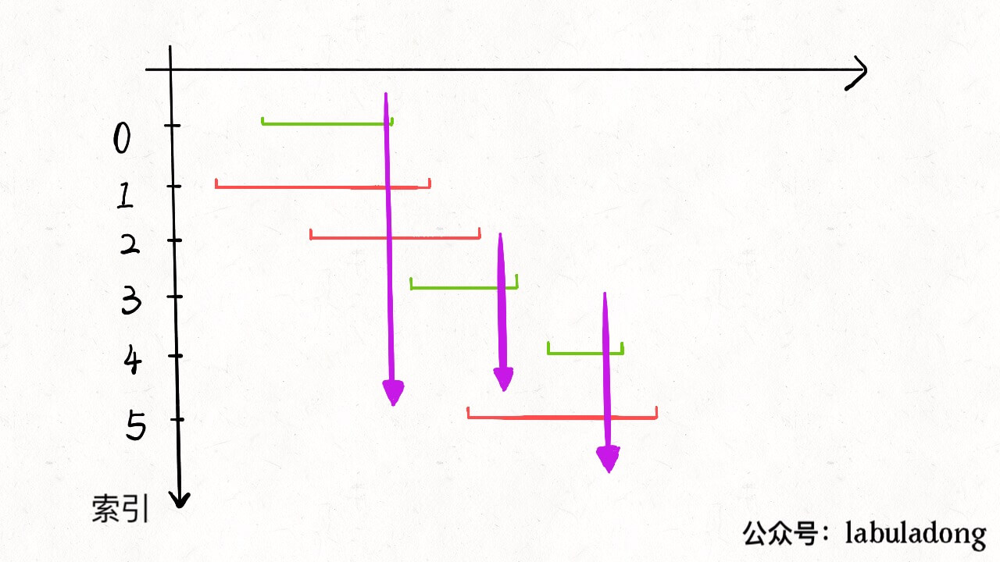

# Interval Problem (I): Interval Scheduling

**Translator: [GYHHAHA](https://github.com/GYHHAHA)**

**Author: [labuladong](https://github.com/labuladong)**

What is the greedy algorithm? It can be regarded as a special case of dynamic programming (DP). Compared with DP, using greedy algorithm need to meet more conditions, such as the greedy choosing property, but show more efficiency.

For example, supposed that a certain algorithm using enumeration method needs exponential time, if the overlapping subproblems can be solved by DP, then polynomial time is available. Furthermore, if it meets the greedy choosing property, the time complexity can be reduced to a linear level.

So what is the greedy choosing property? Easily speaking, if the final global optimum can be satisfied by several local-optimal steps, then we call the algorithm have the greedy choosing property. And also we should remind that it's a special property, only a part of problem have characteristic like this.

For example, if you can choose ten banknotes from 100 given banknotes, how to get banknotes with the highest values in total? Clearly, choosing the banknote with the highest value in the rest each time would bring about the global optimum.

### First Part: Problem Restatement

This article will solve a classical greedy algorithm problem: Interval Scheduling. Given a series of closed intervals `[start, end]` , you should design an algorithm to compute the number of maximum subsets without any overlapping.

```java
int intervalSchedule(int[][] intvs) {}
```

For example,`intvs = [[1,3], [2,4], [3,6]]`, the interval set have 2 subsets without any overlapping at most, `[[1,3], [3,6]]` , so your algorithm should return 2 as the result. Note that intervals with the same border doesn't meet the condition.

This problem is widely used in our daily life. For example, you get several activities today, each activity can be represented by its starting time and its ending time with interval`[start, end]` . Clearly you can't attend 2 activities at the same time, so this problem can be change into a question about how to find the maximum subsets without any time overlapping.

### Second Part: Greedy Algorithm

For this problem, there are some potential thought, but none of them could lead to the correct answer.

① Choosing the interval with the earliest starting time.

There maybe exists some intervals appear very early, but they can also be with long duration, which make us missing up some short intervals.

② Choosing the interval with the shortest duration.

③ Choosing the interval with the shortest duration.

It's easy to raise counterexample to these solution.

The correct thought can be very easy, which can be devided into three parts:

① Choosing a interval 'x', which has the earliest ending time among all the current intervals, from the interval set 'intvs'.

② Delete all invertals intersecting with 'x'.

③ Repecting ① and ②, until intvs gets empty. These 'x' selected before are the subsets meeting the conditions.

Now when we change this thought into algorithm, it's more convenient to implement ① and ② with a ascending sorting by  `end` for each interval.

【Explanations for the chinese in the picture】

【索引：index】【按end排序，sorting by end】【选择区间x：choosing the interval x】

【更新x：updating x】【去除x的重叠区间：delecting the overlapping intervals with x】

【得到结果：achieve the results】


Now we implement our algorithm. For the step one, since we ordered `end` in advance, then it's easy to choose the 'x'. The key point is how to delect the intervals intersecting with 'x' and choose the new 'x' for the next loop.

Thanks to the ordering, it's not difficult to find out all the interval intersecting with 'x' will contain the `end` of 'x'. Namely, if a interval doesn't contain the ending point of 'x', then its  `start` must bigger or equal to the  `end` of  'x'.

【Comments for the chinese in the picture】


Here is the code：

```java
public int intervalSchedule(int[][] intvs) {
    if (intvs.length == 0) return 0;
    // ascending sorting by end
    Arrays.sort(intvs, new Comparator<int[]>() {
        public int compare(int[] a, int[] b) {
            return a[1] - b[1];
        }
    });
    // at least have one interval without intersection
    int count = 1;
    // after sorting, the first interval is x
    int x_end = intvs[0][1];
    for (int[] interval : intvs) {
        int start = interval[0];
        if (start >= x_end) {
            // get the next selected interval
            count++;
            x_end = interval[1];
        }
    }
    return count;
}
```

### Third Part: Example for the Application

Now we will take some problem from leetcode to apply the interval scheduling algorithm.

【Leetcode 435】Given a collection of intervals, find the minimum number of intervals you need to remove to make the rest of the intervals non-overlapping.

**Example 1:**

```
Input: [[1,2],[2,3],[3,4],[1,3]]
Output: 1
Explanation: [1,3] can be removed and the rest of intervals are non-overlapping.
```

**Example 2:**

```
Input: [[1,2],[1,2],[1,2]]
Output: 2
Explanation: You need to remove two [1,2] to make the rest of intervals non-overlapping.
```

**Example 3:**

```
Input: [[1,2],[2,3]]
Output: 0
Explanation: You don't need to remove any of the intervals since they're already non-overlapping.
```

**Note:**

1. You may assume the interval's end point is always bigger than its start point.
2. Intervals like [1,2] and [2,3] have borders "touching" but they don't overlap each other.

Since we are able to compute the original case, it's easy to finish this case by achieving the intervals which need to be removed.

```java
int eraseOverlapIntervals(int[][] intervals) {
    int n = intervals.length;
    return n - intervalSchedule(intervals);
}
```

【Leetcode 452】Minimum Number of Arrows to Burst Balloons

There are a number of spherical balloons spread in two-dimensional space. For each balloon, provided input is the start and end coordinates of the horizontal diameter. Since it's horizontal, y-coordinates don't matter and hence the x-coordinates of start and end of the diameter suffice. Start is always smaller than end. There will be at most 104 balloons.

An arrow can be shot up exactly vertically from different points along the x-axis. A balloon with xstart and xend bursts by an arrow shot at x if xstart ≤ x ≤ xend. There is no limit to the number of arrows that can be shot. An arrow once shot keeps travelling up infinitely. The problem is to find the minimum number of arrows that must be shot to burst all balloons.

**Example:**

```
Input:
[[10,16], [2,8], [1,6], [7,12]]

Output:
2

Explanation:
One way is to shoot one arrow for example at x = 6 (bursting the balloons [2,8] and [1,6]) and another arrow at x = 11 (bursting the other two balloons).
```

Actually, it's not difficult to find that this question is the same as the interval scheduling algorithm. If there are n intervals without overlapping at most, then at least n arrows which get throw all the intervals are needed. 



There still a little difference: in the interval schedule, the same border will not be  regarded as overlapping, but it counts in this problem. 

【Explanations for the chinese in the picture】

【射气球：shooting the balballoon】


Therefore, we can get the answer to this problem with only a little change.

```java
int findMinArrowShots(int[][] intvs) {
    // ...

    for (int[] interval : intvs) {
        int start = interval[0];
        // Change >= into >
        if (start > x_end) {
            count++;
            x_end = interval[1];
        }
    }
    return count;
}
```

It's not difficult to understand why it ought be done like that: 'x' should not be updated when  `start == x_end` , since the same border is also regarded as overlapping. 