# KMP Character Matching Algorithm in Dynamic Programming

**Translator: [ExcaliburEX](https://github.com/ExcaliburEX)**

**Author: [labuladong](https://github.com/labuladong)**

The KMP algorithm (Knuth-Morris-Pratt algorithm) is a well-known string matching algorithm. It is very efficient, but it is a bit complicated.

Many readers complain that the KMP algorithm is incomprehensible. This is normal. When I think about the KMP algorithm explained in university textbooks, I don't know how many future Knuth, Morris, Pratt will be dismissed in advance.  Some excellent students use the process of pushing the KMP algorithm to help understand the algorithm. This is a way, but this article will help the reader understand the principle of the algorithm from a logical level.  Between ten lines of code, KMP died.

**First of all, at the beginning, this article uses `pat` to represent the pattern string, the length is `M`, `txt` represents the text string, and the length is `N`.  The KMP algorithm is to find the substring `pat` in `txt`. If it exists, it returns the starting index of this substring, otherwise it returns -1**.

Why I think the KMP algorithm is a dynamic programming problem, I will explain it later.  For dynamic programming, it has been emphasized many times that the meaning of the `dp` array must be clear, and the same problem may have more than one way to define the meaning of the `dp` array. Different definitions have different solutions.

The KMP algorithm that readers have seen is that a wave of weird operations processes `pat` to form a one-dimensional array `next`, and then passes through another wave of complex operations to match `txt`.  Time complexity O (N), space complexity O (M).  In fact, its `next` array is equivalent to `dp` array, and the meaning of the elements is related to the prefix and suffix of `pat`. The decision rules are complicated and difficult to understand.**This article uses a two-dimensional `dp` array (but the space complexity is still O (M)) to redefine the meaning of the elements, which greatly reduces the code length and greatly improves the interpretability**。

PS： The code of this article refers to "Algorithm 4". The name of the array used in the original code is `DFA` (Determining the Finite State Machine). Because our public account has a series of dynamic programming articles before, it will not say such a tall noun.  Made a little modification to the code in the book and inherited the name of the `dp` array.
 
### I. Overview of KMP Algorithm

First, let's briefly introduce the differences between the KMP algorithm and the brute-force algorithm, the difficulties, and the relationship with dynamic programming.

The brute-force string matching algorithm is easy to write. Take a look at its logic:

```java
// Brute-force matching (pseudo-code)
int search(String pat, String txt) {
    int M = pat.length;
    int N = txt.length;
    for (int i = 0; i <= N - M; i++) {
        int j;
        for (j = 0; j < M; j++) {
            if (pat[j] != txt[i+j])
                break;
        }
        // pat all matches
        if (j == M) return i;
    }
    // pat substring does not exist in txt
    return -1;
}
```

For brute force algorithms, if there are mismatched characters, both pointers of `txt` and `pat` are rolled back, nested for loops, time complexity $O(MN)$, space complexity $O(1)$.  The main problem is that if there are many repeated characters in the string, the algorithm seems stupid.

such as txt = "aaacaaab" pat = "aaab"：

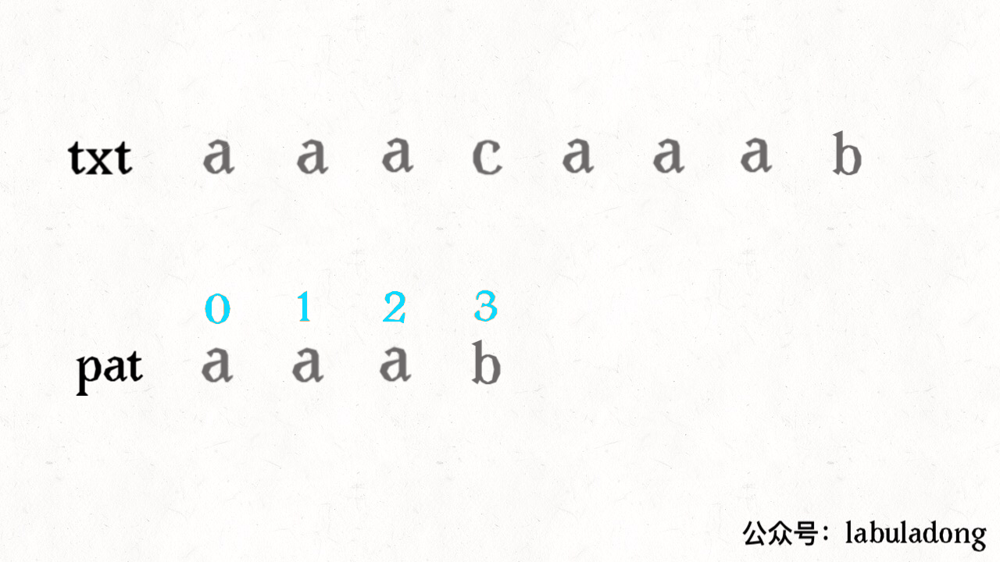

Obviously, there is no character c in `pat` at all, and it is not necessary to roll back the pointer `i`. The brute force solution obviously does a lot of unnecessary operations.

The KMP algorithm is different in that it takes space to record some information, which makes it smart in the above cases:

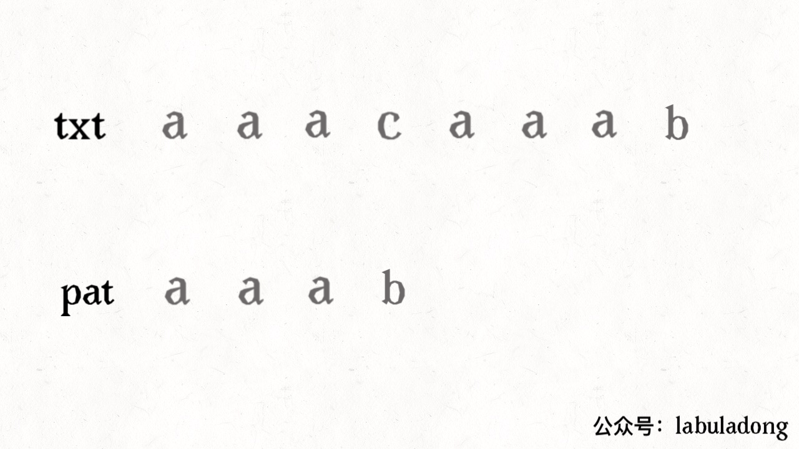

Another example is similar txt = "aaaaaaab" pat = "aaab". The brute force solution will go back to the pointer `i` as stupidly as the above example, and the KMP algorithm will be clever:

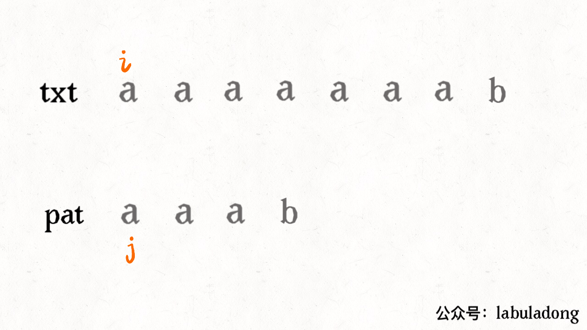

Because the KMP algorithm knows that the character a before the character b is matched, it is only necessary to compare whether the character b is matched every time.

**The KMP algorithm never rolls back the pointer `i` of `txt` and does not go back (it does not scan `txt` repeatedly), but uses the information stored in the `dp` array to move `pat` to the correct position to continue matching**. The time complexity only needs O(N), and space is used for time, so I think it is a dynamic programming algorithm.

The difficulty of the KMP algorithm is how to calculate the information in the `dp` array?  How to move the pointer of pat correctly based on this information?  This requires **Determining Finite State Automata** to assist. Don't be afraid of such a large literary vocabulary. In fact, it is exactly the same as the dynamic programming `dp` array. You can use this word to scare others when you learn it.

One more thing to be clear about: **Calculate the `dp` array, only related to the `pat` string**.  It means that as long as you give me a `pat`, I can calculate the`dp` array from this pattern string, and then you can give me different `txt`, I am not afraid, I can use this `dp` array. String matching is done at O ​​(N) time.

Specifically, for example, the two examples mentioned above:

```python
txt1 = "aaacaaab" 
pat = "aaab"
txt2 = "aaaaaaab" 
pat = "aaab"
```

Our `txt` is different, but `pat` is the same, so the `dp` array used by the KMP algorithm is the same.

Just for the upcoming unmatched case of `txt1`:


The `dp` array instructs `pat` to move like this:

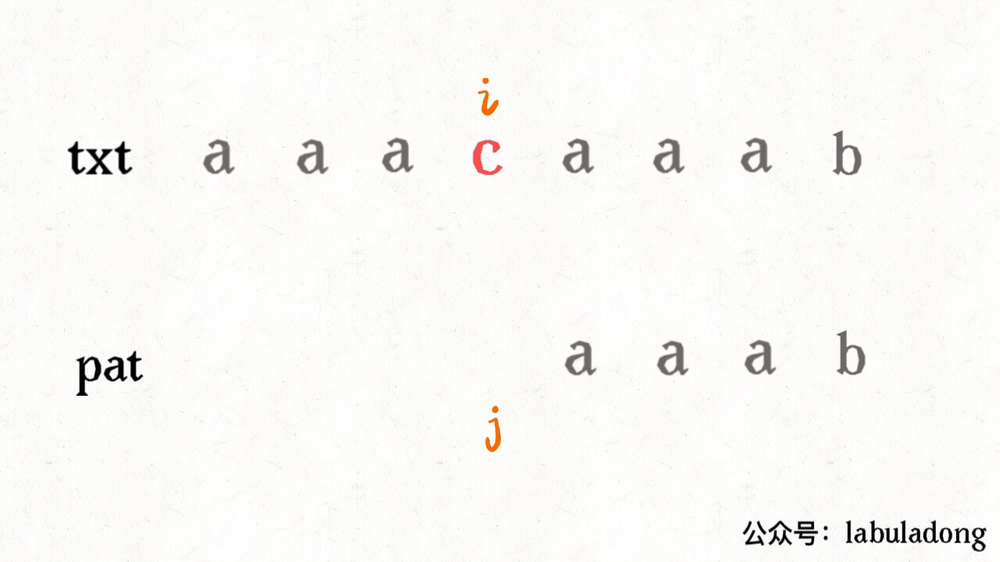

PS：This `j` should not be interpreted as an index, its meaning should be more accurately **state**, so it will appear in this strange position, which will be described later.

And for the following unmatched case of `txt2`:

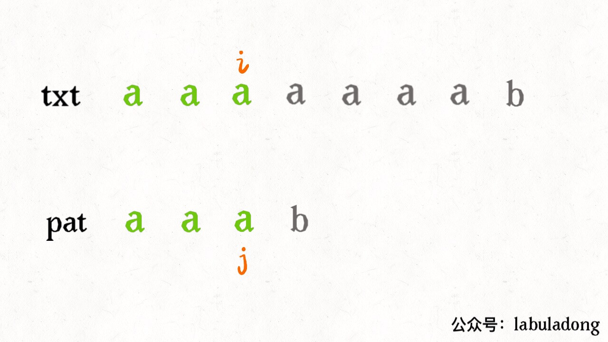

The `dp` array instructs `pat` to move like this:

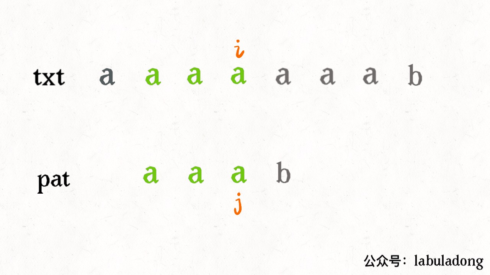

Understand that the `dp` array is only related to `pat`, so we will design the KMP algorithm more beautifully:

```java
public class KMP {
    private int[][] dp;
    private String pat;

    public KMP(String pat) {
        this.pat = pat;
        // Build dp array from pat
        // Requires O (M) time
    }

    public int search(String txt) {
        // Match txt with dp array
        // O (N) time required
    }
}
```

In this way, when we need to use the same `pat` to match different `txt`, we don't need to waste time constructing `dp` arrays:

```java
KMP kmp = new KMP("aaab");
int pos1 = kmp.search("aaacaaab"); //4
int pos2 = kmp.search("aaaaaaab"); //4
```

### Overview of State Machines

Why is the KMP algorithm related to the state machine?  That's it, we can think of a `pat` match as a state transition.  For example when pat = "ABABC":

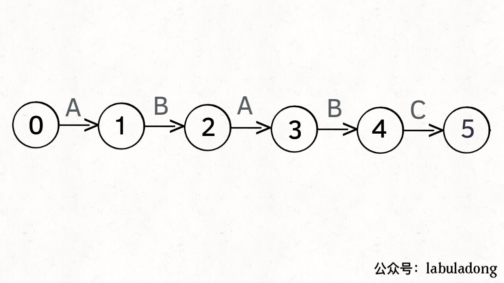

As shown above, the number in the circle is the state, state 0 is the starting state, and state 5 (`pat.length`) is the ending state.  At the beginning of the match, `pat` is in the starting state. Once it is transferred to the ending state, it means that `pat` was found in `txt`.  For example, if it is currently in state 2, the character "AB" is matched:

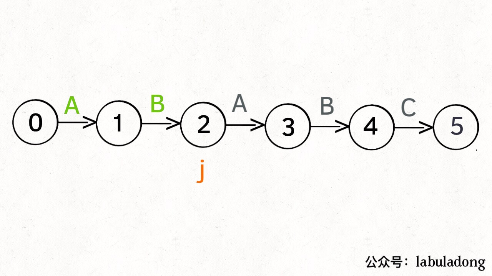

In addition, `pat` state transition behaves differently in different states.  For example, suppose that it now matches state 4. If it encounters character A, it should transition to state 3, if it encounters character C, it should transition to state 5, and if it encounters character B, it should transition to state 0:

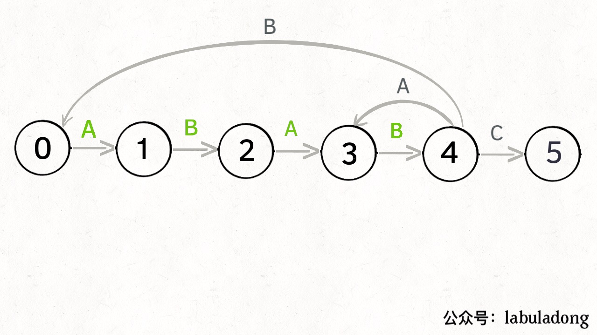

What does it mean, let's take a look at each example.  Use the variable `j` to indicate a pointer to the current state. The current `pat` matches state 4:

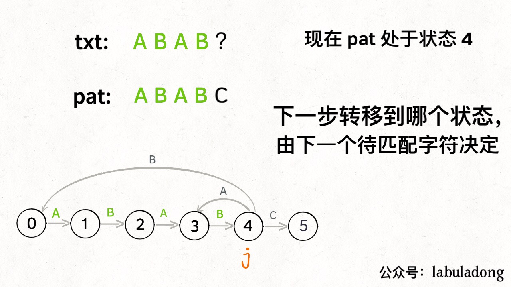

If the character "A" is encountered, it is the smartest to transition to state 3 as indicated by the arrow:

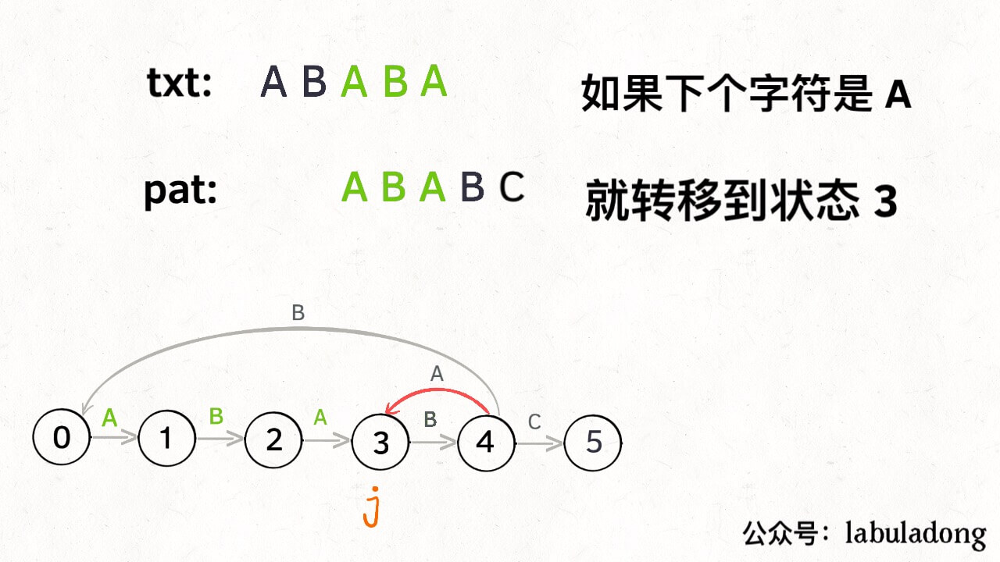

If the character "B" is encountered, as indicated by the arrow, it can only be transferred to state 0 (returning to liberation overnight):

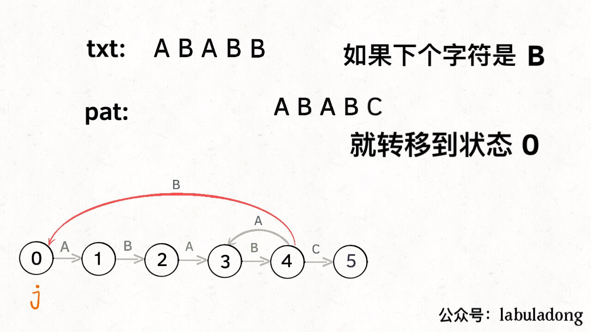

If the character "C" is encountered, it should transition to the termination state 5 according to the arrow, which means that the match is complete:

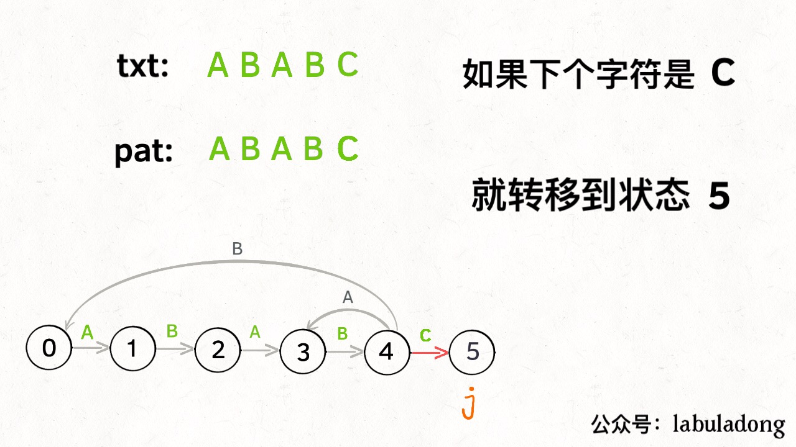


Of course, you may also encounter other characters, such as Z, but you should obviously move to the starting state 0, because there is no character Z at all in `pat`:


Here for clarity, when we draw the state diagram, the arrows that transfer other characters to state 0 are omitted, and only the state transition of the characters appearing in `pat` is drawn:

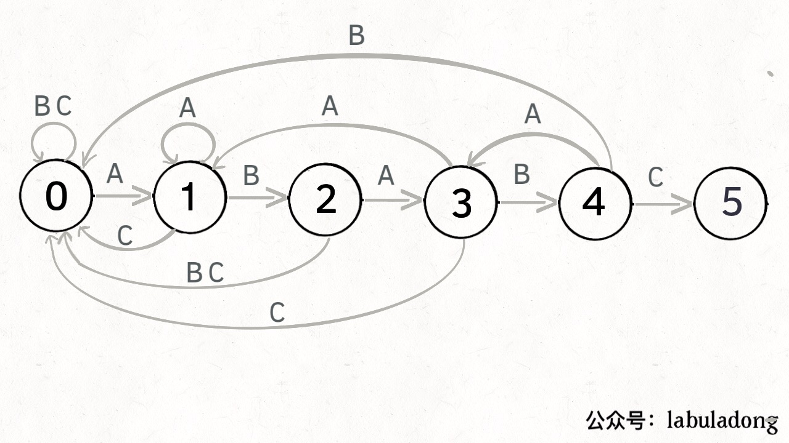

The most critical step of the KMP algorithm is to construct this state transition diagram.  **To determine the behavior of the state transition, two variables must be specified, one is the current matching state and the other is the character encountered**; Once these two variables are determined, you can know which one to transfer in this case  status.

Let's take a look at the process of the KMP algorithm matching the string `txt` according to this state transition diagram:

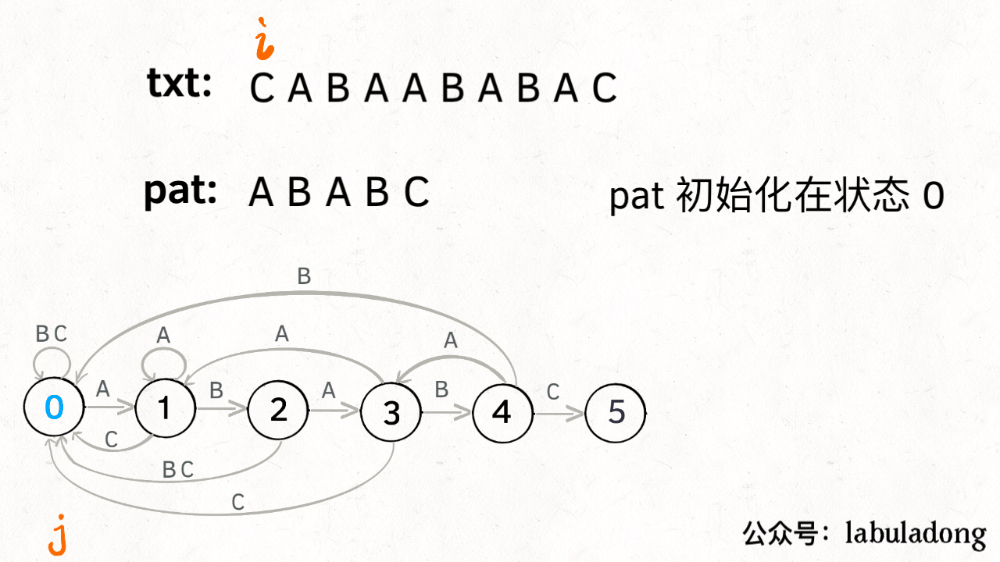

**Remember this GIF matching process, this is the core logic of the KMP algorithm**！

To describe the state transition diagram, we define a two-dimensional dp array, which has the following meaning:

```python
dp[j][c] = next
0 <= j < M，The current state of the table
0 <= c < 256，Character encountered (ASCII code)
0 <= next <= M，Represents the next state

dp[4]['A'] = 3 Means: 
The current state is 4, if the character A is encountered, 
pat should go to state 3

dp[1]['B'] = 2 Means:
Current state 1, if character B is encountered,
pat should transition to state 2
```

According to the definition of our dp array and the process of state transition just now, we can first write the search function code of the KMP algorithm:

```java
public int search(String txt) {
    int M = pat.length();
    int N = txt.length();
    // The initial state of pat is 0
    int j = 0;
    for (int i = 0; i < N; i++) {
        // The current state is j. The character txt [i] is encountered.
        // Which state should pat go to?
        j = dp[j][txt.charAt(i)];
        // If the termination state is reached, the index at the beginning of the match is returned
        if (j == M) return i - M + 1;
    }
    // Not reached termination state, matching failed
    return -1;
}
```

At this point, it should still be well understood. The `dp` array is the state transition diagram we just drew. If not clear, go back and see the evolution of the GIF algorithm.  Here's how to build this `dp` array via `pat`?

### III. Building a state transition diagram

Recall what just said:**To determine the behavior of state transitions, two variables must be specified, one is the current matching state and the other is the character encountered**, And we have determined the meaning of the `dp` array according to this logic, then the framework for constructing the `dp` array is like this:

```python
for 0 <= j < M: # status
    for 0 <= c < 256: # character
        dp[j][c] = next
```

How should we find this next state?  Obviously, **If the characters `c` and `pat[j]` match**, the state should move forward by one. That is, `next = j + 1`. We might as well call this situation **state advance**:

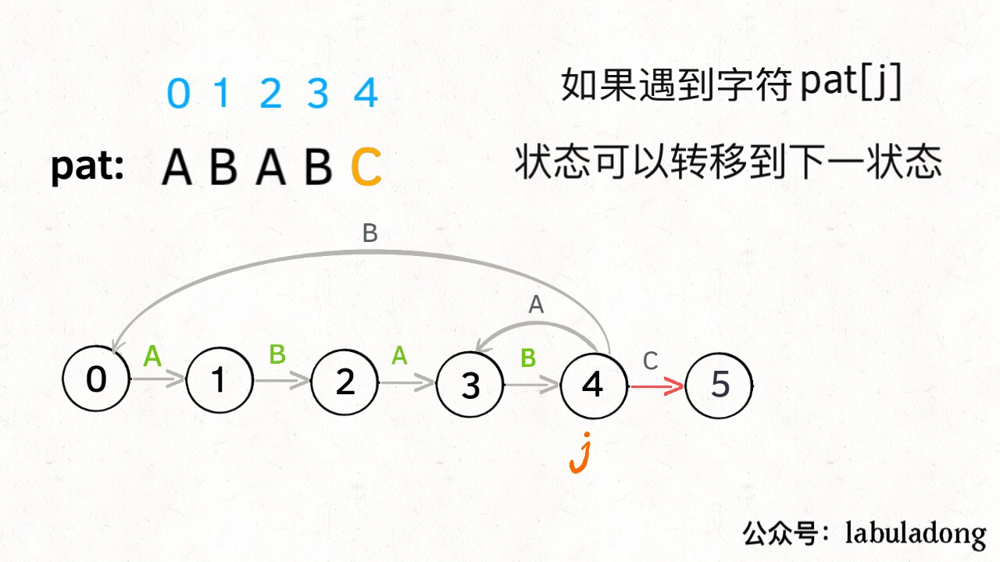

If the characters `c` and `pat[j]` do not match, the state will roll back (or stay in place), we might as well call this situation **state restart**:

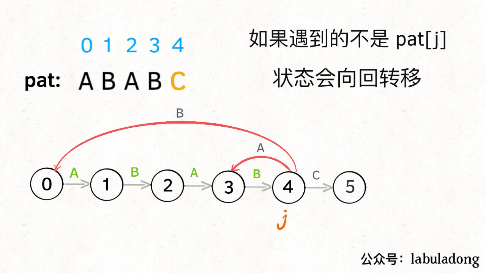

So, how do you know in which state to restart?  Before answering this question, we define another name: **Shadow State** (i named), which is represented by the variable `X`.  **The so-called shadow state has the same prefix as the current state**.  For example:

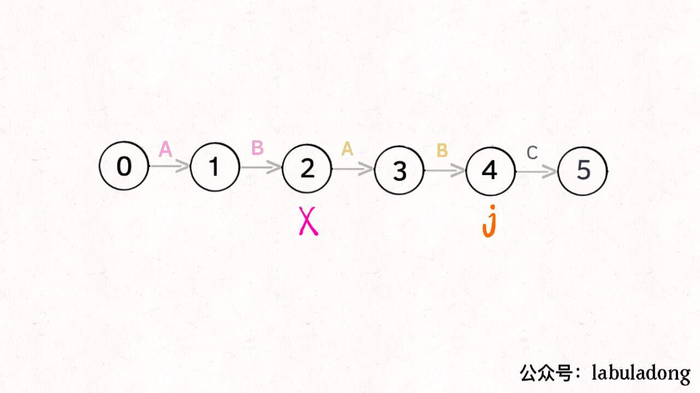

The current state `j = 4`, its shadow state is `X = 2`, and they all have the same prefix "AB".  Because the state `X` and the state `j` have the same prefix, when the state `j` is ready for state restart (the characters encountered `c` and `pat[j]` do not match), you can use `X` State transition diagram to get **recent restart position**.

For example, if the state `j` encountered a character "A", where should it go?  First of all, the state can only be advanced if it encounters "C". Obviously, it can only restart the state when it encounters "A".  **State `j` will delegate this character to state `X` processing, which is `dp[j]['A'] = dp[X]['A']`**:

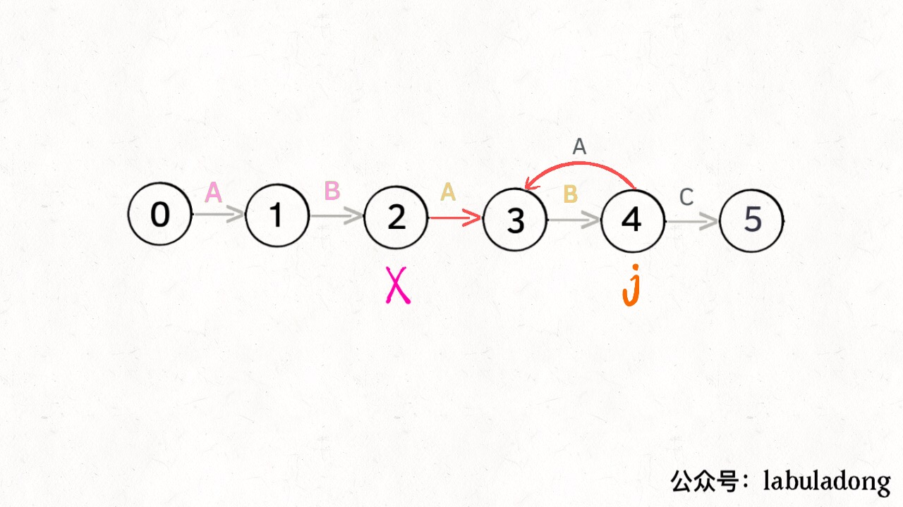

Why is this possible?  Because: Since `j` has been determined that the character "A" cannot be advanced, **can only be rolled back**, and KMP wants to **roll back as little as possible** to avoid unnecessary calculations.  Then `j` can ask `X` with the same prefix as itself. If `X` meets "A" and can perform "state advancement", then it will be transferred, because it will have the least rollback.


Of course, if the character encountered is "B", the state `X` cannot be "state advanced" and can only be rolled back. `j` just needs to roll back in the direction of `X`:

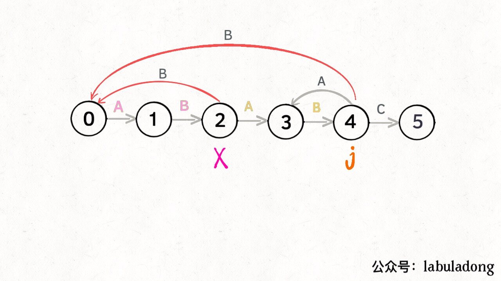

You may ask, how does this `X` know that when it encounters the character "B", it will fall back to state 0?  Because `X` always follows behind `j`, how the state `X` shifts has been calculated before.  Doesn't dynamic programming algorithm use past results to solve current problems?

In this way, we will refine the framework code just now:

```python
int X # Shadow state
for 0 <= j < M:
    for 0 <= c < 256:
        if c == pat[j]:
            # State advancement
            dp[j][c] = j + 1
        else: 
            # State restart
            # Delegate X to calculate restart position
            dp[j][c] = dp[X][c] 
```

### IX. Code Implementation

If you can understand the previous content, congratulations! Now there is one question left: how did the shadow state `X` get?  Let's look directly at the complete code.

```java
public class KMP {
    private int[][] dp;
    private String pat;

    public KMP(String pat) {
        this.pat = pat;
        int M = pat.length();
        // dp[state][character] = next state
        dp = new int[M][256];
        // base case
        dp[0][pat.charAt(0)] = 1;
        // Shadow state X is initially 0
        int X = 0;
        // Current state j starts at 1
        for (int j = 1; j < M; j++) {
            for (int c = 0; c < 256; c++) {
                if (pat.charAt(j) == c) 
                    dp[j][c] = j + 1;
                else 
                    dp[j][c] = dp[X][c];
            }
            // Update shadow status
            X = dp[X][pat.charAt(j)];
        }
    }

    public int search(String txt) {...}
}
```

First explain this line of code:

```java
// base case
dp[0][pat.charAt(0)] = 1;
```

This line of code is a base case. Only when the character pat[0] is encountered can the state transition from 0 to 1. If it encounters other characters, it stays at state 0 (Java initializes the array to 0 by default).

The shadow state `X` is first initialized to 0 and then continuously updated as `j` advances.  Let's see **how to update the shadow state `X`** in the end:

```java
int X = 0;
for (int j = 1; j < M; j++) {
    ...
    // Update shadow status
    // The current state is X, the character pat[j] is encountered,
    // Which state should pat go to?
    X = dp[X][pat.charAt(j)];
}
```

Updating `X` is actually very similar to updating the status `j` in the `search` function:

```java
int j = 0;
for (int i = 0; i < N; i++) {
    // The current state is j. The character txt[i] is encountered.
    // Which state should pat go to?
    j = dp[j][txt.charAt(i)];
    ...
}
```

**The principle is very delicate**, pay attention to the initial value of the variable in the for loop in the code, you can understand this: the latter is matching `pat` in `txt`, the former is matching `pat[1.end]`, state `X` is always one state behind state `j`, with the same longest prefix as `j`.  So I compare `X` to a shadow state, and it seems a bit appropriate.

In addition, constructing the dp array is based on the base case `dp[0][..]`.  This is why I consider the KMP algorithm to be a dynamic programming algorithm.

Take a look at the complete construction process of the state transition diagram, you can understand the subtlety of the role of the state `X`:

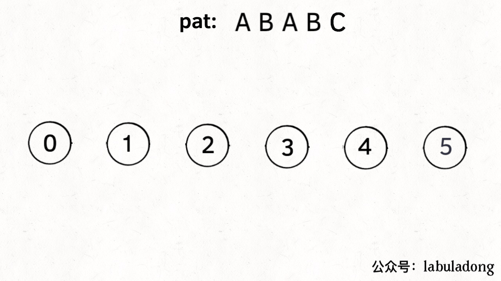

At this point, the core of the KMP algorithm has finally been written.  Take a look at the complete code of the KMP algorithm:

```java
public class KMP {
    private int[][] dp;
    private String pat;

    public KMP(String pat) {
        this.pat = pat;
        int M = pat.length();
        // dp[state][character] = next state
        dp = new int[M][256];
        // base case
        dp[0][pat.charAt(0)] = 1;
        // Shadow state X is initially 0
        int X = 0;
        // Build state transition diagram (slightly more compact)
        for (int j = 1; j < M; j++) {
            for (int c = 0; c < 256; c++)
                dp[j][c] = dp[X][c];
            dp[j][pat.charAt(j)] = j + 1;
            // Update shadow status
            X = dp[X][pat.charAt(j)];
        }
    }

    public int search(String txt) {
        int M = pat.length();
        int N = txt.length();
        // The initial state of pat is 0
        int j = 0;
        for (int i = 0; i < N; i++) {
            // Calculate the next state of pat
            j = dp[j][txt.charAt(i)];
            // Reached termination state and returned results
            if (j == M) return i - M + 1;
        }
        // Not reached termination state, matching failed
        return -1;
    }
}
```

After the previous detailed examples, you should understand the meaning of this code. Of course, you can also write the KMP algorithm as a function.  The core code is the part of the for loop in the two functions. Is there more than ten lines in the count?

### V. Conclusion

 The traditional KMP algorithm uses a one-dimensional array `next` to record prefix information, and this article uses a two-dimensional array `dp` to solve the character matching problem from the perspective of state transition, but the space complexity is still O(256M) = O(M).
 

In the process of `pat` matching `txt`, as long as the two questions of "current state" and "what characters are encountered" are clear, it can be determined which state should be transferred (forward or back)  .

For a pattern string `pat`, there are a total of M states, and for ASCII characters, the total will not exceed 256.  So we construct an array `dp[M][256]` to include all cases, and make clear the meaning of the `dp` array:

`dp[j][c] = next` means that the current state is `j`, the character `c` is encountered, and it should move to the state `next`.

With its meaning clear, it is easy to write the code for the search function.

For how to build this `dp` array, you need a secondary state `X`, which is always one state behind the current state `j`, with the same prefix as the longest `j`. We named it "Shadow State".

When constructing the transition direction of the current state `j`, only the character `pat[j]` can advance the state (`dp[j][pat[j]] = j + 1`); for other characters only  State fallback, you should ask where the shadow state `X` should fall back (`dp[j][other] = dp[X][other]`, where `other` is other than `pat[j]`  all other characters).

For the shadow state `X`, we initialize it to 0 and update it as `j` advances. The update method is very similar to the search process to update `j` (`X = dp[X][pat[j]]`).

The KMP algorithm is also a matter of dynamic programming. Our public account article directory has a series of articles that specialize in dynamic programming, and all are based on a set of frameworks. It is nothing more than describing the logic of the problem, clarifying the meaning of the `dp` array and defining the base case. That's a shit.  I hope this article will give you a deeper understanding of dynamic programming.

