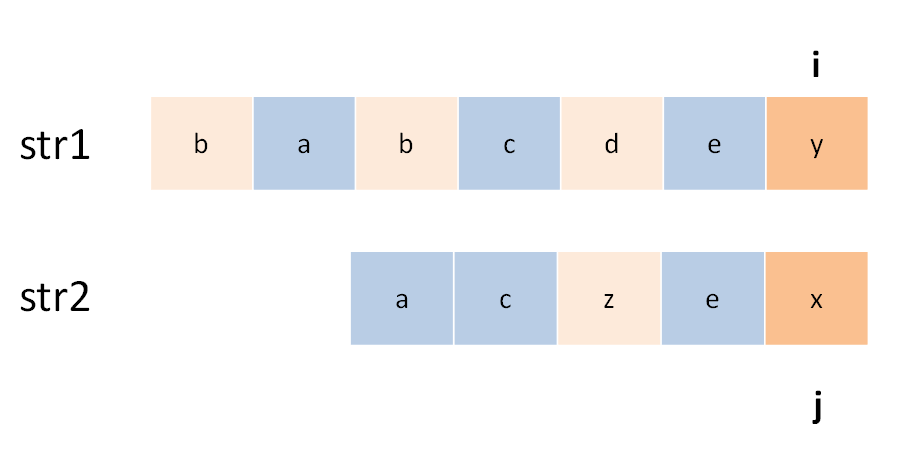

# The Longest Common Subsequence

**Translator: [ABCpril](https://github.com/ABCpril)**

**Author: [labuladong](https://github.com/labuladong)**

Longest Common Subsequence (LCS) is a classic interview question, because its solution indicates typical two-dimensional dynamic programming. Most of the difficult problems related to string are similar to LCS problem, such as Edit distance. Moreover, LCS algorithm is worth mastering because it can be utilized to solve other relative problems effectively.

Given str1 and str2, find out the length of the longest common subsequence. 

```
Input: str1 = "abcde", str2 = "ace" 
Output: 3  
Explanation: The longest common subsequence is "ace" whose length is 3
```

Some readers may wonder why should this problem be solved by dynamic programming. It is difficult to list exhaustively all the possible results when it comes to solving the problem of subsequence types. Thanks to exhausting and pruning, dynamic programming algorithms can be satisfying. In a word, as long as the subsequence is involved, dynamic programming should be considered to solve it. 

Let's analyze how to solve this problem with dynamic programming skills in detail.

### 1、Line of thinking with dynamic programming

**The first step is to make sure the meaning of the `dp` array **. For the dynamic programming problem of two strings, the routine is universal.

For example, for the strings `s1` and` s2`, a DP table should be constructed like this:


For the sake of understanding this table, we temporarily consider that the index starts from 1. We only need to make a few adjustments in the code block later. Among them, `dp [i] [j]` means: For `s1 [1..i]` and `s2 [1..j]`, their LCS length is `dp [i] [j]` .

In the table above, d [2] [4] means: For `" ac "` and `" babc "`, their LCS length is 2. The final answer is hidden in `dp [3] [6]`.

**The second step is to define the base case.**

What base case needs is that: `dp[0][..]` and `dp[..][0]` should be initialized to 0 for representing null strings.

According to the definition of the dp array above, `dp [0] [3] = 0` means: For the strings` "" `and` "bab" `, the length of the LCS is 0. Due to one null string, the length of their longest common subsequence should obviously be zero.

**The third step is to find the state transition equation。**

This is the most difficult step in dynamic programming. Fortunately, the routines for this type of string problem are similar. So let's take this question as an example to find out ideas for handling such problems.

Making choices is what state transition exactly does. For example, this problem is to find the longest common subsequence of `s1` and` s2`. This subsequence may be called `lcs`. So what options are there for each character in `s1` and` s2`? Obviously, there are two options, either in `lcs` or not.


Both "in" and "absent" are choices. The key is,  which should you choose? This requires some brainpower: if a character should be in `lcs`, then this character must exist in both` s1` and `s2`, because` lcs` is the longest **common **subsequence. So consider this:

Use two pointers `i` and` j` to traverse `s1` and` s2` from back to front. If `s1 [i] == s2 [j]`, then this character **must be in `lcs`**; Otherwise, **at least one of  `s1[i] and s2[j]` is not in `lcs` **. And it should be discarded. Have a look at the recursive solution which is easier to understand:

```python
def longestCommonSubsequence(str1, str2) -> int:
    def dp(i, j):
        #  base case
        if i == -1 or j == -1:
            return 0
        if str1[i] == str2[j]:
            # found a character belongs to lcs, keep finding
            return dp(i - 1, j - 1) + 1
        else:
            # it's up to the character which can make lcs longer
            return max(dp(i-1, j), dp(i, j-1))
        
    # i and j became the indexes of the final character in lcs
    return dp(len(str1)-1, len(str2)-1)
```

For the first case, you have found a character in `lcs`,` i` `j`should move forward by one, and the length of`lcs` increases by one; for the latter,  take greater results from left and up.

In fact, this code is a brute force solution. We can optimize the time complexity through memos or DP tables, such as the DP table described above:

```python
def longestCommonSubsequence(str1, str2) -> int:
    m, n = len(str1), len(str2)
    # construct DP table and base case
    dp = [[0] * (n + 1) for _ in range(m + 1)]
    # state transition
    for i in range(1, m + 1):
        for j in range(1, n + 1):
            if str1[i - 1] == str2[j - 1]:
                # found a character in lcs
                dp[i][j] = 1 + dp[i-1][j-1]
            else:
                dp[i][j] = max(dp[i-1][j], dp[i][j-1])
        
    return dp[-1][-1]
```

### 2、Troubleshooting

For the cases where `s1 [i]` and `s2 [j]` are not equal, it indicates that **at least one** of the characters are not in `lcs`. Will both characters be missing? For example:



So let's change the code to this considering the situation above:

```python
if str1[i - 1] == str2[j - 1]:
    # ...
else:
    dp[i][j] = max(dp[i-1][j], 
                   dp[i][j-1],
                   dp[i-1][j-1])
```

In fact, you can change it this way and get the correct answer, but it is useless because `dp [i-1] [j-1]` is always the smallest of the three, and max will not reach it.

The reason lies in our definition of dp array: for `s1 [1..i]` and `s2 [1..j]`, their LCS length is `dp [i] [j]`.


Through this way, it is clear that the length of the `lcs` corresponding to` dp [i-1] [j-1] `cannot be larger than the first two cases, so there is no need to add it in the comparison.

### 3、Summary

For the dynamic programming of two strings, DP tables are generally defined. Because it is easier to write the state transition equation and get the state of `dp [i] [j]` by analyzing the previous dp values with DP table:


The key to find out the state transition equation is to think about the "choices" of each state. As long as we can make the right choice with right logic, the algorithm will take effect as planned.

