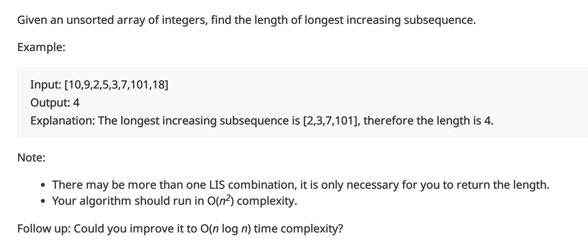
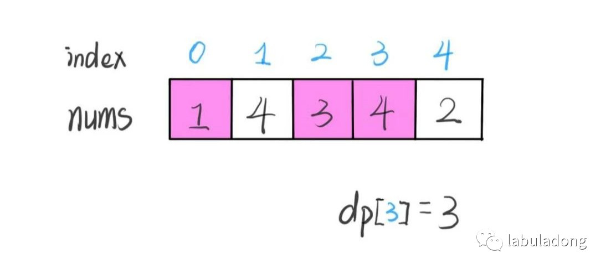
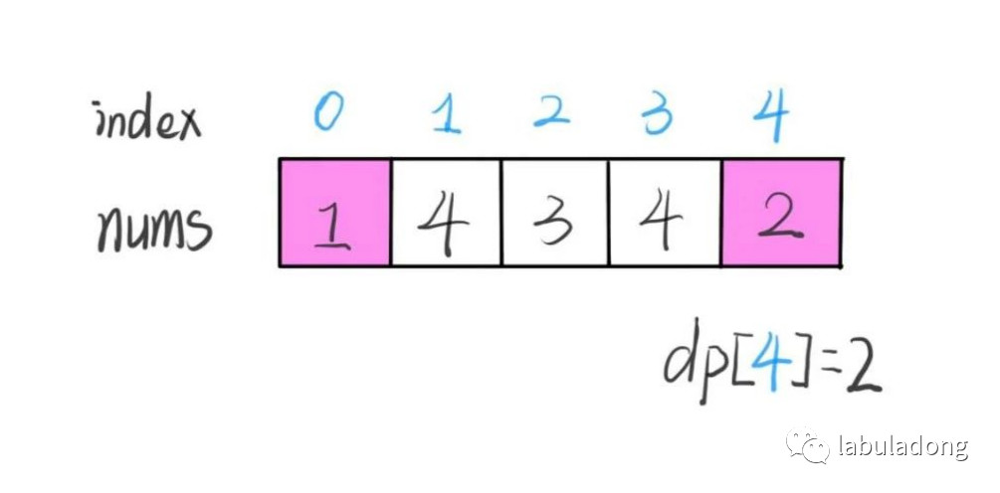
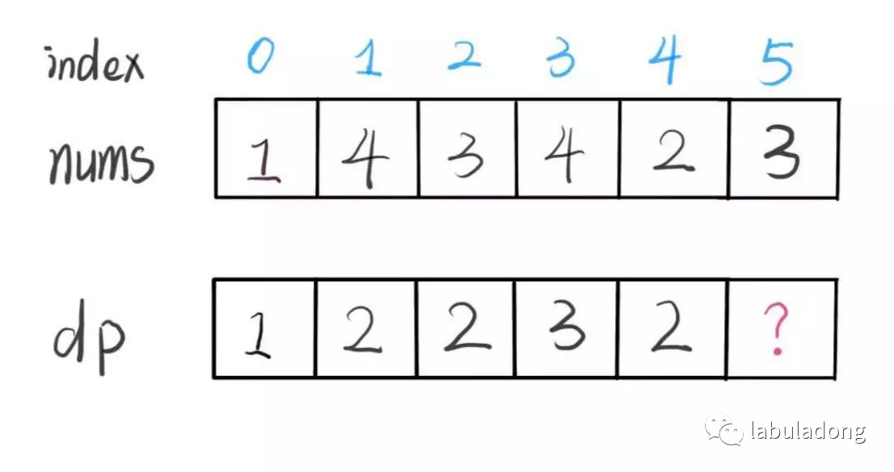
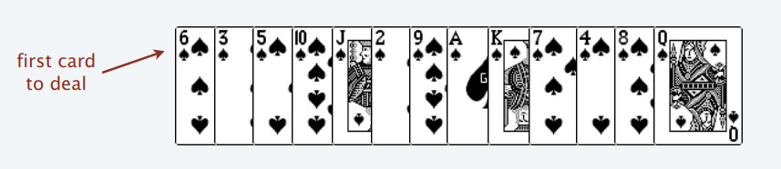
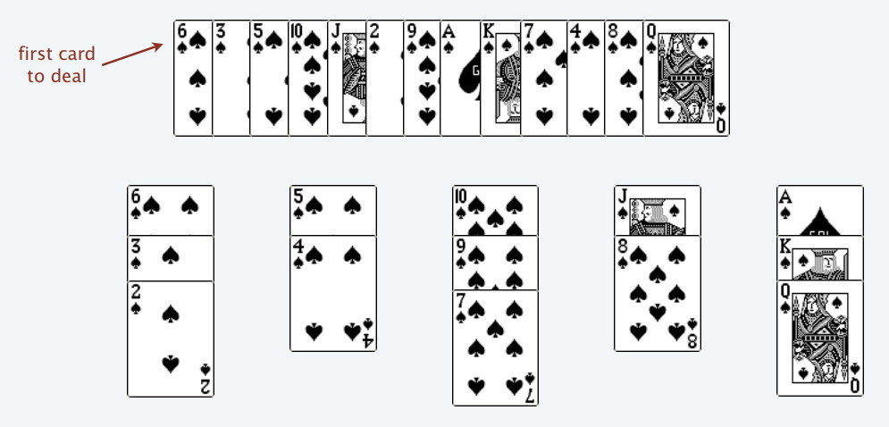
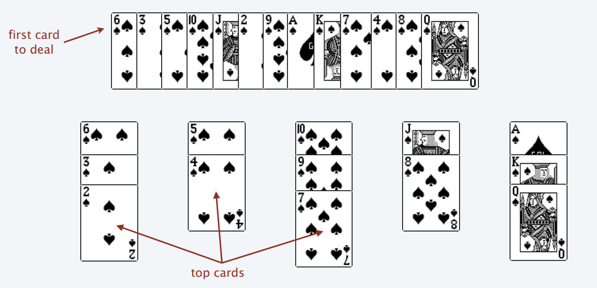
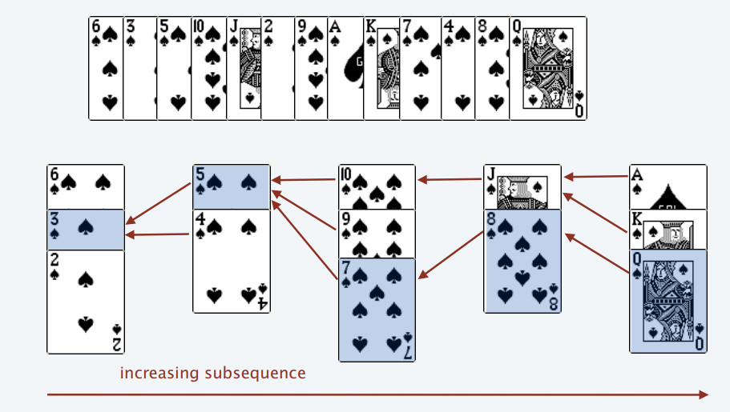

# Dynamic Programming Design: Longest Increasing Subsequence

**Translator: [ABCpril](https://github.com/ABCpril)**

**Author: [labuladong](https://github.com/labuladong)**

A number of readers said that even after reading the previous article [Dynamic Programming Detailed Explanation], and understanding the routines of dynamic programming, they could not conclude state transition equations due to lack of ideas. What should you do in that situation? This article takes the "Longest Increasing Subsequence" as an example to describe a general technique for designing dynamic programming: mathematical induction.

Longest Increasing Subsequence (short for LIS) is a classic problem. We will analyze this problem to explain how to master dynamic programming from the shallower to the deeper. It is easier to come out with a dynamic programming solution whose time complexity is O (N ^ 2). Another difficult solution whose time complexity is O (NlogN) takes advantage of binary search. Let's play a simple card game to help understand this Ingenious solution.

Given the description as follows: 



Note the difference between the two terms "subsequence" and "substring". Substrings must be continuous, and subsequences are not necessarily continuous. The following will design the dynamic programming algorithm step by step to solve this problem.

### 1、Line of thinking with dynamic programming

The core design idea of dynamic programming is mathematical induction.

I believe that everyone is no stranger to mathematical induction and considers the idea as very simple. For example,  to prove a mathematical conclusion, we begin with an assumption that this conclusion is true when `k < n`, and then think of a way to prove that this conclusion still makes sense when `k = n`. If it works, this conclusion can stand up no matter which number k is equal to. 

Similarly, when we design a dynamic programming algorithm, we need a dp array. We can assume that `dp [0 ... i-1]` has been calculated, and then ask ourselves: how to calculate dp[i] from these results?

Take the example of the longest increasing subsequence directly as an example and you will understand. However, we must first define the meaning of the dp array, that is, what does the value of dp[i] represent?

**Our definition: dp[i] represents the length of the longest increasing subsequence ending with nums[i].**

Give two examples：






The picture below shows the process: 


According to this definition, the final result (the maximum length of the subsequence) is the largest value in the dp array.

```java
int res = 0;
for (int i = 0; i < dp.size(); i++) {
    res = Math.max(res, dp[i]);
}
return res;
```

The result of each dp[i] in the process just now can be seen by the naked eye. The reader may wonder how should we design the algorithm logic to calculate each dp[i] correctly?

This is the highlight of dynamic programming. To think about how to perform state transfer, you can use the idea of mathematical induction:

How can we derive `dp [5]`after knowing all the values of `dp [0 ... 4]`?



According to our definition of dp array, to find out the value of dp[5], you have to figure out the longest increasing subsequence that ends with nums[5].

nums[5] = 3. Since it is an increasing subsequence, we only need to find the previous subsequences with a smaller end than 3.  After connecting 3 to the end to form a new increasing subsequence,  the new subsequence length will be increased by one.

Absolutely, many new subsequences may be formed. However, we should only keep the longest one and use its length as the value of dp[5].


```java
for (int j = 0; j < i; j++) {
    if (nums[i] > nums[j]) 
        dp[i] = Math.max(dp[i], dp[j] + 1);
}
```

The code block above can calculate dp[5]. At this point, we have basically completed the LIS algorithm. The reader may wonder how to calculate dp[4], dp[3] ... even if we just calculated dp[5].

In fact, the calculation can be simple as long as you remember mathematical induction.

```java
for (int i = 0; i < nums.length; i++) {
    for (int j = 0; j < i; j++) {
        if (nums[i] > nums[j]) 
            dp[i] = Math.max(dp[i], dp[j] + 1);
    }
}
```

Detail: For a string, every subsequence's length is at least 1. During initialization, all the dp values should be set to 1. Have a look at the complete version:

```java
public int lengthOfLIS(int[] nums) {
    int[] dp = new int[nums.length];
    // set all the dp values to 1
    Arrays.fill(dp, 1);
    for (int i = 0; i < nums.length; i++) {
        for (int j = 0; j < i; j++) {
            if (nums[i] > nums[j]) 
                dp[i] = Math.max(dp[i], dp[j] + 1);
        }
    }
    
    int res = 0;
    for (int i = 0; i < dp.length; i++) {
        res = Math.max(res, dp[i]);
    }
    return res;
}
```

By far, this problem has been solved with time complexity of O (N ^ 2). To summarize the design process of dynamic programming:

To begin with, the meaning of the values in dp array should be clarified. This step is of great importance. If your understanding is inappropriate or not clear enough, the subsequent steps will be hindered.

Secondly, based on the definition of dp array and the idea of mathematical induction, given the values of `dp [0 ... i-1]`, find a way to calculate `dp [i]`. Once this step is completed, the entire problem is basically  solved.

However, if this step cannot be completed, it is likely that the definition of the dp array is not appropriate and needs to be redefined; or the information stored in the dp array is not enough to introduce the next answer, thus the dp array needs to be expanded into Two-dimensional arrays or even three-dimensional arrays.

Finally, think about what the base case of the problem is and how to initialize the dp array to ensure that the algorithm runs correctly.

### 2、Binary search solution

The time complexity of this solution is O (NlogN). But to be honest, normal people can hardly come out with this solution (maybe people who have played some card games can have a try). Under normal circumstances, it is good enough to give a dynamic programming solution.

It is difficult to imagine that LIS has a relatation with binary search. In fact, LIS is related to a card game called patience game. There is even a sorting method called patience sorting.

For the sake of simplicity, all mathematical proofs will be skipped later, and a simplified example is used to understand the idea.

Given a row of playing cards, we process these cards one by one from left to right like traversing the array. Finally we will divide these cards into several piles.



The following rules apply to these cards:

You can only push a card to another with more points. If the current card has more points than any top card of the piles, create a new pile and put this card into it. If the current card can be placed into multiple piles, choose the leftmost pile.

For example, the above playing cards will eventually be divided into 5 piles (The value of A is the largest, not 1)



Why should we choose the leftmost heap when encountering multiple alternative heaps? Because this can guarantee the order of the cards on the top of the pile (2, 4, 7, 8, Q), the proof is omitted.



Following the above rules, the longest increasing subsequence can be found. The number of piles represents the length of LIS.



We just need to adapt the process of playing cards into a program. Each time dealing with a playing card, you need to find a suitable card pile to put. With the cards on the top of the piles being in order, you can take advantage of binary search: where the current card should be placed.

PS: The previous article [Detailed Explanation of Binary Search Algorithm] lists the details and variants of binary search, one of which is perfectly applied here. If you haven't read it before, it is highly recommended.

```java
public int lengthOfLIS(int[] nums) {
    int[] top = new int[nums.length];
    // Initialize the number of piles
    int piles = 0;
    for (int i = 0; i < nums.length; i++) {
        // play cards to be handled
        int poker = nums[i];

        /***** binary search *****/
        int left = 0, right = piles;
        while (left < right) {
            int mid = (left + right) / 2;
            if (top[mid] > poker) {
                right = mid;
            } else if (top[mid] < poker) {
                left = mid + 1;
            } else {
                right = mid;
            }
        }
        /*********************************/
        
        // create a new pile and put this card into it
        if (left == piles) piles++;
        // put the card on the top
        top[left] = poker;
    }
    // The number of piles represents the length of LIS
    return piles;
}
```

So far, the solution utilizing binary search has been explained.

This solution is really difficult to conceive. First of all, this solution involves mathematical proof. It's surprising that you can get LIS through following the rules? Secondly, it is an application of binary search. If you don't master the details of binary search, it will be difficult for you to apply appropriately.

To conclude, you can take a quick look at this method to broaden your mind. But you should fully understand the design method of dynamic programming: assuming that the previous answers are known, based on mathematical induction, correctly deduct the state transition, and figure out the answer eventually.
