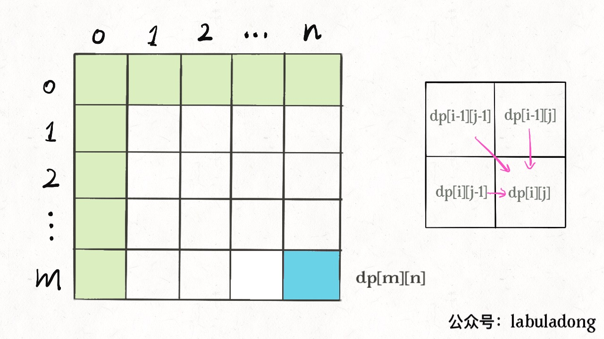
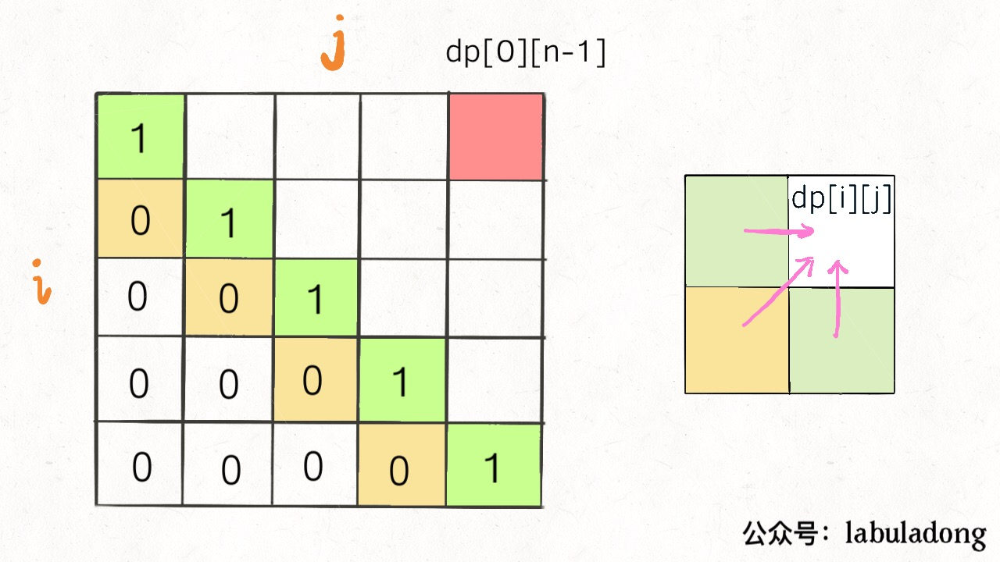
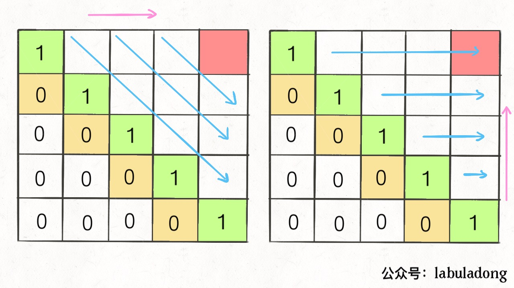

# Q&A on Dynamic Programming

**Translator: [qy-yang](https://github.com/qy-yang)**

**Author: [labuladong](https://github.com/labuladong)**

This article will answer two questions:

1. What exactly is called "optimal substructure" and what is the relationship with dynamic programming?

2. Why does dynamic programming have various ways to traverse `dp` arrays, some are traversing fowards, some are traversing backwards, and some are traversing diagonally.

### 1. Optimal substructure

"Optimal substructure" is a specific property of some problems and is not exclusive to dynamic programming. In other words, many problems actually have optimal substructures, but most of them do not have overlapping subproblems, so we cannot classify them dynamic programming problems.

Here is a trivial example: supposed your school has 10 classes, and you have already calculated the highest test score for each class. So if I ask you to calculate the highest grade in the school, how would you do it? Obviously, it is not necessary to re-traverse the scores of all the students'. You only need to take the maxium score among the 10x highest (from each class).

This example **exhibits optimal substructure**: the optimal solution of a problem can be derived from the optimal solultions of subproblems. Calculating the highest score of **each class** is the subproblem. Once you know the answers to all the subprbolems, you can use this to derive the solution of the original problem which calculating the highest score across the school.

Although this problem has optimal-substructure property, it cannot be solved by dynamic programming due to lack of overlapping-subproblem property.

Here is an another example: Supposed your school has 10 classes, and you have known the maximum score difference (the difference between the highest score and lowest score) of each class. And now you want to calculate the maximum score difference among the students in the school, how would you do it? You should note that it can't be calculated  by taking the maximum score difference of these 10 classes. As the maximum score difference of the 10 classes does not necessarily result in the maximum score difference of the entire school. More concretely, the maximum score difference of the school may be the derived by the highest score of class 3 and the lowest score of class 6.

This problem does **not exhibit optimal substructure**, you cannot get the optimal solution of school through optimal solutions of each class. As mentioned in [Detailed Explanation of Dynamic Programming](https://github.com/labuladong/fucking-algorithm/blob/english/dynamic_programming/%E5%8A%A8%E6%80%81%E8%A7%84%E5%88%92%E8%AF%A6%E8%A7%A3%E8%BF%9B%E9%98%B6.md), the subproblems must be independent of each other to satisfy the optimal-substructure requirement. In this example, the maximum score difference of the whole school may be derived from two classes. In other words, the subproblems are not independent, so this problem does not have the optimal substructure.

**So what should be done when it lacks of optimal substructure? The trick is: recontructing the problem**. For the problem of maximum score difference, as we can't use score differences of each class, we can write a piece of brute-force code like this:

```java
int result = 0;
for (Student a : school) {
    for (Student b : school) {
        if (a is b) continue;
        result = max(result, |a.score - b.score|);
    }
}
return result;
```

Next we can transform it to an equivalent problem and we should realise that: the maximum score difference is equivalent to the difference between the highest score and the lowest score; the highest and lowest score is required. So it is back to first question that has optimal substructure, and we can apply the optimal substructure to solve the highest-score & lowest-score problem, then solve the problem of maximum score difference. This is more efficient, isn't?

The examples above are quite simple, but readers should notice that we are constantly seeking the maximum/minimum values for dynamic programming problems. This is exactly the same with the examples. Once again, dynamic programming is nothing more than solving the overlapping subproblems.

Previous sections "different definitions with different solutions" and ["throwing eggs in high building throwing (advanced)"](https://github.com/labuladong/fucking-algorithm/blob/english/dynamic_programming/SuperEggDropAdvanced.md) showed readers on how to transform the problem. Reader should understant that different optimal substructures may lead to different solutions and efficiency.

Here is another common and simple example: find the maximum value of a binary tree (for simplicity, assume that all the values in the nodes are non-negative):

```java
int maxVal(TreeNode root) {
    if (root == null)
        return -1;
    int left = maxVal(root.left);
    int right = maxVal(root.right);
    return max(root.val, left, right);
}
```

Reader can observe that this problem also exhibits optimal substructure. The maximum value of the tree rooted at "root" node can be calculated from the maximum value of the subtrees (subproblem) at left side and right side. This is similar to the example of the highest score in school before.

The tree example above is not a dynamic programming problem. And readers should notice that the optimal-substructure property is not  unique for dynamic programming. Most of the problems with optimal values have this property. **However, the optimal substructure is a necessary condition for dynamic programming problems.** So in the future, if you encounter the problem of optimal value. The dynamic programming is one of the right idea. This is the trick.

Dynamic programming is to induce the optimal solution starting from trivial base case. And it can be viewed as a chain reaction. Only the problems with optimal substructure have the chain reaction.

The process of finding the optimal substructure is actually the process of verifying correctness of state transition equation. There exists a brute-force solution, if the state transition exhibits the optimal substructure. Next is to check if there are overlapping subproblems. If so, some optimization can be done. This is another trick.

We are not giving the examples of non-classical dynamic programming here. Readers can read more about how state transition follows the optimal substructure from previous articles. Next, let ’s look at another confusing issue with dynamic programming.

### 2. Traversal order of the `dp` array

I believe that some readers will definitely be confused with the traversal orders of `dp` arrays when doing dynamic programming problems . Taking a two-dimensional `dp` array as an example, sometimes we traverse forward:

```java
int[][] dp = new int[m][n];
for (int i = 0; i < m; i++)
    for (int j = 0; j < n; j++)
        // Calculate dp[i][j]
```

sometimes we traverse backward:

```java
for (int i = m - 1; i >= 0; i--)
    for (int j = n - 1; j >= 0; j--)
        // Calculate dp[i][j]
```

and sometimes it may traverse diagonally:

```java
// Traverse the array diagonally
for (int l = 2; l <= n; l++) {
    for (int i = 0; i <= n - l; i++) {
        int j = l + i - 1;
        // Calculate dp[i][j]
    }
}
```

Even more confusing, a correct answer can be obtained by traversing either forward or backward sometimes. For example, we can do both forward and backward in some parts of the problem ["best time to buy and sell stock".](https://github.com/labuladong/fucking-algorithm/blob/english/dynamic_programming/%E5%9B%A2%E7%81%AD%E8%82%A1%E7%A5%A8%E9%97%AE%E9%A2%98.md)

If you look it closely, you should find out the reason. There are two rules you should take note:

**1. During traversal, all the required states must have been calculated**.

**2. The final point of the traversal must be the point where the result is stored**.

Let's explain the two principles in detail.

For example, the classic problem "edit distance" that explained in the previous article [Edit Distance](https://github.com/labuladong/fucking-algorithm/blob/english/dynamic_programming/EditDistance.md), by definition of `dp`, we know that the base case is `dp[..][0]` and `dp[0][..]`; and the final answer is `dp[m][n]`. We also know from the state transition equation that `dp[i][j]` is derived from `dp[i-1][j]`, `dp[i] [j-1]`, `dp [i-1] [j-1]`, as shown below:



So, referring to the two principles, how would you traverse the `dp` array? It should be a forward traversal:

```java
for (int i = 1; i < m; i++)
    for (int j = 1; j < n; j++)
        // First calculate dp[i-1][j], dp[i][j-1], dp[i-1][j-1]
        // Then calculate dp[i][j]
```

In this way, the left, top, and top left of each iteration will be either base cases or states calculated before, and finally it will end up with the answer we want `dp[m][n]`.

Another example, the palindrome subsequence problem, refer to [Strategies For Subsequence Problem](https://github.com/labuladong/fucking-algorithm/blob/english/dynamic_programming/StrategiesForSubsequenceProblem.md) for details, from the definition of `dp` array, we know the base case is in the middle of diagonal of the array. `dp[i][j]` is derived from `dp[i+1][j]`, `dp[i][j-1]`, and `dp[i+1][j-1]`, and the final answer to be calculated is `dp[0][n-1]`, as shown below:



In this case, there are two correct traversal orders:



Either traverse obliquely from left to right, or traverse from bottom to top, left to right, so that to ensure the left, bottom, and bottom left of `dp[i][j]` have been calculated.

Now, readers should understand these two principles, which are mainly dependent on the base case and the location of final result. Just to ensure that the intermediate results used during traversal have been calculated. There are multiple ways to get the correct answer sometimes, and readers can choose one based on your preference.
