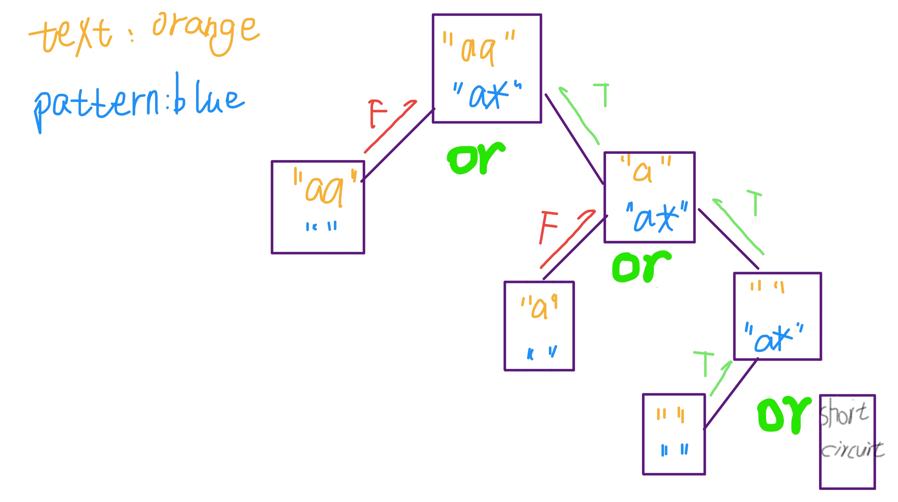

# Regular Expression - Dynamic Programming

**Translator: [PaperJets](https://github.com/PaperJets)**

**Author: [labuladong](https://github.com/labuladong)**

The previous article, "Dynamic Programming in Detail," was very well-received. Today, I'm going to talk about a practical application: Regular Expression. I highly recommend you to take a look at the previous article, if you don't know what is "Dynamic Programming".

Regular Expression is an ingenious algorithm but is a little bit hard to understand. This article mainly focuses on the implementation of two Regular Expression symbols: period「.」and asterisk「*」. Don't worry if you have never used Regular Expression; I will introduce it later. At the end of this article, I'll share with you a tip to quickly find the overlapping subproblems.

Another important purpose of this article is to teach readers how to design their own algorithms. Sometimes it's hard to understand others' comprehensive algorithms. And we even feel exhausted. But in this article, I just want to tell you that designing an algorithm is not a piece of cake; instead, it's a continuing upward spiral of progress. You need to work for it, refine it and perfect it. I'll try my best to make you know how do we simplify problems and build the final solutions from the simplest framework.

Without wasting time, let's dive into it:
	Given a string(s) and a string mode(p). Implement the Regular Expression that supports the '.' and '*' match.
```
'.'  matches any single character
'*'  matches zero or more before "*"
Note: Matches should cover the whole string, not part of it.
```
Demo1:
```text
Input:
	s = "aa"
	p = "a*"
Output:
	true
Explanation:
	'*' represents matching zero or more characters before the "*". 
	"a*" can either match "a" or "aa".
```

Demo2:
```text
Input:
	s = "aab"
	p = "c*a*b"
Output:
	true
Explanation:
    'c' and 'a' can appear zero time or more than one times.
```

Demo3:  

```text
Input:
    s = "ab"
    p = ".*"
Output:
    true
Explanation:
    ".*" means matching zero or more('*') arbitrary character('.').
```


### 1. Warm-up

The first step, let's ignore the regular symbols for a moment. If you're comparing two normal strings, how do you match them? I think this is an algorithm that anyone can write:

```cpp
bool isMatch(string text, string pattern) {
    if (text.size() != pattern.size()) 
        return false;
    for (int j = 0; j < pattern.size(); j++) {
        if (pattern[j] != text[j])
            return false;
    }
    return true;
}
```
Then, I'm going to tweak the above code a little bit. It's a little more complicated, but it still means the same thing.

```cpp
bool isMatch(string text, string pattern) {
    int i = 0; // Index position of text
    int j = 0; // Index position of pattern
    while (j < pattern.size()) {
        if (i >= text.size()) 
            return false;
        if (pattern[j++] != text[i++])
            return false;
    }
    // Equality means matching is complete
    return j == text.size();
}
```
The above rewriting is to transform this algorithm into a recursive algorithm (pseudo code) :

```python
def isMatch(text, pattern) -> bool:
    if pattern is empty: return (text is empty?)
    first_match = (text not empty) and pattern[0] == text[0]
    return first_match and isMatch(text[1:], pattern[1:])
```
If you can understand this code. Congratulations! your recursion idea is in place. The regular expression algorithm, though a little complicated, is actually based on this recursive code.

### 2. Handle the dot 「.」 wildcard

Dot can match any character. Very handy! In fact, it is the simplest with a little modification:

```python
def isMatch(text, pattern) -> bool:
    if not pattern: return not text
    first_match = bool(text) and pattern[0] in {text[0], '.'}
    return first_match and isMatch(text[1:], pattern[1:])
```

### 3. Handle the 「*」 wildcard  

The asterisk wildcard allows the previous character to be repeated any number of times, including zero. How many times? It's a little hard to say, but don't worry, we can at least build the framework further:

```python
def isMatch(text, pattern) -> bool:
    if not pattern: return not text
    first_match = bool(text) and pattern[0] in {text[0], '.'}
    if len(pattern) >= 2 and pattern[1] == '*':
        # find '*' wildcard
    else:
        return first_match and isMatch(text[1:], pattern[1:])
```
How many times does the character before the asterisk have to be repeated? It depends on the computation of a computer. Let's say, N times. As I've said many times before, the trick to writing recursion is to focus on the present issues and leave the rest to the recursion. Here, no matter what N is, there are only two choices: zero matches and one match. So you can do it this way:

```py
if len(pattern) >= 2 and pattern[1] == '*':
    return isMatch(text, pattern[2:]) or \
            first_match and isMatch(text[1:], pattern)

# explanation: 
    #if a character is found in combination with '*',
    # or match the character 0 times, then skip the character and '*'
    # or move the text when the pattern[0] matches the text[0]
```
As we can see, we keep the 「\*」 in the pattern and pushed the text backwards to implement the function of 「*」 to match the characters repeatedly for many times. A simple example will illustrate the logic. Suppose 'pattern = a*', 'text = aaa', we can draw a picture to see the matching process:
  


At this point, the regular expression algorithm is almost complete.

### 4. Dynamic Programming

I chose to use the 「memo」 recursion to lower complexity. With the brute force method, the optimization process is as simple as using two variables I and j to record the current matching position, thus avoiding substring slices, and storing I and j in memos to avoid double counting.

I put the violent solution and the optimized solution together so that you can easily compare. You will find that the optimized solution is nothing more than the violent solution "translated", add a memo. That's all!

```py
# Recursion with memo
def isMatch(text, pattern) -> bool:
    memo = dict() # memo
    def dp(i, j):
        if (i, j) in memo: return memo[(i, j)]
        if j == len(pattern): return i == len(text)

        first = i < len(text) and pattern[j] in {text[i], '.'}
        
        if j <= len(pattern) - 2 and pattern[j + 1] == '*':
            ans = dp(i, j + 2) or \
                    first and dp(i + 1, j)
        else:
            ans = first and dp(i + 1, j + 1)
            
        memo[(i, j)] = ans
        return ans
    
    return dp(0, 0)

# brute force recursive
def isMatch(text, pattern) -> bool:
    if not pattern: return not text

    first = bool(text) and pattern[0] in {text[0], '.'}

    if len(pattern) >= 2 and pattern[1] == '*':
        return isMatch(text, pattern[2:]) or \
                first and isMatch(text[1:], pattern)
    else:
        return first and isMatch(text[1:], pattern[1:])
```
**Some readers may ask, how do you know that this problem is a dynamic programming problem, how do you know that there is an overlapping subproblem? It's not easy to find that!** 


The clearest way is to answer this question is to assume an input and then draw a recursion tree. And you will definitely find the same node, which is a quantitative analysis. In fact, without so much trouble, let me teach you the qualitative analysis, at a glance can see the "overlapping sub-problem" property.

Taking the simplest Fibonacci sequence for example, we abstract the framework of recursive algorithm:

```py
def fib(n):
    fib(n - 1) #1
    fib(n - 2) #2
```

Look at the frame, how do I get from the original problem f(n) to the sub-problem f(n - 2)? There are two paths, one is f(n) -> #1 -> #1, and the other is f(n) -> #2. The former recurses twice; the latter recurse once. Two different computational paths but all face the same problem, which is called the "overlap subproblem". It is certain that **as long as you find a repeated path, there must be tens of thousands of such repeated paths, meaning that the huge quantum problem overlaps.**

Similarly, for this problem, we still abstract the algorithm framework first:

```py
def dp(i, j):
    dp(i, j + 2)     #1
    dp(i + 1, j)     #2
    dp(i + 1, j + 1) #3
```
A similar problem is raised. How can we reach the subproblem dp(i, j) from the original problem dp(i + 2, j + 2)? There are at least two paths, one is the dp(i, j) - > # 3 - > # 3, the second is the dp (i, j) - > # 1 - > #2 - > #2. Therefore, there must be overlapping subproblems in this problem, which need the optimization skills of dynamic programming to deal with.

### 5. Summary
In this article, you have gained a deep insight into the algorithmic implementation of two common wildcards for regular expressions. In fact, the implementation of the dot 「.」is very simple. The key is that the implementation of the asterisk 「*」 needs to use dynamic programming skills, a little more complex. But it breaks down under our analysis. In addition, you have developed a technique for quickly analyzing the nature of overlapping subproblems, allowing you to quickly determine whether a problem can be solved using dynamic programming.

Reviewing the whole process, you should be able to understand the process of algorithm design: from similar simple problems to the basic framework of the gradual assembly of new logic, eventually become a more complex, sophisticated algorithm. So, you guys don't be afraid of some more complex algorithm problems. No matter how big the algorithm in your eyes is just a piece of cake.

If this article is helpful to you, welcome to pay attention to my wechat official account **labuladong**, I'm committed to make the algorithm problem more clear ~