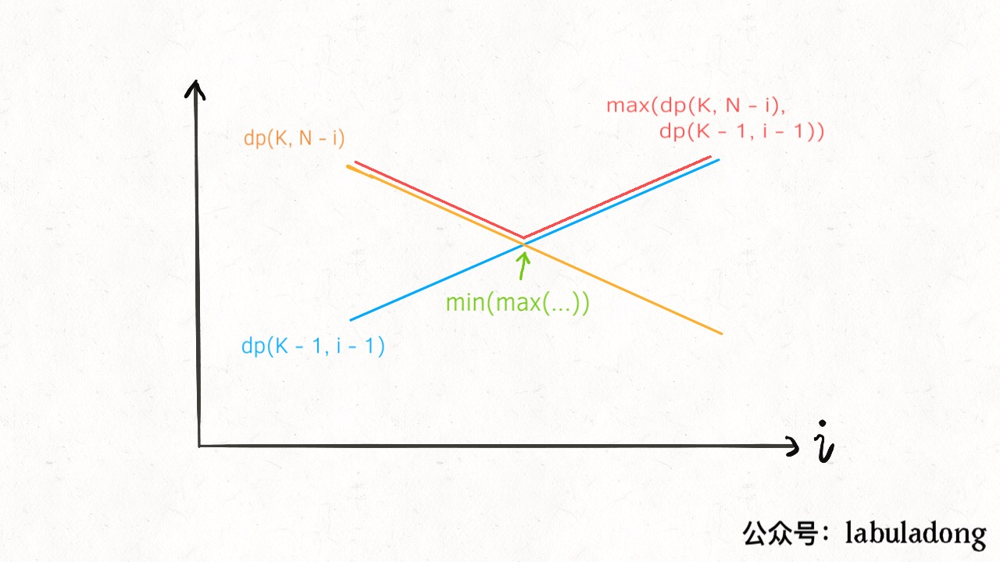
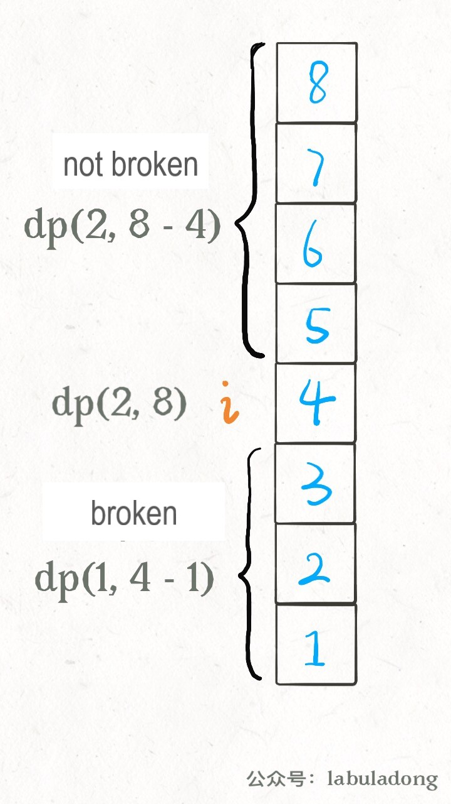
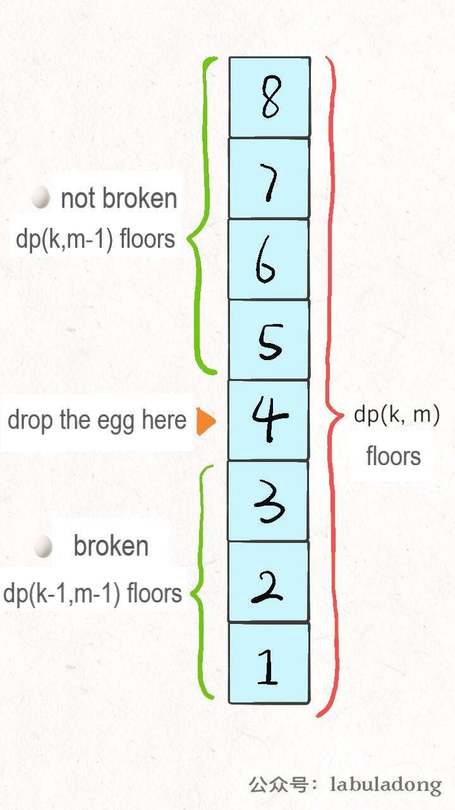

# Super Egg Drop（Advanced）

**Translator: [Jieyixia](https://github.com/Jieyixia)**

**Author: [labuladong](https://github.com/labuladong)**

The Super Egg Drop problem (Leetcode 887) has been discussed in the last article using the classic dynamic programming method. If you are not very familiar with this problem and the classic method, please read「Super Egg Drop」, which is the basic of following contents.

In this article, we will optimize this problem with other two more efficient methods. One is adding binary search into the classic dynamic programming method, the other one is redefining state transition equation. 

### Binary Search Optimization
We want to find the floor `F` for a building with `N` floors using **minimum** number of moves (Each move means dropping an egg from a certain floor). Any egg dropped at a floor higher than `F` will break, and any egg dropped at or below floor `F` will not break. First, let's review the classic dynamic programming method:

1、To know `F`, we should traverse the situations that we drop an egg from floor `i`, `1 <= i <= N` and find the situation that costs minimum number of moves;

2、Anytime we drop an egg, there are two possible outcomes: the egg is broken or not broken;

3、If the egg is broken, `F` <= `i`; else, `F` > `i`;

4. Whether the egg is broken or not depends on which outcome causes **more** moves, since the goal is to know with certainty what the value of `F` is, regardless of its initial value.

The code for state transition:

```python
# current state: K eggs, N floors
# return the optimal results under current state
def dp(K, N):
    for 1 <= i <= N:
        # the mininum moves 
        res = min(res, 
                  max( 
                        dp(K - 1, i - 1), # the egg is broken
                        dp(K, N - i)      # the egg is not broken
                     ) + 1 # drop an egg at floor i
                 )
    return res
```

The above code reflects the following state transition equation:

$$ dp(K, N) = \min_{0 <= i <= N}\{\max\{dp(K - 1, i - 1), dp(K, N - i)\} + 1\}$$

If you can understand the state transition equation, it is not difficult to understand how to use binary search to optimize the process.

From the definition of `dp(K, N)` array (the minimum number of moves with `K` eggs and `N` floors), we know that when `K` is fixed, `dp(K, N)` will increase monotonically as `N` increases. In the above state transition equation,  `dp(K - 1, i - 1)` will increase monotonically and `dp(K, N - i)` will decrease monotonically as `i` increases from 1 to `N`. 



We need to find the maximum between `dp(K - 1, i - 1)` and `dp(K, N - i)`, and then choose the minimum one among those maximum values. This means that we should get the intersection of the two straight lines (the lowest points of the red polyline).

In other article, we have mentioned that binary search is widely used in many cases, for example:

```java
for (int i = 0; i < n; i++) {
    if (isOK(i))
        return i;
}
```

In the above case, it is likely to use binary search to optimize the complexity of linear search. Review the two `dp` functions, the lowest point satisfies following condition:

```java
for (int i = 1; i <= N; i++) {
    if (dp(K - 1, i - 1) == dp(K, N - i))
        return dp(K, N - i);
}
```

If you are familiar with binary search, it is easy to know that what we need to search is the valley value. Let's look at the following code:

```python
def superEggDrop(self, K: int, N: int) -> int:
        
    memo = dict()
    def dp(K, N):
        if K == 1: return N
        if N == 0: return 0
        if (K, N) in memo:
            return memo[(K, N)]
                            
        # for 1 <= i <= N:
        #     res = min(res, 
        #             max( 
        #                 dp(K - 1, i - 1), 
        #                 dp(K, N - i)      
        #                 ) + 1 
        #             )

        res = float('INF')
        # use binary search to replace linear search
        lo, hi = 1, N
        while lo <= hi:
            mid = (lo + hi) // 2
            broken = dp(K - 1, mid - 1) # the egg is broken
            not_broken = dp(K, N - mid) # the egg is not broken
            # res = min(max(broken, not broken) + 1)
            if broken > not_broken:
                hi = mid - 1
                res = min(res, broken + 1)
            else:
                lo = mid + 1
                res = min(res, not_broken + 1)

        memo[(K, N)] = res
        return res
    
    return dp(K, N)
```
The time complexity for dynamic programming problems is **the number of sub-problems × the complexity of function**.

Regardless of the recursive part, the complexity of `dp` function is O(logN), since binary search is used.

The number of sub-problems equals to the number of different states, which is O(KN).

Therefore, the time complexity of the improved method is O(K\*N\*logN), which is more efficient than O(KN^2) of the classic dynamic programming method. The space complexity is O(KN).


### Redefine State Transition Equation

It has been mentioned in other article that the state transition equation for the same problem is not unique, resulting in different methods with different complexity.

Review the definition of the `dp` function:

```python
def dp(k, n) -> int
# current state: k eggs, n floors
# return the optimal results under current state
```

Or the `dp` array:

```python
dp[k][n] = m
# current state: k eggs, n floors
# return the optimal results under current state
```

Based on this definition, the expected answer is `dp(K, N)`. The method of exhaustion is necessary, we have to compare the results under different situations `1<=i<=N` to find the minimum. Binary search helps to reduce the search space. 

Now, we make some modifications to the definition of `dp` array, current states are `k` eggs and allowed maximum number of moves `m`. `dp[k][m] = n` represents that we can accurately determine a floor `F` for a building with at most `n` floors. More specifically:

```python
dp[k][m] = n
# current state: k eggs, at most m moves 
# `F` can be determined for a building with at most n floors

# For example: dp[1][7] = 7 represents:;
# one egg is given and you can drop an egg at certain floor 7 times;
# you can determine floor `F` for a building with at most 7 floors;
# any egg dropped at a floor higher than `F` will break;
# any egg dropped at or below floor `F` will not break.
# (search linearly from the first floor)
```

This is actually a reverse version of our original definition. We want to know the number of moves at last. But under this new definition, it is one state of the `dp` array instead of the result. This is how we deal with this problem:

```java
int superEggDrop(int K, int N) {

    int m = 0;
    while (dp[K][m] < N) {
        m++;
        // state transition...
    }
    return m;
}
```

The `while` loop ends when `dp[K][m] == N`, which means that given `K` eggs and at most `m` moves, floor `F` can be accurately determined for a building with `N` floors. This is exactly the same as before. 

Then how to find the state transition equation? Let's start from the initial idea:



You have to traverse `1<=i<=N` to find the minimum. But these are not necessary under the new definition of `dp` array. This is based on the following two facts:

**1、There are only two possible outcomes when you drop an egg at any floor: the egg is broken or not broken. If the egg is broken, go downstairs. If the egg is not broken, go upstairs**。

**2、No matter which outcome, total number of floors = the number of floors upstairs + the number of floors downstairs + 1（current floor）**。

Base on the two facts, we can write the following state transition equation:

`dp[k][m] = dp[k][m - 1] + dp[k - 1][m - 1] + 1`

**`dp[k][m - 1]` is the number of floors upstairs**. `k` keeps unchanged since the egg is not broken, `m` minus one;

**`dp[k - 1][m - 1]` is the number of floors downstairs**. `k` minus one since the egg is broken, `m` minus one.

PS: why `m` minus one instead of plus one? According to the definition, `m` is the upper bound of the number of moves, instead of the number of moves。



The code is：

```java
int superEggDrop(int K, int N) {
    // m will not exceed N (linear search)
    int[][] dp = new int[K + 1][N + 1];
    // base case:
    // dp[0][..] = 0
    // dp[..][0] = 0
    // Java intializes the array to be all 0 by default
    int m = 0;
    while (dp[K][m] < N) {
        m++;
        for (int k = 1; k <= K; k++)
            dp[k][m] = dp[k][m - 1] + dp[k - 1][m - 1] + 1;
    }
    return m;
}
```

which equals to:

```java
for (int m = 1; dp[K][m] < N; m++)
    for (int k = 1; k <= K; k++)
        dp[k][m] = dp[k][m - 1] + dp[k - 1][m - 1] + 1;
```

It seems more familiar. Since we need to get a certain index `m` of the `dp` array, `while` loop is used.

The time complexity of this algorithm is apparently O(KN), two nested `for` loop。

Moreover, `dp[m][k]` only relates to the left and left-top states, it is easy to simplify `dp` array to one dimension.

### More Optimization

In this section, we will introduce some mathematical methods without specific details.

Based on the `dp` definition in the previous section, **`dp(k, m)` increases monotonically when `m` increases. When `k` is fixed, a bigger `m` will cause a bigger `N`**。

We can also use binary search to optimize the process, `dp[K][m] == N` is the stop criterion. Time complexity further decreases to O(KlogN), we can assume `g(k, m) =`……

All right, let's stop. I think it's enough to understand the binary search method with O(K\*N\*logN) time complexity.

It is certain that we should change the for loop to find `m`:

```java
// change the linear search to binary search
// for (int m = 1; dp[K][m] < N; m++)
int lo = 1, hi = N;
while (lo < hi) {
    int mid = (lo + hi) / 2;
    if (... < N) {
        lo = ...
    } else {
        hi = ...
    }
    
    for (int k = 1; k <= K; k++)
        // state transition equation
}
```
In conclusion, the first optimization using binary search is based on the monotonicity of the `dp` function; the second optimization modifies the state transition function. For most of us, it is easier to understand the idea of binary search instead of different forms of `dp` array.

If you have grasped the basic methods well, the methods in the last section are good challenges for you.


