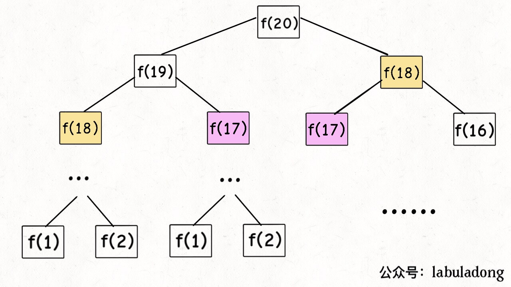
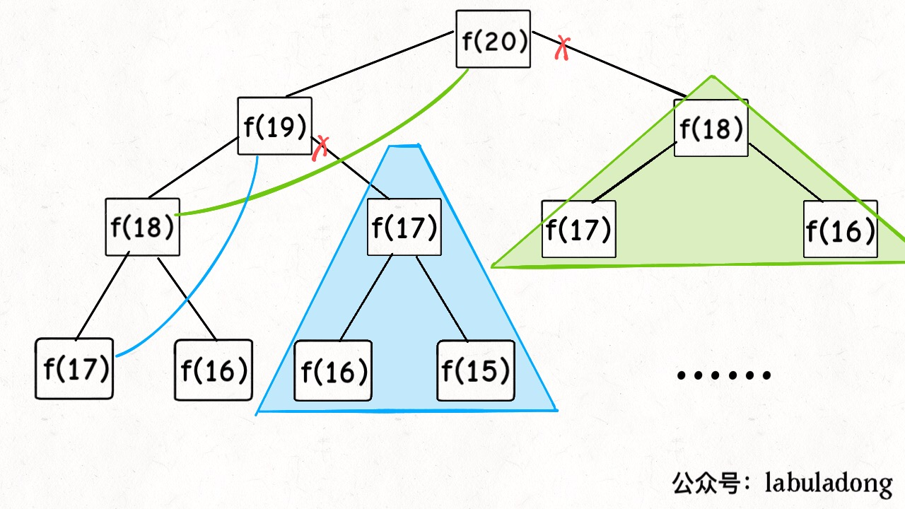
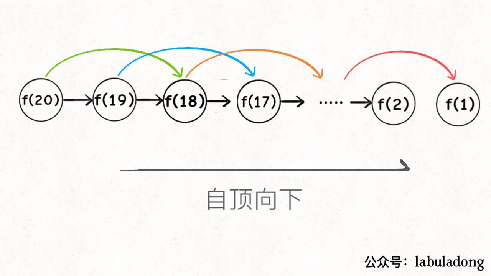
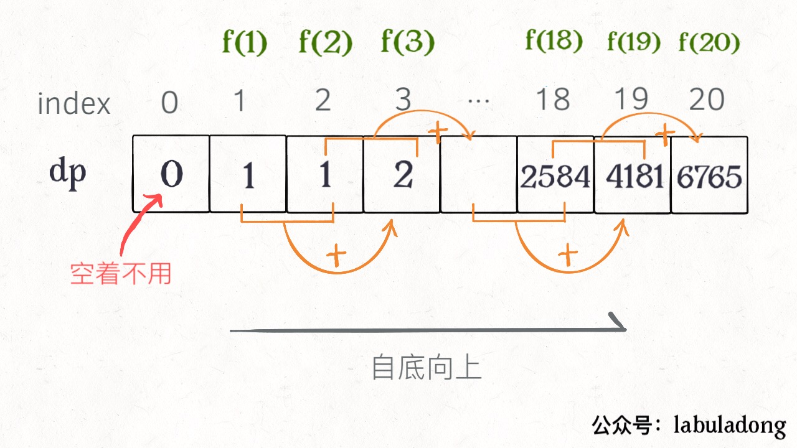
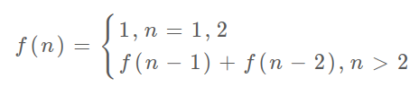
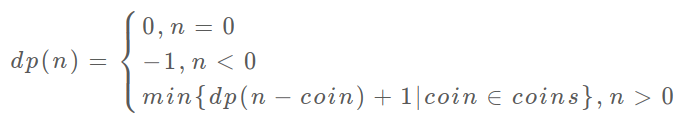
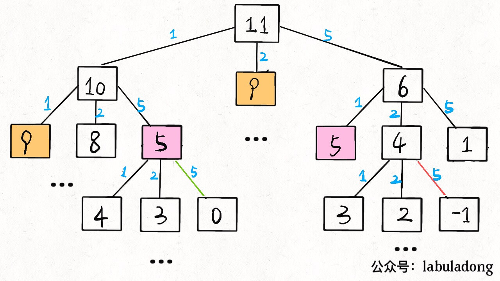
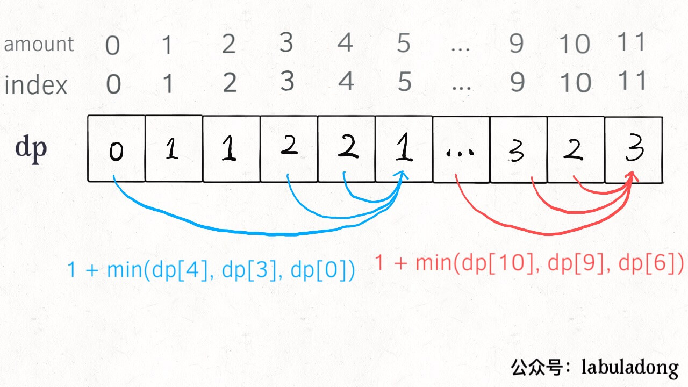

# 动态规划详解

这篇文章是我们号半年前一篇 200 多赞赏的成名之作「动态规划详解」的进阶版。由于账号迁移的原因，旧文无法被搜索到，所以我润色了本文，并添加了更多干货内容，希望本文成为解决动态规划的一部「指导方针」。

再说句题外话，我们的公众号开号至今写了起码十几篇文章拆解动态规划问题，我都整理到了公众号菜单的「文章目录」中，**它们都提到了动态规划的解题框架思维，本文就系统总结一下**。这段时间本人也从非科班小白成长到刷通半个 LeetCode，所以我总结的套路可能不适合各路大神，但是应该适合大众，毕竟我自己也是一路摸爬滚打过来的。

算法技巧就那几个套路，如果你心里有数，就会轻松很多，本文就来扒一扒动态规划的裤子，形成一套解决这类问题的思维框架。废话不多说了，上干货。

**动态规划问题的一般形式就是求最值**。动态规划其实是运筹学的一种最优化方法，只不过在计算机问题上应用比较多，比如说让你求**最长**递增子序列呀，**最小**编辑距离呀等等。

既然是要求最值，核心问题是什么呢？**求解动态规划的核心问题是穷举**。因为要求最值，肯定要把所有可行的答案穷举出来，然后在其中找最值呗。

动态规划就这么简单，就是穷举就完事了？我看到的动态规划问题都很难啊！

首先，动态规划的穷举有点特别，因为这类问题**存在「重叠子问题」**，如果暴力穷举的话效率会极其低下，所以需要「备忘录」或者「DP table」来优化穷举过程，避免不必要的计算。

而且，动态规划问题一定会**具备「最优子结构」**，才能通过子问题的最值得到原问题的最值。

另外，虽然动态规划的核心思想就是穷举求最值，但是问题可以千变万化，穷举所有可行解其实并不是一件容易的事，只有列出**正确的「状态转移方程**」才能正确地穷举。

以上提到的重叠子问题、最优子结构、状态转移方程就是动态规划三要素。具体什么意思等会会举例详解，但是在实际的算法问题中，**写出状态转移方程是最困难的**，这也就是为什么很多朋友觉得动态规划问题困难的原因，我来提供我研究出来的一个思维框架，辅助你思考状态转移方程：

明确「状态」 -> 定义 dp 数组/函数的含义 -> 明确「选择」-> 明确 base case。

下面通过斐波那契数列问题和凑零钱问题来详解动态规划的基本原理。前者主要是让你明白什么是重叠子问题（斐波那契数列严格来说不是动态规划问题），后者主要举集中于如何列出状态转移方程。

请读者不要嫌弃这个例子简单，**只有简单的例子才能让你把精力充分集中在算法背后的通用思想和技巧上，而不会被那些隐晦的细节问题搞的莫名其妙**。想要困难的例子，历史文章里有的是。

### 一、斐波那契数列

**1、暴力递归**

斐波那契数列的数学形式就是递归的，写成代码就是这样：

```cpp
int fib(int N) {
    if (N == 1 || N == 2) return 1;
    return fib(N - 1) + fib(N - 2);
}
```

这个不用多说了，学校老师讲递归的时候似乎都是拿这个举例。我们也知道这样写代码虽然简洁易懂，但是十分低效，低效在哪里？假设 n = 20，请画出递归树。

PS：但凡遇到需要递归的问题，最好都画出递归树，这对你分析算法的复杂度，寻找算法低效的原因都有巨大帮助。



这个递归树怎么理解？就是说想要计算原问题 `f(20)`，我就得先计算出子问题 `f(19)` 和 `f(18)`，然后要计算 `f(19)`，我就要先算出子问题 `f(18)` 和 `f(17)`，以此类推。最后遇到 `f(1)` 或者 `f(2)` 的时候，结果已知，就能直接返回结果，递归树不再向下生长了。

**递归算法的时间复杂度怎么计算？子问题个数乘以解决一个子问题需要的时间。**

子问题个数，即递归树中节点的总数。显然二叉树节点总数为指数级别，所以子问题个数为 O(2^n)。

解决一个子问题的时间，在本算法中，没有循环，只有 f(n - 1) + f(n - 2) 一个加法操作，时间为 O(1)。

所以，这个算法的时间复杂度为 O(2^n)，指数级别，爆炸。

观察递归树，很明显发现了算法低效的原因：存在大量重复计算，比如 `f(18)` 被计算了两次，而且你可以看到，以 `f(18)` 为根的这个递归树体量巨大，多算一遍，会耗费巨大的时间。更何况，还不止 `f(18)` 这一个节点被重复计算，所以这个算法及其低效。

这就是动态规划问题的第一个性质：**重叠子问题**。下面，我们想办法解决这个问题。

**2、带备忘录的递归解法**

明确了问题，其实就已经把问题解决了一半。即然耗时的原因是重复计算，那么我们可以造一个「备忘录」，每次算出某个子问题的答案后别急着返回，先记到「备忘录」里再返回；每次遇到一个子问题先去「备忘录」里查一查，如果发现之前已经解决过这个问题了，直接把答案拿出来用，不要再耗时去计算了。

一般使用一个数组充当这个「备忘录」，当然你也可以使用哈希表（字典），思想都是一样的。

```cpp
int fib(int N) {
    if (N < 1) return 0;
    // 备忘录全初始化为 0
    vector<int> memo(N + 1, 0);
    // 初始化最简情况
    return helper(memo, N);
}
 
int helper(vector<int>& memo, int n) {
    // base case 
    if (n == 1 || n == 2) return 1;
    // 已经计算过
    if (memo[n] != 0) return memo[n];
    memo[n] = helper(memo, n - 1) + 
                helper(memo, n - 2);
    return memo[n];
}
```

现在，画出递归树，你就知道「备忘录」到底做了什么。



实际上，带「备忘录」的递归算法，把一棵存在巨量冗余的递归树通过「剪枝」，改造成了一幅不存在冗余的递归图，极大减少了子问题（即递归图中节点）的个数。



递归算法的时间复杂度怎么算？子问题个数乘以解决一个子问题需要的时间。

子问题个数，即图中节点的总数，由于本算法不存在冗余计算，子问题就是 `f(1)`, `f(2)`, `f(3)` ... `f(20)`，数量和输入规模 n = 20 成正比，所以子问题个数为 O(n)。

解决一个子问题的时间，同上，没有什么循环，时间为 O(1)。

所以，本算法的时间复杂度是 O(n)。比起暴力算法，是降维打击。

至此，带备忘录的递归解法的效率已经和迭代的动态规划解法一样了。实际上，这种解法和迭代的动态规划已经差不多了，只不过这种方法叫做「自顶向下」，动态规划叫做「自底向上」。

啥叫「自顶向下」？注意我们刚才画的递归树（或者说图），是从上向下延伸，都是从一个规模较大的原问题比如说 `f(20)`，向下逐渐分解规模，直到 `f(1)` 和 `f(2)` 触底，然后逐层返回答案，这就叫「自顶向下」。

啥叫「自底向上」？反过来，我们直接从最底下，最简单，问题规模最小的 `f(1)` 和 `f(2)` 开始往上推，直到推到我们想要的答案 `f(20)`，这就是动态规划的思路，这也是为什么动态规划一般都脱离了递归，而是由循环迭代完成计算。

**3、dp 数组的迭代解法**

有了上一步「备忘录」的启发，我们可以把这个「备忘录」独立出来成为一张表，就叫做 DP table 吧，在这张表上完成「自底向上」的推算岂不美哉！

```cpp
int fib(int N) {
    vector<int> dp(N + 1, 0);
    // base case
    dp[1] = dp[2] = 1;
    for (int i = 3; i <= N; i++)
        dp[i] = dp[i - 1] + dp[i - 2];
    return dp[N];
}
```



画个图就很好理解了，而且你发现这个 DP table 特别像之前那个「剪枝」后的结果，只是反过来算而已。实际上，带备忘录的递归解法中的「备忘录」，最终完成后就是这个 DP table，所以说这两种解法其实是差不多的，大部分情况下，效率也基本相同。

这里，引出「状态转移方程」这个名词，实际上就是描述问题结构的数学形式：



为啥叫「状态转移方程」？为了听起来高端。你把 f(n) 想做一个状态 n，这个状态 n 是由状态 n - 1 和状态 n - 2 相加转移而来，这就叫状态转移，仅此而已。

你会发现，上面的几种解法中的所有操作，例如 return f(n - 1) + f(n - 2)，dp[i] = dp[i - 1] + dp[i - 2]，以及对备忘录或 DP table 的初始化操作，都是围绕这个方程式的不同表现形式。可见列出「状态转移方程」的重要性，它是解决问题的核心。很容易发现，其实状态转移方程直接代表着暴力解法。

**千万不要看不起暴力解，动态规划问题最困难的就是写出状态转移方程**，即这个暴力解。优化方法无非是用备忘录或者 DP table，再无奥妙可言。

这个例子的最后，讲一个细节优化。细心的读者会发现，根据斐波那契数列的状态转移方程，当前状态只和之前的两个状态有关，其实并不需要那么长的一个 DP table 来存储所有的状态，只要想办法存储之前的两个状态就行了。所以，可以进一步优化，把空间复杂度降为 O(1)：

```cpp
int fib(int n) {
    if (n == 2 || n == 1) 
        return 1;
    int prev = 1, curr = 1;
    for (int i = 3; i <= n; i++) {
        int sum = prev + curr;
        prev = curr;
        curr = sum;
    }
    return curr;
}
```

有人会问，动态规划的另一个重要特性「最优子结构」，怎么没有涉及？下面会涉及。斐波那契数列的例子严格来说不算动态规划，因为没有涉及求最值，以上旨在演示算法设计螺旋上升的过程。下面，看第二个例子，凑零钱问题。

### 二、凑零钱问题

先看下题目：给你 `k` 种面值的硬币，面值分别为 `c1, c2 ... ck`，每种硬币的数量无限，再给一个总金额 `amount`，问你**最少**需要几枚硬币凑出这个金额，如果不可能凑出，算法返回 -1 。算法的函数签名如下：

```java
// coins 中是可选硬币面值，amount 是目标金额
int coinChange(int[] coins, int amount);
```

比如说 `k = 3`，面值分别为 1，2，5，总金额 `amount = 11`。那么最少需要 3 枚硬币凑出，即 11 = 5 + 5 + 1。

你认为计算机应该如何解决这个问题？显然，就是把所有肯能的凑硬币方法都穷举出来，然后找找看最少需要多少枚硬币。

**1、暴力递归**

首先，这个问题是动态规划问题，因为它具有「最优子结构」的。**要符合「最优子结构」，子问题间必须互相独立**。啥叫相互独立？你肯定不想看数学证明，我用一个直观的例子来讲解。

比如说，你的原问题是考出最高的总成绩，那么你的子问题就是要把语文考到最高，数学考到最高…… 为了每门课考到最高，你要把每门课相应的选择题分数拿到最高，填空题分数拿到最高…… 当然，最终就是你每门课都是满分，这就是最高的总成绩。

得到了正确的结果：最高的总成绩就是总分。因为这个过程符合最优子结构，“每门科目考到最高”这些子问题是互相独立，互不干扰的。

但是，如果加一个条件：你的语文成绩和数学成绩会互相制约，此消彼长。这样的话，显然你能考到的最高总成绩就达不到总分了，按刚才那个思路就会得到错误的结果。因为子问题并不独立，语文数学成绩无法同时最优，所以最优子结构被破坏。

回到凑零钱问题，为什么说它符合最优子结构呢？比如你想求 `amount = 11` 时的最少硬币数（原问题），如果你知道凑出 `amount = 10` 的最少硬币数（子问题），你只需要把子问题的答案加一（再选一枚面值为 1 的硬币）就是原问题的答案，因为硬币的数量是没有限制的，子问题之间没有相互制，是互相独立的。

那么，既然知道了这是个动态规划问题，就要思考**如何列出正确的状态转移方程**？

**先确定「状态」**，也就是原问题和子问题中变化的变量。由于硬币数量无限，所以唯一的状态就是目标金额 `amount`。

**然后确定 `dp` 函数的定义**：当前的目标金额是 `n`，至少需要 `dp(n)` 个硬币凑出该金额。

**然后确定「选择」并择优**，也就是对于每个状态，可以做出什么选择改变当前状态。具体到这个问题，无论当的目标金额是多少，选择就是从面额列表 `coins` 中选择一个硬币，然后目标金额就会减少：

```python
# 伪码框架
def coinChange(coins: List[int], amount: int):
    # 定义：要凑出金额 n，至少要 dp(n) 个硬币
    def dp(n):
        # 做选择，选择需要硬币最少的那个结果
        for coin in coins:
            res = min(res, 1 + dp(n - coin))
        return res
    # 我们要求的问题是 dp(amount)
    return dp(amount)
```

**最后明确 base case**，显然目标金额为 0 时，所需硬币数量为 0；当目标金额小于 0 时，无解，返回 -1：

```python
def coinChange(coins: List[int], amount: int):

    def dp(n):
        # base case
        if n == 0: return 0
        if n < 0: return -1
        # 求最小值，所以初始化为正无穷
        res = float('INF')
        for coin in coins:
            subproblem = dp(n - coin)
            # 子问题无解，跳过
            if subproblem == -1: continue
            res = min(res, 1 + subproblem)

        return res if res != float('INF') else -1
    
    return dp(amount)
```

至此，状态转移方程其实已经完成了，以上算法已经是暴力解法了，以上代码的数学形式就是状态转移方程：



至此，这个问题其实就解决了，只不过需要消除一下重叠子问题，比如 `amount = 11, coins = {1,2,5}` 时画出递归树看看：



**时间复杂度分析：子问题总数 x 每个子问题的时间**。

子问题总数为递归树节点个数，这个比较难看出来，是 O(n^k)，总之是指数级别的。每个子问题中含有一个 for 循环，复杂度为 O(k)。所以总时间复杂度为 O(k * n^k)，指数级别。

**2、带备忘录的递归**

只需要稍加修改，就可以通过备忘录消除子问题：

```python
def coinChange(coins: List[int], amount: int):
    # 备忘录
    memo = dict()
    def dp(n):
        # 查备忘录，避免重复计算
        if n in memo: return memo[n]

        if n == 0: return 0
        if n < 0: return -1
        res = float('INF')
        for coin in coins:
            subproblem = dp(n - coin)
            if subproblem == -1: continue
            res = min(res, 1 + subproblem)
        
        # 记入备忘录
        memo[n] = res if res != float('INF') else -1
        return memo[n]
    
    return dp(amount)
```

不画图了，很显然「备忘录」大大减小了子问题数目，完全消除了子问题的冗余，所以子问题总数不会超过金额数 n，即子问题数目为 O(n)。处理一个子问题的时间不变，仍是 O(k)，所以总的时间复杂度是 O(kn)。

**3、dp 数组的迭代解法**

当然，我们也可以自底向上使用 dp table 来消除重叠子问题，`dp` 数组的定义和刚才 `dp` 函数类似，定义也是一样的：

**`dp[i] = x` 表示，当目标金额为 `i` 时，至少需要 `x` 枚硬币**。

```cpp
int coinChange(vector<int>& coins, int amount) {
    // 数组大小为 amount + 1，初始值也为 amount + 1
    vector<int> dp(amount + 1, amount + 1);
    // base case
    dp[0] = 0;
    for (int i = 0; i < dp.size(); i++) {
        // 内层 for 在求所有子问题 + 1 的最小值
        for (int coin : coins) {
            // 子问题无解，跳过
            if (i - coin < 0) continue;
            dp[i] = min(dp[i], 1 + dp[i - coin]);
        }
    }
    return (dp[amount] == amount + 1) ? -1 : dp[amount];
}
```



PS：为啥 `dp` 数组初始化为 `amount + 1` 呢，因为凑成 `amount` 金额的硬币数最多只可能等于 `amount`（全用 1 元面值的硬币），所以初始化为 `amount + 1` 就相当于初始化为正无穷，便于后续取最小值。

### 三、最后总结

第一个斐波那契数列的问题，解释了如何通过「备忘录」或者「dp table」的方法来优化递归树，并且明确了这两种方法本质上是一样的，只是自顶向下和自底向上的不同而已。

第二个凑零钱的问题，展示了如何流程化确定「状态转移方程」，只要通过状态转移方程写出暴力递归解，剩下的也就是优化递归树，消除重叠子问题而已。

如果你不太了解动态规划，还能看到这里，真得给你鼓掌，相信你已经掌握了这个算法的设计技巧。

**计算机解决问题其实没有任何奇技淫巧，它唯一的解决办法就是穷举**，穷举所有可能性。算法设计无非就是先思考“如何穷举”，然后再追求“如何聪明地穷举”。

列出动态转移方程，就是在解决“如何穷举”的问题。之所以说它难，一是因为很多穷举需要递归实现，二是因为有的问题本身的解空间复杂，不那么容易穷举完整。

备忘录、DP table 就是在追求“如何聪明地穷举”。用空间换时间的思路，是降低时间复杂度的不二法门，除此之外，试问，还能玩出啥花活？

**致力于把算法讲清楚！欢迎关注我的微信公众号 labuladong，查看更多通俗易懂的文章**：


[上一篇：学习数据结构和算法读什么书](../算法思维系列/为什么推荐算法4.md)

[下一篇：动态规划答疑篇](../动态规划系列/最优子结构.md)

[目录](../README.md#目录)