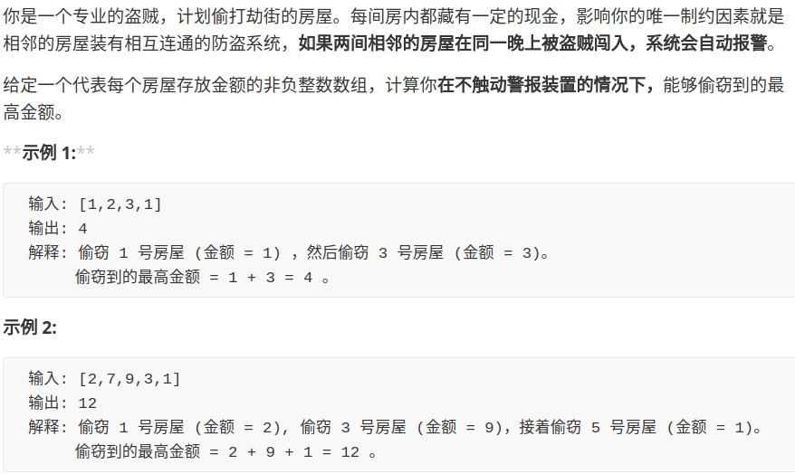
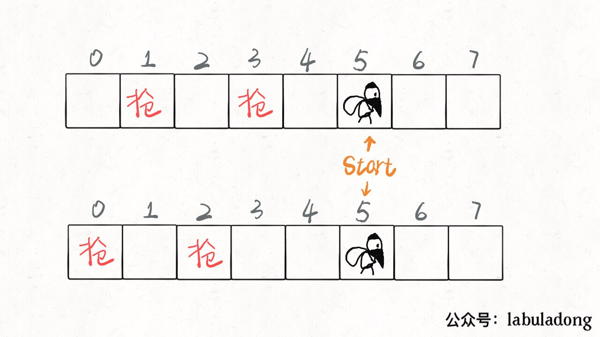
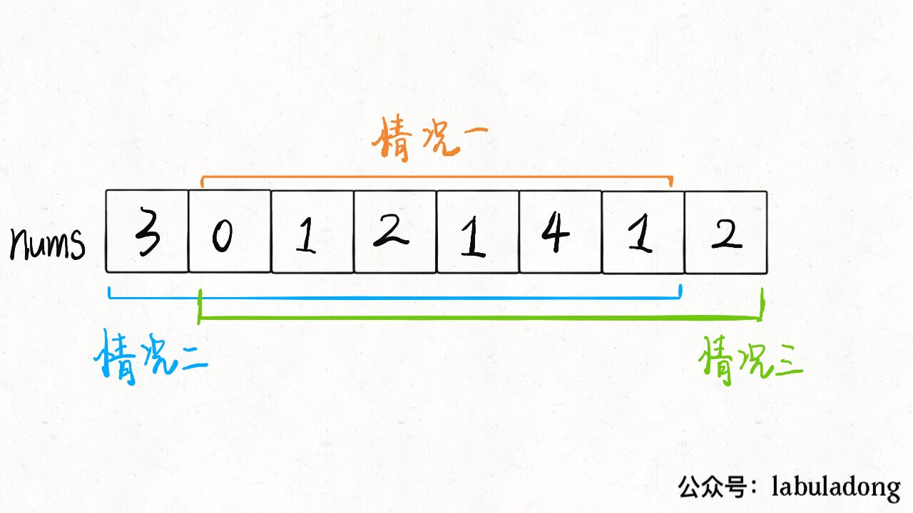
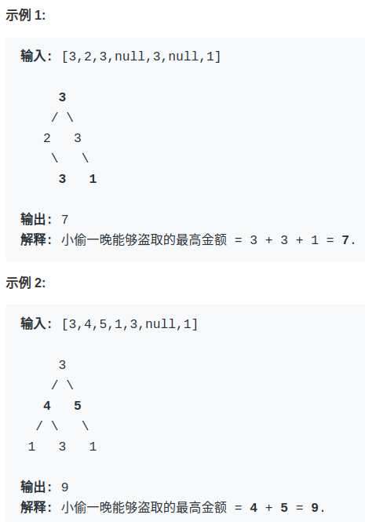

# 团灭 LeetCode 打家劫舍问题

有读者私下问我 LeetCode 「打家劫舍」系列问题（英文版叫 House Robber）怎么做，我发现这一系列题目的点赞非常之高，是比较有代表性和技巧性的动态规划题目，今天就来聊聊这道题目。

打家劫舍系列总共有三道，难度设计非常合理，层层递进。第一道是比较标准的动态规划问题，而第二道融入了环形数组的条件，第三道更绝，把动态规划的自底向上和自顶向下解法和二叉树结合起来，我认为很有启发性。如果没做过的朋友，建议学习一下。

下面，我们从第一道开始分析。

### House Robber I



```java
public int rob(int[] nums);
```

题目很容易理解，而且动态规划的特征很明显。我们前文「动态规划详解」做过总结，**解决动态规划问题就是找「状态」和「选择」，仅此而已**。

假想你就是这个专业强盗，从左到右走过这一排房子，在每间房子前都有两种**选择**：抢或者不抢。

如果你抢了这间房子，那么你**肯定**不能抢相邻的下一间房子了，只能从下下间房子开始做选择。

如果你不抢这件房子，那么你可以走到下一间房子前，继续做选择。

当你走过了最后一间房子后，你就没得抢了，能抢到的钱显然是 0（**base case**）。

以上的逻辑很简单吧，其实已经明确了「状态」和「选择」：**你面前房子的索引就是状态，抢和不抢就是选择**。


在两个选择中，每次都选更大的结果，最后得到的就是最多能抢到的 money：

```java
// 主函数
public int rob(int[] nums) {
    return dp(nums, 0);
}
// 返回 nums[start..] 能抢到的最大值
private int dp(int[] nums, int start) {
    if (start >= nums.length) {
        return 0;
    }
    
    int res = Math.max(
            // 不抢，去下家
            dp(nums, start + 1), 
            // 抢，去下下家
            nums[start] + dp(nums, start + 2)
        );
    return res;
}
```

明确了状态转移，就可以发现对于同一 `start` 位置，是存在重叠子问题的，比如下图：



盗贼有多种选择可以走到这个位置，如果每次到这都进入递归，岂不是浪费时间？所以说存在重叠子问题，可以用备忘录进行优化：

```java
private int[] memo;
// 主函数
public int rob(int[] nums) {
    // 初始化备忘录
    memo = new int[nums.length];
    Arrays.fill(memo, -1);
    // 强盗从第 0 间房子开始抢劫
    return dp(nums, 0);
}

// 返回 dp[start..] 能抢到的最大值
private int dp(int[] nums, int start) {
    if (start >= nums.length) {
        return 0;
    }
    // 避免重复计算
    if (memo[start] != -1) return memo[start];
    
    int res = Math.max(dp(nums, start + 1), 
                    nums[start] + dp(nums, start + 2));
    // 记入备忘录
    memo[start] = res;
    return res;
}
```

这就是自顶向下的动态规划解法，我们也可以略作修改，写出**自底向上**的解法：

```java
 int rob(int[] nums) {
    int n = nums.length;
    // dp[i] = x 表示：
    // 从第 i 间房子开始抢劫，最多能抢到的钱为 x
    // base case: dp[n] = 0
    int[] dp = new int[n + 2];
    for (int i = n - 1; i >= 0; i--) {
        dp[i] = Math.max(dp[i + 1], nums[i] + dp[i + 2]);
    }
    return dp[0];
}
```

我们又发现状态转移只和 `dp[i]` 最近的两个状态有关，所以可以进一步优化，将空间复杂度降低到 O(1)。

```java
int rob(int[] nums) {
    int n = nums.length;
    // 记录 dp[i+1] 和 dp[i+2]
    int dp_i_1 = 0, dp_i_2 = 0;
    // 记录 dp[i]
    int dp_i = 0; 
    for (int i = n - 1; i >= 0; i--) {
        dp_i = Math.max(dp_i_1, nums[i] + dp_i_2);
        dp_i_2 = dp_i_1;
        dp_i_1 = dp_i;
    }
    return dp_i;
}
```

以上的流程，在我们「动态规划详解」中详细解释过，相信大家都能手到擒来了。我认为很有意思的是这个问题的 follow up，需要基于我们现在的思路做一些巧妙的应变。

### House Robber II

这道题目和第一道描述基本一样，强盗依然不能抢劫相邻的房子，输入依然是一个数组，但是告诉你**这些房子不是一排，而是围成了一个圈**。

也就是说，现在第一间房子和最后一间房子也相当于是相邻的，不能同时抢。比如说输入数组 `nums=[2,3,2]`，算法返回的结果应该是 3 而不是 4，因为开头和结尾不能同时被抢。

这个约束条件看起来应该不难解决，我们前文「单调栈解决 Next Greater Number」说过一种解决环形数组的方案，那么在这个问题上怎么处理呢？

首先，首尾房间不能同时被抢，那么只可能有三种不同情况：要么都不被抢；要么第一间房子被抢最后一间不抢；要么最后一间房子被抢第一间不抢。



那就简单了啊，这三种情况，那种的结果最大，就是最终答案呗！不过，其实我们不需要比较三种情况，只要比较情况二和情况三就行了，**因为这两种情况对于房子的选择余地比情况一大呀，房子里的钱数都是非负数，所以选择余地大，最优决策结果肯定不会小**。

所以只需对之前的解法稍作修改即可：

```java
public int rob(int[] nums) {
    int n = nums.length;
    if (n == 1) return nums[0];
    return Math.max(robRange(nums, 0, n - 2), 
                    robRange(nums, 1, n - 1));
}

// 仅计算闭区间 [start,end] 的最优结果
int robRange(int[] nums, int start, int end) {
    int n = nums.length;
    int dp_i_1 = 0, dp_i_2 = 0;
    int dp_i = 0;
    for (int i = end; i >= start; i--) {
        dp_i = Math.max(dp_i_1, nums[i] + dp_i_2);
        dp_i_2 = dp_i_1;
        dp_i_1 = dp_i;
    }
    return dp_i;
}
```

至此，第二问也解决了。

### House Robber III

第三题又想法设法地变花样了，此强盗发现现在面对的房子不是一排，不是一圈，而是一棵二叉树！房子在二叉树的节点上，相连的两个房子不能同时被抢劫，果然是传说中的高智商犯罪：



整体的思路完全没变，还是做抢或者不抢的选择，去收益较大的选择。甚至我们可以直接按这个套路写出代码：

```java
Map<TreeNode, Integer> memo = new HashMap<>();
public int rob(TreeNode root) {
    if (root == null) return 0;
    // 利用备忘录消除重叠子问题
    if (memo.containsKey(root)) 
        return memo.get(root);
    // 抢，然后去下下家
    int do_it = root.val
        + (root.left == null ? 
            0 : rob(root.left.left) + rob(root.left.right))
        + (root.right == null ? 
            0 : rob(root.right.left) + rob(root.right.right));
    // 不抢，然后去下家
    int not_do = rob(root.left) + rob(root.right);
    
    int res = Math.max(do_it, not_do);
    memo.put(root, res);
    return res;
}
```

这道题就解决了，时间复杂度 O(N)，`N` 为数的节点数。

但是这道题让我觉得巧妙的点在于，还有更漂亮的解法。比如下面是我在评论区看到的一个解法：

```java
int rob(TreeNode root) {
    int[] res = dp(root);
    return Math.max(res[0], res[1]);
}

/* 返回一个大小为 2 的数组 arr
arr[0] 表示不抢 root 的话，得到的最大钱数
arr[1] 表示抢 root 的话，得到的最大钱数 */
int[] dp(TreeNode root) {
    if (root == null)
        return new int[]{0, 0};
    int[] left = dp(root.left);
    int[] right = dp(root.right);
    // 抢，下家就不能抢了
    int rob = root.val + left[0] + right[0];
    // 不抢，下家可抢可不抢，取决于收益大小
    int not_rob = Math.max(left[0], left[1])
                + Math.max(right[0], right[1]);
    
    return new int[]{not_rob, rob};
}
```

时间复杂度 O(N)，空间复杂度只有递归函数堆栈所需的空间，不需要备忘录的额外空间。

你看他和我们的思路不一样，修改了递归函数的定义，略微修改了思路，使得逻辑自洽，依然得到了正确的答案，而且代码更漂亮。这就是我们前文「不同定义产生不同解法」所说过的动态规划问题的一个特性。

实际上，这个解法比我们的解法运行时间要快得多，虽然算法分析层面时间复杂度是相同的。原因在于此解法没有使用额外的备忘录，减少了数据操作的复杂性，所以实际运行效率会快。


坚持原创高质量文章，致力于把算法问题讲清楚，欢迎关注我的公众号 labuladong 获取最新文章：


[上一篇：团灭 LeetCode 股票买卖问题](../动态规划系列/团灭股票问题.md)

[下一篇：动态规划之四键键盘](../动态规划系列/动态规划之四键键盘.md)

[目录](../README.md#目录)