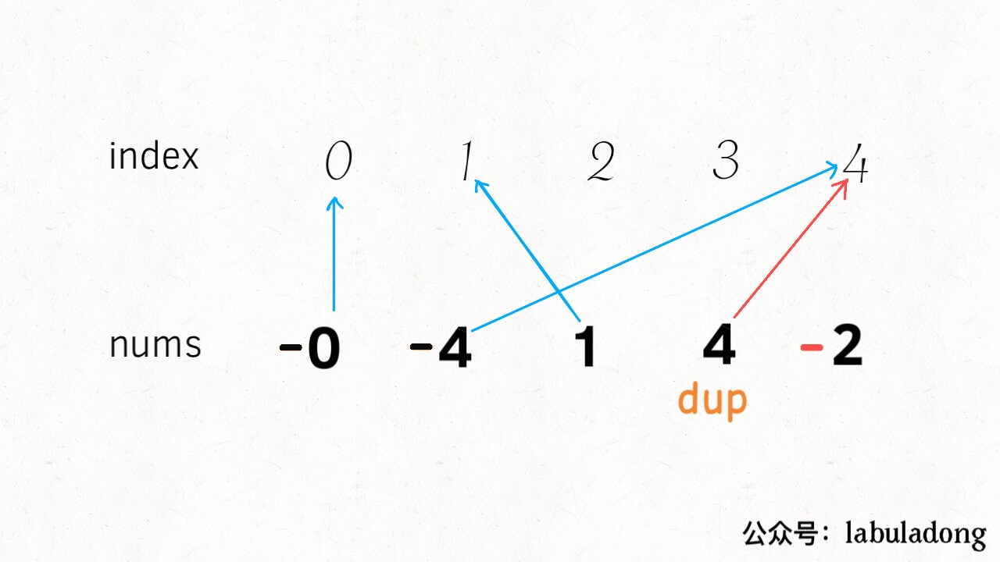

# How to Find Duplicate and Missing Element

**Translator: [bryceustc](https://github.com/bryceustc)**

**Author: [labuladong](https://github.com/labuladong)**

Today we are going to talk about a simple but skillfull problem: find duplicate and missing element. It seems to be similar to the previous problem [How to Find Missing Elements](./missing_elements.md), but there are some difference between these two problems.

Here is the detailed description of this problem(LeetCode 645: Set Mismatch)

The set ``S``originally contains numbers from `1` to ``n``. But unfortunately, due to the data error, one of the numbers in the set got duplicate to **another** number in the set, which results in repetition of one number and loss of another number.

Given an array ``nums`` representing the data status of this set after the error. Your task is to firstly find the number occurs twice and then find the number that is missing. Return them in the form of an array.

**Example 1:**

```
Input: nums = [1,2,2,4]
Output: [2,3]
```

Actually, it's easy to solve this problem. Firstly, traverse over the whole `nums` array and use HashMap to store the number of times each element of the  array. After this, we can consider every number from `1` to `n`, and check for its presence in map.

But here's a problem.  This solution requires a HashMap that means the space complexity is O(n). We check the condition again.  Consider the numbers from `1` to `n`, which happens to be one duplicate element and one missing element. There must be something strange about things going wrong.

We must traverse over the whole `nums` array of size `n` for each of the numbers from `1` to `n`. That means the time complexity is O(n). So we can think how to save the space used to reduce the space complexity to O(1).

## Analysis

The characteristic of this problem is that each element has a certain correspondence with the array index.

Let's change the condition of the problem temporarily. Change the elements in ``nums`` array to ``[0..N-1]``. Therefore, each element corresponds exactly to an array index, which is easy to understand.

We assume that there are no duplicate or missing elements in the array. Therefore, each element corresponds to a unique index value.

But the question now is one number is repeated that results which results in  loss of another number. What would happen? This will result in two elements corresponding to the same index, and there will be an index with no elements to correspond. 

If we can somehow find the duplicate corresponding index, which means we find the duplicate element. Then find the index that no element to correspond that also means we find the missing element.

So, how do you determine how many elements of an index correspond to without using extra space? Here is the subtlety of the question.

**By turning the element corresponding to each index into a negative number, it indicates that this index has been mapped once.**


If we find a  duplicate element `4`,  the intuitive result is that the element corresponding to index `4 `is already negative.



For the missing element `3`,  the intuitive result is that the element corresponding to index `3 `is positive.


Therefore, we can code as follows:
```c++
vector<int> findErrorNums(vector<int>& nums) {
    int n = nums.size();
    int dup = -1;
    for (int i = 0; i < n; i++) {
        int index = abs(nums[i]);
        // nums[index] < 0  means find the duplicate element
        if (nums[index] < 0)
            dup = abs(nums[i]);
        else
            nums[index] *= -1;
    }

    int missing = -1;
    for (int i = 0; i < n; i++)
        // nums[i] > 0 means find the missing element
        if (nums[i] > 0)
            missing = i;
    
    return {dup, missing};
}
```

Now, the question is basically solved. But don't forget that we have just assumed that the elements in ``nums`` array is from `0` to `N-1`. Actually, it should be `1` to `N`. So we need to modify two places to get the right answer to the original question.

```c++
vector<int> findErrorNums(vector<int>& nums) {
    int n = nums.size();
    int dup = -1;
    for (int i = 0; i < n; i++) {
        // Now, elements  start at 1
        int index = abs(nums[i]) - 1;
        if (nums[index] < 0)
            dup = abs(nums[i]);
        else
            nums[index] *= -1;
    }

    int missing = -1;
    for (int i = 0; i < n; i++)
        if (nums[i] > 0)
            // Convert index to element
            missing = i + 1;
    
    return {dup, missing};
}
```

In fact, it makes sense for elements to start from `1`, and it must start with a non-zero number. If the element starts from  `0`, the opposite number of `0` is still itself. So when the number `0` is repeated or missing, we can't deal with this situation. Our previous assumption was just to simplify the problem and make it easier to understand.

## Summary

**The key point is that elements and indexes appear in pairs for this kind of problems.  Common methods include Sorting, XOR, and Map**

The idea of Map is the above analysis. Mapping each index and element, and recording whether an element is mapped with a sign.

The Sorting method is also easy to understand. For this problem, we can assume that if all elements are sorted from smallest to largest. If we find that the corresponding elements of the index didn't match, so we find duplicate and missing elements.

XOR operation is also commonly used. The XOR operation (`^`) has a special property: the result of a number XOR itself is 0, and the result of a number with 0 is itself. For instance: ``a ^ a = 0, a ^ 0 = a``. If we take  XOR of the index and element at the same time, the paired index and element can be eliminated, and the remaining are duplicate or missing elements. You can look at the previous article [Find Missing Elements](./missing_elements.md) which introduce this method.

_We can stop by now._