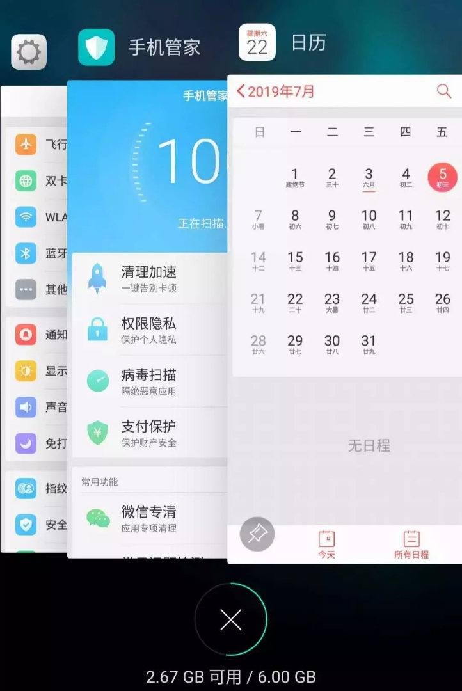
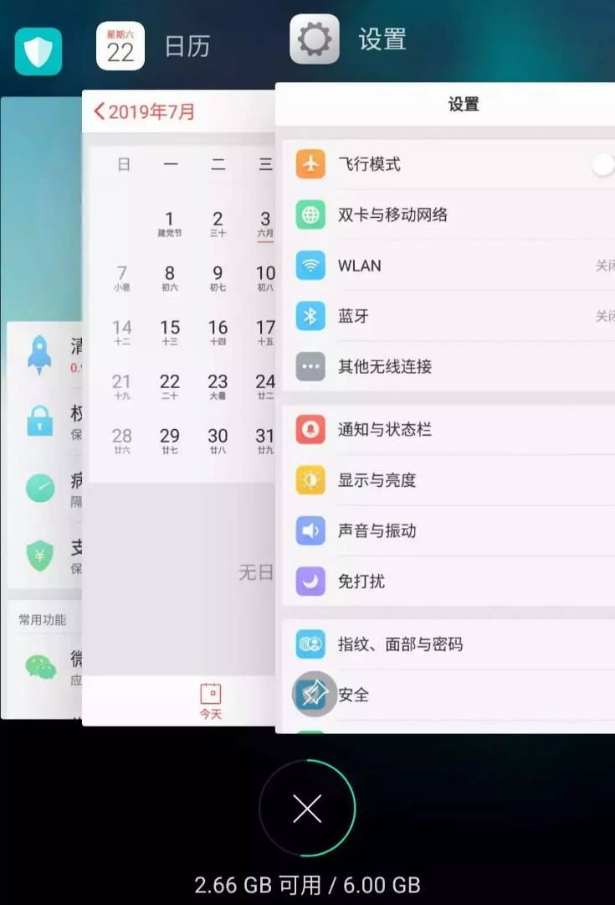
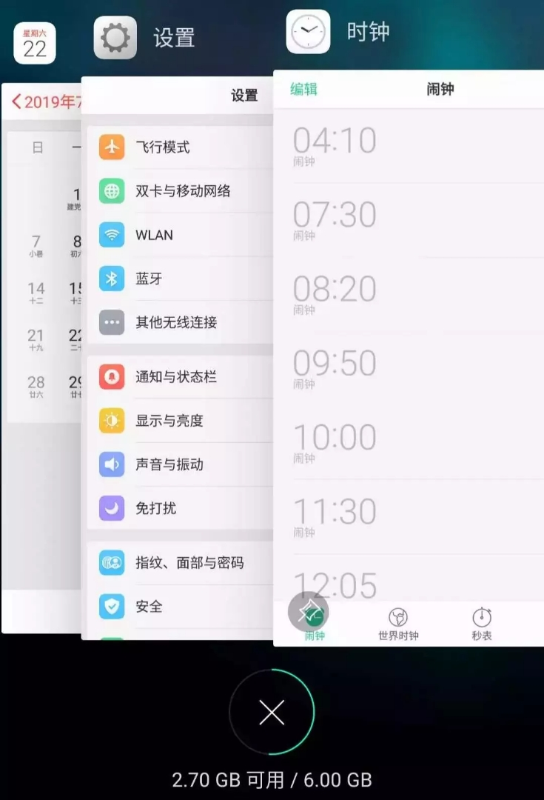

# Detailed Analysis of LRU Algorithm

**Translator: [youyun](https://github.com/youyun)**

**Author: [labuladong](https://github.com/labuladong)**

### 1. What is LRU Algorithm

It is just a cache clean-up strategy.

A computer has limited memory cache. If the cache is full, some contents need to be removed from cache to provide space for new content. However, which part of the cache should be removed? We hope to remove not so useful contents, while leaving useful contents untouched for future usage. So the question is, what are the criteria to determine if the data is _useful_ or not?

LRU (Least Recently Used) cache clean-up algorithm is a common strategy. According to the name, the latest used data should be _useful_. Hence, when the memory cache is full, we should prioritize removing those data that haven't been used for long are not useful.

For example, an Android phone can run apps in the background. If I opened in sequence: Settings, Phone Manager, and Calendar, their order in the background will be shown as following:



If I switch to Settings now, Settings will be brought to the first:



Assume that my phone only allows me to open 3 apps simultaneously, then the cache is already full by now. If I open another app, Clock, then I have to close another app to free up space for Clock. Which one should be closed?

According to LRU strategy, the lowest app, Phone Manager, should be closed, because it is the longest unused app. Afterwards, the newly opened app will be on the top:



Now you should understand LRU (Least Recently Used) strategy. There are some other strategies available, for example, LFU (Least Frequently Used) strategy, etc. Different strategies can be applied in different use cases. We'll focus on LRU in this article.

### 2. LRU Algorithm Description

LRU algorithm is actually about data structure design: 
1. Take a parameter, `capacity`, as the maximum size; then
2. Implement two APIs:
    * `put(key, val)`: to store key-value pair
    * `get(key)`: return the value associated with the key; return -1 if the key doesn't exist.
3. The time complexity for both `get` and `put` should be __O(1)__.

Let's use an example to understand how the LRU algorithm works.

```cpp
/* Cache capacity is 2 */
LRUCache cache = new LRUCache(2);
// Assume the cache is an queue
// The head is on the left, while the tail is on the right
// The latest used is at the head, while the longest unused is at the tail
// Bracket represents key-value pair, (key, val)

cache.put(1, 1);
// cache = [(1, 1)]
cache.put(2, 2);
// cache = [(2, 2), (1, 1)]
cache.get(1);       // return 1
// cache = [(1, 1), (2, 2)]
// Remarks: because key 1 is visited, move it to the head
// Return the value, 1, associated with key 1
cache.put(3, 3);
// cache = [(3, 3), (1, 1)]
// Remarks: the memory capacity is full
// We need to remove some contents to free up space
// Removal will prioritize longest unused data, which is at the tail
// Afterwards, insert the new data at the head
cache.get(2);       // return -1 (not found)
// cache = [(3, 3), (1, 1)]
// Remarks: key 2 does not exist in the cache
cache.put(1, 4);    
// cache = [(1, 4), (3, 3)]
// Remarks: key 1 exists
// Overwrite with new value 4
// Don't forget to bring the key to the head
```

### 3. LRU Algorithm Design

Through analysis of the above steps, if time complexity for `put` and `get` are both O(1), we can summarize features of this cache data structure: fast search, fast insertion, fast deletion, and ordered.
- _Ordered_: Obviously, the data has to be ordered to distinguish recently used and longest unused.
- _Fast Search_: We also need to be able to find if a key exists in the cache.
- _Fast Deletion_: If the cache is full, we need to delete the last element.
- _Fast Insertion_: We need to insert the data to the head upon each visit.

Which data structure can fulfill the above requirements? Hash table can search fast, but the data is unordered. Data in linked list is ordered, and can be inserted or deleted fast, but is hard to search. Combining these two, we can come up with a new data structure: __hash linked list__.

The core data structure of LRU cache algorithm is hash linked list, a combination of doubly linked list and hash table. Here is how the data structure looks:


The idea is simple - using a hash table to provide the ability of fast search to linked list. Think again about the previous example, isn't this data structure the perfect solution for LRU cache data structure?

Some audience may wonder, why doubly linked list? Can't single linked list work? Since key exists in hash table, why do we have to store the key-value pairs in linked list instead of values only?

The answers only afloat when we actually do it. We can only understand the rationale behind the design after we implement the LRU algorithm ourselves. Let's look at the code.

### 4. Implementation

A lot of programming languages have built-in hash linked list, or LRU-alike functions. To help understand the details of the LRU algorithm, let's use Java to reinvent the wheel.

First, define the `Node` class of doubly linked list. Assuming both `key` and `val` are of type `int`.

```java
class Node {
    public int key, val;
    public Node next, prev;
    public Node(int k, int v) {
        this.key = k;
        this.val = v;
    }
}
```

Using our `Node` class, implement a doubly linked list with the necessary APIs (the time complexity of these functions are all O(1)):

```java
class DoubleList {  
    // Add x at the head, time complexity O(1)
    public void addFirst(Node x);

    // Delete node x in the linked list (x is guaranteed to exist)
    // Given a node in a doubly linked list, time complexity O(1)
    public void remove(Node x);
    
    // Delete and return the last node in the linked list, time complexity O(1)
    public Node removeLast();
    
    // Return the length of the linked list, time complexity O(1)
    public int size();
}
```

P.S. This is the typical interface of a doubly linked list. In order to focus on the LRU algorithm, we'll skip the detailed implementation of functions in this class.

Now we can answer the question, why we have to use a doubly linked list. In order to delete a node, we not only need to get the pointer of the node itself, but also need to update the node before and the node after. Only using a doubly linked list, we can guarantee the time complexity is O(1).

With the doubly linked list, we just need to use it in with a hash table in the LRU algorithm. Let's sort out the logic with pseudo code:

```java
// key associated with Node(key, val)
HashMap<Integer, Node> map;
// Node(k1, v1) <-> Node(k2, v2)...
DoubleList cache;

int get(int key) {
    if (key does not exist) {
        return -1;
    } else {        
        bring (key, val) to the head;
        return val;
    }
}

void put(int key, int val) {
    Node x = new Node(key, val);
    if (key exists) {
        delete the old node;
        insert the new node x to the head;
    } else {
        if (cache is full) {
            delete the last node in the linked list;
            delete the associated value in map;
        } 
        insert the new node x to the head;
        associate the new node x with key in map;
    }
}
```

If you can understand the logic above, it's easy to translate to code:

```java
class LRUCache {
    // key -> Node(key, val)
    private HashMap<Integer, Node> map;
    // Node(k1, v1) <-> Node(k2, v2)...
    private DoubleList cache;
    // Max capacity
    private int cap;
    
    public LRUCache(int capacity) {
        this.cap = capacity;
        map = new HashMap<>();
        cache = new DoubleList();
    }
    
    public int get(int key) {
        if (!map.containsKey(key))
            return -1;
        int val = map.get(key).val;
        // Using put method to bring it forward to the head
        put(key, val);
        return val;
    }
    
    public void put(int key, int val) {
        // Initialize new node x
        Node x = new Node(key, val);
        
        if (map.containsKey(key)) {
            // Delete the old node, add to the head
            cache.remove(map.get(key));
            cache.addFirst(x);
            // Update the corresponding record in map
            map.put(key, x);
        } else {
            if (cap == cache.size()) {
                // Delete the last node in the linked list
                Node last = cache.removeLast();
                map.remove(last.key);
            }
            // Add to the head
            cache.addFirst(x);
            map.put(key, x);
        }
    }
}
```

This can answer the previous question, why we need to store key-value pair in the linked list, instead of value only. Pay attention to the block of code below:

```java
if (cap == cache.size()) {
    // Delete the last node
    Node last = cache.removeLast();
    map.remove(last.key);
}
```

If the cache is full, we not only need to delete the last node, but also need to delete the key in the map, where we can only get the key through the node. If we only store value in a node, we can't get the key, and hence, can't delete the key from the map.

Till now, you should have understood the idea and implementation of LRU algorithm. One common mistake is to update associated entries in the hash table when you deal with nodes in the linked list.
