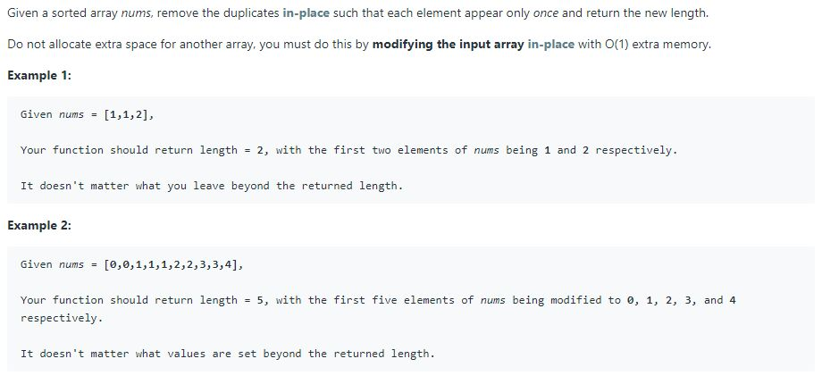
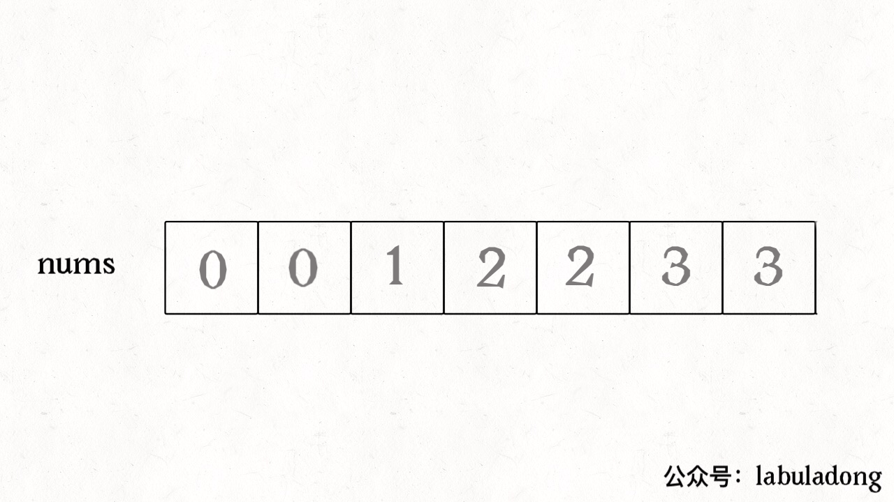
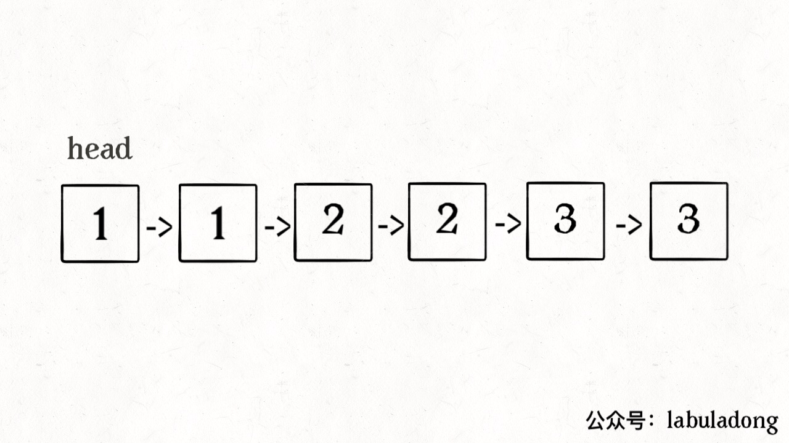

# Remove Duplicates from Sorted Array

**Translator: [Hi_archer](https://hiarcher.top/)**

**Author: [labuladong](https://github.com/labuladong)**

We know that for arrays,it is efficient to insert and delete elements at the end,with a time complexity of O(1).However, if we insert and delete elements at the middle or the beginning,it will move many data, with a time complexity of O(N).

Therefore, for the general algorithm problems dealing with arrays, we need to operate on the elements at the end of the array as much as possible to avoid additional time complexity

This article is on how to remove Duplicates from Sorted Array.



Obviously, since the array is sorted, the duplicate elements must be connected together, so it's not difficult to find them, but if you delete each duplicate element as soon as you find it, you're going to delete it in the middle of the array, and the total time complexity is going to be $O(N^2)$.And the problem asking us must do this by modifying the input array in-place with O(1) extra memory.

In fact,**for the array related algorithm problem,there is a general technique: try to avoid deleting the element in the middle, then I want to find a way to swap the element to the last**.In this way,the elements to be deleted are dragged to the end of the array and the time complexity of a single deletion is reduced to $O(1)$.

Through this idea, we can derive a common way to solve similar requirements——the two-pointer technique.To be specific, it should be fast or slow pointer.

We let the slow pointer `slow` go to the back of the array, and the fast pointer` fast` go ahead to find the way. If we find a unique element,let` slow` move forward. In this way, when the `fast` pointer traverses the entire array` nums`, **`nums [0..slow]` is a unique element, and all subsequent elements are repeated elements**.

```java
int removeDuplicates(int[] nums) {
    int n = nums.length;
    if (n == 0) return 0;
    int slow = 0, fast = 1;
    while (fast < n) {
        if (nums[fast] != nums[slow]) {
            slow++;
            // Maintain no repetition of nums[0..slow] 
            nums[slow] = nums[fast];
        }
        fast++;
    }
    //The length is index + 1 
    return slow + 1;
}
```

Look at the process of algorithm implementation:



Extending it briefly,how to remove Duplicates from Sorted list.In fact, it is exactly the same as an array.The only difference is that the array assignment operation is turned into an operation pointer:

```java
ListNode deleteDuplicates(ListNode head) {
    if (head == null) return null;
    ListNode slow = head, fast = head.next;
    while (fast != null) {
        if (fast.val != slow.val) {
            // nums[slow] = nums[fast];
            slow.next = fast;
            // slow++;
            slow = slow.next;
        }
        // fast++
        fast = fast.next;
    }
    // The list disconnects from the following repeating elements
    slow.next = null;
    return head;
}
```




