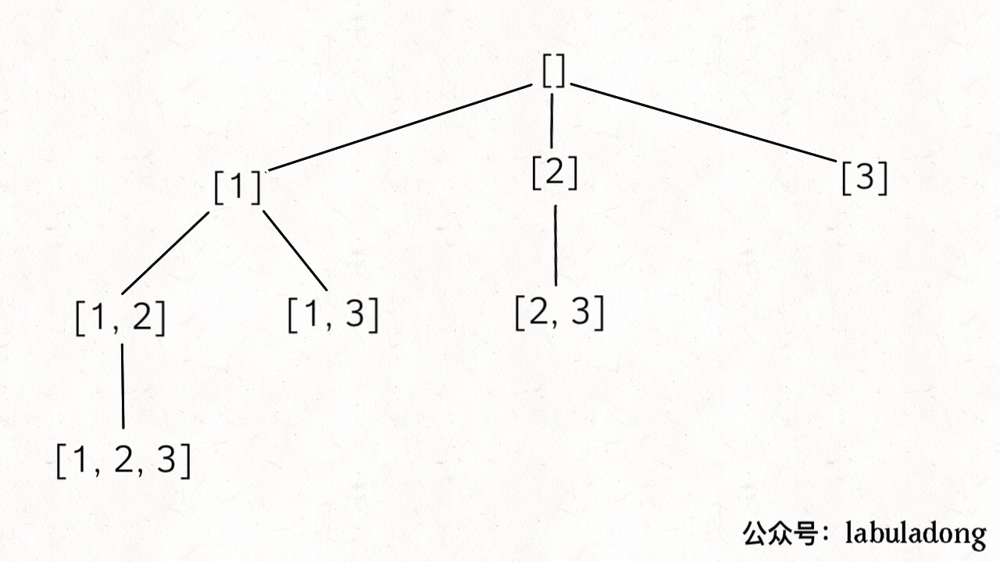
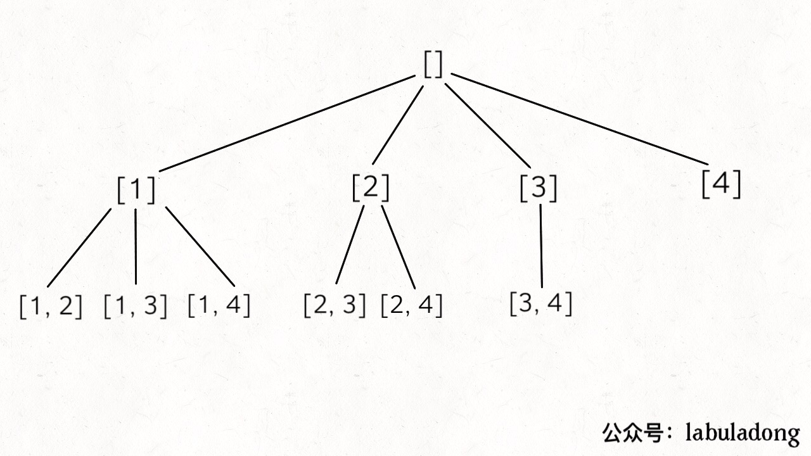
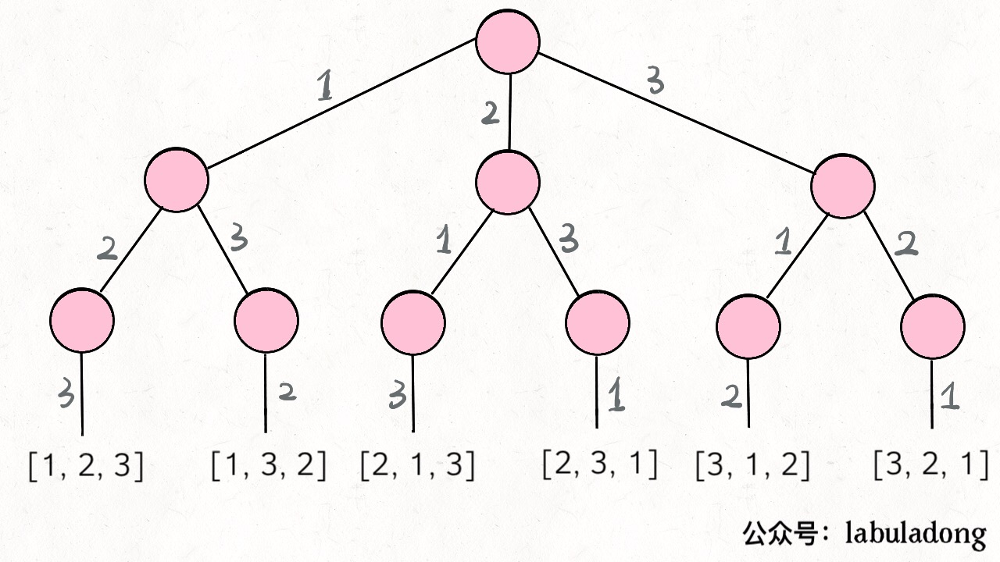

# Solve Permutation, Combination, Subset Problems by Backtracking

**Translator: [yx-tan](https://github.com/yx-tan)**

**Author: [labuladong](https://github.com/labuladong)**

Today let's talk about three common interview problems which are quite confusing. They are finding subset, finding permutation and finding combination.

These problems can be solved by a backtracking algorithm template, what's more the subset problem can also be solved by mathematical induction. You can keep the routines of these three problems in mind to avoid confusion.

### 1. Subset

The problem is simple: Input an array **without duplicate numbers**, and your algorithm needs to output all subsets of these numbers.

```cpp
vector<vector<int>> subsets(vector<int>& nums);
```

For example, for the input `nums = [1,2,3]`, your algorithm should output 8 subsets, including empty set and the set itself. The order can be different:

[ [],[1],[2],[3],[1,3],[2,3],[1,2],[1,2,3] ]

**The first solution is using the idea of mathematical induction**: Suppose now I know the results of a smaller subproblem, then how can I derive the results of the current problem?

To be specific, now you need to find the subset of `[1,2,3]`, if you have already known the subset of `[1,2]`, can you derive the subset of `[1,2,3]`? Let's take a look of the subset of `[1,2]`:

[ [],[1],[2],[1,2] ]

You will find such a rule:

subset(`[1,2,3]`) - subset(`[1,2]`)

= [3],[1,3],[2,3],[1,2,3]

And this is to add 3 to each set in the result of subset(`[1,2]`).

In other words, if `A = subset([1,2])`, then:

`subset([1,2,3])`

= A + [A[i].add(3) for i = 1..len(A)]

This is a typical recursive structure: The subset of`[1,2,3]`can be derived by`[1,2]`, and the subset of `[1,2]` can be derived by `[1]`. Obviously, the base case is that when  the input set is an empty set, the output subset is also an empty set.

It is easy to understand if we translate the idea into code:

```cpp
vector<vector<int>> subsets(vector<int>& nums) {
    // base case, return an empty set
    if (nums.empty()) return {{}};
    // take the last element
    int n = nums.back();
    nums.pop_back();
    // recursively calculate all subsets of the previous elements
    vector<vector<int>> res = subsets(nums);

    int size = res.size();
    for (int i = 0; i < size; i++) {
        // then append to the previous result
        res.push_back(res[i]);
        res.back().push_back(n);
    }
    return res;
}
```

**It is easy to make mistakes calculating the time complexity of this problem.** The method we said to calculate the time complexity of a recursive problem is to find the recursion depth and then multiply it by the number of iterations in each recursion. However, for this problem, the recursion depth is obviously N, but we found that the number of iterations of for loop in each recursion depends on the length of `res`, which is not fixed.

According to the idea above, the length of `res` should be doubled every recursion. So the total number of iterations should be 2^N. Or don't bother, how many subsets of a set of size N has do you think? 2^N, right? So at least 2^N elements must be added to `res`.

So is the time complexity of the algorithm O (2^N)? Still wrong. 2^N subsets are added to `res` by ` push_back`, so the efficiency of `push_back` operation must be considered: 

```cpp
for (int i = 0; i < size; i++) {
    res.push_back(res[i]); // O(N)
    res.back().push_back(n); // O(1)
}
```

Because `res[i]` is also an array, `push_back` copies ` res[i] `and adds it to the end of the array, so the time of one operation is O (N).

Above all, the total time complexity is O (N*2^N), which is quite time-consuming.

Considering space complexity, if the space used to store the returned results is not calculated, only O(N) recursive stack space is required. If you calculate the space for `res`, it should be O (N*2^N).

**The second general method is the backtracking algorithm**. There is a template for backtracking algorithms in the old article [DetailsaboutBacktracking](https://github.com/labuladong/fucking-algorithm/blob/english/think_like_computer/DetailsaboutBacktracking.md):

```python
result = []
def backtrack(Path, Seletion List):
    if meet the End Conditon:
        result.add(Path)
        return
    
    for seletion in Seletion List:
        select
        backtrack(Path, Seletion List)
        deselect
```

We just need to modify the template of the backtracking algorithm:

```cpp
vector<vector<int>> res;

vector<vector<int>> subsets(vector<int>& nums) {
    // record the path
    vector<int> track;
    backtrack(nums, 0, track);
    return res;
}

void backtrack(vector<int>& nums, int start, vector<int>& track) {
    res.push_back(track);
    for (int i = start; i < nums.size(); i++) {
        // select
        track.push_back(nums[i]);
        // backtrack
        backtrack(nums, i + 1, track);
        // deselect
        track.pop_back();
    }
}
```

It can be seen that the update position of `res` is in the preorder traversal, which means, **` res` is all nodes on the tree **:



### 2. Combination

Input two numbers `n, k`, and the algorithm outputs all combinations of k numbers in `[1..n]`.

```cpp
vector<vector<int>> combine(int n, int k);
```

For example, input `n = 4, k = 2`, the output is as follows, the order does not matter, but it cannot contain duplicates (according to the definition of the combination,` [1,2] `and` [2,1] `are also duplicates):

[
  [1,2],
  [1,3],
  [1,4],
  [2,3],
  [2,4],
  [3,4]
]

This is also a typical backtracking algorithm. `K` limits the height of the tree, and ` n` limits the width of the tree. Just continue to use the template framework of the backtracking algorithm we have mentioned before:



```cpp
vector<vector<int>>res;

vector<vector<int>> combine(int n, int k) {
    if (k <= 0 || n <= 0) return res;
    vector<int> track;
    backtrack(n, k, 1, track);
    return res;
}

void backtrack(int n, int k, int start, vector<int>& track) {
    // reach the bottom of tree
    if (k == track.size()) {
        res.push_back(track);
        return;
    }
    // note: i is incremented from start 
    for (int i = start; i <= n; i++) {
        // select
        track.push_back(i);
        backtrack(n, k, i + 1, track);
        // deselect
        track.pop_back();
    }
}
```

The `backtrack` function is similar to computing a subset, except that the time to update `res` is reaching the bottom of tree.

### 3. Permutation

Enter an array `nums` which **does not contain duplicate numbers **, and return all permutations of these numbers.

```cpp
vector<vector<int>> permute(vector<int>& nums);
```

For example, for input array `[1,2,3]`, the output result should be as follows, the order does not matter, there can be no duplicates:

[
  [1,2,3],
  [1,3,2],
  [2,1,3],
  [2,3,1],
  [3,1,2],
  [3,2,1]
]

This problem is used in [DetailsaboutBacktracking](https://github.com/labuladong/fucking-algorithm/blob/english/think_like_computer/DetailsaboutBacktracking.md) to explain the backtracking template. We use this problem again to compare the coded of two backtracking algorithms "permutation" and "combination".

First draw a backtrack tree and take a look:



Our solution was written in Java code at that time:

```java
List<List<Integer>> res = new LinkedList<>();

/* main function, input a uique set of numbers and return all permutations of them */
List<List<Integer>> permute(int[] nums) {
    // record "path"
    LinkedList<Integer> track = new LinkedList<>();
    backtrack(nums, track);
    return res;
}

void backtrack(int[] nums, LinkedList<Integer> track) {
    // trigger the ending condition
    if (track.size() == nums.length) {
        res.add(new LinkedList(track));
        return;
    }
    
    for (int i = 0; i < nums.length; i++) {
        // exclud illegal selections
        if (track.contains(nums[i]))
            continue;
        // select
        track.add(nums[i]);
        // go to the next decision tree
        backtrack(nums, track);
        // deselect
        track.removeLast();
    }
}
```

The backtracking template remains unchanged, but according to the trees drawn by the permutation problem and the combination problem, the tree of the permutation problem is relatively symmetrical, and the tree of the combination problem has fewer right nodes.

In the code we can see, the permutation problem uses the `contains` method to exclude the numbers that have been selected in ` track` each time; while the combination problem passes a `start` parameter to exclude the numbers before the ` start` index .

**The above is the solution to the three problems of permutation, combination and subsets. To sum up:**

The subset problem can use the idea of mathematical induction: assuming that the results of a smaller problem are known, and thinking about how to derive the results of the original problem. You can also use the backtracking algorithm, using the `start` parameter to exclude selected numbers.

The combination problem uses the backtracking idea, and the results can be expressed as a tree structure. We only need to apply the backtracking algorithm template. The key point is to use a `start` to exclude the selected numbers.

The permutation problem uses the backtracking idea, and it can also be expressed as a tree structure to apply the algorithm template. The key point is to use the `contains` method to exclude the selected numbers. There is detailed analysis previously. Here we mainly compare it with the combination problem.

Keeping the shape of these trees in mind is enough to deal with most backtracking algorithm problems. It is nothing more than the pruning of `start` or ` contains`. There is no other trick.