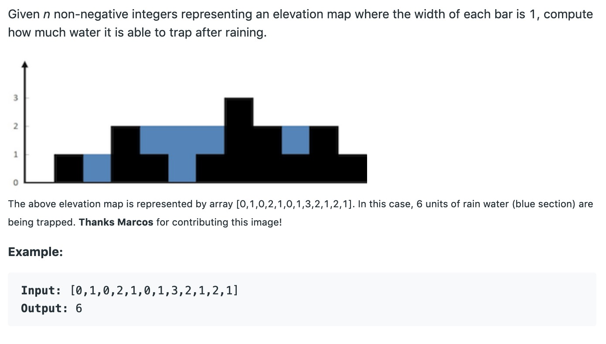
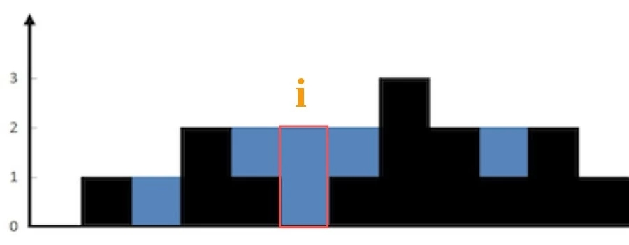
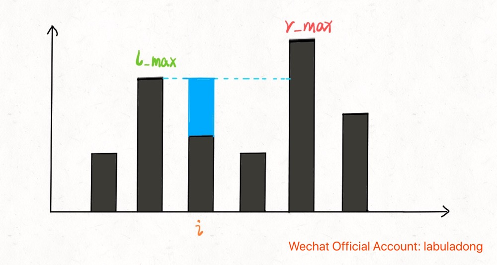
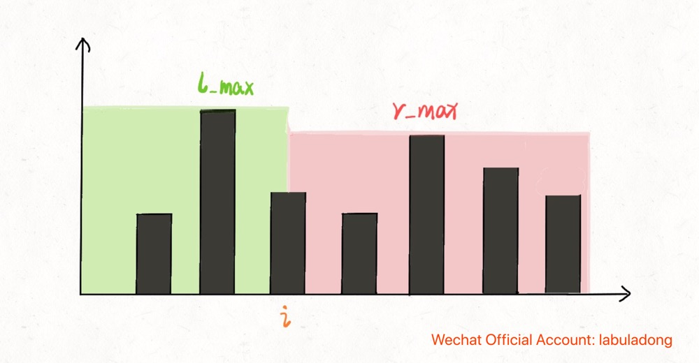
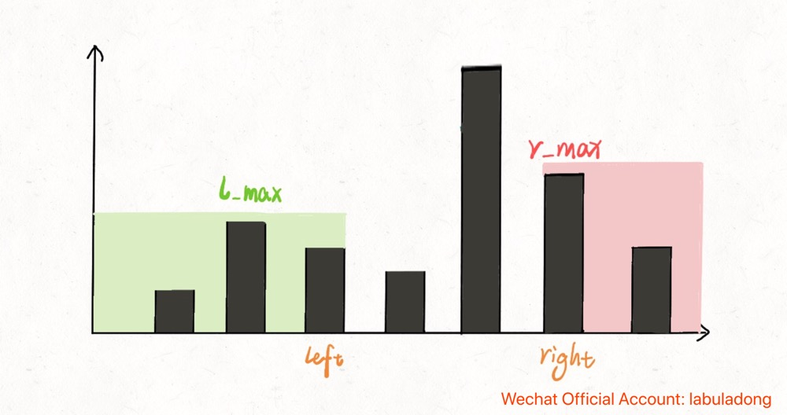
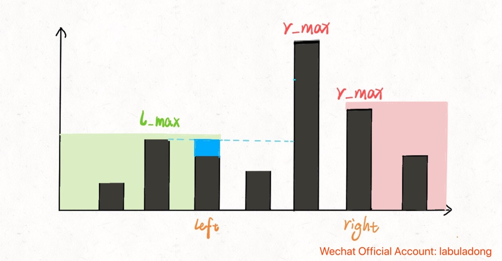

# Detailed analysis of the trapping rain water problem

**Translator: [Iruze](https://github.com/Iruze)**

**Author: [labuladong](https://github.com/labuladong)**

The trapping rain water problem is very interesting and preforms frequently in interviews. So this paper will show how to solve the problem and explain how to optimize the solution step by step.

First of all, let's have a view on the problem:



In a word, an array represents an elevation map and hope you calculate how much rain water the elevation map can hold at most.

```java
int trap(int[] height);
```

Now I will explain three approaches from shallow to deep: Brute force -> Using memorandum -> Using two pointers, and finally solve the problem with O(1) space complexity and O(N) time complexity.

### I. Core idea

When I saw this problem for the first time, I had no idea at all. I believe that many friends have the same experience. As for this kind of problem, we should not consider from the whole, but from the part; Just as the previous articles that talk about how to handle the string problem, don't consider how to handle the whole string. Instead, you should focus on how to handle each character among the string.

Therefore, we find that the thought of this problem is sample. Specifically, just for the position `i` as below, how much water can it hold? 



Position `i` occupies 2 grids for holding water. Why it happens to hold 2 grids of water? Because the height of `height[i]` is 0, and `height[i]` can hold up to 2 grids of water, therefore there exists 2 - 0 = 2.

But why the position `i` can hold 2 grids of water at most? Because the height of water column at position `i` depends on both the hightest water column on the left and the highest water column on the right. We describe the height of the two highest water columns as `l_max` and `r_max` respectively. **Thus the height at position `i` is `min(l_max, r_max)`**.

Further more, as for the position `i`, how much water it holds can be demonstrated as:
```python
water[i] = min(
               # the highest column on the left
               max(height[0..i]),  
               # the highest column on the right
               max(height[i..end]) 
            ) - height[i]
```




This is the core idea of the problem, so we can program a simple brute approach:

```cpp
int trap(vector<int>& height) {
    int n = height.size();
    int ans = 0;
    for (int i = 1; i < n - 1; i++) {
        int l_max = 0, r_max = 0;
        // find the highest column on the right
        for (int j = i; j < n; j++)
            r_max = max(r_max, height[j]);
        // find the highest column on the right
        for (int j = i; j >= 0; j--)
            l_max = max(l_max, height[j]);
        // if the position i itself is the highest column
        // l_max == r_max == height[i]
        ans += min(l_max, r_max) - height[i];
    }
    return ans;
}
```

According to the previous thought, the above approach seems very direct and brute. The time complexity is O(N^2) and the space complexity is O(1). However, it is obvious that the way of calculating `r_max` and `l_max` is very clumsy, which the memorandum is generally introduced to optimize the way.

### II. Memorandum Optimization

In the previous brute approach, the `r_max` and `l_max` are calculated at every position `i`. So we can cache that calculation results, which avoids the stupid traversal at every time. Thus the time complexity will reasonably decline.

Here two arrays `r_max` and `l_max` are used to act the memo. `l_max[i]` represents the highest column on the left of position `i` and `r_max[i]` represents the highest column on the right of position `i`. These two arrays are calculated in advance to avoid duplicated calculation.

```cpp
int trap(vector<int>& height) {
    if (height.empty()) return 0;
    int n = height.size();
    int ans = 0;
    // arrays act the memo
    vector<int> l_max(n), r_max(n);
    // initialize base case
    l_max[0] = height[0];
    r_max[n - 1] = height[n - 1];
    // calculate l_max from left to right
    for (int i = 1; i < n; i++)
        l_max[i] = max(height[i], l_max[i - 1]);
    // calculate r_max from right to left
    for (int i = n - 2; i >= 0; i--) 
        r_max[i] = max(height[i], r_max[i + 1]);
    // calculate the final result
    for (int i = 1; i < n - 1; i++) 
        ans += min(l_max[i], r_max[i]) - height[i];
    return ans;
}
```

Actually, the memo optimization has not much difference from the above brute approach, except that it avoids repeat calculation and reduces the time complexity to O(N). Although time complexity O(N) is already the best, but the space complexity is still O(N). So let's look at a more subtle approach that can reduce the space complexity to O(1).

### III. Two pointers

The thought of this approach is exactly the same, but it is very ingenious in the way of implementation. We won't use the memo to cache calculation results in advance this time. Instead, we use two pointers to calculate during traversal and the space complexity will decline as a result.

First, look at some of the code:

```cpp
int trap(vector<int>& height) {
    int n = height.size();
    int left = 0, right = n - 1;
    
    int l_max = height[0];
    int r_max = height[n - 1];
    
    while (left <= right) {
        l_max = max(l_max, height[left]);
        r_max = max(r_max, height[right]);
        left++; right--;
    }
}
```

In the above code, what's the meaning of `l_max` and `r_max` respectively?

It is easy to understand that **`l_max` represents the highest column among `height[0..left]` and `r_max` represents the highest column among `height[right..end]`**.

With that in mind, look directly at the approach:

```cpp
int trap(vector<int>& height) {
    if (height.empty()) return 0;
    int n = height.size();
    int left = 0, right = n - 1;
    int ans = 0;
    
    int l_max = height[0];
    int r_max = height[n - 1];
    
    while (left <= right) {
        l_max = max(l_max, height[left]);
        r_max = max(r_max, height[right]);
        
        // ans += min(l_max, r_max) - height[i]
        if (l_max < r_max) {
            ans += l_max - height[left];
            left++; 
        } else {
            ans += r_max - height[right];
            right--;
        }
    }
    return ans;
}
```

The core idea of the approach is the same as before, which is just like old wine in new bottle. However, a careful reader may find that the approach is slightly different in details from the previous ones:

In the memo optimization approach, `l_max[i]` and `r_max[i]` represent the highest column of `height[0..i]` and `height[i..end]` respectively. 

```cpp
ans += min(l_max[i], r_max[i]) - height[i];
```



But in two pointers approach, `l_max` and `r_max` represent the highest column of `height[0..left]` and `height[right..end]` respectively. Take the below code as an example:

```cpp
if (l_max < r_max) {
    ans += l_max - height[left];
    left++; 
} 
```



At this time, `l_max` represents the highest column on the left of `left` pointer, but `r_max` is not always the highest column on the right of `left` pointer. Under the circumstances, can this approach really get the right answer?

In fact, we need to think about it in this way: we just focus on `min(l_max, r_max)`. In the above elevation map, we have known `l_max < r_max`, so it is doesn't matter whether the `r_max` is the highest column on the right. The key is that water capacity in `height[i]` just depends on `l_max`.



***Tip:***          
Adhere to the original high-quality articles and strive to make the algorithm clear. Welcome to my Wechat official account: **labuladong** to get the latest articles.
