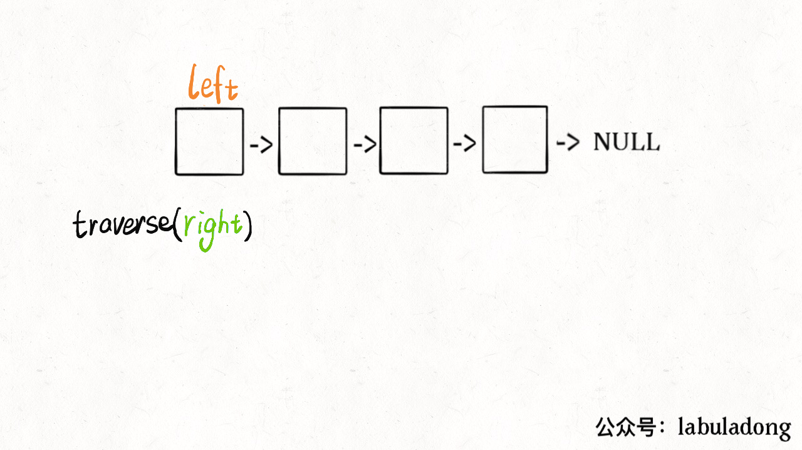
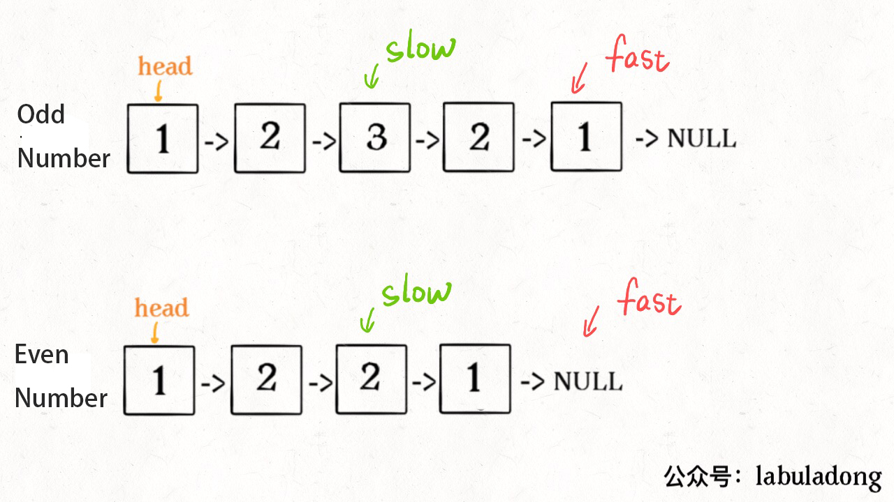
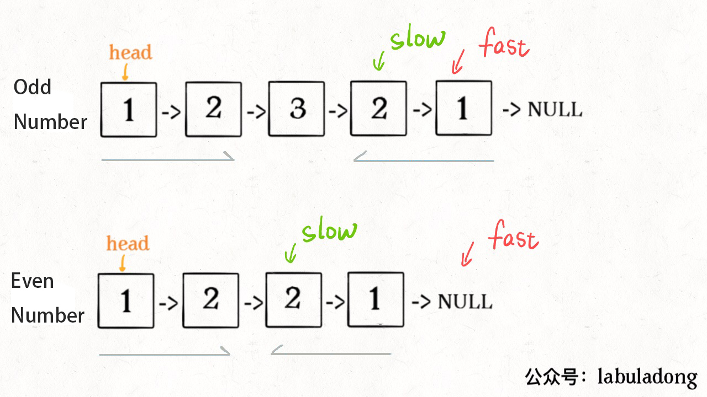
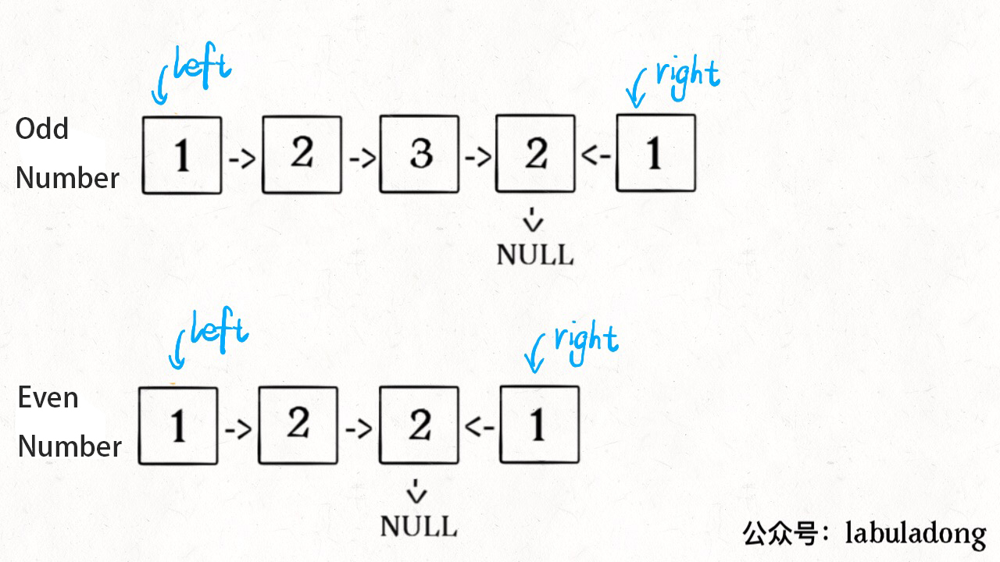
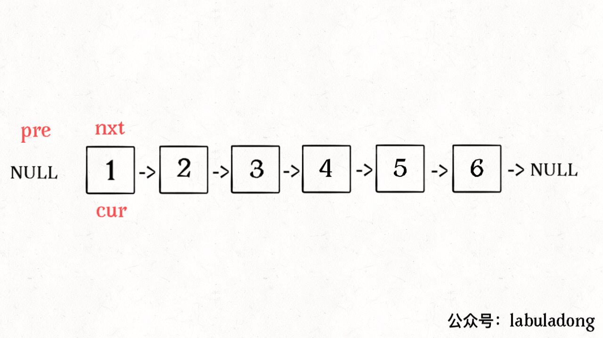

**Translator: [natsunoyoru97](https://github.com/natsunoyoru97)**

**Author: [labuladong](https://github.com/labuladong)**

There are two previous articles mentioned the problems about palindromic strings and palindromic sequences.

The core concept to **FIND** the palindromic strings is expanding from the middle to the edges:

```cpp
string palindrome(string& s, int l, int r) {
    // to prevent the indexes from getting out of range
    while (l >= 0 && r < s.size()
            && s[l] == s[r]) {
        // expand to two edges
        l--; r++;
    }
    // return the longest palindromic in which the middle
    // are both s[l] and s[r]
    return s.substr(l + 1, r - l - 1);
}
```

The length of the palindromic strings can be either odd or even: when the length is odd there is only one middle pivot, and when the length is even there are two middle pivots. So the function above needs to parse the arguments `l` and `r` in.

But to **CHECK** a palindromic string is much easier. Regardless of its length, we only need to do the double pointers trick, and move from two edges to the middle:

```cpp
bool isPalindrome(string s) {
    int left = 0, right = s.length - 1;
    while (left < right) {
        if (s[left] != s[right])
            return false;
        left++; right--;
    }
    return true;
}
```

So the code is cleaner and much easier to understand. **The palindromic strings are SYMMETRIC so it is same to write it in normal order as in reverse order, which is the key to solve the problems of the palindromic strings.**

We make expansion from this simple scenario, and try to solve the problem: how to check a palindromic singly linked list.

### 1. Check A Palindromic Singly Linked List

Given the head node of a singly linked list, and check if the values are palindromic:

```java
/**
 * The definition of nodes in a singly linked list:
 * public class ListNode {
 *     int val;
 *     ListNode next;
 * }
 */

boolean isPalindrome(ListNode head);

Input: 1->2->null
Output: false

Input: 1->2->2->1->null
Output: true
```

The two pointers DON'T do the trick because we can't traverse a singly linked list in reverse. The most straightforward way is to store the existed linked list in a new linked list REVERSELY, then to compare whether these two linked lists are the same. If you have no idea about how to reverse a linked list, you can look at _[Reverse Part of a Linked List via Recusion](https://github.com/labuladong/fucking-algorithm/blob/english/data_structure/reverse_part_of_a_linked_list_via_recursion.md)_.

But **similar to the postorder traversal in a binary tree, we can traverse a linked list reversely without doing the actual reverse**.

We are familiar with the ways to traverse a binary tree:

```java
void traverse(TreeNode root) {
    // code to traverse in preorder
    traverse(root.left);
    // code to traverse in inorder
    traverse(root.right);
    // code to traverse in postorder
}
```

As mentioned in _The Thinking Patterns in Data Structure_, the linked list is recursive and it is the derivation of the trees ADT. Thus, **the linked list also has preorder traversal and postorder traversal**:

```java
void traverse(ListNode head) {
    // code to traverse in preorder
    traverse(head.next);
    // code to traverse in postorder
}
```

How do we apply such a pattern? If I want to print the value of `val` in a linked list in normal order, I will write the code in the position of preorder traversal; Meanwhile, if I want to print the value in reverse order, I will make the code in the position of postorder traversal:

```java
/* print the values in a linked list reversely */
void traverse(ListNode head) {
    if (head == null) return;
    traverse(head.next);
    // code to traverse in postorder
    print(head.val);
}
```

We can also make a slight modification to imitate the two pointers to check the palindromes:

```java
// The left pointer
ListNode left;

boolean isPalindrome(ListNode head) {
    left = head;
    return traverse(head);
}

boolean traverse(ListNode right) {
    if (right == null) return true;
    boolean res = traverse(right.next);
    // code to traverse in postorder
    res = res && (right.val == left.val);
    left = left.next;
    return res;
}
```

What is the essence of this way? It is all about **pushing the nodes in the linked list into a stack and then popping them out. At this time the elements are in reverse.** What we make in use is the queues and stacks in recursion.



Of course, both the time complexity and the space complexity are O(N) no matter you construct a reversed linked list or use postorder traversal. Can we solve it without using extra spaces?

### 2. Optimizing the Space Complexity

Here is how to optimize:

**2.1 Find the node in the middle by the fast and slow pointers**:

```java
ListNode slow, fast;
slow = fast = head;
while (fast != null && fast.next != null) {
    slow = slow.next;
    fast = fast.next.next;
}
// the slow pointer now points to the middle point
```



**2.2 If the `fast` pointer doesn't point to `null`, the length of this linked list is odd, which means the `slow` pointer needs to forward one more step**:

```java
if (fast != null)
    slow = slow.next;
```



**2.3 Reverse the right half of the linked list and compare palindromes**:

```java
ListNode left = head;
ListNode right = reverse(slow);

while (right != null) {
    if (left.val != right.val)
        return false;
    left = left.next;
    right = right.next;
}
return true;
```



Till now, we only need to merge these 3 parts of code to cope with this problem. The `reverse` function is easy to build:

```java
ListNode reverse(ListNode head) {
    ListNode pre = null, cur = head;
    while (cur != null) {
        ListNode next = cur.next;
        cur.next = pre;
        pre = cur;
        cur = next;
    }
    return pre;
}
```



The time complexity of this algorithm is O(N) and the space complexity is O(1), which is fully optimized.

I know some readers may ask: It is efficient but it broke the structure of the linked list. Can we remain the structure in origin?

It is easy to deal with, and the key is to get the positions of the pointers `p, q`:


We only need to add one line before the return function to get the original order of the linked list.

```java
p.next = reverse(q);
```

To avoid being wordy, my words will stop here. Readers can have a try by yourselves.

### 3. Summing Up

First, by extending **from the middle to the two edges** to FIND the palindromic strings, meanwhile by shrinking **from the middle to the two edges** to CHECK the palindromic strings. Traversing in reverse doesn't work for a singly linked list, the two alternatives are: to construct a new reversed linked list instead, or to apply the stack ADT.

Due to the feature of palindromes (they are SYMMETRIC), we can optimize the space complexity to O(1) by only **reversing half of the linked list**.