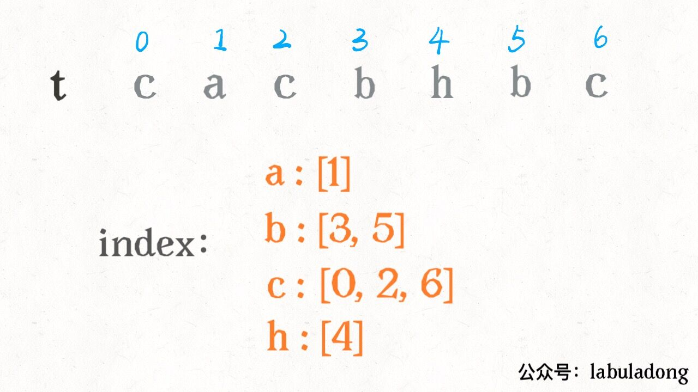
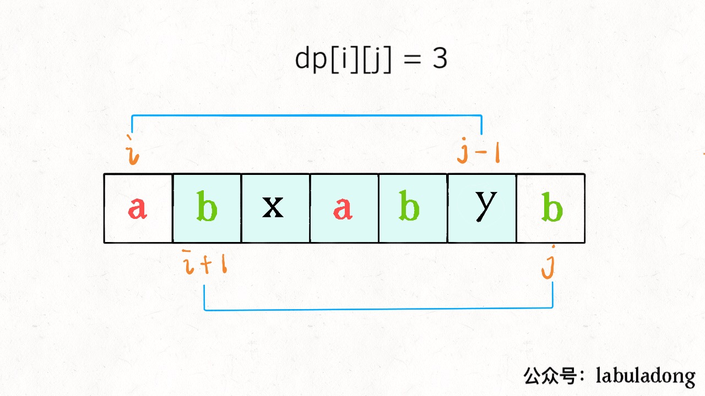

# Subsequence Using Binary Search

**Translator: [youyun](https://github.com/youyun)**

**Author: [labuladong](https://github.com/labuladong)**

Binary search is not hard to understand. It is rather hard to apply. Sometimes, you can't even link a question with binary search. In another article [Longest Increasing Subsequence](../dynamic_programming/动态规划设计：最长递增子序列.md), we could even apply binary search in a poker game.

Let's discuss another interesting question that we can use binary search: how to determine if a given string `s` is subsequence of another string `t` (assume `s` is much shorter as compared to `t`)? Look at the two examples below:

> s = "abc", t = "**a**h**b**gd**c**", return true.

> s = "axc", t = "ahbgdc", return false.

This is a straightforward question which looks simple. But can you relate this with binary search?

### 1. Problem Analysis

Here is an intuitive solution:

```cpp
bool isSubsequence(string s, string t) {
    int i = 0, j = 0;
    while (i < s.size() && j < t.size()) {
        if (s[i] == t[j]) i++;
        j++;
    }
    return i == s.size();
}
```

The idea is to use two pointers `i, j` to point to `s, t` respectively. While moving forward, try to match the characters:


Some people may claim this is the optimal solution, given the time complexity is O(N) while N is the length of `t`.

In fact, this solution is good enough for this problem alone. __However, there is a follow-up__:

Given a list of string `s1,s2,...` and a string `t`, determine if each string `s` is a subsequence of `t` (assume each `s` is much shorter as compared to `t`).

```java
boolean[] isSubsequence(String[] sn, String t);
```

We can still apply the same logic inside a `for` loop. However, the time complexity for each `s` is still O(N). If binary search is applied, the time complexity can be reduced to O(MlogN). Since `N >> M`, the efficiency will be improved significantly.

### 2. Using Binary Search

To begin with binary search, we need to pre-process `t` by storing the indices of each character in a dictionary `index`.

```java
int m = s.length(), n = t.length();
ArrayList<Integer>[] index = new ArrayList[256];
// record down the indices of each character in t
for (int i = 0; i < n; i++) {
    char c = t.charAt(i);
    if (index[c] == null) 
        index[c] = new ArrayList<>();
    index[c].add(i);
}
```



Refer to the diagram below, since we've matched "ab", the next one to be matched should be "c":


If we apply the first solution, we need to traverse linearly using `j` to find "c". With the information in `index`, __we can use binary search to find an index that is greater than `j` in `index["c"]`__. In the diagram above, we need to find an index from `[0, 2, 6]` that is greater than 4:



In this way, we can directly get the index of next "c". The problem becomes how to find the smallest index that is greater than 4? We can use binary search to find the left boundary.

### 3. More about Binary Search

In another article [Detailed Binary Search](../think_like_computer/DetailedBinarySearch.md), we discussed in details how to implement binary search in 3 different ways. When we use binary search to return the index of target `val` to find __the left boundary__, there is a special property:

__When `val` does not exist, the index returned is the index of the smallest value which is greater than `val`__.

It means that when we try to find element 2 in array `[0,1,3,4]`, the algorithm will return index 2, where element 3 is located. And element 3 is the smallest element that is greater than 2 in this array. Hence, we can use binary search to avoid linear traversal.

```java
// binary search to find the left boundary
int left_bound(ArrayList<Integer> arr, int tar) {
    int lo = 0, hi = arr.size();
    while (lo < hi) {
        int mid = lo + (hi - lo) / 2;
        if (tar > arr.get(mid)) {
            lo = mid + 1;
        } else {
            hi = mid;
        } 
    }
    return lo;
}
```

The binary search above is to find the left boundary. Its details can be found in [Detailed Binary Search](../think_like_computer/DetailedBinarySearch.md). Let's apply it.

### 4. Implementation

We take a single string `s` as an example for the case of multiple strings. The part of pre-processing can be extracted out.

```java
boolean isSubsequence(String s, String t) {
    int m = s.length(), n = t.length();
    // pre-process t
    ArrayList<Integer>[] index = new ArrayList[256];
    for (int i = 0; i < n; i++) {
        char c = t.charAt(i);
        if (index[c] == null) 
            index[c] = new ArrayList<>();
        index[c].add(i);
    }
    
    // the pointer in t
    int j = 0;
    // find s[i] using index
    for (int i = 0; i < m; i++) {
        char c = s.charAt(i);
        // character c does not exist in t
        if (index[c] == null) return false;
        int pos = left_bound(index[c], j);
        // c is not found in the binary search interval
        if (pos == index[c].size()) return false;
        // increment pointer j
        j = index[c].get(pos) + 1;
    }
    return true;
}
```

The gif below illustrates how the algorithm executes:


We can see that the efficiency can be significantly improved using binary search.
