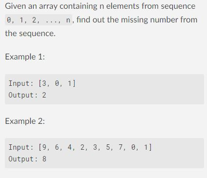
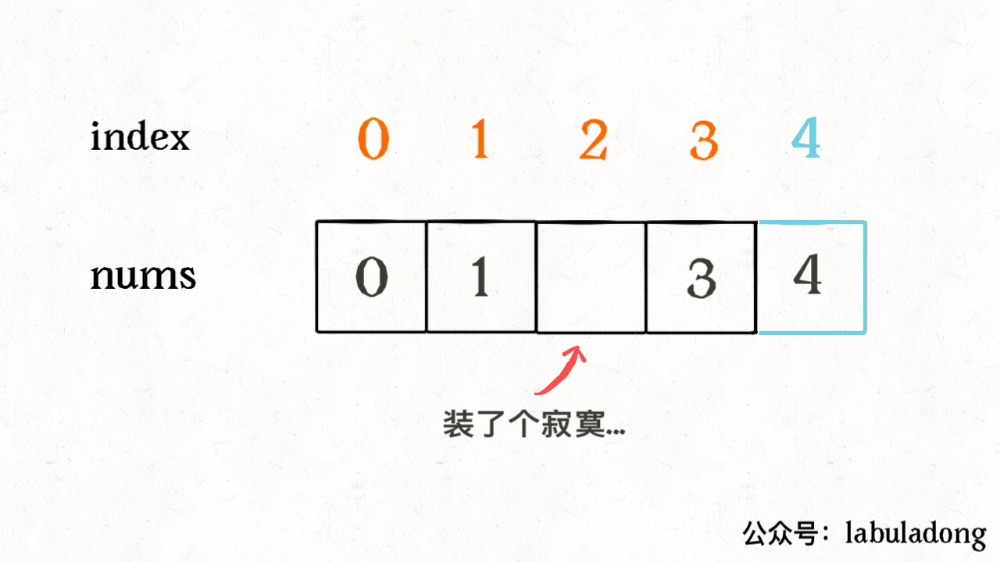
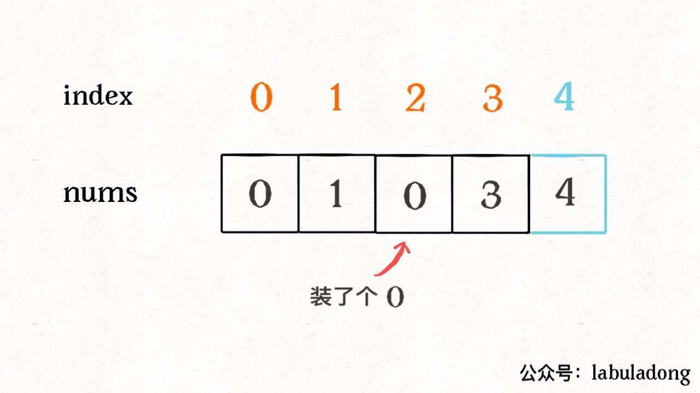

# How to Find Missing Elements

**Translator: [youyun](https://github.com/youyun)**

**Author: [labuladong](https://github.com/labuladong)**

I have written several articles about mind twisters. Today, let's look at another interesting question.

The question is simple:



Given an arry of length n, the index should be in `[0, n)`. Since we have to put `n+1` number of elements from set `[0, n]`, there must be one element which can't fit. Find the missing element.

This question is not hard. It's easy to think aabout traversing after sorting. Alternatively, using a `HashSet` to store all the existing elements, and then go through elements in `[0, n]` and loop up in the `HashSet`. Both ways can find the correct answer.

However, the time complexity for the sorting solution is O(NlogN). The `HashSet` solution has O(N) for time complexity, but requires O(N) space complexity to store the data.

__Third Solution: Bit Operation__

The XOR operation (`^`) has a special property: the result of a number XOR itself is 0, and the result of a number with 0 is itself.

In addition, XOR operation satisfies the Exchange Law and Communicative Law. For instance:

2 ^ 3 ^ 2 = 3 ^ (2 ^ 2) = 3 ^ 0 = 3

We can using these special properties to find the missing element through a smart way. For example, `nums = [0,3,1,4]`：


For easier understanding, let's assume the index increments by 1 (from `[0, n)` to `[0, n]`), and let each element to be placed at the index of its value:



After doing so, all elements and their indices will be a pair except the missing element. If we can find out index 2 is missing, we can find out the missing element subsequently.

How to find out the missing number? __Perform XOR operations to all elements and their indices respectively. A pair of an element and its index will become 0. Only the missing element will be left.__

```java
int missingNumber(int[] nums) {
    int n = nums.length;
    int res = 0;
    // XOR with the new index first
    res ^= n;
    // XOR with the all elements and the other indices
    for (int i = 0; i < n; i++)
        res ^= i ^ nums[i];
    return res;
}
```



Because XOR operation fulfills the Exchange Law and the Communicative Law, all pairs of numbers will become 0, left with the missing element.

Till now, the time complexity is O(N), and the space complexity is O(1). This is optimal. _Should we stop now?_

If we think so, we have become restricted by algorithms. The more knowledge we learn, the easier we might fall into stagnant mindsets. There is actually an even easier solution: __Summation of Arithmetic Progression (AP)__.

We can interpret the question in this way: given an arithmetic progression `0, 1, 2, ..., n` with an missing element, please find out the missing one. Consequently, the number is just `sum(0,1,..n) - sum(nums)`!

```java
int missingNumber(int[] nums) {
    int n = nums.length;
    // Formula: (head + tail) * n / 2
    int expect = (0 + n) * (n + 1) / 2;

    int sum = 0;
    for (int x : nums) 
        sum += x;
    return expect - sum;
```

As you can see, this is the simplest solution. But honestly, even I didn't think of this way. It may be hard for an experienced programmers to think in this way, but very easy for a secondary school student to come up with such a solution.

_Should we stop now?_

If we think so, we might still need to pay more attention to details. When we use the formula to calculate `except`, have you thought about __Integer overflow__? If the product is too big and overflowing, the final result must be wrong.

In the previous implementation, we subtract two sums. To avoid overflow, why not perform subtraction while summing up? Similar to our bit operation solution just now, assume `nums = [0,3,1,4]`, add an index such that elements will be paired up with indices respectively.


Let's subtract each element from its corresponding index, and then sum up the differences, the result will be the missing element!

```java
public int missingNumber(int[] nums) {
    int n = nums.length;
    int res = 0;
    // Added index
    res += n - 0;
    // Summing up the differences between the remaining indices and elements
    for (int i = 0; i < n; i++) 
        res += i - nums[i];
    return res;
}
```

Because both addition and subtraction satisfy the Exchange Law and the Communicative Law, we can always eliminate paired numbers, left with the missing one.

_We can stop by now._
