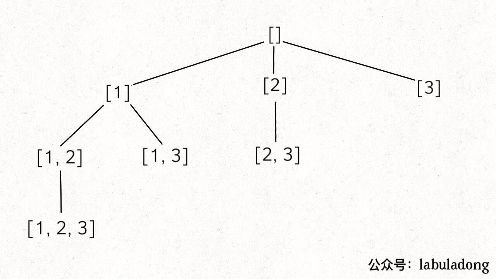
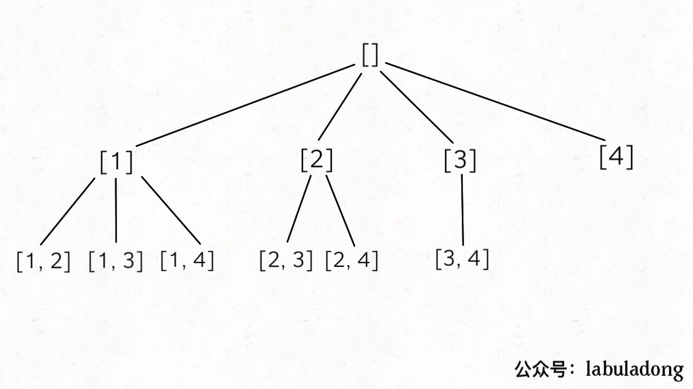
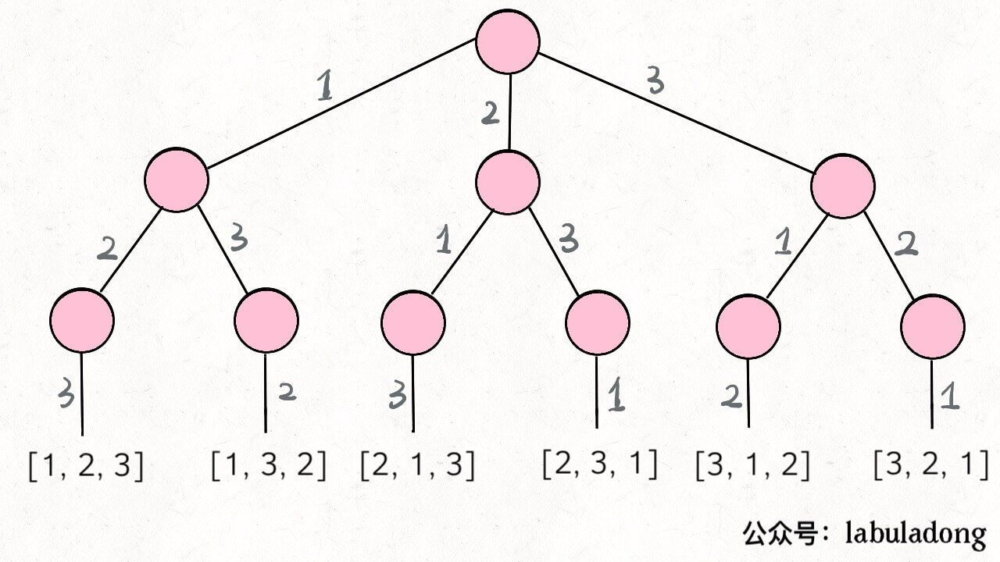

今天就来聊三道考察频率高，而且容易让人搞混的算法问题，分别是求子集（subset），求排列（permutation），求组合（combination）。

这几个问题都可以用回溯算法模板解决，同时子集问题还可以用数学归纳思想解决。读者可以记住这几个问题的回溯套路，就不怕搞不清了。

### 一、子集

问题很简单，输入一个**不包含重复数字**的数组，要求算法输出这些数字的所有子集。

```cpp
vector<vector<int>> subsets(vector<int>& nums);
```

比如输入 `nums = [1,2,3]`，你的算法应输出 8 个子集，包含空集和本身，顺序可以不同：

[ [],[1],[2],[3],[1,3],[2,3],[1,2],[1,2,3] ]

**第一个解法是利用数学归纳的思想**：假设我现在知道了规模更小的子问题的结果，如何推导出当前问题的结果呢？

具体来说就是，现在让你求 `[1,2,3]` 的子集，如果你知道了 `[1,2]` 的子集，是否可以推导出 `[1,2,3]` 的子集呢？先把  `[1,2]` 的子集写出来瞅瞅：

[ [],[1],[2],[1,2] ]

你会发现这样一个规律：

subset(`[1,2,3]`) - subset(`[1,2]`)

= [3],[1,3],[2,3],[1,2,3]

而这个结果，就是把 sebset(`[1,2]`) 的结果中每个集合再添加上 3。

换句话说，如果 `A = subset([1,2])` ，那么：

subset(`[1,2,3]`)

= A + [A[i].add(3) for i = 1..len(A)]

这就是一个典型的递归结构嘛，`[1,2,3]` 的子集可以由 `[1,2]` 追加得出，`[1,2]` 的子集可以由 `[1]` 追加得出，base case 显然就是当输入集合为空集时，输出子集也就是一个空集。

翻译成代码就很容易理解了：

```cpp
vector<vector<int>> subsets(vector<int>& nums) {
    // base case，返回一个空集
    if (nums.empty()) return {{}};
    // 把最后一个元素拿出来
    int n = nums.back();
    nums.pop_back();
    // 先递归算出前面元素的所有子集
    vector<vector<int>> res = subsets(nums);

    int size = res.size();
    for (int i = 0; i < size; i++) {
        // 然后在之前的结果之上追加
        res.push_back(res[i]);
        res.back().push_back(n);
    }
    return res;
}
```

**这个问题的时间复杂度计算比较容易坑人**。我们之前说的计算递归算法时间复杂度的方法，是找到递归深度，然后乘以每次递归中迭代的次数。对于这个问题，递归深度显然是 N，但我们发现每次递归 for 循环的迭代次数取决于 `res` 的长度，并不是固定的。

根据刚才的思路，`res` 的长度应该是每次递归都翻倍，所以说总的迭代次数应该是 2^N。或者不用这么麻烦，你想想一个大小为 N 的集合的子集总共有几个？2^N 个对吧，所以说至少要对 `res` 添加 2^N 次元素。

那么算法的时间复杂度就是 O(2^N) 吗？还是不对，2^N 个子集是 `push_back` 添加进 `res` 的，所以要考虑 `push_back` 这个操作的效率：

```cpp
for (int i = 0; i < size; i++) {
    res.push_back(res[i]); // O(N)
    res.back().push_back(n); // O(1)
}
```

因为 `res[i]` 也是一个数组呀，`push_back` 是把 `res[i]` copy 一份然后添加到数组的最后，所以一次操作的时间是 O(N)。

综上，总的时间复杂度就是 O(N*2^N)，还是比较耗时的。

空间复杂度的话，如果不计算储存返回结果所用的空间的，只需要 O(N) 的递归堆栈空间。如果计算 `res` 所需的空间，应该是 O(N*2^N)。

**第二种通用方法就是回溯算法**。旧文「回溯算法详解」写过回溯算法的模板：

```python
result = []
def backtrack(路径, 选择列表):
    if 满足结束条件:
        result.add(路径)
        return
    for 选择 in 选择列表:
        做选择
        backtrack(路径, 选择列表)
        撤销选择
```

只要改造回溯算法的模板就行了：

```cpp
vector<vector<int>> res;

vector<vector<int>> subsets(vector<int>& nums) {
    // 记录走过的路径
    vector<int> track;
    backtrack(nums, 0, track);
    return res;
}

void backtrack(vector<int>& nums, int start, vector<int>& track) {
    res.push_back(track);
    for (int i = start; i < nums.size(); i++) {
        // 做选择
        track.push_back(nums[i]);
        // 回溯
        backtrack(nums, i + 1, track);
        // 撤销选择
        track.pop_back();
    }
}
```

可以看见，对 `res` 更新的位置处在前序遍历，也就是说，**`res` 就是树上的所有节点**：




### 二、组合

输入两个数字 `n, k`，算法输出 `[1..n]` 中 k 个数字的所有组合。

```cpp
vector<vector<int>> combine(int n, int k);
```

比如输入 `n = 4, k = 2`，输出如下结果，顺序无所谓，但是不能包含重复（按照组合的定义，`[1,2]` 和 `[2,1]` 也算重复）：

[
  [1,2],
  [1,3],
  [1,4],
  [2,3],
  [2,4],
  [3,4]
]

这也是典型的回溯算法，`k` 限制了树的高度，`n` 限制了树的宽度，继续套我们以前讲过的回溯算法模板框架就行了：



```cpp
vector<vector<int>>res;

vector<vector<int>> combine(int n, int k) {
    if (k <= 0 || n <= 0) return res;
    vector<int> track;
    backtrack(n, k, 1, track);
    return res;
}

void backtrack(int n, int k, int start, vector<int>& track) {
    // 到达树的底部
    if (k == track.size()) {
        res.push_back(track);
        return;
    }
    // 注意 i 从 start 开始递增
    for (int i = start; i <= n; i++) {
        // 做选择
        track.push_back(i);
        backtrack(n, k, i + 1, track);
        // 撤销选择
        track.pop_back();
    }
}
```

`backtrack` 函数和计算子集的差不多，区别在于，更新 `res` 的时机是树到达底端时。

### 三、排列

输入一个**不包含重复数字**的数组 `nums`，返回这些数字的全部排列。

```cpp
vector<vector<int>> permute(vector<int>& nums);
```

比如说输入数组 `[1,2,3]`，输出结果应该如下，顺序无所谓，不能有重复：

[
  [1,2,3],
  [1,3,2],
  [2,1,3],
  [2,3,1],
  [3,1,2],
  [3,2,1]
]

「回溯算法详解」中就是拿这个问题来解释回溯模板的。这里又列出这个问题，是将「排列」和「组合」这两个回溯算法的代码拿出来对比。

首先画出回溯树来看一看：



我们当时使用 Java 代码写的解法：

```java
List<List<Integer>> res = new LinkedList<>();

/* 主函数，输入一组不重复的数字，返回它们的全排列 */
List<List<Integer>> permute(int[] nums) {
    // 记录「路径」
    LinkedList<Integer> track = new LinkedList<>();
    backtrack(nums, track);
    return res;
}

void backtrack(int[] nums, LinkedList<Integer> track) {
    // 触发结束条件
    if (track.size() == nums.length) {
        res.add(new LinkedList(track));
        return;
    }
    
    for (int i = 0; i < nums.length; i++) {
        // 排除不合法的选择
        if (track.contains(nums[i]))
            continue;
        // 做选择
        track.add(nums[i]);
        // 进入下一层决策树
        backtrack(nums, track);
        // 取消选择
        track.removeLast();
    }
}
```

回溯模板依然没有变，但是根据排列问题和组合问题画出的树来看，排列问题的树比较对称，而组合问题的树越靠右节点越少。

在代码中的体现就是，排列问题每次通过 `contains` 方法来排除在 `track` 中已经选择过的数字；而组合问题通过传入一个 `start` 参数，来排除 `start` 索引之前的数字。

**以上，就是排列组合和子集三个问题的解法，总结一下**：

子集问题可以利用数学归纳思想，假设已知一个规模较小的问题的结果，思考如何推导出原问题的结果。也可以用回溯算法，要用 `start` 参数排除已选择的数字。

组合问题利用的是回溯思想，结果可以表示成树结构，我们只要套用回溯算法模板即可，关键点在于要用一个 `start` 排除已经选择过的数字。

排列问题是回溯思想，也可以表示成树结构套用算法模板，关键点在于使用 `contains` 方法排除已经选择的数字，前文有详细分析，这里主要是和组合问题作对比。

记住这几种树的形状，就足以应对大部分回溯算法问题了，无非就是 `start` 或者 `contains` 剪枝，也没啥别的技巧了。

坚持原创高质量文章，致力于把算法问题讲清楚，欢迎关注我的公众号 labuladong 获取最新文章：


[上一篇：回溯算法详解](../算法思维系列/回溯算法详解修订版.md)

[下一篇：二分查找详解](../算法思维系列/二分查找详解.md)

[目录](../README.md#目录)