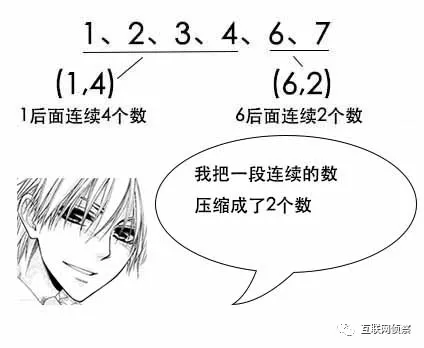
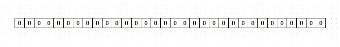

## question 
假设有20亿个int类型不重复非负数的数字，而我们只有4G的内存空间，如何将其排序？

一个int类型数据占据4个Byte，而1个Byte占据8个bit位。20亿个int大概需要7.45GB的内存。那么4G的空间是决计不够的
我们可以用1bit来存储一个int的目的，只要遍历一下这个bitmap，就可以自然地得到数字序列的排序。并且理论上它所占用的空间只有原来的1/32，20亿个数字，现在只需要230MB左右即可实现。
python 中的int 是有符号的，所以只支持31 个数


bitmap是很常用的数据结构，比如用于Bloom Filter中、用于无重复整数的排序等等。bitmap通常基于数组来实现，数组中每个元素可以看成是一系列二进制数，所有元素组成更大的二进制集合。对于Python来说，整数类型默认是有符号类型，所以一个整数的可用位数为31位。
### bitmap  
[知乎漫画_bitmap](https://zhuanlan.zhihu.com/p/54783053?utm_source=wechat_timeline)

### 结构段
蛋哥：我觉得可以这样。首先，32位int的范围是42亿，40亿整数中肯定有一些是连续的，我们可以先对数据进行一个外部排序，然后用一个初始的数和一个长度构成一个数据结构，来表示一段连续的数，举个例子。 

如果数据是1 2 3 4 6 7……这种的，那么可以用(1,4)和(6,2)来表示，这样一来，连续的数都变成了2个数表示。

来了一个新数之后，就用二分法进行查找了。

这样一来，最差情况就是2亿多的断点，也就是2亿多的结构体，每个结构体8个字节，大概16亿字节，1.6GB，在内存中可以放下

## bitmap实现思路
bitmap是用于对每一位进行操作。举例来说，一个Python数组包含4个32位有符号整型，则总共可用位为4 * 31 = 124位。如果要在第90个二进制位上操作，则要先获取到操作数组的第几个元素，再获取相应的位索引，然后执行操作。
上图所示为一个32位整型，在Python中默认是有符号类型，最高位为符号位，bitmap不能使用它。左边是高位，右边是低位，最低位为第0位

```py

# -*- coding: utf-8 -*-
class bigmap(object):
    def __init__(self,_max):
        self._max = _max
        self.size = self.calcElemIndex(_max,True)
        self.array = [0 for i in range(self.size)]

    def calcElemIndex(self,num, up=False):
        if up:
            return int((num + 31 -1)/31)
        else:
            return num/31
    
    def calcBitIndex(self,num):
        return num % 31

    def set(self,num):
        elem_index = self.calcElemIndex(num)
        byte_idex = self.calcBitIndex(num)
        elem = self.array[elem_index]
        # print "### ",elem_index,'  elem=',elem ,'  byte_idex=', byte_idex, (1 << byte_idex),elem | (1 << byte_idex), '  num=',num
        self.array[elem_index] = elem | (1 << byte_idex)        ## 或运算 求和
    
    def clean(self, num):
        elem_index = self.calcElemIndex(num)
        byte_idex = self.calcBitIndex(num)
        elem = self.array[elem_index]
        self.array[elem_index] = elem & (~(1 << byte_idex))     ## 先取反， 与 运算

    def test(self, num):
        elem_index = self.calcElemIndex(num)
        byte_idex = self.calcBitIndex(num)
        elem = self.array[elem_index]
        # print "### ",elem_index,'  elem=',elem ,'  byte_idex=', byte_idex, (1 << byte_idex),elem | (1 << byte_idex), '  num=',num
        if elem & (1 << byte_idex):   ## 
            return True
        else:
            return False
    
    def sort(self,_list):
        _res = []
        for i in _list:
            self.set(i)
        for i in range(self._max+1):
            if self.test(i):
                _res.append(i)
        return _res

if __name__ == '__main__':
    _max = 200
    _bit = bigmap(_max)
    _array = [45,3,56,76,23,114,156,12,34,155]
    result = _bit.sort(_array)
    print '**result=', result


  
```


## 初始化bitmap
首先需要初始化bitmap。拿90这个整数来说，因为单个整型只能使用31位，所以90除以31并向上取整则可得知需要几个数组元素。代码如下：
```py
#!/usr/bin/env python
#coding: utf8
 
class Bitmap(object):
	def __init__(self, max):
		self.size = int((max + 31 - 1) / 31) #向上取整
 
if __name__ == '__main__':
	bitmap = Bitmap(90)
	print '需要 %d 个元素。' % bitmap.size

"""
>>> int((90 + 31 -1)/31)
3
"""
```
## 计算索引
确定了数组大小后，也就可以创建这个数组了。如果要将一个整数保存进这个数组，首先需要知道保存在这个数组的第几个元素之上，然后要知道是在这个元素的第几位上。因此计算索引分为：

1 计算在数组中的索引

2 计算在数组元素中的位索引
## 计算在数组中的索引
计算在数组中的索引其实是跟之前计算数组大小是一样的。只不过之前是对最大数计算，现在换成任一需要存储的整数。但是有一点不同，计算在数组中的索引是向下取整，所以需要修改calcElemIndex方法的实现。代码改为如下：

所以获取最大整数很重要，否则有可能创建的数组容纳不下某些数据。
```py
#!/usr/bin/env python
#coding: utf8
 
class Bitmap(object):
	def __init__(self, max):
		self.size  = self.calcElemIndex(max, True)
		self.array = [0 for i in range(self.size)]
 
	def calcElemIndex(self, num, up=False):
		'''up为True则为向上取整, 否则为向下取整'''
		if up:
			return int((num + 31 - 1) / 31) #向上取整
		return num / 31
 
if __name__ == '__main__':
	bitmap = Bitmap(90)
	print '数组需要 %d 个元素。' % bitmap.size
	print '47 应存储在第 %d 个数组元素上。' % bitmap.calcElemIndex(47)
"""
$ python bitmap.py
数组需要 3 个元素。
47 应存储在第 1 个数组元素上。
"""
```


## 计算在数组元素中的位索引
数组元素中的位索引可以通过取模运算来得到。令需存储的整数跟31取模即可得到位索引。代码改为如下：

别忘了是从第0位算起哦。
```py
#!/usr/bin/env python
#coding: utf8
 
class Bitmap(object):
	def __init__(self, max):
		self.size  = self.calcElemIndex(max, True)
		self.array = [0 for i in range(self.size)]
 
	def calcElemIndex(self, num, up=False):
		'''up为True则为向上取整, 否则为向下取整'''
		if up:
			return int((num + 31 - 1) / 31) #向上取整
		return num / 31
 
	def calcBitIndex(self, num):
		return num % 31
 
if __name__ == '__main__':
	bitmap = Bitmap(90)
	print '数组需要 %d 个元素。' % bitmap.size
	print '47 应存储在第 %d 个数组元素上。' % bitmap.calcElemIndex(47)
	print '47 应存储在第 %d 个数组元素的第 %d 位上。' % (bitmap.calcElemIndex(47), bitmap.calcBitIndex(47),)

 """
$ python bitmap.py
数组需要 3 个元素。
47 应存储在第 1 个数组元素上。
47 应存储在第 1 个数组元素的第 16 位上。
 """   
```

## 置1操作
二进制位默认是0，将某位置1则表示在此位存储了数据。代码改为如下：
 因为从第0位算起，所以如需要存储0，则需要把第0位置1。
```bash
$ python bitmap.py
[1, 0, 0]

## 因为从第0位算起，所以如需要存储0，则需要把第0位置1。


# print "### ",elem_index,'  elem=',elem ,'  byte_idex=', byte_idex, (1 << byte_idex),elem | (1 << byte_idex), '  num=',num


    _max = 200
    _bit = bigmap(_max)
    _bit.set(1)
    _bit.set(2)
    _bit.set(3)
    _bit.set(4)

PS C:\Users\戴义\gongde\job_and_study\intertview_study\interview\leetcode\二进制> python .\test.py
###  0   elem= 0   byte_idex= 1 2 2   num= 1
[2, 0, 0, 0, 0, 0, 0]
###  0   elem= 2   byte_idex= 2 4 6   num= 2
[6, 0, 0, 0, 0, 0, 0]
###  0   elem= 6   byte_idex= 3 8 14   num= 3
[14, 0, 0, 0, 0, 0, 0]
###  0   elem= 14   byte_idex= 4 16 30   num= 4
[30, 0, 0, 0, 0, 0, 0]


    _max = 200
    _bit = bigmap(_max)
    _bit.set(30)
    _bit.set(31)
    _bit.set(61)
    _bit.set(62)

PS C:\Users\戴义\gongde\job_and_study\intertview_study\interview\leetcode\二进制> python .\test.py
###  0   elem= 0   byte_idex= 30 1073741824 1073741824   num= 30
[1073741824, 0, 0, 0, 0, 0, 0]
###  1   elem= 0   byte_idex= 0 1 1   num= 31
[1073741824, 1, 0, 0, 0, 0, 0]
###  1   elem= 1   byte_idex= 30 1073741824 1073741825   num= 61
[1073741824, 1073741825, 0, 0, 0, 0, 0]
###  2   elem= 0   byte_idex= 0 1 1   num= 62
[1073741824, 1073741825, 1, 0, 0, 0, 0]

```
## 清0操作
将某位置0，也即丢弃已存储的数据。代码如下：

清0和置1是互反操作。

## 测试某位是否为1
判断某位是否为1是为了取出之前所存储的数据。代码如下：
```sh
    _max = 200
    _bit = bigmap(_max)
    _bit.set(1)
    _bit.set(2)
    _bit.set(8)
    result = _bit.test(5)
    print '**result=', result

PS C:\Users\戴义\gongde\job_and_study\intertview_study\interview\leetcode\二进制> python .\test.py
###  0   elem= 0   byte_idex= 1 2 2   num= 1
###  0   elem= 2   byte_idex= 2 4 6   num= 2
###  0   elem= 6   byte_idex= 8 256 262   num= 8
###  0   elem= 262   byte_idex= 5 32 294   num= 5
**result= False
```

## 排序
接下来实现一个不重复数组的排序。已知一个无序非负整数数组的最大元素为879，请对其自然排序。代码如下：
```sh
    _max = 200
    _bit = bigmap(_max)
    _array = [45,3,56,76,23,114,156,12,34,155]
    result = _bit.sort(_array)
    print '**result=', result

PS C:\Users\戴义\gongde\job_and_study\intertview_study\interview\leetcode\二进制> python .\test.py
**result= [3, 12, 23, 34, 45, 56, 76, 114, 155, 156]

```


## 结束语
bitmap实现了，则利用其进行排序就非常简单了。其它语言也同样可以实现bitmap，但对于静态类型语言来说，比如C/Golang这样的语言，因为可以直接声明无符号整型，所以可用位就变成32位，只需将上述代码中的31改成32即可，这点请大家注意。


