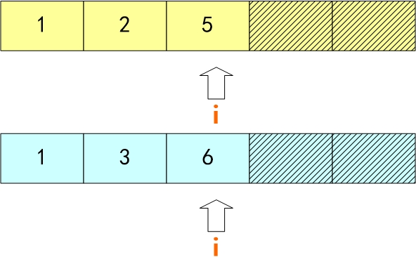
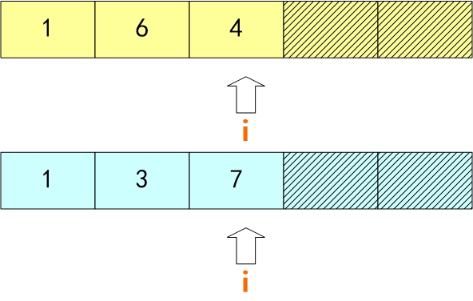

## question
[801. 使序列递增的最小交换次数](https://leetcode-cn.com/problems/minimum-swaps-to-make-sequences-increasing/)
我们有两个长度相等且不为空的整型数组 A 和 B 。

我们可以交换 A[i] 和 B[i] 的元素。注意这两个元素在各自的序列中应该处于相同的位置。

在交换过一些元素之后，数组 A 和 B 都应该是严格递增的（数组严格递增的条件仅为A[0] < A[1] < A[2] < ... < A[A.length - 1]）。

给定数组 A 和 B ，请返回使得两个数组均保持严格递增状态的最小交换次数。假设给定的输入总是有效的。

示例:
输入: A = [1,3,5,4], B = [1,2,3,7]
输出: 1
解释: 
交换 A[3] 和 B[3] 后，两个数组如下:
A = [1, 3, 5, 7] ， B = [1, 2, 3, 4]
两个数组均为严格递增的。
注意:

A, B 两个数组的长度总是相等的，且长度的范围为 [1, 1000]。
A[i], B[i] 均为 [0, 2000]区间内的整数。
## solution
确定状态
动态规划一般来讲，目标是求什么则什么即为状态，然后分析当前状态和之前状态的推导关系，进而进行穷举所有状态即可。
本题中使用dp[i][j] 表示第 i 个位置的元素，第 j （交换、不交换）状态时的最小次数。

初始状态
第 0 个位置可以交换，也可以不交换，即初始状态为：d[0][0] = 0、dp[0][1] = 1。

状态转移方程
根据题目要求一定存在结果，所以在第 i 个位置，只会有以下几种情况：
①．A、B 两个数组对应的位置都是有序、存在交叉


如上图，A[i-1] < A[i] 、B[i-1] < B[i]，并且 A[i-1] < B[i] 、B[i-1] < A[i]；此时位置 i 可以交换，也可以不交换，并且和上个位置的交换状态无关。
②．A、B 两个数组对应的位置都是有序、不在交叉


如上图，A[i-1] < A[i] 、B[i-1] < B[i]，并且 A[i-1] < B[i] 、B[i-1] > A[i]；此时位置 i 若选择不交换，则上个位置也不能交换、若选择交换，则上个位置也必须交换。
③．A、B 两个数组对应的位置有一个存在无序


如上图，A[i-1] > A[i] 、B[i-1] < B[i]，并且 A[i-1] < B[i] 、B[i-1] < A[i]；此时位置 i 若选择不交换，则上个位置必须交换、若选择交换，并且上个位置不能交换。

确认结果
数组末尾位置的状态值就是本题为结果，即 min(dp[A.size()-1][0],dp[A.size()-1][1]);

作者：li-zhi-chao-4
链接：https://leetcode-cn.com/problems/minimum-swaps-to-make-sequences-increasing/solution/dong-tai-gui-hua-de-yi-ban-bu-zou-by-li-zhi-chao-4/
来源：力扣（LeetCode）
著作权归作者所有。商业转载请联系作者获得授权，非商业转载请注明出处。
### code 
```py
class Solution(object):
    def minSwap(self, A, B):
        """
        :type A: List[int]
        :type B: List[int]
        :rtype: int
        """
        if not A or len(A) <= 1: return 0
        dp = [[0,1] for _ in A]
        for i in range(len(A)-1):
            if (A[i] < A[i+1] and B[i] < B[i+1]) and (B[i] < A[i+1] and A[i] < B[i+1]):
                dp[i+1][0] = min(dp[i][0],dp[i][1])
                dp[i+1][1] = min(dp[i][0],dp[i][1]) + 1
            if (A[i] < A[i+1] and B[i] < B[i+1]) and (B[i] >= A[i+1] or A[i] >= B[i+1]):
                dp[i+1][0] = dp[i][0]
                dp[i+1][1] = dp[i][1] + 1
            if (A[i] >= A[i+1] or B[i] >= B[i+1]):
                dp[i+1][0] = dp[i][1]
                dp[i+1][1] = dp[i][0]+1
        return min(dp[-1][0], dp[-1][1])
```