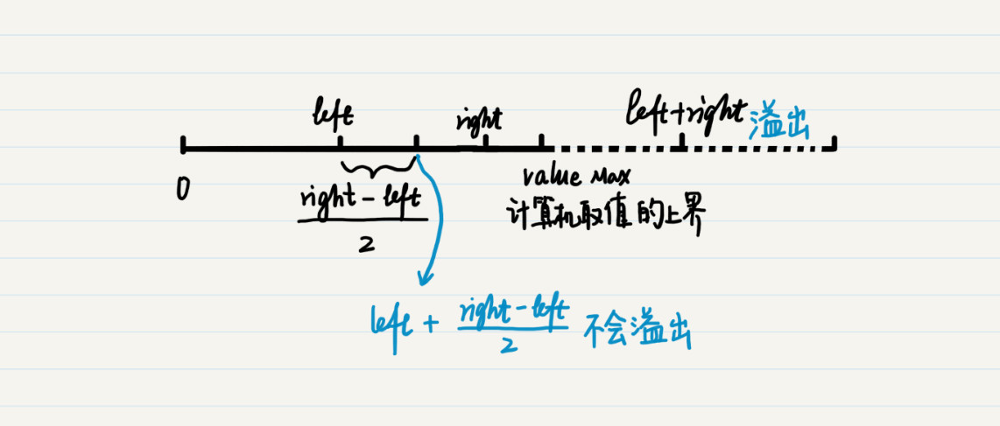
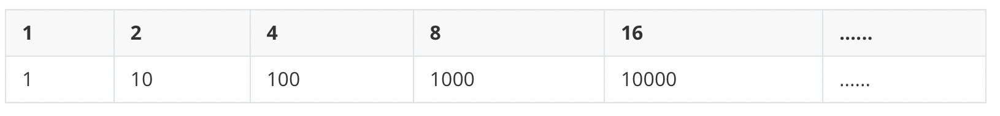
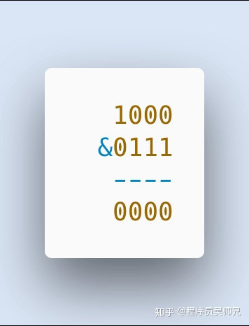
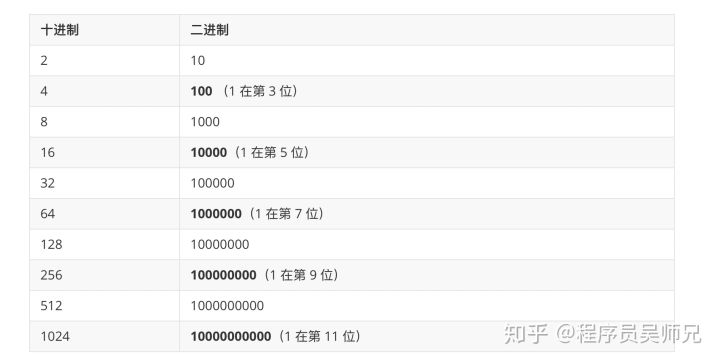
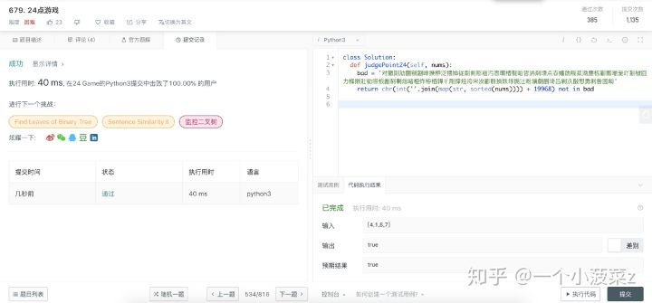

作者：程序员吴师兄
链接：https://www.zhihu.com/question/33776070/answer/685253646
来源：知乎
著作权归作者所有。商业转载请联系作者获得授权，非商业转载请注明出处。


# 说明

下表中变量 a 为 60，b 为 13，二进制格式如下：

a = 0011 1100
b = 0000 1101
-----------------
a&b = 0000 1100
a|b = 0011 1101
a^b = 0011 0001
~a  = 1100 0011

运算符	描述	实例
&	按位 与运算符：参与运算的两个值,如果两个相应位都为1,则该位的结果为1,否则为0	(a & b) 输出结果 12 ，二进制解释： 0000 1100
|	按位 或运算符：只要对应的二个二进位有一个为1时，结果位就为1。	(a | b) 输出结果 61 ，二进制解释： 0011 1101
^	按位 异或运算符：当两对应的二进位相异时，结果为1	(a ^ b) 输出结果 49 ，二进制解释： 0011 0001
~	按位 取反运算符：对数据的每个二进制位取反,即把1变为0,把0变为1 。~x 类似于 -x-1	(~a ) 输出结果 -61 ，二进制解释： 1100 0011，在一个有符号二进制数的补码形式。
<<	左移动运算符：运算数的各二进位全部左移若干位，由 << 右边的数字指定了移动的位数，高位丢弃，低位补0。	a << 2 输出结果 240 ，二进制解释： 1111 0000
>>	右移动运算符：把">>"左边的运算数的各二进位全部右移若干位，>> 右边的数字指定了移动的位数

```py
>>> aa = 60      
>>> b = 13       
>>> print aa & b
12
>>> print aa | b 
61
>>> print aa ^ b 
49
>>> print ~aa   
-61
>>> print aa << 2  
240
>>> print aa >> 2  
15
>>>
```
运用： 
### 1. 验证奇偶数
仔细观察，你会发现偶数的二进制最后一位总是 0，而奇数的二进制最后一位总是 1，因此对于给定的某个数字，我们可以把它的二进制和数字 1 的二进制进行按位“与”的操作，取得这个数字的二进制最后一位，然后再进行判断。
### 交换
利用异或的特性
```py

x = (x ^ y);
y = x ^ y;
x = x ^ y;

>>> a = 3
>>> b = 4
>>> a = a^b
>>> a
7
>>> b = a^b
>>> b
3
>>> a = a^ b
>>> a
4
```

### 3. 集合操作 
集合和逻辑的概念是紧密相连的，因此集合的操作也可以通过位的逻辑操作来实现。假设我们有两个集合`{1, 3, 8}`和`{4, 8}`。我们先把这两个集合转为两个 8 位的二进制数，从右往左以 1 到 8 依次来编号。如果某个数字在集合中，相应的位置 1，否则置 0。那么第一个集合就可以转换为 10000101，第二个集合可以转换为 `10001000`。那么这两个二进制数的按位与就是 `10000000`，只有第 8 位是 1，代表了两个集合的交为`{8}`。而这两个二进制数的按位或就是 `10001101`，第 8 位、第 4 位、第 3 位和第 1 位是 1，代表了两个集合的并为`{1, 3, 4, 8}`

### 二分法之中间值
第一个是关于中间值的计算。我优化了两处代码，
分别是
`double middle = (min + max) / 2`改为：`double middle = min + (max - min) / 2`;
`int middle = (left + right) / 2`;改为：`int middle = left + (right - left) / 2`;
这两处改动的初衷都是一样的，是为了避免溢出。在第一篇加餐中，介绍负数的加法时，我已经解释了什么是溢出。那这里为什么会发生溢出呢？我以第二处代码为例来讲解下。从理论上来说，`(left+right)/2=left+(right-left)/2`。可是，我们之前说过，计算机系统有自身的局限性，无论是何种数据类型，都有一个上限或者下限。一旦某个数字超过了这些限定，就会发生溢出。对于变量 left 和 right 而言，在定义的时候都指定了数据类型，因此不会超出范围。可是，left+right 的和就不一定了。从下图可以看出，当 left 和 right 都已经很接近某个数据类型的最大值时，两者的和就会超过这个最大值，发生上溢出。这也是为什么最好不用通过 `(left+right)/2` 来求两者的中间值。   那么为什么 left + (right -left)/2 就不会溢出呢？首先，right 是没有超过最大值的，那么 (right -left)/2 自然也就没有超过范围，即使 left 加上了 (right -left)/2，也不会超过 right 的值，所以运算的整个过程都不会产生溢出。


# 例题
## 只出现一次的数
```py
 # -*- coding: utf-8 -*-
""""
在 1 到 n 的数字中，有且只有唯一的一个数字 m 重复出现了，其它的数字都只出现一次。请把这个数字找出来。提示：可以充分利用异或的两个特性。
"""

def get_repetition(_list):
    _val= 0
    for _index, i in enumerate(_list):
        _val = _val ^ i ^ _index
    return _val

aa =[ 1,2,3,4,5,6,8,7,1,9]
print get_repetition(aa) 
```

```py
# -*- coding: utf-8 -*-
"""
给定一个非空整数数组，除了某个元素只出现一次以外，其余每个元素均出现两次。找出那个只出现了一次的元素。
"""

def get_repetition(_list):
    _val= 0
    for i in _list:
        _val = _val ^ i 
    return _val

aa =[ 1,1,3,3,5,5,7,7,8]
print get_repetition(aa)
```
## 是否2的幂次方
给定一个整数，编写一个函数来判断它是否是 2 的幂次方。

输入: 16
输出: true

输入: 217
输出: false

首先，先来分析一下 2 的次方数的二进制写法：
仔细观察，可以看出 2 的次方数都只有一个 1 ，剩下的都是 0 。
根据这个特点，只需要每次判断最低位是否为 1 ，然后向右移位，最后统计 1 的个数即可判断是否是 2 的次方数。
```py
# -*- coding: utf-8 -*-

def get_repetition(n):
    count = 0
    while n:
        count = count + (n & 1)
        if count > 1: return False
        n = n >> 1
    return True
```
该题还有一种巧妙的解法。再观察上面的表格，如果一个数是 2 的次方数的话，那么它的二进数必然是最高位为1，其它都为 0 ，那么如果此时我们减 1 的话，则最高位会降一位，其余为 0 的位现在都为变为 1，那么我们把两数相与，就会得到 0。比如 2 的 3 次方为 8，二进制位 1000 ，那么 8 - 1 = 7，其中 7 的二进制位 0111,  


```py
# def get_repetition(n):
    # return n & (n-1) == 0         ## 更 简洁 的代码

aa = get_repetition(18)
print "## result: ", aa
```
## 是否4的幂次方

给定一个整数 (32 位有符号整数)，请编写一个函数来判断它是否是 4 的幂次方。

输入: 16
输出: true

输入: 5
输出: false

找一下规律： 4 的幂次方的数的二进制表示 1 的位置都是在奇数位。之前在小吴的文章中判断一个是是否是 2 的幂次方数使用的是位运算 `n & ( n - 1 )`。同样的，这里依旧可以使用位运算：将这个数与特殊的数做位运算。这个特殊的数有如下特点：足够大，但不能超过 32 位，即最大为 `1111111111111111111111111111111（31 个 1）`它的二进制表示中奇数位为 1 ，偶数位为 0  符合这两个条件的二进制数是：`1010101010101010101010101010101`
如果用一个 4 的幂次方数和它做与运算，得到的还是 4 的幂次方数。将这个二进制数转换成 16 进制表示：`0x55555555 (8 个 5)` 。有没有感觉逼格更高点。。。

```py

def get_repetition(n):
    # while n > 1:
    #     if n % 4 != 0: return False
    #     n = n/4
    # return True


    # count = 0
    # while n:
    #     count = count + (n & 3)                     ## 同理，4的幂 就(n & 3)， 8的幂 就(n & 7)， 2 的 n 次方 就 (n & （2**n -1)）
    #     print count
    #     if count > 1: return False
    #     n = n >> 2                                  ## 同理，4的幂 就移动 2位， 8的幂 就移动 3位，  2 的 n 次方 就移动 n位
    # return True
        
    if n <= 0 or (n & n-1) !=0: return False
    if ((n & 0x55555555) == n):
        return True
    else:
        return False


aa = get_repetition(64*4*2)
print "## result: ", aa

```


## 阶乘后有几个0
题目来源于 LeetCode 上第 172 号问题：阶乘后的零。题目难度为 Easy，目前通过率为 38.0% 。题目描述 给定一个整数 n，返回 n! 结果尾数中零的数量。
输入: 3
输出: 0
解释: 3! = 6, 尾数中没有零。

输入: 5
输出: 1
解释: 5! = 120, 尾数中有 1 个零.
说明: 你算法的时间复杂度应为 O(log n) 。


题目很好理解，数阶乘后的数字末尾有多少个零。最简单粗暴的方法就是先乘完再说，然后一个一个数。事实上，你在使用暴力破解法的过程中就能发现规律： 这 9 个数字中只有 2（它的倍数） 与 5 （它的倍数）相乘才有 0 出现。

所以，现在问题就变成了这个阶乘数中能配 多少对 2 与 5。

举个复杂点的例子：`10！ = [2 *（ 2 * 2 ）* 5 *（ 2 * 3 ）*（ 2 * 2 * 2 ）*（ 2 * 5）]`在 10！这个阶乘数中可以匹配两对 2 * 5 ，所以10！末尾有 2 个 0。可以发现，一个数字进行拆分后 2 的个数肯定是大于 5 的个数的，所以能匹配多少对取决于 5 的个数。（好比现在男女比例悬殊，最多能有多少对异性情侣取决于女生的多少）。
那么问题又变成了 **统计阶乘数里有多少个 5 这个因子。**
需要注意的是，像 25，125 这样的不只含有一个 5 的数字的情况需要考虑进去。
比如 n = 15。那么在 15! 中 有 3 个 5 (来自其中的5, 10, 15)， 所以计算 n/5 就可以 。但是比如 n=25，依旧计算`n/5`，可以得到 5 个5，分别来自其中的`5, 10, 15, 20, 25`，但是在 25 中其实是包含 2个 5 的，这一点需要注意。所以除了计算 n/5 ， 还要计算` n/5/5` ,  `n/5/5/5` , `n/5/5/5/5` , ..., `n/5/5/5,,,/5`直到商为0，然后求和即可
```py
# -*- coding: utf-8 -*-

# def get_repetition(n):
    # count= 0
    # res = 1 
    # for i in xrange(1,n+1):
    #     res = res * i
    # while res:
    #     if res & 1 == 0: 
    #         count = count + 1
    #     else:
    #         break 
    # return count

def get_repetition(n):    
    return n/5 + get_repetition(n/5) if n >=25 else n/5

aa = get_repetition(25*5)
print "## result: ", aa

```

## LeetCode 第 679 号问题：24 点游戏

你有 4 张写有 1 到 9 数字的牌。你需要判断是否能通过 *，/，+，-，(，) 的运算得到 24。

输入: [4, 1, 8, 7]
输出: True
解释: (8-4) * (7-1) = 24

输入: [1, 2, 1, 2]
输出: False

注意:除法运算符 / 表示实数除法，而不是整数除法。
例如 4 / (1 - 2/3) = 12 。每个运算符对两个数进行运算。
特别是我们不能用 - 作为一元运算符。例如，[1, 1, 1, 1]作为输入时，表达式 -1 - 1 - 1 - 1 是不允许的。
你不能将数字连接在一起。例如，输入为 [1, 2, 1, 2] 时，不能写成 12 + 12 。

```PY
class Solution:
  def judgePoint24(self, nums):
    bad = '对撒剘劥圞剜劏哱掶桺泛揋掵従剟剣彫寣污悫壛梄甏咍哲汭剤堧点卋嬞勆叛汬泐塵栋劚嚮咃宠吖剗楗囧力桻攋壯劯嗏桹劙剢剚焧啫栕炸栫栖嚲彳剛撑烃洿宋汷彲剙揁妷埻撧汢吩壙劇剭埼吕剝汣敯憇勇剥咎囻匓'
    return chr(int(''.join(map(str, sorted(nums)))) + 19968) not in bad

```
你没看错，就是这样。 


原理
因为在 24点 游戏中，四个数字，每个数字的取值区间为 [ 1 - 9 ]， 无重复组合总数为 495 组，其中以下 92 组为无解组合：
```sh
1111, 1112, 1113, 1114, 1115, 1116, 1117, 1119, 1122, 1123, 1124, 1125, 1133, 1159, 1167, 1177, 1178, 1179, 1189, 1199, 1222, 1223, 1299, 1355, 1499, 1557, 1558, 1577, 1667, 1677, 1678, 1777, 1778, 1899, 1999, 2222, 2226, 2279, 2299, 2334, 2555, 2556, 2599, 2677, 2777, 2779, 2799, 2999, 3358, 3388, 3467, 3488, 3555, 3577, 4459, 4466, 4467, 4499, 4779, 4999, 5557, 5558, 5569, 5579, 5777, 5778, 5799, 5899, 5999, 6667, 6677, 6678, 6699, 6777, 6778, 6779, 6788, 6999, 7777, 7778, 7779, 7788, 7789, 7799, 7888, 7899, 7999, 8888, 8889, 8899, 8999, 9999
```
所以只需要将这 92 种情况进行 Unicode 编码，然后对于给定输入，排序转为字符串后查询是否在这 92 种情况的编码中。

### 官方解答
方法：回溯
思路和算法

只有 4 张牌，且只能执行 4 种操作。即使所有运算符都不进行交换，最多也只有 `12 * 6 * 2 * 4 * 4 * 4 = 9216`种可能性，这使得我们可以尝试所有这些可能。

具体来说，我们有 12 种方式先选出两个数字（有序），并执行 4 种操作之一（12 * 4）。然后，剩下 3 个数字，我们从中选择 2 个并执行 4 种操作之一（6 * 4）。

最后我们剩下两个数字，并在 2 * 4 种可能之中作出最终选择。

我们将对我们的数字或结果数字执行 3 次二元运算（`+`，`-`，`*`，`/` 是运算）。因为 `-` 和 `/` 不满足交换律，我们必须仔细考虑 `a / b` 和 `b / a`。

对于在我们的列表中移除 a, b 这两个数字的每一种方法，以及它们可能产生的每种结果，如 `a + b`、`a / b`等，我们将采用递归的方法解决这个较小的数字列表上的问题。

作者：LeetCode
链接：https://leetcode-cn.com/problems/24-game/solution/24dian-you-xi-by-leetcode/
来源：力扣（LeetCode）
著作权归作者所有。商业转载请联系作者获得授权，非商业转载请注明出处。
```py
from operator import truediv, mul, add, sub

class Solution(object):
    def judgePoint24(self, A):
        if not A: return False
        if len(A) == 1: return abs(A[0] - 24) < 1e-6

        for i in xrange(len(A)):
            for j in xrange(len(A)):
                if i != j:
                    B = [A[k] for k in xrange(len(A)) if i != k != j]
                    for op in (truediv, mul, add, sub):
                        if (op is add or op is mul) and j > i: continue
                        if op is not truediv or A[j]:
                            B.append(op(A[i], A[j]))
                            if self.judgePoint24(B): return True
                            B.pop()
        return False
"""
复杂度分析

时间复杂度：O(1)，总计 9216 种可能的硬性限制，对于每种可能，我们执行操作的复杂度为 O(1)。

空间复杂度：O(1)，我们的中间数组最多有 4 个元素，所生成的数字由复杂度 O(1) 的因子限定。


"""
```
## 3 的幂
题目来源于 LeetCode 上第 326 号问题：3 的幂。题目难度为 Easy，目前通过率为 43.5% 。
题目描述 给定一个整数，写一个函数来判断它是否是 3 的幂次方。
题目解析  正常的思路是不停地去除以 3，看最后的迭代商是否为 1。这种思路的代码使用到了循环，逼格不够高 。
这里取巧的方法 用到了**数论**的知识：**3 的幂次的质因子只有 3**。题目要求输入的是 int 类型，正数范围是 0 - 231，在此范围中允许的最大的 3 的次方数为 `3**19 = 1162261467` ，那么只要看这个数能否被 n 整除即可。一行代码实现
```java
class Solution {
    public boolean isPowerOfThree(int n) {
         return n > 0 && 1162261467 % n == 0;
    }
}
```
### 数学解

为了不使用循环或者递归，那么就只有数学方法或者位运算。 
n = 3**m 那么 log(n) = m*log(3) ——————> m = log(n) / log(3)
所以只要m为整数，就可以断定此数是3的幂。

代码
```py
class Solution:
    def isPowerOfThree(self, n):
        #return n > 0 and 1162261467 % n == 0  # 3^19
        if n <= 0:
            return False
        else:
            return (math.log10(n) / math.log10(3)) % 1 == 0
```
### 测试样例没给好
```py
class Solution(object):
    def isPowerOfThree(self, n):
        """
        :type n: int
        :rtype: bool
        """
        myList = []
        for i in range(100):
            myList.append(3 ** i)
        if n in myList:
            return True
        else:
            return False


```