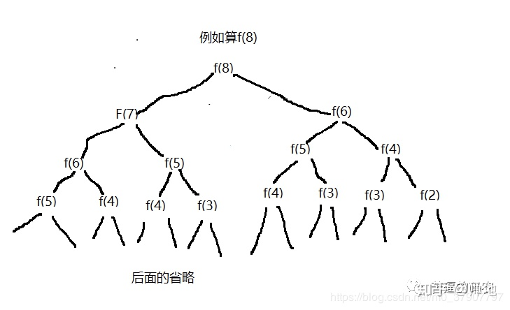

如果你是为了笔试刷题的话，我建议你多看看一些奥数题的技巧性解题思路，而不是一些算法的思路。------ 高中奥数
meddium , hard-----对于 ACMer 来说， just so so,    so you can try 'ACM'.

<!-- TOC -->

- [all](#all)
    - [直接用数学公式](#直接用数学公式)
    - [1、多思考能否使用位运算](#1多思考能否使用位运算)
        - [1、利用 n & (n - 1)消去 n 最后的一位 1](#1利用-n--n---1消去-n-最后的一位-1)
        - [2、异或(^)运算的妙用](#2异或^运算的妙用)
    - [2、考虑是否可以使用数组下标](#2考虑是否可以使用数组下标)
    - [3、考虑能否使用双指针](#3考虑能否使用双指针)
        - [给定一个整数有序数组和一个目标值，找出数组中和为目标值的两个数，并且打印出来](#给定一个整数有序数组和一个目标值找出数组中和为目标值的两个数并且打印出来)
        - [“判断单链表是否有环”](#判断单链表是否有环)
        - [“如何一次遍历就找到链表中间位置节点”](#如何一次遍历就找到链表中间位置节点)
        - [单链表中倒数第 k 个节点”](#单链表中倒数第-k-个节点)
    - [4、从递归到备忘录到递推或者动态规划](#4从递归到备忘录到递推或者动态规划)
        - [（1）.对于可以递归的问题务必考虑是否有重复计算的](#1对于可以递归的问题务必考虑是否有重复计算的)
            - [青蛙跳台阶](#青蛙跳台阶)
                - [备忘录法](#备忘录法)
            - [考虑自底向上](#考虑自底向上)
                - [递推](#递推)
    - [5、考虑是否可以设置哨兵位来处理临届问题](#5考虑是否可以设置哨兵位来处理临届问题)

<!-- /TOC -->
# all
## 直接用数学公式

[leetcode 的 62 号题](https://leetcode-cn.com/problems/unique-paths/)
一个机器人位于一个 m x n 网格的左上角 （起始点在下图中标记为“Start” ）。

机器人每次只能向下或者向右移动一步。机器人试图达到网格的右下角（在下图中标记为“Finish”）。
问总共有多少条不同的路径？ 

例如，上图是一个7 x 3 的网格。有多少可能的路径？

输入: m = 3, n = 2
输出: 3g
解释:
从左上角开始，总共有 3 条路径可以到达右下角。
1. 向右 -> 向右 -> 向下
2. 向右 -> 向下 -> 向右
3. 向下 -> 向右 -> 向右

输入: m = 7, n = 3
输出: 28
 

提示：
1 <= m, n <= 100
题目数据保证答案小于等于 2 * 10 ^ 9

来源：力扣（LeetCode）
链接：https://leetcode-cn.com/problems/unique-paths
著作权归领扣网络所有。商业转载请联系官方授权，非商业转载请注明出处。
```py
class Solution(object):
    def uniquePaths(self, m, n):
        """
        :type m: int
        :type n: int
        :rtype: int
        """
        def _reverse(i,j):
            if i and j:
                grid[i][j]= grid[i][j-1] + grid[i-1][j]
            else:
                grid[i][j] = 1

        grid= [[1]*m]*n
        for x in range(n):
            for y in range(m):
                 _reverse(x,y)
        return grid[n-1][m-1]

# class Solution:
#     def uniquePaths(self, m: int, n: int) -> int:
#         return int(math.factorial(m+n-2)/math.factorial(m-1)/math.factorial(n-1))


# class Solution:
#     def uniquePaths(self, m: int, n: int) -> int:
        # M, N = 1, 1

        # for i in range(2,min(m,n)):       # min(m,n)-1 +1 
        #     N *= i
        # for i in range(m+n-2, m+n-2 - (min(m,n)-1), -1):
        #     M *= i
        # return M//N
"""
C(n-1, m+n-2) or C(m-1, m+n-2)  两者相等 组合公式， 意思是
总共走的步长为m+n-2, 从里面寻找 (n-1) 或 (m-1) 的组合。 
纵向 必然要走 m-1 步， 横向必然走n-1 步。

m,n --> 3, 7  C(2, 8)  --> 8*7 // 2*1

时间复杂度 O(max(m,n)), 空间复杂度 O(1)

"""
```

## 1、多思考能否使用位运算

如果你去看一些大佬的解题代码，你会发现大部分代码里都会出现位运算相关的代码，而且不瞒你说，如果我看到一个人的代码里，如果出现了位运算，我就会感觉这个人还是有点东西。最简单地位运算使用场景就是当我们在进行除法和乘法运算的时候了，例如每次遇到 n / 2，n / 4，n / 8这些运算地时候，完全可以使用位运算，也可以使你地代码运行效率更高
### 1、利用 n & (n - 1)消去 n 最后的一位 1
### 2、异或(^)运算的妙用
关于异或运算符，我们先来看下他的特性
特性一：两个相同的数相互异或，运算结果为 0，例如 n ^ n = 0;
特性二：任何数和 0 异或，运算结果不变，例如 n ^ 0 = n;
特性三：支持交换律和结合律，例如 x ^ ( y ^ x) = (x ^ y) ^ x;

作者：帅地
链接：https://zhuanlan.zhihu.com/p/109431459
来源：知乎
著作权归作者所有。商业转载请联系作者获得授权，非商业转载请注明出处。
## 2、考虑是否可以使用数组下标
数组的下标是一个隐含的很有用的数组，特别是在统计一些数字，或者判断一些整型数是否出现过的时候。
例如，给你一串字母，让你判断这些字母出现的次数时，我们就可以把这些字母作为下标，在遍历的时候，如果字母a遍历到，则arr[a]就可以加1了，即  arr[a]++;通过这种巧用下标的方法，我们不需要逐个字母去判断。
我再举个例子： 问题：给你n个无序的int整型数组arr，并且这些整数的取值范围都在0-20之间，要你在 O(n) 的时间复杂度中把这 n 个数按照从小到大的顺序打印出来。 对于这道题，如果你是先把这 n 个数先排序，再打印，是不可能O(n)的时间打印出来的。但是数值范围在 0-20。我们就可以巧用数组下标了。把对应的数值作为数组下标，如果这个数出现过，则对应的数组加1。
```py
# -*- coding: utf-8 -*-

def get_repetition(_list):    
    """
    >>> aa = [0]*20
    >>> aa
    [0, 0, 0, 0, 0, 0, 0, 0, 0, 0, 0, 0, 0, 0, 0, 0, 0, 0, 0, 0]
    """
    _res = [0]*21  
    for i in _list:
        _res[i] = _res[i] + 1
    # for j in range(21):
        # if _res[j]: print j
    return [j for j in range(21) if _res[j]]

bb = [1,5,3,6,7,2,11,17,16]
aa = get_repetition(bb)
print "## result: ", aa
```

## 3、考虑能否使用双指针
双指针这个技巧，那就更加常用的，特别是在链表和有序数组中，例如

### 给定一个整数有序数组和一个目标值，找出数组中和为目标值的两个数，并且打印出来

一种简单的做法就是弄个两层的 for 循环，然而对于这种有序的数组，如果是要寻找某个数之类的，大概率可以考虑双指针，也就是设置一个头指针和尾指针，直接看代码吧，代码如下

```java
int find(int arr[], int target){
    int left = 0;//头指针
    int right = arr.length - 1;// 尾指针
    while(left < right){
        if(left + right == target){
            // 找到目标数，进行打印，这里我就不执行打印操作两
        }else if(left + right < target){
            left ++;
        }else{
            right --;
        }
    }
}

```
在 leetcode 中的三数之和和四数只和都可以采用这个类型的双指针来处理。

当然，双指针在链表中也是非常给力的，例如
###   “判断单链表是否有环”
solution:   设置一个慢指针和一个快指针来遍历这个链表。慢指针一次移动一个节点，而快指针一次移动两个节点，如果该链表没有环，则快指针会先遍历完这个表，如果有环，则快指针会在第二次遍历时和慢指针相遇

###   “如何一次遍历就找到链表中间位置节点”
solution:   设置一个快指针和慢指针。慢的 两次 移动一个节点，而快的 一次移动一个。在遍历链表的时候，当快指针遍历完成时，慢指针刚好达到中点

###   单链表中倒数第 k 个节点”
solution:   设置两个指针，其中一个指针先移动k个节点。之后两个指针以相同速度移动。当那个先移动的指针遍历完成的时候，第二个指针正好处于倒数第k个节点

你看，采用双指针方便多了吧。所以以后在处理与链表相关的一些问题的时候，可以考虑双指针哦。

## 4、从递归到备忘录到递推或者动态规划

递归真的太好用了，好多问题都可以使用递归来解决，不过 80% 的递归题都可以进行**剪枝**，并且还有还多带**有备忘录的递归**都可以转化为**动态规划**， `递归 =》递归+备忘录 =》动态规划 =》动态规划优化` 。

列举一个简单的例子吧，这个例子重在告诉大家遇到**递归**的题，一定要考虑是否可以**剪枝**，是否可以把**递归**转化成**递推**。

### （1）.对于可以递归的问题务必考虑是否有重复计算的
#### 青蛙跳台阶
问题：一只青蛙一次可以跳上1级台阶，也可以跳上2级。求该青蛙跳上一个n级的台阶总共有多少种跳法？这个问题用递归很好解决。假设 f(n) 表示n级台阶的总跳数法，则有`f(n) = f(n-1) + f(n - 2)`。递归的结束条件是当`0 <= n <= 2`时, `f(n) = n`。因此我们可以很容易写出递归的代码
```java
public int f(int n) {
       if (n <= 2) {
           return n;
       } else {
           return f(n - 1) + f(n - 2);
       }
   }
```
不过对于可以使用递归解决的问题，我们一定要考虑是否有很多重复计算，一种简单的方法就是大家可以画一个图来看下。如这道题

显然对于 f(n) = f(n-1) + f(n-2) 的递归，是有很多重复计算的。这个时候我们要考虑状态保存。例如用hashMap来进行保存，当然用一个数组也是可以的，这个时候就像我们上面说的巧用数组下标了。可以当arr[n] = 0时，表示n还没计算过，当arr[n] != 0时，表示f(n)已经计算过，这时就可以把计算过的值直接返回回去了。因此我们考虑用状态保存的做法代码如下：
##### 备忘录法
这样，可以极大着提高算法的效率。也有人把这种状态保存称之为**备忘录法**
```java
//数组的大小根据具体情况来，由于int数组元素的的默认值是0
   int[] arr = new int[1000];
   public int f(int n) {
       if (n <= 2) {
           return n;
       } else {
           if (arr[n] != 0) {
               return arr[n];//已经计算过，直接返回
           } else {
               arr[n] = f(n-1) + f(n-2);
               return arr[n];
           }
       }
   }

```
#### 考虑自底向上
对于递归的问题，我们一般都是从上往下递归的，直到递归到最底，再一层一层着把值返回。不过，有时候当n比较大的时候，例如当 `n = 10000`时，那么必须要往下递归10000层直到 `n <=2` 才将结果慢慢返回，如果n太大的话，可能栈空间会不够用。对于这种情况，其实我们是可以考虑自底向上的做法的。例如我知道`f(1) = 1; f(2) = 2`;那么我们就可以推出 `f(3) = f(2) + f(1) = 3`。从而可以推出f(4),f(5)等直到f(n)。因此，我们可以考虑使用自底向上的方法来做。代码如下：
##### 递推
```java
public int f(int n) {
       if(n <= 2)
           return n;

       int f1 = 1;
       int f2 = 2;
       int sum = 0;

       for (int i = 3; i <= n; i++) {
           sum = f1 + f2;
           f1 = f2;
           f2 = sum;
       }
       return sum;
   }
```
我们也把这种自底向上的做法称之为**递推**。根据这种**带备忘录的递归**，往往可以演变成**动态规划**，

大家可以拿 leetcode 这两道题试试水
[leetcode 的 62 号题](https://leetcode-cn.com/problems/unique-paths/)
一个机器人位于一个 m x n 网格的左上角 （起始点在下图中标记为“Start” ）。

机器人每次只能向下或者向右移动一步。机器人试图达到网格的右下角（在下图中标记为“Finish”）。
问总共有多少条不同的路径？ 

例如，上图是一个7 x 3 的网格。有多少可能的路径？

输入: m = 3, n = 2
输出: 3
解释:
从左上角开始，总共有 3 条路径可以到达右下角。
1. 向右 -> 向右 -> 向下
2. 向右 -> 向下 -> 向右
3. 向下 -> 向右 -> 向右

输入: m = 7, n = 3
输出: 28
 

提示：
1 <= m, n <= 100
题目数据保证答案小于等于 2 * 10 ^ 9

来源：力扣（LeetCode）
链接：https://leetcode-cn.com/problems/unique-paths
著作权归领扣网络所有。商业转载请联系官方授权，非商业转载请注明出处。
```py
class Solution(object):
    def uniquePaths(self, m, n):
        """
        :type m: int
        :type n: int
        :rtype: int
        """
        def _reverse(i,j):
            if i and j:
                grid[i][j]= grid[i][j-1] + grid[i-1][j]
            else:
                grid[i][j] = 1

        grid= [[1]*m]*n
        for x in range(n):
            for y in range(m):
                 _reverse(x,y)
        return grid[n-1][m-1]

# class Solution:
#     def uniquePaths(self, m: int, n: int) -> int:
#         return int(math.factorial(m+n-2)/math.factorial(m-1)/math.factorial(n-1))


# class Solution:
#     def uniquePaths(self, m: int, n: int) -> int:
        # M, N = 1, 1

        # for i in range(2,min(m,n)):       # min(m,n)-1 +1 
        #     N *= i
        # for i in range(m+n-2, m+n-2 - (min(m,n)-1), -1):
        #     M *= i
        # return M//N
"""
C(n-1, m+n-2) or C(m-1, m+n-2)  两者相等 组合公式， 意思是
总共走的步长为m+n-2, 从里面寻找 (n-1) 或 (m-1) 的组合。 
纵向 必然要走 m-1 步， 横向必然走n-1 步。

m,n --> 3, 7  C(2, 8)  --> 8*7 // 2*1

时间复杂度 O(max(m,n)), 空间复杂度 O(1)

"""
```


[leetcode 的第64题](https://leetcode-cn.com/problems/minimum-path-sum/)
```py
64. 最小路径和
给定一个包含非负整数的 m x n 网格，请找出一条从左上角到右下角的路径，使得路径上的数字总和为最小。

说明：每次只能向下或者向右移动一步。

输入:
[
  [1,3,1],
  [1,5,1],
  [4,2,1]
]
输出: 7
解释: 因为路径 1→3→1→1→1 的总和最小。
```
```py
class Solution(object):
    def minPathSum(self, grid):
        """
        :type grid: List[List[int]]
        :rtype: int
        """
        m = len(grid)
        n = len(grid[0])

        for i in xrange(1,n):
            grid[0][i]= grid[0][i]  + grid[0][i-1]
        for j in xrange(1,m):
            grid[j][0] = grid[j][0]  + grid[j-1][0]
        
        for j in xrange(1,m):
            for i in xrange(1,n):
                grid[j][i]= grid[j][i]  + min(grid[j][i-1] ,grid[j-1][i])

        return grid[m-1][n-1]
```
总结一下当你在使用递归解决问题的时候，要考虑以下两个问题
**(1). 是否有状态重复计算的，可不可以使用备忘录法来优化。**
**(2). 是否可以采取递推的方法来自底向上做，减少一味递归的开销。**

## 5、考虑是否可以设置哨兵位来处理临届问题

在链表的相关问题中，我们经常会设置一个头指针，而且这个头指针是不存任何有效数据的，只是为了操作方便，这个头指针我们就可以称之为**哨兵位**了。例如我们要删除头第一个节点是时候，如果没有设置一个哨兵位，那么在操作上，它会与删除第二个节点的操作有所不同。但是我们设置了哨兵，那么删除第一个节点和删除第二个节点那么在操作上就一样了，不用做额外的判断。当然，插入节点的时候也一样。
有时候我们在操作数组的时候，也是可以设置一个哨兵的，`把arr[0]作为哨兵`。例如，要判断两个相邻的元素是否相等时，设置了哨兵就不怕越界等问题了，可以直接`arr[i] == arr[i-1]`了。不用怕`i = 0`时出现越界。当然我这只是举一个例子，具体的应用还有很多，例如`插入排序，环形链表`等

