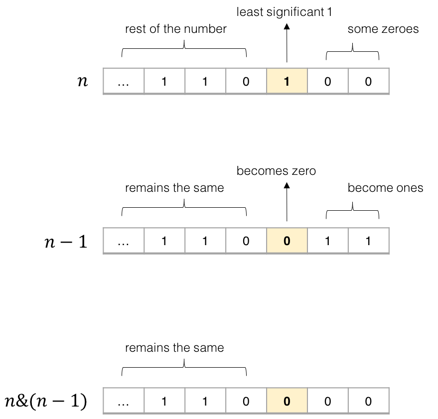
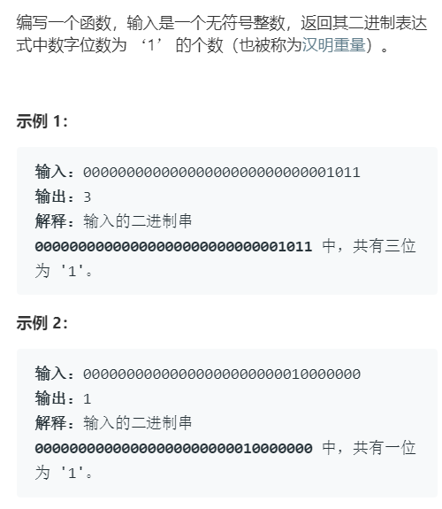

# Common Bit manipulation

Translator: [Funnyyanne](https://github.com/Funnyyanne)

Author: [labuladong](https://github.com/labuladong)

This article is divided into two parts. The first part lists a few interesting bitwise operations, second part explains n&(n-1) trick commonly used in algorithm. By the way, I’m going to show you the algorithm for this trick. Because Bit manipulation is simple, it is assumed that the reader already knows the three basic operations of AND, OR, XOR.

Bit Manipulation can play a lot of fucking trick, but most of these tricks are too obscure, there is no need to dig in. We just need to remember some useful operations.

### Ⅰ.Interesting Bit manipulations


1. Use OR '|' and space bar coverts English characters to lowercase

```c
('a' | ' ') = 'a'
('A' | ' ') = 'a'
```

2. Use AND '&' and underline coverts English to uppercase.

```c
('b' & '_') = 'B'
('B' & '_') = 'B'
```

3. Use XOR '^' and space bar for English characters case exchange.  

```c
('d' ^ ' ') = 'D'
('D' ^ ' ') = 'd'
```

PS：The reason why the operation can produce strange effects is ASCII encoding. Characters are actually Numbers, it happens that the Numbers corresponding to these characters can get the correct result through bit manipulations, if you interested in it, you can check ASCII table, this article does not expand it.

4. Determine if the sign of two numbers are different

```c
int x = -1, y = 2;
bool f = ((x ^ y) < 0); // true

int x = 3, y = 2;
bool f = ((x ^ y) < 0); // false
```

PS：This technique is very practical, and uses sign bit complement encoding. If you don't use the bit operation to determine whether the sign is different, you need to use if else branch, which is quite troublesome. Readers may want to try to use products or quotients to determine whether two numbers have different signs, but this processing method may cause overflow and cause errors. (For complement coding and overflow, see the previous article.)

5. Swap two Numbers

```c
int a = 1, b = 2;
a ^= b;
b ^= a;
a ^= b;
// 现在 a = 2, b = 1
```

6. Plus one

```c
int n = 1;
n = -~n;
// 现在 n = 2
```

7. Minus one

```c
int n = 2;
n = ~-n;
// 现在 n = 1
```

PS：These three operations just Show off, No practical use, we just know it.。

### Ⅱ.Algorithm common operations n&(n-1)

This operation is the common algorithm, the function is eliminated the number n of the binary representation of the last 1.

It is easy to understand by looking at the picture：



1. Count Hamming Weight（Hamming Weight）



Be to let you return several ones in the binary representation of n's one. Because n & (n-1) can eliminate the last one, you can use a loop to eliminate 1 and count at the same time until n becomes 0.

```cpp
int hammingWeight(uint32_t n) {
    int res = 0;
    while (n != 0) {
        n = n & (n - 1);
        res++;
    }
    return res;
}
```

1. Determine if a number is an exponent of 2

If a number is an exponent of 2, its binary representation must contain only one 1:

```cpp
2^0 = 1 = 0b0001
2^1 = 2 = 0b0010
2^2 = 4 = 0b0100
```

If you use the bit operation technique, it is very simple (note the precedence of the operator, the parentheses cannot be omitted) :

```cpp
bool isPowerOfTwo(int n) {
    if (n <= 0) return false;
    return (n & (n - 1)) == 0;
}
```

The above are some interesting / common bit manipulation. In fact, there are many bit manipulation techniques. There is a foreign website called Bit Twiddling Hacks which collects almost all black technology gameplays of bit manipulation. Interested readers can search to view.
