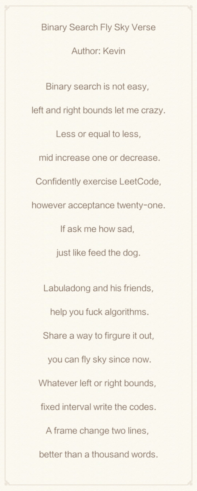
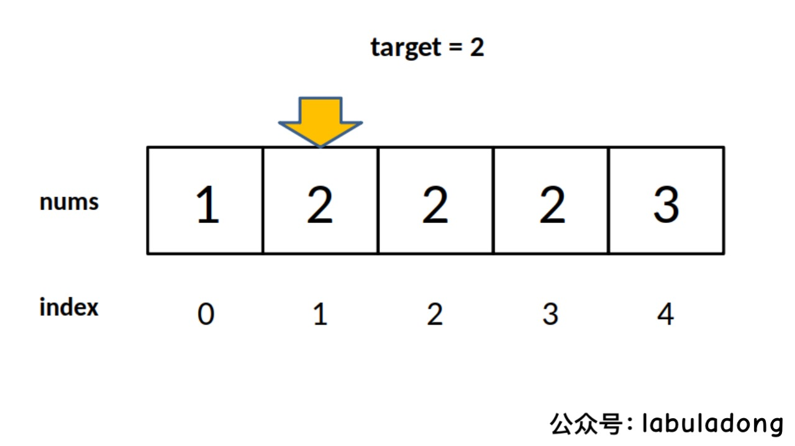
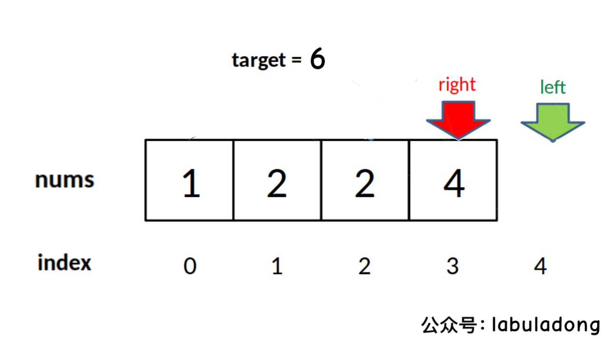
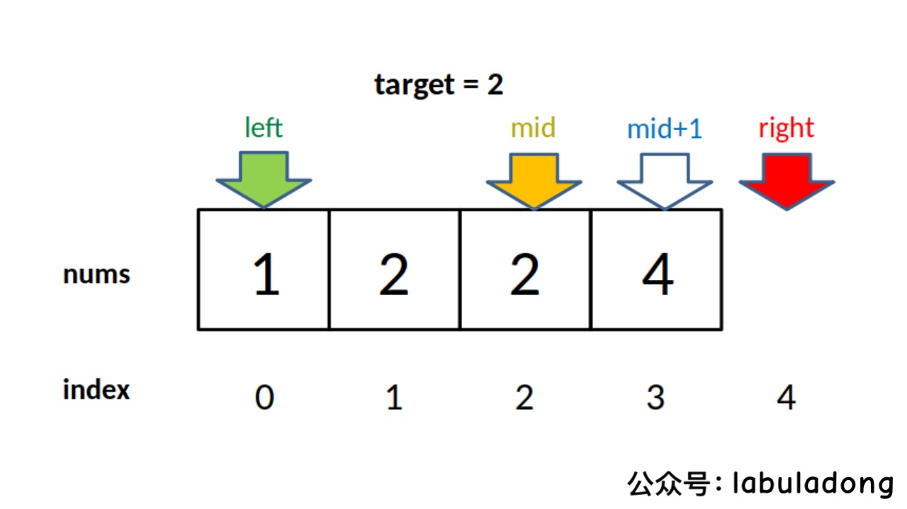
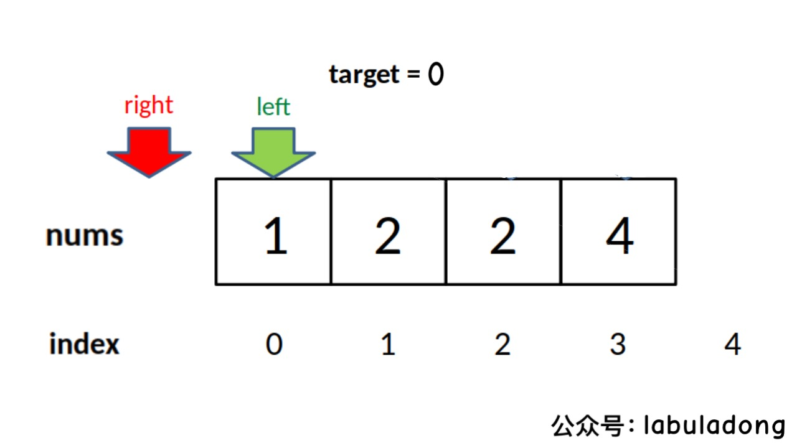

# Detailed Binary Search

**Translator: [Kevin](https://github.com/Kevin-free)**

**Author: [labuladong](https://github.com/labuladong)**

First, let me tell you a joke cheerful:

One day Adong went to the library and borrowed N books. When he went out of the library, the alarm went off, so the security guard stopped Adong to check which books were not registered for loan. ADong is going to go through each book under the alarm to find the book that caused the alarm, but the security guard's disdainful look: Can't you even do a binary search? Then the security divided the books into two piles, let the first pile pass the alarm, the alarm sounded; then divided the pile into two piles ... Finally, after checking logN times, the security successfully found the one that caused the alarm The book showed a smug and ridiculous smile. So Adong left with the remaining books.

Since then, the library has lost N-1 books.

Binary search is not easy. The mogul Knuth (the one who invented the KMP algorithm) said that binary search: **Although the basic idea of binary search is comparatively straightforward, the details can be surprisingly tricky...** Many people like to talk about integer overflow bugs, but the real pit of binary search is not the detail problem at all, but whether to add one to or subtract one from `mid`, whether to use` <= `in while `<`.

If you don't understand these details correctly, writing dichotomy is definitely metaphysical programming, and if there is a bug, you can only rely on bodhisattva to bless it. **I deliberately wrote a poem to celebrate the algorithm, summarize the main content of this article, and suggest to save:**



This article explores some of the most commonly used binary search scenarios: finding a number, finding the left boundary, and finding the right boundary. Moreover, we are going to go into details, such as whether the inequality sign should be accompanied by an equal sign, whether mid should be increased by one, and so on. Analyze the differences in these details and the reasons for these differences to ensure that you can write the correct binary search algorithm flexibly and accurately.

### Zero, binary search framework

```java
int binarySearch(int[] nums, int target) {
    int left = 0, right = ...;

    while(...) {
        int mid = left + (right - left) / 2;
        if (nums[mid] == target) {
            ...
        } else if (nums[mid] < target) {
            left = ...
        } else if (nums[mid] > target) {
            right = ...
        }
    }
    return ...;
}
```

**A technique for analyzing binary search is: do not appear else, but write everything clearly with else if, so that all details can be clearly displayed**. This article will use else if to make it clear, and readers can simplify it after understanding.

The section marked with `...`, is the place where details may occur. When you see a binary search code, pay attention to these places first. The following sections use examples to analyze what changes can be made in these places.

In addition, it is necessary to prevent overflow when calculating mid. `left + (right-left) / 2` is the same as` (left + right) / 2` in the code, but it effectively prevents `left` and` right`. Too large a direct addition causes an overflow.


### First, find a number (basic binary search)

This scenario is the simplest and certainly the most familiar to everyone, that is, searching for a number, if it exists, returns its index, otherwise it returns -1.

```java
int binarySearch(int[] nums, int target) {
    int left = 0; 
    int right = nums.length - 1; // attention

    while(left <= right) {
        int mid = left + (right - left) / 2;
        if(nums[mid] == target)
            return mid; 
        else if (nums[mid] < target)
            left = mid + 1; // attention
        else if (nums[mid] > target)
            right = mid - 1; // attention
    }
    return -1;
}
```

**1. Why is <= instead of < in the condition of the while loop?**

Answer: Because the initial assignment of `right` is` nums.length-1`, which is the index of the last element, not `nums.length`.

These two may appear in binary search with different functions. The difference is that the former is equivalent to the both closed interval `[left, right]`, and the latter is equivalent to the left closed right opening interval `[left, right)`, because An index size of `nums.length` is out of bounds.

In our algorithm, we use the interval where `[left, right]`is closed at both ends. **This interval is actually the interval for each search**.

When should you stop searching? Of course, you can terminate when the target value is found:

```java
    if(nums[mid] == target)
        return mid; 
```

But if not found, you need to terminate the while loop and return -1. When should the while loop terminate? **It should be terminated when the search interval is empty**, which means that if you don't have to find it, it means you haven't found it.

The termination condition of `while (left <= right)` is `left == right + 1`, written in the form of an interval is` [right + 1, right] `, or with a specific number in it `[3, 2] `, It can be seen that **the interval is empty at this time**, because no number is greater than or equal to 3 and less than or equal to 2. So the termination of the while loop is correct at this time, just return -1.

The termination condition of `while (left <right)` is `left == right`, written in the interval form is `[left, right]`, or a specific number is entered in `[2, 2] `, ** this The interval is not empty **, and there is a number 2, but at this time the while loop terminates. That is to say, the interval `[2, 2] `is omitted, and the index 2 is not searched. If it returns -1 at this time, it is wrong.

Of course, if you have to use `while (left <right)`, we already know the cause of the error, so just patch it:

```java
    //...
    while(left < right) {
        // ...
    }
    return nums[left] == target ? left : -1;
```


**2. Why `left = mid + 1` and` right = mid-1`? I think some code is `right = mid` or` left = mid`. Without these additions, additions, subtractions, what's going on, how to judge**?

Answer: This is also a difficult point of binary search, but as long as you understand the previous content, you can easily judge.

The concept of "search interval" was just clarified, and the search interval of this algorithm is closed at both ends, that is, `[left, right] `. So when we find that the index `mid` is not the` target` we are looking for, where should we search next?

Of course, search for `[left, mid-1]` or `[mid + 1, right]`, right? **Because `mid` has already been searched, it should be removed from the search interval**.

**3. What are the flaws of this algorithm**?

Answer: At this point, you should have mastered all the details of the algorithm, and the reasons for doing so. However, this algorithm has limitations.

For example, to give you an ordered array `nums = [1,2,2,2,3]`, and `target` is 2, the index returned by this algorithm is 2, yes. But if I want to get the left border of `target`, which is index 1, or I want to get the right border of` target`, which is index 3, then this algorithm cannot handle it.

Such a requirement is very common. **You might say, find a target and then search linearly left or right? Yes, but it is not good, because it is difficult to guarantee the complexity of the logarithm of binary search**.

Our subsequent algorithms will discuss these two binary search algorithms.


### Second, binary search to find the left border

Here are the most common forms of code, where the tags are details that need attention:

```java
int left_bound(int[] nums, int target) {
    if (nums.length == 0) return -1;
    int left = 0;
    int right = nums.length; // attention
    
    while (left < right) { // attention
        int mid = (left + right) / 2;
        if (nums[mid] == target) {
            right = mid;
        } else if (nums[mid] < target) {
            left = mid + 1;
        } else if (nums[mid] > target) {
            right = mid; // attention
        }
    }
    return left;
}
```

**1.Why is `<` instead of `<=` in while?**

Answer: Use the same method, because `right = nums.length` instead of` nums.length-1`. So the "search interval" of each loop is `[left, right)`

The condition of `while (left <right)` termination is `left == right`. At this time, the search interval` [left, left) `is empty, so it can terminate correctly.

PS: First of all, here is a difference between searching the left and right boundaries and the above algorithm, which is also asked by many readers: **Is the `right` just now not` nums.length-1`, why do you have to write it as `nums. length` makes the "search interval" turn left closed right open**?

Because the binary search for searching the left and right borders is more common, I will take this example as an example to ensure that you can understand this type of code in the future. You have to use the wording that is closed at both ends, but it is simpler. I will write related code later to unify the three types of binary search with a wording that is closed at both ends. You can look back patiently.

**2. Why is there no operation that returns -1? What if the value of `target` does not exist in` nums`?**

Answer: Because you have to go step by step, first understand what the special meaning of this "left side border" is:



For this array, the algorithm returns 1. The meaning of this 1 can be interpreted as follows: There is 1 element less than 2 in `nums`.

For example, for an ordered array `nums = [2,3,5,7]`, `target = 1`, the algorithm will return 0, which means: there are 0 elements in` nums` that are less than 1.

For another example, `nums = [2,3,5,7], target = 8`, the algorithm will return 4, meaning: There are 4 elements in` nums` that are less than 8.

In summary, it can be seen that the value returned by the function (that is, the value of the `left` variable) is a closed interval` [0, nums.length] `, so we simply add two lines of code to return at the correct time- 1:

```java
while (left < right) {
    //...
}
// target is greater than all numbers
if (left == nums.length) return -1;
// Similar to the previous algorithm
return nums[left] == target ? left : -1;
```

**3. Why is `left = mid + 1` and` right = mid`? Not the same as the previous algorithm**?

A: This is very easy to explain, because our "search interval" is `[left, right)`, which is left closed and right open, so after `nums [mid]` is detected, the next search interval should be removed from the `mid` segment Into two intervals, namely `[left, mid) `or` [mid + 1, right) `.

**4. Why can the algorithm search the left border**?

Answer: The key lies in the handling of `nums [mid] == target`:

```java
    if (nums[mid] == target)
        right = mid;
```

It can be seen that when you find the target, do not return immediately. Instead, narrow the upper bound of the "search interval" `right`, and continue searching in the interval `[left, mid)`, that is, continue to shrink to the left to lock the left boundary.

**5. Why does it return `left` instead of` right`**?

Answer: It's all the same, because the condition for termination of while is `left == right`.

**6. Can I find a way to change `right` to` nums.length-1`, that is, continue to use the "search interval" with both sides closed? This can be unified to some extent with the first binary search**.

A: Of course, as long as you understand the concept of "search interval", you can effectively avoid missing elements, and you can do whatever you want. Below we modify strictly according to logic:

Because you have to close both ends of the search interval, `right` should be initialized to` nums.length-1`, and the termination condition of while should be `left == right + 1`, which means that` <= `:

```java
int left_bound(int[] nums, int target) {
    // search interval is [left, right]
    int left = 0, right = nums.length - 1;
    while (left <= right) {
        int mid = left + (right - left) / 2;
        // if else ...
    }
```

Because the search interval is closed at both ends, and now the left boundary is searched, the update logic for `left` and` right` is as follows:

```java
if (nums[mid] < target) {
    // search interval is [mid+1, right]
    left = mid + 1;
} else if (nums[mid] > target) {
    // search interval is [left, mid-1]
    right = mid - 1;
} else if (nums[mid] == target) {
    // shrink right border
    right = mid - 1;
}
```

Since the exit condition of while is `left == right + 1`, when` target` is larger than all the elements in `nums`, the following conditions exist to make the index out of bounds:



Therefore, the code that finally returns the result should check for out of bounds:

```java
if (left >= nums.length || nums[left] != target)
    return -1;
return left;
```

At this point, the entire algorithm has been written. The complete code is as follows:

```java
int left_bound(int[] nums, int target) {
    int left = 0, right = nums.length - 1;
    // search interval is [left, right]
    while (left <= right) {
        int mid = left + (right - left) / 2;
        if (nums[mid] < target) {
            // search interval is [mid+1, right]
            left = mid + 1;
        } else if (nums[mid] > target) {
            // search interval is [left, mid-1]
            right = mid - 1;
        } else if (nums[mid] == target) {
            // shrink right border
            right = mid - 1;
        }
    }
    // check out of bounds
    if (left >= nums.length || nums[left] != target)
        return -1;
    return left;
}
```

This is unified with the first binary search algorithm, which are both "search intervals" with both ends closed, and the value of the `left` variable is also returned at the end. As long as you hold the logic of binary search, let's see which one you like and which one you like.

### Third, binary search to find the right border

Similar to the algorithm for finding the left boundary, there are two ways to write it, or the common left-close and right-open method is written first. There are only two differences from the search of the left boundary, which are marked:

```java
int right_bound(int[] nums, int target) {
    if (nums.length == 0) return -1;
    int left = 0, right = nums.length;
    
    while (left < right) {
        int mid = (left + right) / 2;
        if (nums[mid] == target) {
            left = mid + 1; // attention
        } else if (nums[mid] < target) {
            left = mid + 1;
        } else if (nums[mid] > target) {
            right = mid;
        }
    }
    return left - 1; // attention
}
```

**1. Why can this algorithm find the right border**?

Answer: Similarly, the key point is here:

```java
if (nums[mid] == target) {
    left = mid + 1;
```

When `nums [mid] == target`, do not return immediately, but increase the lower bound of the“ search interval ”` left`, so that the interval continuously shrinks to the right to achieve the purpose of locking the right boundary.

**2. Why does it return `left-1` instead of` left`? And I think that since it is searching for the right border, it should return `right` only**.

Answer: First, the termination condition of the while loop is `left == right`, so` left` and `right` are the same. You have to embody the characteristics of the right side and return` right-1`.Answer: First, the termination condition of the while loop is `left == right`, so` left` and `right` are the same. You have to embody the characteristics of the right side and return` right-1`.

As for why it should be reduced by one, this is a special point in the search for the right border. The key is to judge in this condition:

```java
if (nums[mid] == target) {
    left = mid + 1;
    // think it: mid = left - 1
```



Because our update to `left` must be` left = mid + 1`, which means that at the end of the while loop, `nums [left]` must not be equal to `target`, and` nums [left-1] `may be `target`.

As for why the update of `left` must be` left = mid + 1`, the search is the same as the left border, so I won't go into details.

**3. Why is there no operation that returns -1? What if the value of `target` does not exist in` nums`?**

A: Similar to the previous search of the left boundary, because the termination condition of while is `left == right`, that is, the range of` left` is `[0, nums.length]`, so you can add two lines of code returns -1 correctly:

```java
while (left < right) {
    // ...
}
if (left == 0) return -1;
return nums[left-1] == target ? (left-1) : -1;
```

**4. Is it also possible to unify the "search interval" of this algorithm into a form with both ends closed? In this way, the three writing methods are completely unified, and they can be written with closed eyes later**.

Answer: Of course, it is similar to searching for the unified writing on the left border. In fact, you only need to change two places:

```java
int right_bound(int[] nums, int target) {
    int left = 0, right = nums.length - 1;
    while (left <= right) {
        int mid = left + (right - left) / 2;
        if (nums[mid] < target) {
            left = mid + 1;
        } else if (nums[mid] > target) {
            right = mid - 1;
        } else if (nums[mid] == target) {
            // here~ change to shrink left bounds
            left = mid + 1;
        }
    }
    // here~ change to check right out of bounds, see below 
    if (right < 0 || nums[right] != target)
        return -1;
    return right;
}
```

When `target` is smaller than all elements,` right` will be reduced to -1, so you need to prevent it from going out of bounds at the end:



At this point, the two ways of searching for the binary search on the right side of the boundary have also been completed. In fact, it is easier to remember the unification of the "search interval" with both ends closed, right?

### Fourth, unified logic

Let's tease out the causal logic of these detailed differences:

#### Firstly, we implement a basic binary search algorithm:

```python
Because we initialize `right = nums.length - 1`, it decided our search interval is `[left,right]`, and it also decided `left = mid + 1` and `right = mid - 1`.

Since we only need to find a index of `target`, so when `nums[mid] == target`, we can return immediately.
```

#### Secondly, we implement binary search to find left border:

```python
Because we initialize `right = nums.length`, it decided our search interval is `[left,right)`, and it also decided `while (left < right)` ,and `left = mid + 1` and `right = mid`.

Since we need to find the left border, so when `nums[mid] == target`, we shouldn't return immediately, we need to tighten the right border to lock the left border.
```

#### Thirdly, we implement binary search to find right border:

```python
Because we initialize `right = nums.length`, it decided our search interval is `[left,right)`, 

it also decided `while(left < right)`, 
`left = mid + 1` and `right  = mid`.

Since we need to find the left border, so when `nums[mid] == target`, we shouldn't return immediately, we need to tighten the left border to lock the right border.
```

For the binary search to find the left and right boundaries, the common method is to use the left and right open "search intervals". **We also unified the "search intervals" into closed ends on the basis of logic, which is easy to remember. Just modify two places. There are three ways of writing**:

```java
int binary_search(int[] nums, int target) {
    int left = 0, right = nums.length - 1; 
    while(left <= right) {
        int mid = left + (right - left) / 2;
        if (nums[mid] < target) {
            left = mid + 1;
        } else if (nums[mid] > target) {
            right = mid - 1; 
        } else if(nums[mid] == target) {
            // Return directly
            return mid;
        }
    }
    // Return directly
    return -1;
}

int left_bound(int[] nums, int target) {
    int left = 0, right = nums.length - 1;
    while (left <= right) {
        int mid = left + (right - left) / 2;
        if (nums[mid] < target) {
            left = mid + 1;
        } else if (nums[mid] > target) {
            right = mid - 1;
        } else if (nums[mid] == target) {
            // Don't return! Lock left border
            right = mid - 1;
        }
    }
    // Check whether left border out of bounds lastly
    if (left >= nums.length || nums[left] != target)
        return -1;
    return left;
}


int right_bound(int[] nums, int target) {
    int left = 0, right = nums.length - 1;
    while (left <= right) {
        int mid = left + (right - left) / 2;
        if (nums[mid] < target) {
            left = mid + 1;
        } else if (nums[mid] > target) {
            right = mid - 1;
        } else if (nums[mid] == target) {
            // Don't return! Lock right border
            left = mid + 1;
        }
    }
    // Check whether right border out of bounds lastly
    if (right < 0 || nums[right] != target)
        return -1;
    return right;
}
```

If you can understand the above, then congratulations, the details of the binary search algorithm are nothing more than that.

Through this article, you learned:

1. When analyzing the binary search code, do not appear else, expand all into else if for easy understanding.

2. Pay attention to the termination conditions of "search interval" and while. If there are missing elements, remember to check at the end.

3. If you need to define the left and right "search interval" to search the left and right boundaries, you only need to modify it when `nums [mid] == target`, and you need to subtract one when searching the right side.

4. If the "search interval" is unified to be closed at both ends, it is easy to remember, as long as you slightly change the code and return logic at the condition of `nums [mid] == target`, **it is recommended to take a small book As a binary search template**.


