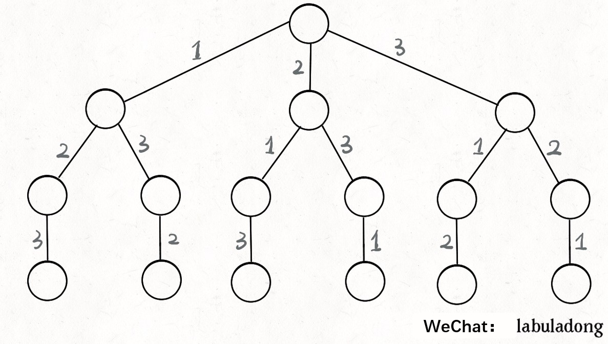
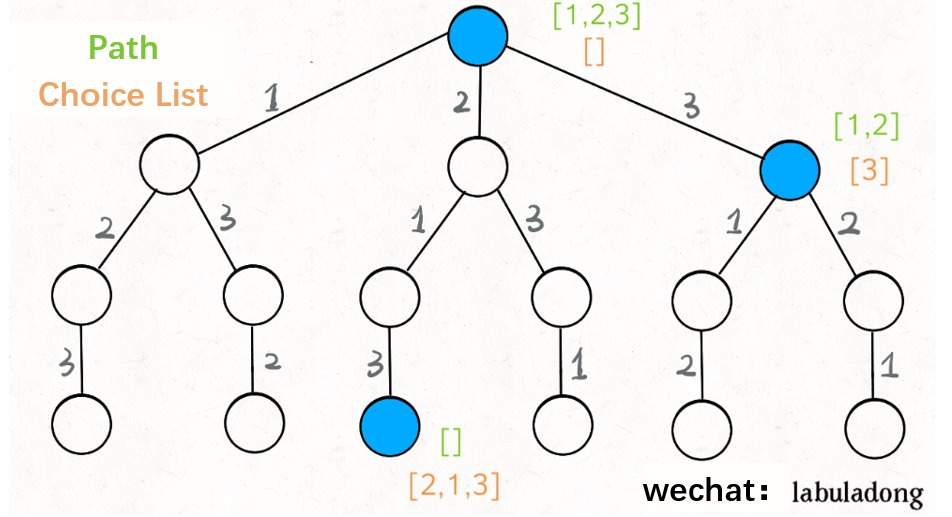
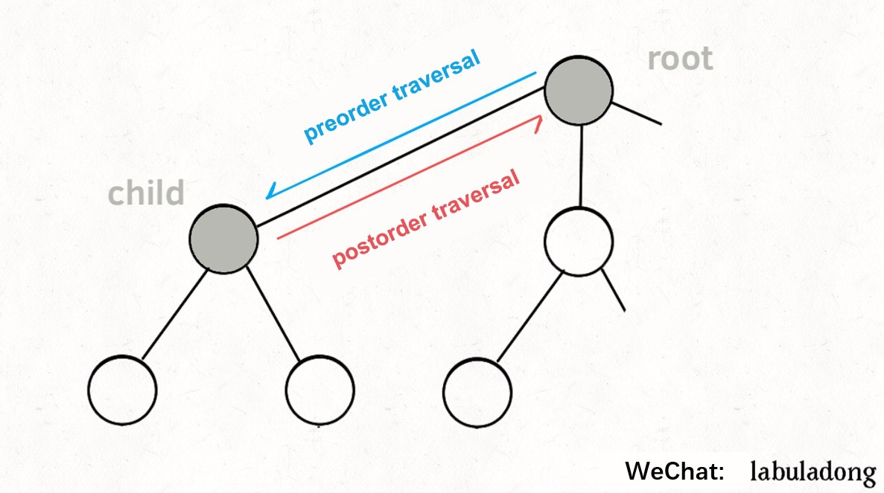
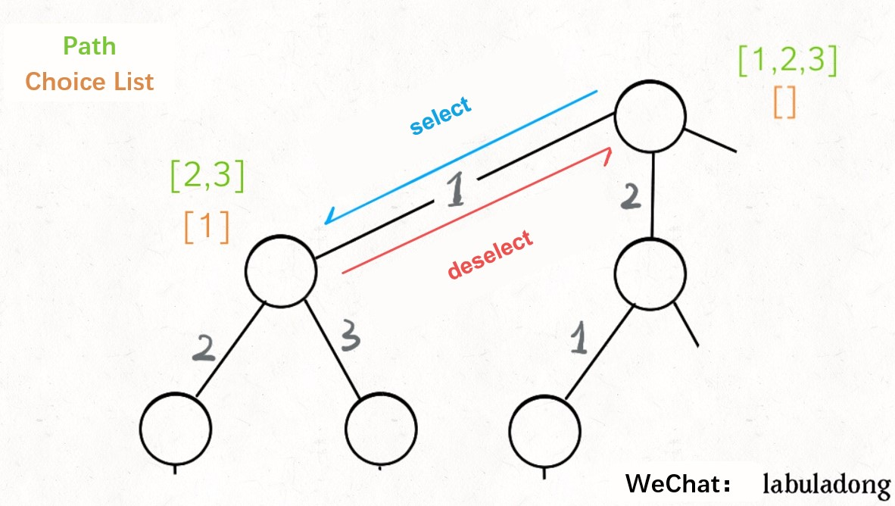
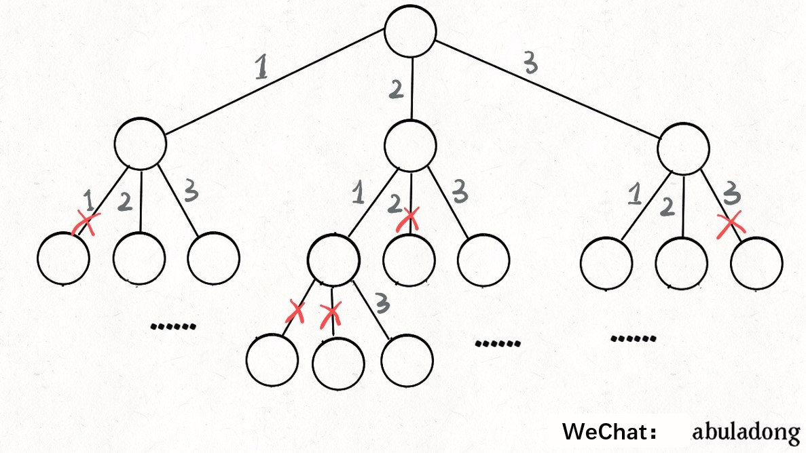
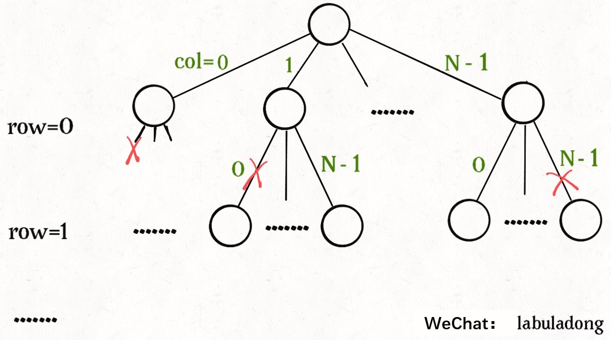

# Details about Backtracking

**Translator**: [xiaodp](https://github.com/xiaodp)

**Author**: [labuladong](https://github.com/labuladong)

This article is an advanced version of "Details of Backtracking Algorithms" before. The previous one isn't clear enough, so you don't need to read it and just read this article.

Ponder carefully and you will find that the backtracking  problems follow the same pattern, that is, have the same framework.

Let's go straight to the framework backtracking follows. **Solving a backtracking problem is actually a traversal process of a decision tree.** Now you only need to think about 3 terms:

1. **Path**: the selection that have been made.

2. **Selection List**: the selection you can currently make.

3. **End Condition**: the condition under which you reach the bottom of the decision tree, and can no longer make a selection.

It doesn’t matter if you don’t understand the explanation of the 3 terms. I will use the two classic backtracking algorithm problems,`Permutation` and `N Queen Problem` to help you understand what they  mean. Before this, you just keep them in mind.

Here shows  the pseudocode of the framework:

```
result = []
def backtrack(Path, Seletion List  ):
    if meet the End Conditon:
        result.add(Path)
        return
    
    for seletion in Seletion List:
        select
        backtrack(Path, Seletion List)
        deselect
```

**The core is the recursion in the for loop. It `makes a selection` before the recursive call and `undoes the selection` after the recursive call**, which is especially simple.

Then what `makes a selection` and `undo the selection` means? and what is the underlying principle of this framework? Let's use `Permutation` to solve  your questions and explore the underlying principle in detail.

### Permutation

You must have learned the permutations and combinations. As we know, for $N$ unique numbers, the number of full permutations is $N!$.

`note`: For simplicity and clarity, **the full permutation problem we are discussing this time does not contain duplicate numbers**.

Think about how we find out all the permutations. If you are given three numbers `[1,2,3]` , you may follow these steps:

1. Fix the first number to 1;
2. Then the second number can be 2;
3. If the second number is 2, then the third number can only be 3;
4. Then you can change the second number to 3 and the third number can only be 2;
5. Then you can only change the first place,and repeat 2-4.

In fact, this is the ''backtracking''. You can use it even without a teacher! The following figure shows the backtracking tree:



Just traverse this tree from the root to the leaves and record the numbers on the paths, and you will get all the permutations. **We might as well call this tree a “decision tree” for backtracking** for you're actually making decisions on each node. For instance, if you are now at the red node, you will making a decision between the "1" branch and "3" branch. Why only 1 and 3? Because the "2" branch is behind you, you have made this selection before, and the full permutation is not allowed to reuse numbers.

**Now you can understand the terms mentioned before more specifically: `[2]` is the “Path”, which records the selections you have made; `[1,3]` is the “Selection List”, which means the current selections you can make; `End Condition` is to traverse to the bottom of the decision tree(here is when the Selection List is empty)**.

If you understand these terms, **you can use the "Path" and "Selection List" as attributes of each node in the decision tree**. For example, the following figure lists the attributes of several nodes



**The  function ```backtrack()``` we defined is actually like a pointer. It is necessary to walk on the tree and maintain the attributes of each node correctly. Whenever it reaches the bottom of the tree, its “Path” is a full permutation**.

Furthermore, how to traverse a tree? it should not be difficult. Recall from the previous article *Framework Thinking of Learning Data Structures*, various search problems are actually tree traversal problems, and the multi-tree traversal framework is:

```java
void traverse(TreeNode root) {
    for (TreeNode child : root.childern)
        // Operations needed for preorder traversal
        traverse(child);
        // Operations needed for postorder traversal
}
```

The so-called preorder traversal and postorder traversal are just two very useful time points. The following picture will make you more clear:



**Preorder travers is executed at the time point before entering a node, and postorder traversal is executed at the time point after leaving a node**.

Recalling what we just said:"Path" and "Selection List" are attributes of each node. If want the function to  maintain the attributes of the node correctly, we must do something at these two special time points:



Now, do you understand the core framework of backtracking?

```python
for seletion in Seletion List:
    # select
    Remove this seletion from the Seletion List
    Path.add(seletion)
    backtrack(Path, Seletion List)
    # deselect
   	Path.remove(seletion)
   	Add the seletion to the Seletion List
```

**As long as we make a selection before recursion and undo the previous selection after recursion**, we can get the Selection List and Path of each node correctly.

Here shows the code for the full permutation:

```java
List<List<Integer>> res = new LinkedList<>();

/* The main method, enter a set of unique numbers and return their full permutations */
List<List<Integer>> permute(int[] nums) {
    // record Path
    LinkedList<Integer> track = new LinkedList<>();
    backtrack(nums, track);
    return res;
}

// Path: recorded in track
// Seletion List: those elements in nums that do not exist in track
// End Condition: all elements in nums appear in track
void backtrack(int[] nums, LinkedList<Integer> track) {
    // trigger the End Condition
    if (track.size() == nums.length) {
        res.add(new LinkedList(track));
        return;
    }
    
    for (int i = 0; i < nums.length; i++) {
        // exclude illegal seletions
        if (track.contains(nums[i]))
            continue;
        // select
        track.add(nums[i]);
        // enter the next level decision tree
        backtrack(nums, track);
        // deselect
        track.removeLast();
    }
}
```

We made a few changes here: instead of explicitly recording the "selection List", we use `nums` and `track` to deduce the current selection list:



So far, we have explained the underlying principle of the backtracking through the full permutation problem. Of course, this algorithm is not very efficient, and using the `contains` method for linked list requires $O(N)$ time complexity. There are better ways to achieve the purpose by exchanging elements which are more difficult to understand. I won't discuss them in this article. If you are interested, you can google related knowledge by yourself.

However, it must be noted that no matter how optimized, it conforms to the backtracking framework, and the time complexity cannot be lower than $O (N!)$.Because exhaustion of the entire decision tree is unavoidable. **This is also a feature of backtracking. Unlike dynamic programming having overlapping subproblems which can be optimized, backtracking is purely violent exhaustion, and time complexity is generally high**.

After understanding the full permutation problem, you can directly use the backtracking framework to solve some problems. Let's take a brief look at the `N Queen`problem.

### N Queen Problem

This is a classical problem: place $N$ non-attacking queens on an $N{\times}N$ chessboard. Thus, a solution requires that no two queens share the same row, column, or diagonal. 

This problem is essentially similar to the full permutation problem. If we build a decision tree, each layer of the decision tree represents each row on the chessboard. And the selection that each node can make is to place a queen on any column of the row.

Apply the  backtracking framework directly:

```cpp
vector<vector<string>> res;

/* Enter board length n, return all legal placements */
vector<vector<string>> solveNQueens(int n) {
    // '.' Means empty, and 'Q' means queen, initializing the empty board.
    vector<string> board(n, string(n, '.'));
    backtrack(board, 0);
    return res;
}

// Path:The rows smaller than row in the board have been successfully placed the queens
// Seletion List: all columns in 'rowth' row are queen's seletions
// End condition: row meets the last line of board(n)
void backtrack(vector<string>& board, int row) {
    // trigger the End Condition
    if (row == board.size()) {
        res.push_back(board);
        return;
    }
    
    int n = board[row].size();
    for (int col = 0; col < n; col++) {
        // exclude illegal seletions
        if (!isValid(board, row, col)) 
            continue;
        // select
        board[row][col] = 'Q';
        // enter next row decision
        backtrack(board, row + 1);
        // deselect
        board[row][col] = '.';
    }
}
```

This part of the code is actually similar to the full permutation problem. The implementation of the ```isValid()```  is also very simple.：

```cpp
/*Is it possible to place a queen on board [row] [col]? */
bool isValid(vector<string>& board, int row, int col) {
    int n = board.size();
    // Check if share the same column
    for (int i = 0; i < n; i++) {
        if (board[i][col] == 'Q')
            return false;
    }
    // Check if share the same right diagonal
    for (int i = row - 1, j = col + 1; 
            i >= 0 && j < n; i--, j++) {
        if (board[i][j] == 'Q')
            return false;
    }
    // Check if share the same left diagonal
    for (int i = row - 1, j = col - 1;
            i >= 0 && j >= 0; i--, j--) {
        if (board[i][j] == 'Q')
            return false;
    }
    return true;
}
```

The function ```backtrack()``` still looks like a pointer walking in the decision tree. The position traversed by the ```backtrack()```can be represented by` row` and `col`, and the unqualified condition can be pruned by the ```isValid()``` :




If you are facing such a chunk of  solution code directly, you may feel very puzzled. But if you understand the framework of backtracking, it is not difficult to understand the solution code. Based on the framework, the changes are just  the way of making selection and excluding illegal selections. As long as you keep the framework in mind, you are left with only minor issues.

When $N = 8$, it is the eight queens problem. Gauss, the mathematics prince , spent his whole life not counting  all possible ways to place, but our algorithm only needs one second .But don't blame Gauss, the complexity of this problem is indeed very high. Look at our decision tree, although there is a pruning by the ```isValid()``` , the worst time complexity is still $O (N ^ {N + 1})$.And it cannot be optimized. If $N = 10$, the calculation is already rather time consuming.

**When we don't want to get all legal answers but only one answer, what should we do ?** For example, the algorithm for solving Sudoku is too complicated to find all the solutions and one solution is enough.

In fact, it is very simple. Just modify the code of the backtracking slightly:

```cpp
// Returns true after finding an answer
bool backtrack(vector<string>& board, int row) {
    // Trigger End Condition
    if (row == board.size()) {
        res.push_back(board);
        return true;
    }
    ...
    for (int col = 0; col < n; col++) {
        ...
        board[row][col] = 'Q';

        if (backtrack(board, row + 1))
            return true;
        
        board[row][col] = '.';
    }

    return false;
}
```

After this modification, as long as an answer is found, subsequent recursion of the for loop will be blocked. Maybe you can slightly modify the code of the N queen problem and write an algorithm to solve Sudoku?

### Conclusion

Backtracking is a multi-tree traversal problem. The key is to do some operations at the positions of pre-order traversal and postorder traversal. The algorithm framework is as follows:

```python
def backtrack(...):
    for seletion in seletions List:
        select
        backtrack(...)
        deselect
```

**When writing the `backtrack()` function, you need to maintain the “Path” you have traveled and the "selection List” you currently have. When the “End Condition” is triggered, record the “Path”  in the result set**.

Think carefully, is the backtracking and dynamic programming somehow similar? We have repeatedly emphasized in the series of articles about dynamic planning that the three points that need to be clear in dynamic programming are "State", "selection" and "Base Case". Do they correspond to the "Path" that has passed, and the current "selection List" And "End Condition "?

To some extent, the brute-force solution phase of dynamic programming is a backtracking. When some problems have overlapping sub-problems, you can use dp table or memo to greatly prune the recursive tree, which becomes dynamic programming. However, today's two problems do not have overlapping subproblems, that is, the problem of backtracking, and the high complexity is inevitable.
