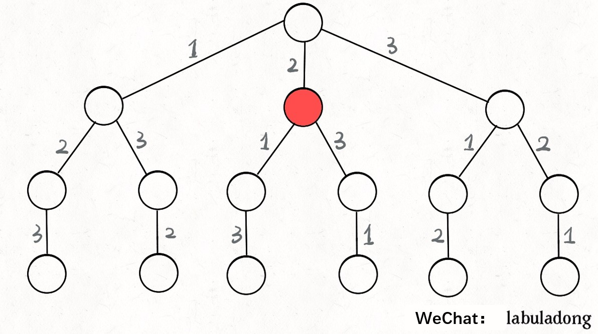

# Details about Backtracking

This article is an advanced version of "Details of Backtracking Algorithms" before. The previous one isn't clear enough, so you don't need to read it and just read this article. By clearly explaining the framework to you, you'll realize that backtracking problems all have the same pattern.

Let's go straight to the framework backtracking follows. **Solving a backtracking problem is actually a traversal process of a decision tree.** Now you only need to think about 3 terms:

1. **Path**: also known as the selection that have been made.

2. **Selection List**: also known as the selections you can currently make.

3. **End Condition**: also known as the condition under which you reach the bottom of the decision tree, and can no longer make a selection.

It doesn’t matter if you don’t understand the explanation of the 3 terms. I will use the two classic backtracking algorithm problems,`Permutation` and `N Queen Problem` to help you understand what they mean. For now, just keep them in mind.

Code wise, here is the pseudocode for the framework:

```python
result = []
def backtrack(Path, SelectionList):
    if meet the End Conditon:
        result.add(Path)
        return
    
    for selection in SelectionList:
        select
        backtrack(Path, SelectionList)
        deselect
```

**The core is the recursion in the `for` loop. It "makes a selection" before the recursive call and "undoes the selection" after the recursive call**, very simple.

Then what `make a selection` and `undo the selection` mean? What is the underlying principle of this framework? Let's use `Permutation` as an example to solve these questions and explore the underlying, wonderful principle in detail.

### 1. Permutation

You must have learned the permutations and combinations. As we know, for `n` unique numbers, the number of full permutations is `n!`.

`Note`: For simplicity and clarity, **the full permutation problem we are discussing here do not contain duplicate numbers**.

Think about how we find out all the permutations. If you are given three numbers `[1,2,3]` , you may follow these steps:

1. Fix the first number to 1;
2. Then the second number can be 2;
3. If the second number is 2, then the third number can only be 3;
4. Then you can change the second number to 3 and the third number can only be 2;
5. Then you can only change the first place,and repeat 2-4.

In fact, this is 'backtracking'. You used it even without a teacher back in high school! Or some of us will draw a figure showing the backtracking tree:


Just traverse this tree from the root to the leaves and record the numbers on the paths, and you will get all the permutations. **We might as well call this tree a “decision tree” for backtracking** as you're actually making decisions on each node. You might e wondering why, consider that you're standing on the red node in the diagram below.



As you are now at the red node, you will make a decision between the "1" branch and "3" branch. Why only 1 and 3? Because the "2" branch is behind you, you have made this selection before, and the full permutation does not allow for number reuse.

**Now you can understand the terms mentioned at the beginning of this article better: `[2]` is the “Path”, which records the selections you have made; `[1,3]` is the “Selection List”, which means the current selections you can make; `End Condition` is to traverse to the bottom of the decision tree(here, it is when the Selection List is empty)**.

If you understand these terms, **you can use the "Path" and "Selection List" as attributes of each node in the decision tree**. For example, the following figure lists the attributes of several nodes


**The  function ```backtrack()``` we defined is actually like a pointer. It is necessary to walk on the tree and maintain the attributes of each node correctly. Whenever it reaches the bottom of the tree, its “Path” is a full permutation**.

Furthermore, how to traverse a tree? it should not be difficult. Recall from the previous article *[Framework and Thoughts about Learning Data Structures and Algorithms](./Framework%20and%20thoughts%20about%20learning%20data%20structure%20and%20algorithm.md)*, various search problems are actually tree traversal problems, and the multi-tree traversal framework is:

```java
void traverse(TreeNode root) {
    for (TreeNode child : root.childern)
        // Operations needed for preorder traversal
        traverse(child);
        // Operations needed for postorder traversal
}
```

The so-called preorder traversal and postorder traversal are just two very useful time points. The following picture will make it more clear to you:


**Preorder travers is executed at the point in time before entering a node, and postorder traversal is executed at the point in time after leaving a node**.

Recalling what we just said: "Path" and "Selection List" are attributes of each node. If we want the function to  maintain the attributes of the node correctly, we must do something at these two special time points:


Now, do you understand the core framework of backtracking?

```python
for selection in SelectionList:
    # select
    Remove this selection from the SelectionList
    Path.add(selection)
    backtrack(Path, SelectionList)
    # deselect
   	Path.remove(selection)
   	Add the selection to the SelectionList
```

**As long as we make a selection before recursion and undo the previous selection after recursion**, we can get the SelectionList and Path at each node correctly.

Below is the code for the full permutation (see the end of this article for a Python 3 solution):

```java
/** The results of all permutations **/
List<List<Integer>> res = new LinkedList<>();

/* The main method, enter an array of unique numbers and return their full permutations */
List<List<Integer>> permute(int[] nums) {
    // record Path
    LinkedList<Integer> track = new LinkedList<>();
    backtrack(nums, track);
    return res;
}

// Path: recorded in "track"
// Selection List: those elements in "nums" that do not exist in "track"
// End Condition: all elements in nums appear in track
void backtrack(int[] nums, LinkedList<Integer> track) {
    // trigger the End Condition
    if (track.size() == nums.length) {
        res.add(new LinkedList(track)); //res is initialized before permute
        return;
    }
    
    for (int i = 0; i < nums.length; i++) {
        // exclude illegal selections
        if (track.contains(nums[i]))
            continue;
        // select
        track.add(nums[i]);
        // enter the next level decision tree
        backtrack(nums, track);
        // deselect
        track.removeLast();
    }
}
```

We made a few changes here: instead of explicitly recording the "selection List", we use `nums` and `track` to deduce the current selection list:


So far, we have explained the underlying principle of the backtracking through the full permutation problem. Of course, this algorithm is not very efficient, and using the `contains` method for linked list requires `O(n)` time complexity every call. There are better ways to achieve the purpose by exchanging elements which are more difficult to understand. I won't discuss them in this article. If you are interested, you can Google the related knowledge by yourself.

However, it must be noted that no matter how optimized, it conforms to the backtracking framework, and the time complexity cannot be lower than `O(n!)`. As brute-force exhaustion of the entire decision tree is unavoidable. **This is also a feature of backtracking. Unlike dynamic programming having overlapping subproblems which can be optimized, backtracking is purely brute-force exhaustion, and time complexity is generally high**.

After understanding the full permutation problem, you can directly use the backtracking framework to solve those type of problems! Now, let's take a brief look at the `N Queen` problem.

### 2. The N Queen Problem

This is a classical problem: Place `N` queens on an $N{\times}N$ chessboard. A valid solution requires that the queens are non-attacking, i.e: No two queens share the same row, column, or diagonal (as queens can attack the same row, column or diagonal). 

This problem is essentially similar to the full permutation problem. If we build a decision tree, each layer of the decision tree represents each row on the chessboard. And the selection at each node is to place a queen on any column of the specfic row.

Apply the backtracking framework directly:

```cpp
vector<vector<string>> res;

/* Enter board length n, return all legal placements */
vector<vector<string>> solveNQueens(int n) {
    // '.' Means empty, and 'Q' means queen, initializing the empty board.
    vector<string> board(n, string(n, '.'));
    backtrack(board, 0);
    return res;
}

// Path: The rows smaller than row in the board have successfully placed the queens
// Selection List: all columns in 'row-th' row are queen's selections
// End condition: row meets the last line of board(n)
void backtrack(vector<string>& board, int row) {
    // trigger the End Condition
    if (row == board.size()) {
        res.push_back(board);
        return;
    }
    
    int n = board[row].size();
    for (int col = 0; col < n; col++) {
        // exclude illegal selections
        if (!isValid(board, row, col)) 
            continue;
        // select
        board[row][col] = 'Q';
        // enter next row decision
        backtrack(board, row + 1);
        // deselect
        board[row][col] = '.';
    }
}
```

This part of the code is actually similar to the full permutation problem. The implementation of `isValid()` is also very simple.：

```cpp
/* Is it possible to place a queen on board [row] [col]? */
bool isValid(vector<string>& board, int row, int col) {
    int n = board.size();
    // Check if share the same column
    for (int i = 0; i < n; i++) {
        if (board[i][col] == 'Q')
            return false;
    }
    // Check if share the same right diagonal --> '/'
    for (int i = row - 1, j = col + 1; 
            i >= 0 && j < n; i--, j++) {
        if (board[i][j] == 'Q')
            return false;
    }
    // Check if share the same left diagonal --> '\'
    for (int i = row - 1, j = col - 1;
            i >= 0 && j >= 0; i--, j--) {
        if (board[i][j] == 'Q')
            return false;
    }
    return true;
}
```

The function `backtrack()` still looks like a pointer walking in the decision tree. The position traversed by `backtrack()` can be represented by `row` and `col`, and the unqualified condition can be pruned by the `isValid()` :


If you are given such a large chunk of solution code directly, you may feel very puzzled. But if you understand the framework of backtracking, what else is difficult to understand in the solution code? Regardless if you're making changes such as the way of making selection, or excluding illegal selections, as long as you keep the framework in mind, you are left to face only minor issues.

When $N = 8$, it is the eight queens problem. Carl Friedrich Gauss, the German mathematicatian, spent his whole life unable to [count all possible ways](http://langevin.univ-tln.fr/cours/PAA/tps/backtrack/histo-gauss.pdf) to place the queens, but our algorithm only needs one second. But we can't blame Gauss, the complexity of this problem is indeed very high. Look at our decision tree, although there is pruning by `isValid()`, the worst time complexity is still $O (N ^ {N + 1})$, and no optimization exists. If $N = 10$, the calculation is even more time consuming.

**What about when we don't want to get all legal/valid answers but only one possible answer, what should we do ?** For example, the algorithm to find all possible solutions of Sudoku is too complicated, and one solution is enough.

In fact, it is very simple. Just modify the code of the backtracking slightly:

```cpp
// Returns true after finding an answer
bool backtrack(vector<string>& board, int row) {
    // Trigger End Condition
    if (row == board.size()) {
        res.push_back(board);
        return true;
    }
    ...
    for (int col = 0; col < n; col++) {
        ...
        board[row][col] = 'Q';

        if (backtrack(board, row + 1))
            return true;
        
        board[row][col] = '.';
    }

    return false;
}
```

After this modification, as long as an answer is found, subsequent recursion of the `for` loop will be stopped. Maybe you can slightly modify the code of the N queen problem and write an algorithm to solve Sudoku?

### 3. Conclusion

Backtracking is a multi-tree traversal problem. The key is to do some operations at the positions of pre-order traversal and post-order traversal. The algorithm framework is as follows:

```python
def backtrack(...):
    for selection in selectionList:
        select
        backtrack(...)
        deselect
```

**When writing the `backtrack()` function, you need to maintain the “Path” you have traveled and the "Selection List” you currently have. When the “End Condition” is triggered, record the “Path” in the result set**.

Think carefully, is the backtracking and dynamic programming somehow similar? We have repeatedly emphasized in the series of articles about dynamic programming that the three concepts that need to be crystal-clear in dynamic programming are "State", "Selection" and "Base Case". Don't they correspond to the "Path" that has passed, the current "selection List", and "End Condition"?

To some extent, the brute-force solution phase of dynamic programming is a backtracking. The difference is that when some problems have overlapping sub-problems, you can use dp table or memos to greatly prune the recursive tree, which then becomes ... dynamic programming. However, today's two problems do not have overlapping subproblems. This is, the flaw of backtracking, the inevitable high time complexity.

[Previous Article: Q&A on Dynamic Programming - Optimal Substructure](../dynamic_programming/OptimalSubstructure.md)

[Next Article: Binary Search in Detail](../think_like_computer/DetailedBinarySearch.md)

[Table of Contents](../README.md#table-of-contents)


**Translator**: [xiaodp](https://github.com/xiaodp)

**Author**: [labuladong](https://github.com/labuladong)

[Zongshuai](https://github.com/zongshuai818) provides Python3 solution code below for permutation:

```python
class Solution:
    def permute(self, nums: List[int]) -> List[List[int]]:
        # Backtracking
        result = []
        track = [] # SelectionList
        def trackBack(nums_, track_):
            if len(track_) == len(nums_): # End condition
                result.append(track_[:])
                return
            for i in nums_: # Loop through all possible selections
                if i in track_: # Decide if it can be selected
                    continue
                track.append(i) # select
                trackBack(nums_, track_) # backtrace
                track.pop() # de-select
        trackBack(nums, track)
        return result
```