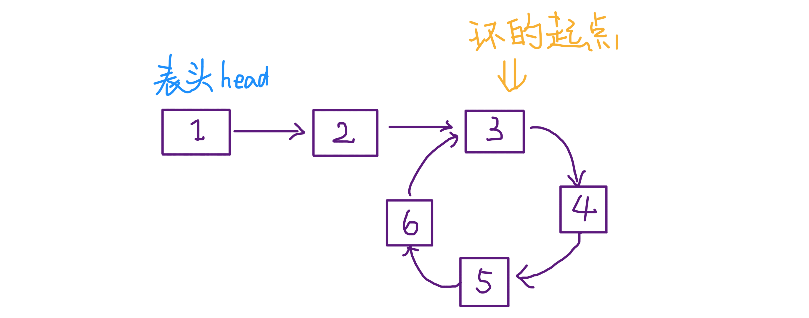
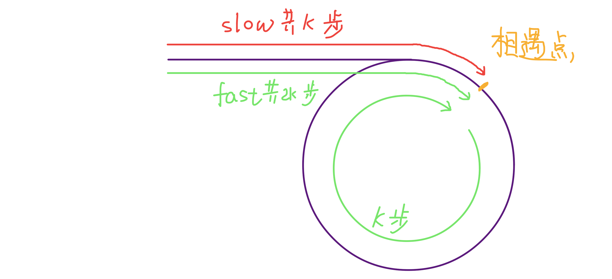
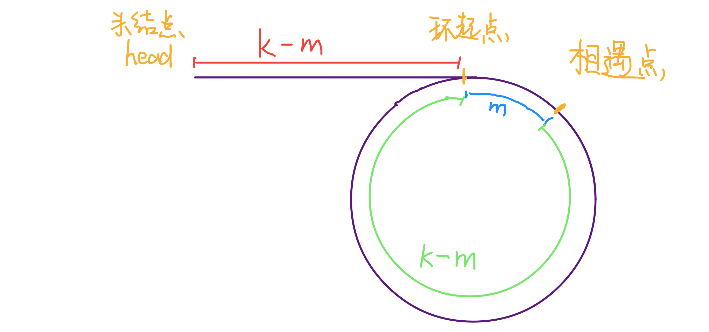
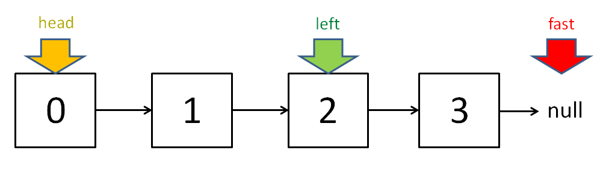

# Summary of double pointer technique[](#双指针技巧总结) 

> 原文地址:[https://github.com/labuladong/fucking-algorithm/blob/master/算法思维系列/双指针技巧.md](https://github.com/labuladong/fucking-algorithm/blob/master/算法思维系列/双指针技巧.md)

**Translator: [miaoxiaozui2017](https://github.com/miaoxiaozui2017)**

**Author: [labuladong](https://github.com/labuladong)**

I divide the double pointer technique into two categories.One is `fast-and-slow pointer`,and the other is `left-and-right pointer`. The former mainly solves the problems in the linked list, such as the typical problem of `determination of whether a ring is included in the linked list`.And the latter mainly solves the problems in the array (or string), such as `binary search`. 

### Part 1. Common algorithms of fast-and-slow pointer[](#快慢指针的常见算法) 

The fast-and-slow pointers are usually initialized to point to the head node of the linked list. When moving forward, the `fast` pointer is in the front and the `slow` pointer is in the back, which ingeniously solves some problems in the linked list. 

**1. Determine whether there is a ring in the linked list**[](#判定链表中是否含有环) 

This should be the most basic operation of linked list. *If the reader already knows this skill, this part can be skipped.*   

The feature of single linked list is that each node only knows the next node, so a pointer can't judge whether there is a ring in the linked list.      

If there is no ring in the linked list, then this pointer will eventually encounter a null pointer indicating that the linked list is at the end.This is a good situation that it can be judged directly that the linked list does not contain a ring.

```java

boolean hasCycle(ListNode head) {
    while (head != null)
        head = head.next;
    return false;
}
```

While if the linked list contains a ring, the pointer will fall into `a dead loop`  because there is no `null` pointer as the tail node in the ring array.            

The classic solution is to use two pointers---one is fast,and the other is slow. If there is no ring, the fast pointer will eventually encounter `null` indicating that the linked list does not contain a ring.Or if there is a ring, the fast pointer will eventually exceed the slow pointer by a circle indicating that the linked list contains a ring.      

```java
boolean hasCycle(ListNode head) {
    ListNode fast, slow;
    fast = slow = head;
    while (fast != null && fast.next != null) {
        fast = fast.next.next;
        slow = slow.next;
        
        if (fast == slow) return true;
    }
    return false;
}
```

**2.A ring is known to exist in the linked list.Return the starting position of this ring**[](#已知链表中含有环，返回这个环的起始位置) 



This problem is not difficult at all. It's a bit like a brain teaser. First, look at the code directly: 

```java
ListNode detectCycle(ListNode head) {
    ListNode fast, slow;
    fast = slow = head;
    while (fast != null && fast.next != null) {
        fast = fast.next.next;
        slow = slow.next;
        if (fast == slow) break;
    }
    //The above code is similar to the hascycle function 
    slow = head;
    while (slow != fast) {
        fast = fast.next;
        slow = slow.next;
    }
    return slow;
}
```

It can be seen that when the fast and slow pointers meet, let any of them points to the head node, and then let them advance at the same speed. When they meet again, the node position is the starting position of the ring. Why is that?            

`At the first meeting`, if the `slow` pointer takes `k` steps, then the `fast` pointer must take `2k` steps, that is to say, it takes `k` steps more than the `slow` pointer (or in another word,the length of the ring).



If the distance between the meeting point and the starting point of the ring is `m`, then the distance between the starting point of the ring and the `head` node is `k - m`. That is to say, if we advance `k - m` steps from the `head` node, we can reach the starting point of the ring.            

Coincidentally, if we continue to move `k - m` steps from the meeting point, we will also arrive at the starting point of the ring. 



So, as long as we point any one of the fast and slow pointers back to `head`, and then the two pointers move at the same speed after `k - m` steps they will meet at the starting point of the ring. 

**3. Find the midpoint of the linked list**[](#寻找链表的中点) 

Similar to the above idea, we can also make the fast pointer advance two steps at a time and the slow pointer advance one step at a time. When the fast pointer reaches the end of the linked list, the slow pointer is exactly in the middle of the linked list. 

```java
while (fast != null && fast.next != null) {
    fast = fast.next.next;
    slow = slow.next;
}
//slow is in the middle 
return slow;
```

When the length of the linked list is odd, `slow` happens to stop at the midpoint.If the length is even, the final position of `slow` is right in the middle: 



An important role in finding the midpoint of a linked list is to merge and sort the linked list.

Recall the `merging and sorting` of arrays: find the midpoint index to divide the arrays recursively, and finally merge the two ordered arrays. For linked list, it is very simple to merge two ordered linked lists, and the difficulty lies in dichotomy.   

But now that you have learned `finding the midpoint of a linked list`, you can achieve the dichotomy of a linked list. For the details of `merging and sorting`, this paper will not expand specifically. 

**4. Looking for the last k element of the linked list**[](#寻找链表的倒数第 k 个元素)            
Our idea is still to use the `fast-and-slow pointer`.Let the `fast` pointer go `k` steps first, and then the `fast` and `slow` pointer starts to move at the same speed. In this way, when the `fast` pointer goes to `null` at the end of the linked list, the position of the `slow` pointer is the last `k` list node (for simplification, suppose `k` not exceed the length of the linked list): 

```java
ListNode slow, fast;
slow = fast = head;
while (k-- > 0) 
    fast = fast.next;

while (fast != null) {
    slow = slow.next;
    fast = fast.next;
}
return slow;
```

### Part 2.Common algorithms of left-and-right pointer[](#左右指针的常用算法) 

The left-and-right pointer in the array actually refer to two index values, which are usually initialized as `left = 0` and `right = nums.length - 1`.   

**1. Binary search**[](#二分查找)           

The previous paper `binary search` is explained in detail. Here only the simplest binary algorithm is written to stick out its double pointer feature: 

```java
int binarySearch(int[] nums, int target) {
    int left = 0; 
    int right = nums.length - 1;
    while(left <= right) {
        int mid = (right + left) / 2;
        if(nums[mid] == target)
            return mid; 
        else if (nums[mid] < target)
            left = mid + 1; 
        else if (nums[mid] > target)
            right = mid - 1;
    }
    return -1;
}
```

**2. Sum of two numbers**[](#两数之和)

Let's take a look at a leetcode question: 


As long as the array is ordered, you should think of the double pointer technique. The solution of this problem is similar to binary search. The size of `sum` can be adjusted by adjusting `left` and `right`: 

```java
int[] twoSum(int[] nums, int target) {
    int left = 0, right = nums.length - 1;
    while (left < right) {
        int sum = nums[left] + nums[right];
        if (sum == target) {
            //The index required by the title starts from 1 
            return new int[]{left + 1, right + 1};
        } else if (sum < target) {
            left++; // make sum bigger
        } else if (sum > target) {
            right--; // make sum smaller
        }
    }
    return new int[]{-1, -1};
}
```

**3. Invert array**[](#反转数组)

```java
void reverse(int[] nums) {
    int left = 0;
    int right = nums.length - 1;
    while (left < right) {
        // swap(nums[left], nums[right])
        int temp = nums[left];
        nums[left] = nums[right];
        nums[right] = temp;
        left++; right--;
    }
}
```

**4. Sliding window algorithm**[](#滑动窗口算法) 

This may be the highest level of the double pointer technique. If you master this algorithm, you can solve a large class of `substring matching` problems, but the `sliding window` is slightly more complex than the algorithms metioned above.            

Fortunately, there are framework templates for this kind of algorithm, and [this article](https://github.com/labuladong/fucking-algorithm/blob/master/算法思维系列/滑动窗口技巧.md) explains the `sliding window` algorithm template, which helps you to "kill" several `substrings matching` problems in leetcode. 
